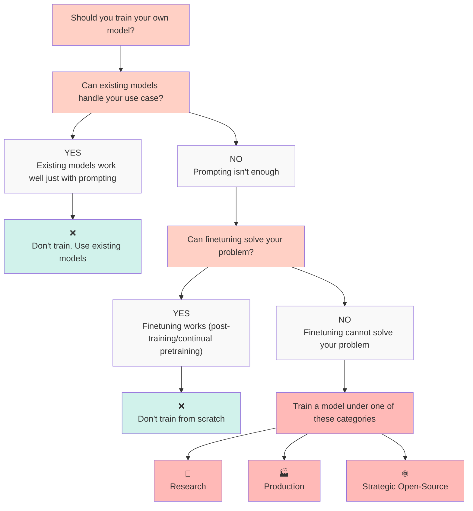
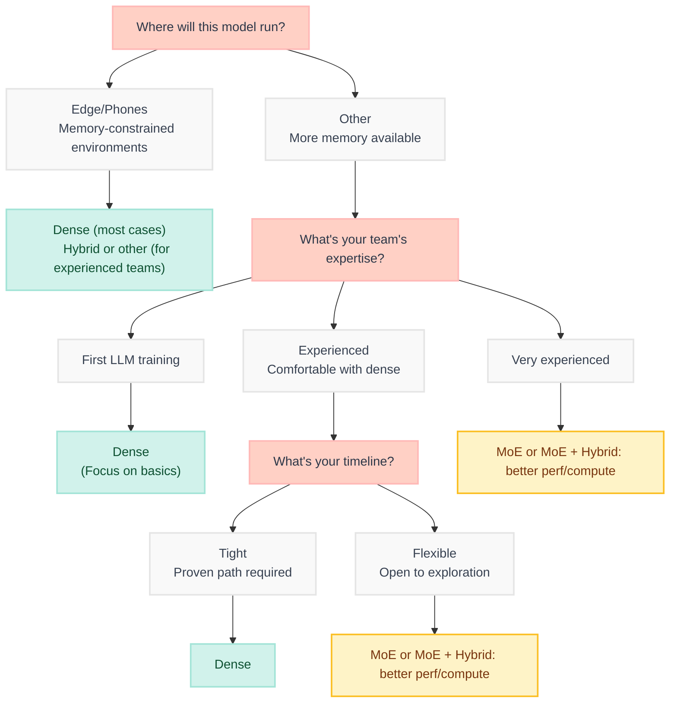
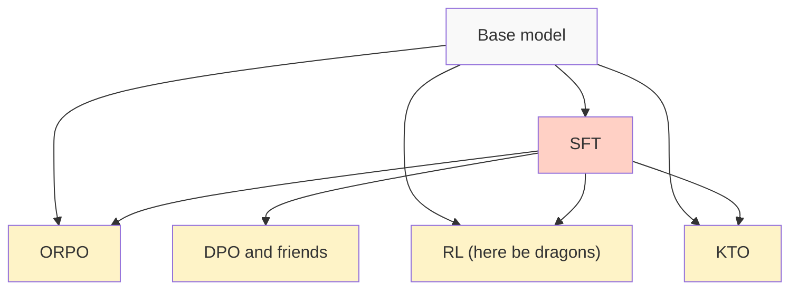
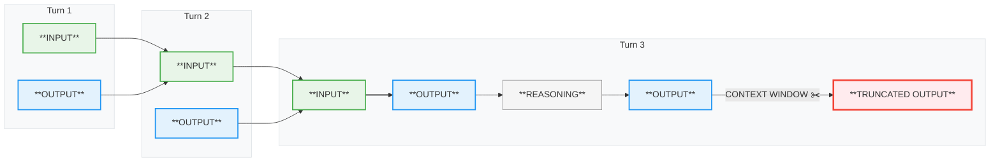
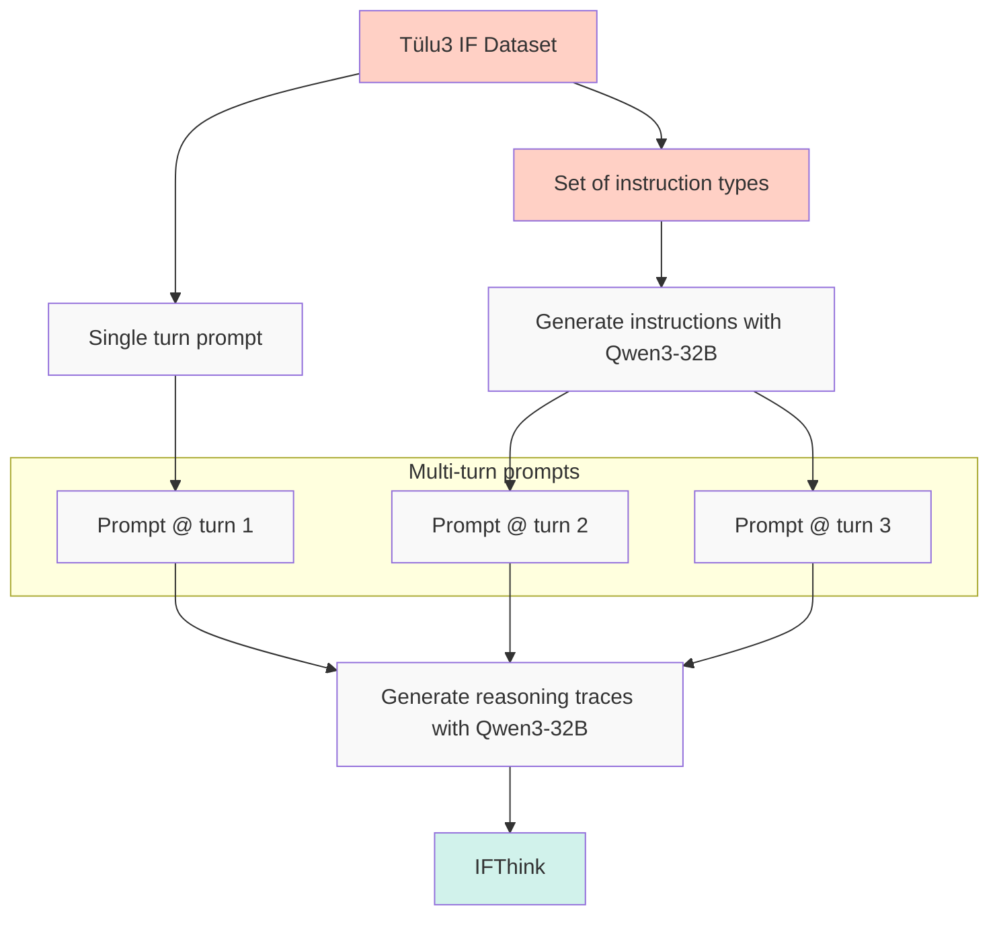
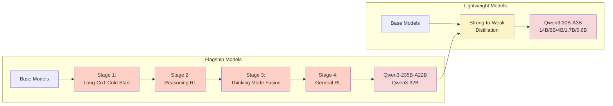
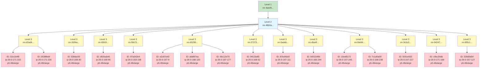

import Sidenote from '../components/Sidenote.astro';
import Image from '../components/Image.astro';
import HtmlEmbed from '../components/HtmlEmbed.astro';
import Note from '../components/Note.astro';
import Wide from '../components/Wide.astro';
import Quote from '../components/Quote.astro';
import Reference from '../components/Reference.astro';
import image_27c1384e_bcac_807c_807b_fac08be1d884 from './assets/image/image_27c1384e-bcac-807c-807b-fac08be1d884.png';
import image_2931384e_bcac_80c4_ab02_f22c53e6fdee from './assets/image/image_2931384e-bcac-80c4-ab02-f22c53e6fdee.png';
import image_2931384e_bcac_8062_bc11_d1ee3706d996 from './assets/image/image_2931384e-bcac-8062-bc11-d1ee3706d996.png';
import Capture_decran_2025_10_20_a_13_25_47_2921384e_bcac_8087_83e5_fa7a40c1f342 from './assets/image/Capture_decran_2025-10-20_a_13_25_47_2921384e-bcac-8087-83e5-fa7a40c1f342.png';
import Capture_decran_2025_10_20_a_13_26_08_2921384e_bcac_80b5_ac36_fb73d6374208 from './assets/image/Capture_decran_2025-10-20_a_13_26_08_2921384e-bcac-80b5-ac36-fb73d6374208.png';
import img_75ae60ff_50be_48e1_aad2_a8fc56120d3d_2921384e_bcac_80c2_984b_d81404e4bb7c from './assets/image/75ae60ff-50be-48e1-aad2-a8fc56120d3d_2921384e-bcac-80c2-984b-d81404e4bb7c.png';
import Capture_decran_2025_10_21_a_11_11_38_2931384e_bcac_8008_ad8d_d5ab0c539d3a from './assets/image/Capture_decran_2025-10-21_a_11_11_38_2931384e-bcac-8008-ad8d-d5ab0c539d3a.png';
import Capture_decran_2025_10_21_a_15_34_27_2931384e_bcac_8066_834b_c485ae8d1fa5 from './assets/image/Capture_decran_2025-10-21_a_15_34_27_2931384e-bcac-8066-834b-c485ae8d1fa5.png';
import image_2471384e_bcac_8059_84a4_d4ce5ae3847c from './assets/image/image_2471384e-bcac-8059-84a4-d4ce5ae3847c.png';
import Capture_decran_2025_10_27_a_22_10_05_2991384e_bcac_802a_a6e6_dab0f9f410ec from './assets/image/Capture_decran_2025-10-27_a_22_10_05_2991384e-bcac-802a-a6e6-dab0f9f410ec.png';
import Screenshot_2025_10_24_at_09_37_24_2961384e_bcac_8055_9e8e_ffbd3a1aa368 from './assets/image/Screenshot_2025-10-24_at_09_37_24_2961384e-bcac-8055-9e8e-ffbd3a1aa368.png';
import Screenshot_2025_09_26_at_22_36_40_27a1384e_bcac_8063_94e0_f1c689e7d9b9 from './assets/image/Screenshot_2025-09-26_at_22_36_40_27a1384e-bcac-8063-94e0-f1c689e7d9b9.png';
import GtU8DnoWsAAruEG_28e1384e_bcac_8051_8122_ed6cacf8f632 from './assets/image/GtU8DnoWsAAruEG_28e1384e-bcac-8051-8122-ed6cacf8f632.png';
import Screenshot_2025_10_01_at_11_31_19_28e1384e_bcac_8005_8c5e_f0af3bf70372 from './assets/image/Screenshot_2025-10-01_at_11_31_19_28e1384e-bcac-8005-8c5e-f0af3bf70372.png';
import image20283129_29a1384e_bcac_800d_8b92_f46377d66a61 from './assets/image/image20283129_29a1384e-bcac-800d-8b92-f46377d66a61.png';
import image_2881384e_bcac_80d6_84fe_d705cb1eae0a from './assets/image/image_2881384e-bcac-80d6-84fe-d705cb1eae0a.png';
import image_2881384e_bcac_801d_9f3d_c875181b9dd1 from './assets/image/image_2881384e-bcac-801d-9f3d-c875181b9dd1.png';
import image_2881384e_bcac_80ed_9bdf_c077977d77b8 from './assets/image/image_2881384e-bcac-80ed-9bdf-c077977d77b8.png';
import h100_dgx_2891384e_bcac_80cf_9f86_ccf0653a79e5 from './assets/image/h100_dgx_2891384e-bcac-80cf-9f86-ccf0653a79e5.gif';
import lstopo_2951384e_bcac_808f_a7c5_c244e7ac69db from './assets/image/lstopo_2951384e-bcac-808f-a7c5-c244e7ac69db.jpg';
import image_2891384e_bcac_80e2_9cc5_c2c46c7ab39b from './assets/image/image_2891384e-bcac-80e2-9cc5-c2c46c7ab39b.png';
import image_27d1384e_bcac_80b1_9ffb_ec29d0021ccc from './assets/image/image_27d1384e-bcac-80b1-9ffb-ec29d0021ccc.png';

## Introduction

What does it actually take to train a high-performance LLM today?

<Sidenote>

Reading time: 2-4 days.
</Sidenote>

Published research makes it look straightforward: strategic architecture choices, carefully curated datasets, and sufficient compute. The results are polished, the ablations are structured and clean. Every decision seems obvious in hindsight. But these technical reports only show what worked and apply a bit of rosy retrospection – they don't capture the 2am dataloader debugging sessions, the loss spikes, or the subtle tensor parallelism bug (see later!) that quietly sabotages your training. The reality is messier, more iterative, and full of decisions that don't make it into the final technical report.

Join us as we look behind the scenes of training SmolLM3, a 3B multilingual reasoning model trained on 11T tokens. This is not an ordinary blog post, but rather the untangling of a spiderweb of decisions, discoveries, and dead ends that led to deep insights into what it takes to build world-class language models.

It is also the final opus in our model-training long-form series: we've worked through building datasets at scale ([FineWeb](https://huggingface.co/spaces/HuggingFaceFW/blogpost-fineweb-v1)), orchestrating thousands of GPUs to sing in unison ([Ultra Scale Playbook](https://huggingface.co/spaces/nanotron/ultrascale-playbook)), and selecting the best evaluations at each step of the process ([Evaluation Guidebook](https://github.com/huggingface/evaluation-guidebook)). Now we shape it all together to build a strong AI model. We'll walk you through the complete journey – not just the final recipe that worked, but showcase how experiments fail, infrastructure breaks, and how debugging processes shaped our decisions.

The story reads like a drama: You'll see how promising small-scale ablations sometimes don't translate at scale, why we restarted a training after 1T tokens, how we balanced the competing objectives of multilinguality, math, and code while maintaining strong English performance, and finally how we post-trained a hybrid reasoning model.

We also tried to avoid a cold list of all we did in favor of an organized story through our adventure. Think of this as a guide for anyone trying to go from "we have a great dataset and GPUs" to "we built a really strong model". We hope being this open will helps close the gap between research and production, and make your next training run a little less chaotic. 

### How to read this blog post

You don't need to read this blog post from top to bottom, and at this point it's too long to realistically read end-to-end in one sitting anyway. The blog post is structured in several distinct pieces that can be skipped or read individually:

-  **Training compass:**  A high-level discussion about whether or not you should pretrain your own model. We walk you through fundamental questions to ask yourself before burning through all your VC money, and how to think systematically through the decision process. This is a high-level section, if you want to skip straight to the technical content, scroll quickly past this part.
-  **Pretraining:** The sections following the training compass cover everything you need to know to build a solid recipe for your own pretraining run: how to run ablations, select evaluations, mix data sources, make architecture choices, tune hyperparameters, and finally endure the training marathon. This section also applies if you're not planning to pretrain from scratch but are interested in long fine-tuning (aka mid-training).
-  **Post-training:** In this part of the blog you'll learn all the tricks to get most out of your pretrained models. Learn the whole post-training alphabet starting with SFT, DPO and GRPO as well as the dark arts and alchemy of model merging. Most of the knowledge about making these algorithms work well is learned through painful lessons, and we'll share our experience here to hopefully spare you some of them.
-  **Infrastructure:** If pretraining is the cake and post-training is the icing and cherry on top, then infrastructure is the industrial-grade oven. Without it, nothing happens, and if it's broken your happy Sunday baking session turns into a fire hazard. Knowledge about how to understand, analyze, and debug GPU clusters is scattered across the internet in various libraries, docs, and forums. This section walks through GPU layout, communication patterns between CPU/GPU/Nodes/Storage, and how to identify and overcome bottlenecks. 

So where do we even start? Pick the section that you find most exciting and let's go!

<Sidenote>

If you have questions or remarks, open a discussion on the <a href="https://huggingface.co/spaces/HuggingFaceTB/smol-training-playbook/discussions">Community tab</a>!
</Sidenote>

## Training compass: why → what → how


<HtmlEmbed frameless src="/embeds/training-compass.html" />

The field of machine learning has an obsessive relationship with optimisation. We fixate on loss curves, model architectures, and throughput; after all, machine learning is fundamentally about optimising the loss function of a model. Yet before diving into these technical details, there's a more fundamental question that often goes unasked:  *should we even be training this model?* 

In 2025, the open-source AI ecosystem releases world-class models on a nearly daily basis: Qwen, Gemma, DeepSeek, Kimi, Llama 🪦, Olmo, and the list grows longer every month. These aren't just research prototypes or toy examples: they're production-grade models covering an astonishing breadth of use cases from multilingual understanding to code generation and reasoning. Most of them come with permissive licenses and active communities ready to help you use them.

<iframe class="card card--p0" frameborder="0" width="100%" height="600px" src="https://cfahlgren1-model-release-heatmap.hf.space/"/>


Which raises an uncomfortable truth: maybe you *don't need to train your own model*  *.* 

This might seem like an odd way to start an "LLM training guide". But many failed training projects didn't fail because of bad hyperparameters or buggy code, they failed because someone decided to train a model they didn't need. So before you commit to training, and dive into  *how*  to execute it, you need to answer two questions:  *why*  are you training this model? And  *what*  model should you train? Without clear answers, you'll waste months of compute and engineering time building something the world already has, or worse, something nobody needs.

Let's start with the why, because without understanding your purpose, you can't make coherent decisions about anything that follows.

<Note title="About this section" emoji="📍" variant="info">

This section is different from the rest of the blog: it's less about experiments and technical details,
more about strategic planning. We'll guide you through deciding <b>whether you need to train from scratch and what model to build.</b>
If you've already thought deeply about your why and what, 
feel free to jump to the [Every big model starts with a small ablation](#every-big-model-starts-with-a-small-ablation) chapter for the technical deep-dive.
But if you're uncertain, investing time here will save you a lot of effort later.
</Note>

###  **Why: the question nobody wants to answer** 

Let's be blunt about what happens in practice. Someone (if they're lucky) gets access to a GPU cluster, maybe through a research grant, maybe through a company's spare capacity, and the thought process goes roughly like this: "We have 100 H100s for three months. Let's train a model!" The model size gets picked arbitrarily, the dataset gets assembled from whatever's available. Training starts. And six months later, after burning through compute budget and team morale, the resulting model sits unused because nobody ever asked  *why.* 

Here are some reasons why you shouldn't train a model:

<HtmlEmbed frameless src="/embeds/wrong-reasons.html" />


The allure of "we trained our own model" is powerful, but before investing a lot of time and resources, it makes sense to ask:  **why do you need to train this model?** 

The flowchart below guides the thought process one should go through before starting a big pretraining project. From a technical perspective, you should essentially first find out if there isn't an existing model that you can either prompt of fine-tune to do the job.


There are essentially three common areas where custom pretraining can make sense: you want to do novel research, you have very specific needs for production use-case, or you want to fill a gap in the open model ecosystem. Let's have a quick look at each: 

####  **Research: what do you want to understand?** 

There is plenty of research one can do in the LLM space. What LLM research projects have in common is that you normally start with a clearly defined question:

- Can we scale training on this new optimiser to a 10B+ model?  From [Muon is Scalable for LLM Training ](https://huggingface.co/papers/2502.16982)
- Can reinforcement learning alone, without SFT, produce reasoning capabilities? From [DeepSeek-R1: Incentivizing Reasoning Capability in LLMs via Reinforcement Learning](https://huggingface.co/papers/2501.12948)
- Can we train good small models on purely synthetic textbooks data? From [Textbooks Are All You Need ](/b349da53329a408f83c48c1f7ab8d6f0)
- Can we achieve competitive performance by training on only openly licensed data? From[ The Common Pile v0.1: An 8TB Dataset of Public Domain and Openly Licensed Text ](https://huggingface.co/papers/2506.05209)

Making the hypothesis as concrete as possible and thinking about the necessary experiment scale increases the chance of success.

####  **Production: why can't you use an existing model?** 

There are mainly three reasons why companies can't use off the shelf models for their use-case. Two of them are technical and the other is due to governance.

The first reason to train your own model is  **domain specificity:**  when your data or tasks involve highly specialized vocabulary or structure that existing models can't handle well. For example:

* A DNA model with a unique vocabulary and long-range dependencies.

* A legal or financial model requiring deep familiarity with domain-specific jargon and logic.

A second, related reason is deployment constraints: when you need a model tailored to your hardware, latency, or privacy requirements. For instance, an LLM running on a drone or on-prem system with custom hardware like FPGAs.

Here's a simple test: spend a few days building on top of Qwen3, Gemma3, or another current SOTA model. Can you reach your performance goals through prompting, tool-use, or post-training? If not, it's probably time to train your own.

Even if the post-training budget needed to meet your requirements is immense, it might still be cheaper than starting from scratch. Post-training your model for 1T tokens is still more economic than starting from scratch to train for 10T+ tokens.

<Sidenote>

At this point LLM trainers start to miraculously call it mid-training 
instead of post-training
</Sidenote>

The third reason to build you own in-house language model is  **safety and governance:**  You need complete control over training data, model behaviour, and update cycles because you're in a regulated industry or high-stakes application. You need to know  *exactly*  what went into the model and be able to prove it to regulators. In some cases you might have no other option than building your own model.

These are the main reasons companies train in-house models, but what about companies or organisations that release open models?

####  **Strategic open-source: do you see a gap you can fill?** 

One of the most common reasons experienced AI labs release new open models is that they've identified a specific gap or new AI use-case in the open-source ecosystem.

The pattern typically looks like this; you notice an under explored area, maybe there are no strong on-device models with very long context, or multilingual models exist but they're weak on low resource languages, or the field is moving towards interactive world-models like [Genie3](https://deepmind.google/discover/blog/genie-3-a-new-frontier-for-world-models/) and no good open-weight model exists. 

You have reasons to believe you can do better; perhaps you've curated better training data, developed better training recipes, or have the compute to overtrain where others couldn't. Your goal is concrete: not "the best model ever," but "the best 3B model for on-device use" or "the first small model with 1M context".

This is a real goal and success creates value: developers adopt your model, it becomes infrastructure for others, or it establishes technical credibility. But success requires experience. You need to know what's actually feasible and how to execute reliably in a competitive space. To make this concrete, let's look at how we think about this question at Hugging Face.

<Sidenote>

We also don't cover distillation or pruning in this blog. These are valid paths to efficient models but represent different workflows than training from scratch. We recommend NVIDIA's <a href="https://arxiv.org/abs/2408.11796" target="_blank">Minitron paper</a> for an overview of these topics.
</Sidenote>

####  **Hugging Face's journey** 

So why does Hugging Face train open models? The answer is simple: we build things that are useful to the open-source ecosystem and fill gaps that few others are filling.

<Sidenote>

Although there are millions of open-weight models, there are very few organisations that train fully open models. In addition to Hugging Face, there's [Ai2](https://allenai.org/) and [Stanford's Marin community](https://marin.community/).
</Sidenote>

 This includes datasets, tooling and training models. Every LLM training project we've started began with noticing a gap and believing we could contribute something meaningful.

We started our first LLM project after GPT-3 [[@gpt3](https://huggingface.co/papers/2005.14165)] was released. At the time, it felt like no one else was building an open alternative, and we were worried that the knowledge would end up locked away in just a few industry labs. So we launched the [BigScience workshop](https://bigscience.huggingface.co/) to train an open version of GPT-3. The resulting model was [Bloom](https://huggingface.co/bigscience/bloom), and came from dozens of contributors working for a year to build the training stack, tokenizer, and pretraining corpus to pre-train a 175B parameter model.

The successor of Bloom was StarCoder in 2022 [[@starcoder](https://huggingface.co/papers/2305.06161)]. OpenAI had developed Codex for GitHub Copilot [[@codex](https://huggingface.co/papers/2107.03374)], but it was closed-source. Building an open-source alternative clearly would provide value to the ecosystem. So in collaboration with ServiceNow, under the [BigCode](https://huggingface.co/bigcode) umbrella, we built [The Stack](https://huggingface.co/datasets/bigcode/the-stack) dataset, and we trained [StarCoder 15B](https://huggingface.co/bigcode/starcoder) to reproduce Codex. [StarCoder2](https://huggingface.co/collections/bigcode/starcoder2-65de6da6e87db3383572be1a) [[@starcoder2](https://huggingface.co/papers/2402.19173)] came from learning we could have trained longer, and recognising that smaller models trained longer might be more valuable than one large model. We trained a family (3B/7B/15B) on multiple trillions of tokens, far beyond what anyone had done for open code models at the time.

The [SmolLM family](https://huggingface.co/HuggingFaceTB) followed a similar pattern. We noticed there were very few strong small models and we had just built [FineWeb-Edu](https://huggingface.co/datasets/HuggingFaceFW/fineweb-edu) [@fineweb], which was a strong pre-training dataset. [SmolLM](https://huggingface.co/collections/HuggingFaceTB/smollm-6695016cad7167254ce15966) (135M/360M/1.7B) was our first version. [SmolLM2](https://huggingface.co/collections/HuggingFaceTB/smollm2-6723884218bcda64b34d7db9) [@smollm2] focused on better data and training longer, reaching SOTA performance on multiple fronts. [SmolLM3](https://huggingface.co/HuggingFaceTB/SmolLM3-3B) scaled to 3B while adding hybrid reasoning, multilinguality and long context, features that the community values in 2025.

This pattern extends beyond pretraining: we trained [Zephyr](https://huggingface.co/HuggingFaceH4/zephyr-7b-alpha) [@zephyr] to show DPO works at scale, started [Open-R1](https://github.com/huggingface/open-r1) to reproduce DeepSeek R1's distillation pipeline and released [OlympicCoder](https://huggingface.co/open-r1/OlympicCoder-7B) for competitive programming, with SOTA performance in the International Olympiad in Informatics. We've also explored other modalities with [SmolVLM](https://huggingface.co/collections/HuggingFaceTB/smolvlm-6740bd584b2dcbf51ecb1f39) [@smolvlm] for vision and [SmolVLA](https://huggingface.co/lerobot/smolvla_base) [@smolvla] for robotics.

<Sidenote>

If you're curious about the HF science projects,
you can find an overview here <a href="https://huggingface.co/science" target="_blank">https://huggingface.co/science</a>
</Sidenote>

Hopefully, this section has convinced you that there is value in thinking deeply about why you want to train a model.

 **For the rest of this blog post, we'll assume you've done this**soul-searching**  **and have a legitimate reason to train.** 

### What: translating goals into decisions

Now that you know  *why*  you're training, what should you train? By "what", we mean: model type (dense, MoE, hybrid, something new), model size, architecture details and data mixture. Once you've settled on the why, you can derive the what, for example:

- fast model for on device → small efficient model
- multilingual model → large tokenizer vocab
- super long context → hybrid architecture

Besides decisions driven by the use-case, there are also some choices that optimise the training itself, either by being more stable, more sample efficient, or faster. These decisions are not always so clear cut, but you can divide the decision process roughly into two phases:

 **Planning:**  Before running experiments, map your use case to the components you need to decide on. Your deployment environment determines model size constraints. Your timeline determines which architectural risks you can take. Your target capabilities determine dataset requirements. This phase is about connecting each constraint from your "why" to concrete specifications in your "what."

 **Validation:**  Once you have a starting point and a list of potential modifications, test systematically. Since testing is expensive, focus on changes that could meaningfully improve performance for your use case or optimise your training. This is where ablations come in, covered in the [ablations section](#every-big-model-starts-with-a-small-ablation).

<Note title="Learn to identify what's worth testing, not just how to run tests." emoji="📍" variant="info">

Perfect ablations on irrelevant choices waste as much compute as sloppy ablations on important ones.
</Note>

In the following chapters you will learn about all the options you have to define your model and how to narrow down the choices with systematic experiments. Before going there we want to share a few learnings on how to setup teams and projects from training our own models as well as observing amazing other teams building great LLMs. 

### Super power: speed and data

Of course there are many ways to get to Rome, but we've found that what consistently sets successful LLM training teams apart is  **iteration speed.**  Training LLMs is really a learning by training discipline, the more often you train, the better your team will become. 
So between the teams that train a model a year and the ones that train one per quarter, the latter will improve so much faster. You can look at the teams from Qwen and DeepSeek for example. Now household names, they have a long track record of consistently releasing new models on a fast cadence.

Besides iteration speed, by far the most influential aspect of LLM training is  **data curation** . There's a natural tendency to dive into architecture choices to improve the model, but the teams that excel in LLM training are the ones that are obsessed with high quality data more than anything else. 

Another aspect that is tied to iteration speed is the team size: for the main pretraining tasks you only need a handful of people equipped with enough compute to execute. To pre-train a model like Llama 3 today you probably only need 2-3 people. Only once you start to venture into more diverse trainings and downstream tasks (multimodal, multilingual, post-training etc) will you slowly need to add a few more people to excel at each domain. 

So start with a small, well equipped team, and build a new model every 2-3 months and within short amount of time you'll climb to the top. Now the rest of the blog will focus on the technical day-to-day of this team!

## Every big model starts with a small ablation

Before we can start training an LLM, we need to make many decisions that will shape the model's performance and training efficiency. Which architecture will best serve our use case? What optimiser and learning rate schedule to use and which data sources to mix in?

How these decisions are made is a frequently asked question. People sometimes expect that they are made by thinking deeply about them. And while strategic thinking is essential—as we covered in the [previous section](#training-compass:-why-→-what-→-how) where we discussed choosing baselines and identifying which modifications are worth testing—reasoning alone isn't enough. Things are not always intuitive with LLMs, and hypotheses about what should work sometimes don't pan out in practice.

For example, using what seems like "the highest quality data" doesn't always yield stronger models. Take the [arXiv](https://arxiv.org/) for example, which is a vast collection of humanity's scientific knowledge. Intuitively, training on such rich STEM data should produce superior models, right? In practice, it doesn't and especially for smaller models, where it can even hurt performance [@grpo]. Why? The reason is that while arXiv papers are full of knowledge, they're highly specialized and written in a narrow academic style that's quite different from the diverse, general text that models learn best from.

So, how can we know what works if staring at the problem long and hard doesn't help? We run a lot of experiments, like good empiricists! Machine learning is not pure math, but actually very much an experimental science.

<Sidenote>

In many ways, machine learning resembles thermodynamics before the discovery of statistical mechanics: we have reliable empirical laws and design principles that work remarkably well, even if deeper theoretical explanations are still emerging.
</Sidenote>

Since those experiments will guide many of our crucial decisions, it is really important to set them up well. There are essentially two main attributes we want from them:

1.  **Speed:** they should run as fast as possible so we can iterate often. The more ablations we can run, the more  hypotheses we can test. 
1.  **Reliability:** they should provide strong discriminative power. If the metrics we look at can't meaningfully distinguish between different setups early on, our ablations may reveal little (and if they're noisy, we risk chasing noise!) For more details, check out the [FineWeb blog post](https://huggingface.co/spaces/HuggingFaceFW/blogpost-fineweb-v1).


But before we can set up our ablations, we need to make some foundational choices about architecture type and model size. These decisions—guided by our compass—impact which training framework to use, how to allocate our compute budget, and which baseline to start from.

For SmolLM3, we went with a dense Llama-style architecture at 3B parameters because we were targeting small on-device models. But as you'll see in the [Defining your LLM chapter](#defining-your-llm), a MoE or hybrid model might be better suited for your use case, and different model sizes come with different tradeoffs. We'll explore these choices in depth later, and show you how to make these decisions. For now, let's start with the most practical first step: choosing your baseline.

###  **Choosing your baseline** 

Every successful model builds on a proven foundation and modifies it for their needs. When Qwen trained their first model family [@qwen1], they started from Llama's architecture. When Meta trained Llama 3, they started from Llama 2. Kimi K2, started from DeepSeek-V3's MoE architecture. This applies to architectures, but also training hyperparameters and optimisers.

Why? Good architectures and training setups design takes years of iteration across many organisations. The standard transformer and optimisers like AdamW have been refined through thousands of experiments. People have found their failure modes, debugged instabilities, optimised implementations. Starting from a proven foundation means inheriting all that accumulated knowledge. Starting fresh means rediscovering every problem yourself.

Here's what makes a good starting point for an architecture:

- Matches your constraints: aligns with your deployment target and use case.
- Proven at scale: multi-trillion token runs at similar or larger sizes.
- Well-documented: known hyperparameters which have been proven to work in open models.
- Framework support: It should ideally be supported in the training frameworks you are considering and the inference frameworks you are planning to use.

Below is a non-exhaustive list of strong 2025 baseline options for various architectures:

| Architecture Type | Model Family | Sizes |
| --- | --- | --- |
| **Dense** | [Llama 3.1](https://huggingface.co/collections/meta-llama/llama-31-669fc079a0c406a149a5738f) | 8B, 70B |
| **Dense** | [Llama 3.2](https://huggingface.co/collections/meta-llama/llama-32-66f448ffc8c32f949b04c8cf) | 1B, 3B |
| **Dense** | [Qwen3](https://huggingface.co/collections/Qwen/qwen3-67dd247413f0e2e4f653967f) | 0.6B, 1.7B, 4B, 14B, 32B |
| **Dense** | [Gemma3](https://huggingface.co/collections/google/gemma-3-release-67c6c6f89c4f76621268bb6d) | 12B, 27B |
| **Dense** | [SmolLM2](https://huggingface.co/collections/HuggingFaceTB/smollm2-6723884218bcda64b34d7db9), [SmolLM3](https://huggingface.co/HuggingFaceTB/SmolLM3-3B) | 135M, 360M, 1.7B, 3B |
| **MoE** | [Qwen3 MoE](https://huggingface.co/collections/Qwen/qwen3-67dd247413f0e2e4f653967f) | 30B-A3B, 235B-A122B |
| **MoE** | [GPT-OSS](https://huggingface.co/collections/openai/gpt-oss-68911959590a1634ba11c7a4) | 21B-A3B, 117B-A5B |
| **MoE** | [Kimi Moonlight](https://huggingface.co/moonshotai/Moonlight-16B-A3B-Instruct) | 16B-A3B |
| **MoE** | [Kimi-k2](https://huggingface.co/collections/moonshotai/kimi-k2-6871243b990f2af5ba60617d) | 1T-A32B |
| **MoE** | [DeepSeek v2](https://huggingface.co/deepseek-ai/DeepSeek-V2) | 671B-A37B |
| **Hybrid** | [Zamba2](https://huggingface.co/Zyphra/models?search=zamba2) | 1.2B, 2.7B, 7B |
| **Hybrid** | [Falcon-H1](https://huggingface.co/collections/tiiuae/falcon-h1-6819f2795bc406da60fab8df) | 0.5B, 1.5B, 3B, 7B, 34B |
| **MoE + Hybrid** | [Qwen3-Next](https://huggingface.co/Qwen/Qwen3-Next-80B-A3B-Instruct) | 80B-A3B |
| **MoE + Hybrid** | [MiniMax-01](https://huggingface.co/MiniMaxAI/MiniMax-Text-01) | 456B-A46B |

So go to your architecture type and pick a baseline close to the number of parameters you'd like your model to have. Don't overthink it too much as the architecture you start from is not set in stone. In the next section, we will see how to go from a baseline to a  final architecture that is optimal for you.

####  **Modifying your baseline: the discipline of de-risking** 

Now you have a baseline that works and fits your use case. You could stop here, train it on your data mixture (assuming it's good) and likely get a decent model. Many successful projects do exactly that. But baselines aren't optimised for your specific constraints, they're designed for the use cases and deployment targets of whoever built them. So there are likely modifications worth making to better align with your goals. However, every architectural change carries risk: it might boost performance, tank it, or do nothing while wasting a week of your compute budget.

The discipline that keeps you on track is  **de-risking** : never change anything unless you know it helps.

<Note title="What counts as de-risked?" emoji="📍" variant="info">

A change is de-risked when testing shows it either improves performance 
on your target capabilities, or provides a meaningful benefit 
(e.g. faster inference, lower memory, better stability) without hurting 
performance beyond your acceptable tradeoffs.
</Note>

The tricky part is that your baseline and training setup have many components you could modify: attention mechanisms, positional encodings, activation functions, optimisers, training hyperparameters, normalisation schemes, model layout, and more. Each represents a potential experiment, and these components often interact in non-linear ways. You have neither the time nor compute to test everything or explore every interaction.

Start by testing the promising changes individually to understand their isolated impact, then combine the ones that work and run a leave-one-out analysis if your compute budget allows for it.

<Sidenote>

Check out the ScaleRL paper [@scalerl] for an excellent example of this methodology in practice.
</Sidenote>

Don't fall into the trap of exhaustive grid searches over every hyperparameter or testing every architectural variant that comes out.

<Note title="Strategic experimentation" emoji="🎯" variant="success">

Knowing how to run experiments isn't enough if you don't know which experiments are worth running. 
Ask yourself two questions before testing any modification:
- Will this help my specific use case?
- Will this optimise my training?

If a modification doesn't clearly address either question, skip it.
</Note>

Now that you know how to identify what's promising through strategic planning, it's time to move to the  **empirical validation** . In the next sections, we'll show you  *how*  to actually test these changes in practice. We'll cover how to set up reliable experiments, interpret results, and avoid common pitfalls. Then in the following chapters, we'll walk through concrete examples of testing popular architectural, data, infra and training decisions.

So let's build a simple ablation setup we can use for our experiments. First, we need to decide which training framework to pick.

### Picking a training framework

The first decision we need to make is which framework to use for training our model, and by extension, for running all our ablations. This choice involves balancing three key considerations that, frustratingly, will work against each other:

<Sidenote>

Don't be a hero and switch the training framework between ablations and your final run. That is the road to suffering.
</Sidenote>

1. The framework must support our target architecture or let us easily extend it. 
1. It needs to be stable and production-ready, and not prone to mysteriously breaking midway through training.
1. It should deliver strong throughput so we can iterate quickly and make the most of our compute budget.

In practice, these requirements might pull against each other, creating trade-offs. Let's look at the available options.

<Wide>

| Framework | Features | Battle-tested | Optimised | Lines of Code (core / total) | Extensibility & Debugging |
| --- | --- | --- | --- | --- | --- |
| **Megatron-LM** | ✅ Extensive | ✅ Kimi-K2, Nemotron | ✅ Pioneers of 3D parallelism | 93k / 269k | ⚠️ Hard for beginners |
| **DeepSpeed** | ✅ Extensive | ✅ BLOOM, GLM | ✅ Pioneers of ZeRO & 3D parallelism | 94k / 194k | ⚠️ Hard for beginners |
| **TorchTitan** | ⚡ Growing feature set | ⚠️ Newer but tested by PyTorch team | ⚡Optimised for dense models, MoE improvements underway. | 7k / 9k | ⚡ Moderate: requires parallelism know-how |
| **Nanotron** | 🎯 Minimal, tailored for HF pretraining | ✅ Yes (StarCoder, SmolLM) | ✅ Optimised (UltraScale Playbook) | 15k / 66k | ⚡ Moderate: requires parallelism know-how |
</Wide>

The table above summarises the key trade-offs between popular frameworks. Lines of code for the first three frameworks are from the TorchTitan technical report [@torchtitan] Let's discuss each in more detail:

[Megatron-LM](https://github.com/NVIDIA/Megatron-LM) from Nvidia has been around for years and is battle-tested. It's what powers models like Kimi's K2 [@kimik2], it delivers solid throughput and has most of the production features we'd want. But that maturity comes with complexity: the codebase can be hard to navigate and modify when we need to implement something new.

[DeepSpeed](https://github.com/deepspeedai/DeepSpeed) falls into a similar category. It's the pioneer of ZeRO optimisation and powered models like BLOOM and GLM. Like Megatron-LM, it's extensively battle-tested and optimised, but shares the same complexity challenges. The large codebase (194k total lines) can be intimidating when you need to implement custom features or debug unexpected behavior.

On the other side, PyTorch's recent [TorchTitan](https://github.com/pytorch/torchtitan) library is much lighter and simpler to navigate, thanks to its compact and modular codebase. It has the core features needed for pretraining and is great for rapid experimentation. However, being newer, it isn't as battle-tested and can still be a bit unstable as it's actively developed.

We took a different path and built our own framework, nanotron, from scratch. This gave us full flexibility and a deep understanding of large-scale pretraining; insights that later evolved into the [Ultra Scale Playbook](https://huggingface.co/spaces/nanotron/ultrascale-playbook). Since we open-sourced the library, we also got valuable feedback from the community, though for most cases we had to battle-test features ourselves first. The framework now supports all the production features we need for training, but we're still building out areas like MoE support.

Building from scratch made sense then, but it demands major investment in team expertise and time to debug issues and add missing features. A strong alternative is forking an existing framework and enhancing it for your needs. For example, Thinking Machines Lab built their internal pretraining library as a fork of TorchTitan ([source](https://x.com/cHHillee/status/1949470943291805832)).

Ultimately, your choice depends on your team's expertise, target features, and how much time you're willing to invest in development versus using the most production-ready option. 

If multiple frameworks support your needs, compare their throughput on your specific hardware. For quick experiments and speed runs, simpler codebases often win.

### Ablation setup

#### Setting up our ablation framework

Now that we've chosen a framework, we need to decide on our ablation setup. Remember, the goal is to run experiments at a small scale and get results we can confidently extrapolate to our final production run.

There are two main approaches. First, we can take our target model size and train it on fewer tokens. For the SmolLM3 ablations, we trained the full 3B model on 100B tokens instead of the final 11T. Second, if our target model is too large, we can train a smaller proxy model for ablations. For example, when Kimi was developing their 1T parameter Kimi K2 model with 32B active parameters, using the full size for all ablations would have been prohibitively expensive, so they ran some ablations on a 3B MoE with 0.5B active parameters [@kimik2].

One key question is whether these small-scale findings actually transfer. In our experience, if something hurts performance at small scale, you can confidently rule it out for large scale. Now something works at small scale, you should still make sure you've trained on a reasonable number of tokens to conclude with high probability that these findings will extrapolate to larger scales. The longer you train and the closer the ablation models are to the final model, the better.

In this blog post, we'll use a baseline vanilla transformer for all ablations. Our main setup is a 1B transformer following [Llama3.2 1B](https://huggingface.co/meta-llama/Llama-3.2-1B) architecture trained on 45B tokens. This takes about 1.5 days to train on a node of 8xH100s using this nanotron [config](https://huggingface.co/datasets/HuggingFaceTB/ablations-training-configs/blob/main/baseline_config_1B.yaml) (42k tokens per second per GPU). For experiments needing stronger signal, we'll also show results from our larger setup: the 3B model trained on 100B tokens that we used for SmolLM3. You can find the 3B baseline config [here](https://huggingface.co/datasets/HuggingFaceTB/ablations-training-configs/blob/main/baseline_config_3B.yaml).

<Sidenote>

We train for 45B tokens to ensure we get stable signal, though ~35B is <a href="https://arxiv.org/abs/2203.15556" target="_blank">Chinchilla-optimal</a> for this model size.
</Sidenote>

Our baseline 1B config captures all the essential training details in a structured YAML format. Here are the key sections:

```yaml
## Datasets and mixing weights
data_stages:
- data:

    dataset:
      dataset_folder:
      - fineweb-edu
      - stack-edu-python
      - finemath-3plus

      dataset_weights:
      - 0.7
      - 0.2
      - 0.1

## Model architecture, Llama3.2 1B configuration
model:
  model_config:
    hidden_size: 2048
    num_hidden_layers: 16
    num_attention_heads: 32
    num_key_value_heads: 8  
    intermediate_size: 8192
    max_position_embeddings: 4096
    rope_theta: 50000.0
    tie_word_embeddings: true

## Training hyperparameters, AdamW with cosine schedule
optimizer:
  clip_grad: 1.0
  learning_rate_scheduler:
    learning_rate: 0.0005
    lr_decay_starting_step: 2000
    lr_decay_steps: 18000
    lr_decay_style: cosine
    lr_warmup_steps: 2000
    lr_warmup_style: linear
    min_decay_lr: 5.0e-05
  optimizer_factory:
    adam_beta1: 0.9
    adam_beta2: 0.95
    adam_eps: 1.0e-08
    name: adamW

## Parallelism, 1 node
parallelism:
  dp: 8  # Data parallel across 8 GPUs
  tp: 1  # No tensor or pipeline parallelism needed at 1B scale
  pp: 1 

## Tokenizer
tokenizer:
  tokenizer_max_length: 4096
  tokenizer_name_or_path: HuggingFaceTB/SmolLM3-3B

## Batch size, sequence length and total training for 30B tokens
tokens:
  batch_accumulation_per_replica: 16
  micro_batch_size: 3 # GBS (global batch size)=dp * batch_acc* MBS * sequence=1.5M tokens
  sequence_length: 4096
  train_steps: 20000 # GBS * 20000 = 30B
 
 ...(truncated)
```
For our ablations, we'll modify the first 3 sections while keeping everything else constant.

<Note title="Modify one thing at a time" emoji="☝️" variant="danger">

Change only one variable per ablation while keeping everything else constant. 
If you change multiple things and performance improves, you won't know what 
caused it. Test modifications individually, then combine successful ones and reassess.
</Note>

When running ablations, some architectural changes can significantly alter parameter count. For instance, switching from tied to untied embeddings doubles our embedding parameters, while going from MHA to GQA or MQA decreases our attention parameters substantially. To ensure fair comparisons, we need to track parameter counts and occasionally adjust other hyperparameters (like hidden size or layer count) to keep model sizes roughly the same. Here is a simple function that we use to estimate parameter counts for different configurations:

```python
from transformers import LlamaConfig, LlamaForCausalLM

def count_parameters(
    tie_embeddings=True,
    num_key_value_heads=4,
    num_attention_heads=32,
    hidden_size=2048,
    num_hidden_layers=16,
    intermediate_size=8192,
    vocab_size=128256,
    sequence_length=4096,
):
    config = LlamaConfig(
        hidden_size=hidden_size,
        num_hidden_layers=num_hidden_layers,
        num_attention_heads=num_attention_heads,
        num_key_value_heads=num_key_value_heads,
        intermediate_size=intermediate_size,
        vocab_size=vocab_size,
        max_position_embeddings=sequence_length,
        tie_word_embeddings=tie_embeddings,
    )
    model = LlamaForCausalLM(config)  
    return f"{sum(p.numel() for p in model.parameters())/1e9:.2f}B"
```
We also provide an interactive tool to visualise LLM parameter distributions, in the case of a dense transformer. This can come in handy when making architecture decisions or setting up configs for ablations.

<HtmlEmbed src="/embeds/parameter-calculator.html" />


<Sidenote>

This calculator assumes standard architectural choices: gated feedforward networks, standard head dimensions for attention (hidden_size / num_heads), and 2 layer norms per transformer layer. It doesn't include bias terms (if used).
</Sidenote>

####  **Understanding what works: evaluation** 

Once we launch our ablations, how do we know what works or not? 

The first instinct of anyone who trains models might be to look at the loss, and yes, that's indeed important. You want to see it decreasing smoothly without wild spikes or instability. For many architectural choices, the loss correlates well with downstream performance and can be sufficient [@chen2025]. However, looking at the loss only is not always reliable. Taking the example of data ablations, you would find that training on Wikipedia gives a lower loss than training on web pages (the next token is easier to predict), but that doesn't mean you'd get a more capable model. Similarly, if we change the tokenizer between runs, the losses aren't directly comparable since text gets split differently. Some changes might also specifically affect certain capabilities like reasoning and math and get washed away in the average loss. Last but not least, models can continue improving on downstream tasks even after pretraining loss has converged [@liu2022].

We need more fine-grained evaluation to see the full picture and understand these nuanced effects and a natural approach is to use downstream evaluations that test knowledge, understanding, reasoning, and whatever other domains matter for us.

For these ablations, it's good to focus on tasks that give good early signal and avoid noisy benchmarks. In [FineTasks](https://huggingface.co/spaces/HuggingFaceFW/blogpost-fine-tasks) and [FineWeb2](https://arxiv.org/pdf/2506.20920), reliable evaluation tasks are defined by four key principles:

-  **Monotonicity:**  The benchmark scores should consistently improve as models train longer.
-  **Low noise:**  When we train models with the same setup but different random seeds, the benchmark scores shouldn't vary wildly.
-  **Above-random performance:**  Many capabilities only emerge later in training, so tasks that show random-level performance for extended periods aren't useful for ablations. This is the case, for example, for MMLU in multiple choice format as we will explain later.
-  **Ranking consistency:**  If one approach outperforms another at early stages, this ordering should remain stable as training continues.

The quality of a task also depends on the task formulation (how we ask the model questions) and metric choice (how we compute the answer score).

Three common task formulations are multiple choice format (MCF), cloze formulation (CF) and freeform generation (FG). Multiple choice format requires models to select an option from a number of choices explicitly presented in the prompt and prefixed with A/B/C/D (as is done in MMLU, for example). In cloze formulation, we compare the likelihood of the difference choices to see which one is more likely without having provided them in the prompt. In FG, we look at the accuracy of the greedy generation for a given prompt. FG requires a lot of latent knowledge in the model and is usually too difficult a task for the models to be really useful in short pre-training ablations before a full of training. We thus focus on multiple choice formulations when running small sized ablations (MCF or CF). 

<Note title="Heads‑up" emoji="📍" variant="info">

For post-trained models, FG becomes the primary formulation since 
we're evaluating whether the model can actually generate useful responses. 
We'll cover evaluation for these models in the post-training chapter.
</Note>

Research has also shown that models struggle with MCF early in training, only learning this skill after extensive training, making CF better for early signal [@olmes, @du2025, @datacomp]. We thus use CF for small ablations, and integrate MCF in the main run as it gives better mid-training signal once a model has passed a threshold to get sufficiently high signal-over-noise ratio for MCF. A quick note also that, to score a model's answer in sequence likelihood evaluations like CF, we compute accuracy as the percentage of questions where the the correct answer has the highest log probability normalised by character count. This normalisation prevents a bias toward shorter answers.

<Sidenote>

The point at which MMLU MCF becomes non-random depends on the model size and training data. For a 7B transformer, [t](https://arxiv.org/pdf/2406.08446)he OLMES paper [@olmes] found the model starts showing non-random performance after 500B tokens. For 1.7B model, we found this happens after 6T tokens in SmolLM2. @du2025 argue this is fundamentally about the pre-training loss reaching a certain threshold.
</Sidenote>

Our ablations evaluation suite includes the benchmarks from [FineWeb](https://huggingface.co/spaces/HuggingFaceFW/blogpost-fineweb-v1) ablations, except for SIQA which we found to be too noisy. We add math and code benchmarks like GSM8K and HumanEval and a long context benchmark RULER for long context ablations. This aggregation of tasks test world knowledge, reasoning, and common sense across a variety of formats, as shown in the table below. To speed up evaluations at the expense of some additional noise, we only evaluate on 1,000 questions from each benchmark. We also use the cloze fomulation (CF) way of evaluating for all multiple-choice benchmarks, as explained above.  Note that for multilingual ablations and actual training, we add more benchmarks to test multilinguality, which we detail later. These evaluations are run using LightEval and the individual benchmarks are covered in more detail in the [Appendix](#appendix). The table above summarises the key characteristics of each benchmark:

| Benchmark | Domain | Task Type | Questions | What it Tests |
| --- | --- | --- | --- | --- |
| MMLU | Knowledge | Multiple choice | 14k | Broad academic knowledge across 57 subjects |
| ARC | Science & reasoning | Multiple choice | 7k | Grade-school level science reasoning |
| HellaSwag | Commonsense reasoning | Multiple choice | 10k | Commonsense reasoning about everyday situations (narrative completion) |
| WinoGrande | Commonsense reasoning | Binary choice | 1.7k | Pronoun resolution requiring world knowledge |
| CommonSenseQA | Commonsense reasoning | Multiple choice | 1.1k | Commonsense reasoning about everyday concepts |
| OpenBookQA | Science | Multiple choice | 500 | Elementary science facts with reasoning |
| PIQA | Physical commonsense | Binary choice | 1.8k | Physical commonsense about everyday objects |
| GSM8K | Math | Free-form generation | 1.3k | Grade-school math word problems |
| HumanEval | Code | Free-form generation | 164 | Python function synthesis from docstrings |

Let's look at a few example questions from each to get a concrete sense of what these evaluations actually test:

<iframe src="https://huggingface.co/datasets/HuggingFaceTB/llm-benchmarks-viewer/embed/viewer/default/mmlu" class="card card--p0" frameborder="0" width="100%" height="450px"></iframe>


Browse through the examples above to see the types of questions in each benchmark. Notice how MMLU and ARC test factual knowledge with multiple choices, GSM8K requires computing numerical answers to math problems, and HumanEval requires generating complete Python code. This diversity ensures we're testing different aspects of model capability throughout our ablations.

 **Which data mixture for the ablations?** 

For  *architecture ablations* , we train on a fixed mix of high-quality datasets that provide early signal across a wide range of tasks. We use English ([FineWeb-Edu](https://huggingface.co/datasets/HuggingFaceFW/fineweb-edu)), math ([FineMath](https://huggingface.co/datasets/HuggingFaceTB/finemath)), and code ([Stack-Edu-Python](https://huggingface.co/datasets/HuggingFaceTB/stack-edu)). Architectural findings should extrapolate well to other datasets and domains, including multilingual data so we can keep our data mixture simple.

For  *data ablations* , we take the opposite approach: we fix the architecture and systematically vary the data mixtures to understand how different data sources affect model performance.

<Sidenote>

Sometimes the differences in the evaluations can be small. If you have enough compute, it might be worth re-running the same ablations with different seeds to see how much the results vary.
</Sidenote>

The real value of a solid ablation setup goes beyond just building a good model. When things inevitably go wrong during our main training run (and they will, no matter how much we prepare), we want to be confident in every decision we made and quickly identify which components weren't properly tested and could be causing the issues. This preparation saves debugging time and bullet proof our future mental sanity.

#### Estimating ablations cost

Ablations are amazing but they require GPU time and it's worth understanding the cost of these experiments. The table below shows our complete compute breakdown for SmolLM3 pretraining: the main run (accounting for occasional downtimes), ablations before and during training, plus compute spent on an unexpected scaling issue that forced a restart and some debugging (which we'll detail later). 

| Phase | GPUs | Days | GPU-hours |
| --- | --- | --- | --- |
| Main pretraining run | 384 | 30 | 276,480 |
| Ablations (pretraining) | 192 | 15 | 69,120 |
| Ablations (mid-training) | 192 | 10 | 46,080 |
| Training reset & debugging | 384/192 | 3/4 | 46,080 |
| **Total cost** | - | - | **437,760** |

<Sidenote>

We estimate evaluation costs to be slightly under 10,000 GPU hours. Our full evaluation suite (english, multilingual, math & code) takes around 1.5 hours per GPU, and we evaluate every 10B tokens throughout the 11T tokens, in addition to numerous ablations. The long context evaluations were particularly expensive, taking around 1 hour on 8 GPUs per run.
</Sidenote>

The numbers reveal an important fact: ablations and debugging consumed a total of 161,280 GPU hours,  **more than half the cost of our main training run**  (276,480 GPU hours) **.**  We run over 100 ablations total across SmolLM3's development: we spent 20 days on pre-training ablations, 10 days on mid-training ablations, and 7 days recovering from an unexpected training issue that forced a restart and some debugging (which we'll detail later).

This highlights why ablation costs must be factored into your compute budget: plan for training cost plus ablations plus buffer for surprises. If you're targeting SOTA performance, implementing new architecture changes, or don't already have a proven recipe, ablations become a substantial cost center rather than minor experiments.

<Sidenote>

When [DeepSeek-V3](https://huggingface.co/deepseek-ai/DeepSeek-V3) came out, [the world fixated](https://www.forbes.com/sites/markminevich/2025/02/06/the-6-million-ai-bombshell-how-deepseek-shook-wall-street-and-ai-leadership/) on its reported $5.6M training cost. Many interpreted that number as the full R&D cost. In reality, it only reflects the final training run. The much larger — and usually invisible — expense is in the research itself: the ablations, failed runs, and debugging that lead to a final recipe. Given the scale and novelty of the model, their research costs were certainly higher.
</Sidenote>

Before we move to the next section, let's establish some ground rules that every person running experiments should follow.

### Rules of engagement

<Quote>

TL;DR: Be paranoid.
</Quote>

 **Validate your evaluation suite.** Before training any models, make sure your evaluation suite can reproduce the published results of models you will compare against. If any benchmarks are generative in nature (e.g. GSM8k), be extra paranoid and manually inspect a few samples to ensure the prompt is formatted correctly and that any post-processing is extracting the correct information. Since evals will guide every single decision, getting this step right is crucial for the success of the project!

 **Test every change, no matter how small.**  Don't underestimate the impact of that seemingly innocent library upgrade or the commit that "only changed two lines". These small changes can introduce subtle bugs or performance shifts that will contaminate your results. You need a library with a strong test suite on the cases which matter to you to avoid regression.

<Sidenote>

In some cases, a bug can be solved by upgrading the library to the latest version. For a beautiful example of this with some detective debugging, see the [blog post](https://elanapearl.github.io/blog/2025/the-bug-that-taught-me-pytorch/?t=1) by Elana Simon.
</Sidenote>

 **Change one thing at a time.**  Keep everything else identical between experiments. Some changes can interact with each other in unexpected ways, so we first want to assess the individual contribution of each change, then try combining them to see their overall impact.

 **Train on enough tokens and use sufficient evaluations.**  As we mentioned earlier, we need to make sure we have good coverage in our evaluation suite and train long enough to get reliable signal. Cutting corners here will lead to noisy results and bad decisions.

Following these rules might feel overly cautious, but the alternative is spending days debugging mysterious performance drops that turn out to be caused by an unrelated dependency update from days earlier. The golden principle: once you have a good setup,  *no change should go untested!*

## Designing the Model Architecture

Now that we have our experimental framework in place, it's time to make the big decisions that will define our model. Every choice we make, from model size to attention mechanisms to tokenizer choice, creates constraints and opportunities that will affect model training and usage. 

Remember the [Training Compass](#training-compass:-why-→-what-→-how): before making any technical choices, we need clarity on the  *why*  and  *what* . Why are we training this model, and what should it look like?

It sounds obvious, but as we explained in the Training Compass, being deliberate here shapes our decisions and keeps us from getting lost in the endless space of possible experiments. Are we aiming for a SOTA model in English? Is long context a priority? Or a we trying to validate a new architecture?  The training loop may look similar in all these cases, but the experiments we run and the trade-offs we accept will be different. Answering this question early helps us decide how to balance our time between data and architecture work, and how much to innovate in each before starting the run. 

So, let's lead by example and walk through the goals that guided SmolLM3's design. We wanted a strong model for on-device applications with competitive multilingual performance, solid math and coding capabilities, and robust long context handling. As we mentioned earlier, this led us to a dense model with 3B parameters: large enough for strong capabilities but small enough to fit comfortably on phones. We went with a dense transformer rather than MoE or Hybrid given the memory constraints of edge devices and our project timeline (roughly 3 months).

We had a working recipe from SmolLM2 for English at a smaller scale (1.7B parameters), but scaling up meant re-validating everything and tackling new challenges like multilinguality and extended context length. One clear example of how having defined goals shaped our approach. For example, in SmolLM2, we struggled to extend the context length at the end of pretraining, so for SmolLM3 we made architectural choices from the start — like using NoPE and intra-document masking (see later) — to maximise our chances of getting it right, and it worked.

<Sidenote>

SmolLM2 was our previous generation of small language models, with three variants at 135M, 360M, and 1.7B parameters designed for on-device deployment. They were English only with 8k context length.
</Sidenote>

Once our goals are clear, we can start making the technical decisions that will bring them to life. In this chapter, we'll go through our systematic approach to these core decisions:  architecture, data, and hyperparameters. Think of this as our strategic planning phase, getting these fundamentals right will save us from costly mistakes during the actual training marathon.

### Architecture choices

If you look at recent models like Qwen3, Gemma3, or DeepSeek v3, you'll see that despite their differences, they all share the same foundation — the transformer architecture introduced in 2017 [@transformer]. What's changed over the years isn't the fundamental structure, but the refinements to its core components. Whether you're building a dense model, a Mixture of Experts, or a hybrid architecture, you're working with these same building blocks.

These refinements emerged from teams pushing for better performance and tackling specific challenges: memory constraints during inference, training instability at scale, or the need to handle longer contexts. Some modifications, like shifting from Multi-Head Attention (MHA) to more compute efficient attention variants like Grouped Query Attention (GQA) [@gqa], are now widely adopted. Others, like different positional encoding schemes, are still being debated. Eventually, today's experiments will crystalize into tomorrow's baselines.

So what do modern LLMs actually use today? Let's look at what leading models have converged on. Unfortunately, not all models disclose their training details, but we have enough transparency from families like DeepSeek, OLMo, Kimi, and SmolLM to see the current landscape:

<Wide>

<Reference id="llms-landscape-pretrain" caption="">

| Model | Architecture | Parameters | Training Tokens | Attention | Context Length (final) | Position Encoding | Precision | Init (std) | Optimizer | Max LR | LR Schedule | Warmup Steps | Batch Size |
| --- | --- | --- | --- | --- | --- | --- | --- | --- | --- | --- | --- | --- | --- |
| DeepSeek LLM 7B | Dense | 7B | 2T | GQA | 4K | RoPE | BF16 | 0.006 | AdamW | 4.2×10⁻⁴ | Multi-Step | 2K | 9.4M |
| DeepSeek LLM 67B | Dense | 67B | 2T | GQA | 4K | RoPE | BF16 | 0.006 | AdamW | 3.2×10⁻⁴ | Multi-Step | 2K | 18.9M |
| DeepSeek V2 | MoE | 236B (21B active) | 8.1T | MLA | 128K | Partial RoPE | - | 0.006 | AdamW | 2.4×10⁻⁴ | Multi-Step | 2K | 9.4M→37.7M (warmup 225B) |
| DeepSeek V3 | MoE | 671B (37B active) | 14.8T | MLA | 129K | Partial RoPE | FP8 | 0.006 | AdamW | 2.2×10⁻⁴ | Multi-Step + Cosine | 2K | 12.6M→62.9M (warmup 469B) |
| MiniMax-01 | MoE + Hybrid | 456B (45.9 active) | 11.4T | Linear attention + GQA | 4M | Partial RoPE | - | Xavier init with deepnorm scaling | AdamW | 2×10⁻⁴ | Multi-Step | 500 | 16M→32M→64M→128M |
| Kimi K2 | MoE | 1T (32B active) | 15.5T | MLA | 128K | Partial RoPE | BF16 | likely 0.006 | MuonClip | 2×10⁻⁴ | WSD | 500 | 67M |
| OLMo 2 7B | Dense | 7B | 5T | MHA | 4K | RoPE | BF16 | 0.02 | AdamW | 3×10⁻⁴ | Cosine | 2K | 4.2M |
| SmolLM3 | Dense | 3B | 11T | GQA | 128K | NoPE | BF16 | 0.02 | AdamW | 2×10⁻⁴ | WSD | 2K | 2.3M |
</Reference>

</Wide>

If you don't understand some of these terms yet, such as MLA or NoPE or WSD, don't worry. We'll explain each one in this section. For now, just notice the variety: different attention mechanisms (MHA, GQA, MLA), position encodings (RoPE, NoPE, partial RoPE), and learning rate schedules (Cosine, Multi-Step, WSD). 

Looking at this long list of architecture choices it's a bit overwhelming to figure out where to even start. As in most such situations, we'll take it step by step and gradually build up all the necessary know-how. We'll focus on the simplest base architecture first (a dense model) and investigate each architectural aspect in detail. Later, we'll dive deep into MoE and Hybrid models and discuss when using them is a good choice. Finally we explore the tokenizer, an often overlooked and underrated component. Should we use an existing one or train our own? How do we even evaluate if our tokenizer is good?

<Note title="Ablation setup" emoji="📍" variant="info">

Throughout the rest of this chapter, we validate most of the architectural choices through ablations using the setup described in the chapter above: our 1B baseline model (following the Llama3.2 1B architecture) trained on 45B tokens from a mix of FineWeb-Edu, FineMath, and Python-Edu. For each experiment, we show both training loss curves and downstream evaluation scores to assess the impact of each modification. You can find the configs for all the runs in [HuggingFaceTB/training-guide-nanotron-configs](https://huggingface.co/datasets/HuggingFaceTB/training-guide-nanotron-configs/tree/main).
</Note>

<Sidenote>

This [blog post](https://sebastianraschka.com/blog/2025/the-big-llm-architecture-comparison.html) by Sebastian Raschka gives a good overview of modern LLM architectures in 2025.
</Sidenote>

But now let's start with the core of every LLM: the attention mechanism.    

####  **Attention** 

One of the most active areas of research around transformer architectures is the attention mechanism. While feedforward layers dominate compute during pretraining, attention becomes the main bottleneck at inference (especially with long contexts), where it drives up compute cost and the KV cache quickly consumes GPU memory, reducing throughput. Let's take a quick tour around the main attention mechanisms and how they trade-off capacity and speed.

 **How many heads for my attention?** 

 *Multi-head attention (MHA)* is the standard attention introduced with the original transformer [@transformer]. The main idea is that you have N attention heads each independently doing the same retrieval task: transform the hidden state into queries, keys, and values, then use the current query to retrieve the most relevant token by match on the keys and finally forward the value associated with the matched tokens. At inference time we don't need to recompute the KV values for past tokens and can reuse them. The memory for past KV values is called the  *KV-Cache* .  As context windows grow, this cache can quickly become an inference bottleneck and consume a large share of GPU memory. Here's a simple calculation to estimate the KV-Cache memory $s_{KV}$ for the Llama 3 architecture with MHA and a sequence length of 8192:

<Sidenote>

Checkout [Jay Alamar's famous blog](https://jalammar.github.io/illustrated-transformer/) post for a quick refresher!
</Sidenote>

$$
\begin{equation} 
\begin{aligned} 
s_{KV} &= 2 \times n_{bytes} \times seq \times n_{layers} \times n_{heads} \times dim_{heads} \\
&= 2 \times 2 \times8192 \times 32 \times 32 \times 128  =4 \text{ GB} \textit{ (Llama 3 8B)} \\
&= 2 \times 2 \times8192 \times 80 \times 64 \times 128  =20 \text{ GB} \textit{ (Llama 3 70B)}
\end{aligned} 
\end{equation}
$$

Note that the leading factor of 2 comes from storing both key and value caches. As you can see, the cache increases linearly with sequence length, but context windows have grown exponentially, now reaching millions of tokens. So improving the efficiency of the cache would make scaling context at inference time much easier. 

The natural question to ask is: do we really need new KV values for each head? Probably not and both Multi-Query Attention (MQA) [@mqa] and Grouped Query Attention (GQA) [@gqa] address this. The simplest case is to share the KV values across all heads, thus dividing the size of the KV cache by  $n_{heads}$ , which is e.g. a 64 decrease for Llama 3 70B! This is the idea of MQA and was used in some models like StarCoder as an alternative to MHA. However, we might give away a bit more attention capacity than we are willing to, so we could consider the middle ground and share the KV values across groups of heads e.g. 4 heads sharing the same KV values. This is the GQA approach and strikes a middle ground between MQA and MHA. 

More recently, DeepSeek-v2 (and also used in v3) introduced  *Multi-Latent Attention (MLA) [@deepseekv2]* , which uses a different strategy to compress the cache: rather than reducing the number KV-values it reduces their size and simply stores a latent variable which can be decompressed into KV values at runtime. With this approach they managed to reduce the cache to an equivalent of GQA with 2.25 groups while giving stronger performance than MHA! In order to make this work with RoPE, a small tweak with an extra small latent vector is needed. In DeepSeek-v2 they chose  $4*dim_{head}$  for the main latent variable and  $1/2*dim_{head}$  for the RoPE part so a total fo  $4.5*dim_{head}$  which is used for both K and V simultaneously thus dropping the leading factor of 2.

<Sidenote>

RoPE (Rotary Position Embeddings) is a method for encoding positional information by rotating query and key vectors based on their positions in the sequence. It's commonly used in today's LLMs.
</Sidenote>

You can see a visual explanation of each attention mechanism in the following graphic:

<Wide>

<Reference caption="Simplified illustration of Multi-Head Attention (MHA), Grouped-Query Attention (GQA), Multi-Query Attention (MQA), and Multi-head Latent Attention (MLA). Through jointly compressing the keys and values into a latent vector, MLA significantly reduces the KV cache during inference.">

<HtmlEmbed src="embeds/attention-mechanisms.html"/>
</Reference>

</Wide>


The following table compares the attention mechanisms we just discussed in this section. For simplicity we compare the parameters used per token, if you want to compute total memory simply multiply by bytes per parameter (typically 2) and sequence length:

| Attention Mechanism | KV-Cache parameters per token |
| --- | --- |
| MHA | $= 2 \times n_{heads} \times n_{layers} \times dim_{head}$ |
| MQA | $= 2 \times 1 \times n_{layers} \times dim_{head}$ |
| GQA | $= 2 \times g \times n_{layers} \times dim_{head} \text { (typically g=2,4,8 )}$ |
| MLA | $= 4.5 \times n_{layers} \times dim_{head}$ |

Now let's see how these attention mechanisms fare in real experiments!

 **Ablation - GQA beats MHA** 

Here we compare different attention mechanisms. Our [baseline](https://huggingface.co/datasets/HuggingFaceTB/ablations-training-configs/blob/main/baseline_config_1B.yaml) model uses 32 heads and 8 KV heads which corresponds to GQA with ratio 32/8=4. How would performance change if we used MHA, or if we went for even less KV heads and a higher GQA ratio?

<Sidenote>

Some libraries call the GQA ratio: Query groups = Query heads / KV heads
</Sidenote>

Changing the number of KV heads affects parameter count especially for the MHA case. For consistency, we adjust the number of layers for the MHA run since it would otherwise have a 100M+ parameter discrepancy; for the rest we keep the default 16 layers.

| Attention Type | Query Heads | KV Heads | Layers | Parameter Count | Notes |
| --- | --- | --- | --- | --- | --- |
| MQA | 32 | 1 | 16 | 1.21B |
| GQA (ratio 16) | 32 | 2 | 16 | 1.21B |
| GQA (ratio 8) | 32 | 4 | 16 | 1.22B | **Our baseline** |
| GQA (ratio 4) | 32 | 8 | 16 | 1.24B |
| GQA (ratio 2) | 32 | 16 | 15 | 1.22B | Reduced layers |
| MHA | 32 | 32 | 14 | 1.20B | Reduced layers |
| GQA (ratio 2) | 32 | 16 | 16 | 1.27B | Too large - not ablated |
| MHA | 32 | 32 | 16 | 1.34B | Too large - not ablated |

So we compare MHA, MQA and 4 setups for GQA (ratios 2, 4, 8, 16). You can find the nanotron configs [here](https://huggingface.co/datasets/HuggingFaceTB/training-guide-nanotron-configs/tree/main/attention).

Looking at the ablation results, we find that MQA and GQA with 16 groups (leaving only 1 and 2 KV heads respectively) underperform MHA significantly. On the other hand, GQA configurations with 2, 4, and 8 groups roughly match MHA performance.

<HtmlEmbed
src="embeds/d3-line-chart.html"
config={{
dataUrl: "./data/attention_loss.csv",
xDomain: [0, 45e9],
yDomain: [2.1, 2.7],
smoothing: true,
title: "Attention Loss"
}}
/>

<Wide>

<HtmlEmbed
src="embeds/d3-six-line-charts.html"
config={{
dataUrl: "./data/attention_evals.csv",
charts: [
{ title: "HellaSwag", metric: "hellaswag" },
{ title: "MMLU", metric: "mmlu" },
{ title: "ARC", metric: "arc" },
{ title: "PIQA", metric: "piqa" },
{ title: "OpenBookQA", metric: "openbookqa" },
{ title: "WinoGrande", metric: "winogrande" }
],
smoothing: true,
smoothingWindow: 15
}}
/>
</Wide>


The results are consistent across both loss curves and downstream evaluations. We observe this clearly in benchmarks like HellaSwag, MMLU, and ARC, while benchmarks like OpenBookQA and WinoGrande show a bit of noise.

Based on these ablations, GQA is a solid alternative to MHA. It preserves performance while being more efficient at inference. Some recent models have adopted MLA for even greater KV cache compression, though it hasn't been as widely adopted yet. We didn't ablate MLA since it wasn't implemented in nanotron at the time of the ablations. For SmolLM3, we used GQA with 4 groups.

Beyond the attention architecture itself, the attention pattern we use during training also matters. Let's have a look at attention masking.

 **Document masking** 

How we apply attention across our training sequences impacts both computational efficiency and model performance. This brings us to  *document masking*  and the broader question of how we structure our training samples in the dataloader.

During pretraining, we train with fixed sequence lengths but our documents have variable lengths. A research paper might be 10k tokens while a short code snippet might only have few hundred tokens. How do we fit variable-length documents into fixed-length training sequences? Padding shorter documents to reach our target length wastes compute on meaningless padding tokens. Instead, we use  **packing** : shuffle and concatenate documents with end-of-sequence (EOS) tokens, then split the result into fixed-length chunks matching the sequence size.

<Sidenote>

We could also add BOS tokens at the beginning of documents. In this case you'll notice a different `bos_token_id` present in the model/tokenizer configs.
</Sidenote>

Here's what this looks like in practice:

```markdown
File 1: "Recipe for granola bars..." (400 tokens) <EOS>
File 2: "def hello_world()..." (300 tokens) <EOS>  
File 3: "Climate change impacts..." (1000 tokens) <EOS>
File 4: "import numpy as np..." (3000 tokens) <EOS>
...

After concatenation and chunking into 4k sequences:
Sequence 1: [File 1] + [File 2] + [File 3] + [partial File 4]
Sequence 2: [rest of File 4] + [File 5] + [File 6] + ...
```
A training sequence might contain one complete file if it's long enough to fill our 4k context, but in most cases files are short, so sequences contain concatenations of multiple random files.

With standard causal masking, tokens can attend to all previous tokens in the packed sequence. In the examples above, a token in that Python function of file 4 can attend to the granola bars recipe, the climate change article, and any other content that happened to be packed together. Let's quickly take a look at what a typical 4k pre-training context would contain. A quick[ analysis](https://www.harmdevries.com/post/context-length/) reveals that a substantial portion (about 80-90%) of files in CommonCrawl and GitHub are shorter than 2k tokens.

The chart below examines token distribution for more recent datasets, used throughout this blog:

<HtmlEmbed src="embeds/token-distribution.html"/>


More than 80% of documents in FineWeb-Edu, DCLM, FineMath and Python-Edu contain fewer than 2k tokens. This means with a 2k or 4k training sequence and standard causal masking, the vast majority of tokens would spend compute attending to unrelated documents packed together.

<Note title="Longer documents in PDFs" variant="info">

While most web-based datasets consist of short documents, PDF-based datasets contain substantially longer content. [FinePDFs](https://huggingface.co/datasets/HuggingFaceFW/fineweb-2) documents are on average 2× longer than web text, and they improve performance when mixed with FineWeb-Edu and DCLM.
</Note>

Besides computational inefficiency, @zhao2024 find that this approach introduces noise from unrelated content that can degrade performance. They suggest using  *intra-document masking* , where we modify the attention mask so tokens can only attend to previous tokens within the same document. The visualization below illustrates this difference:

<Wide>

<HtmlEmbed src="/embeds/doc-masking.html" />
</Wide>


@skyladder in SkyLadder found similar benefits from intra-document masking, but offer a different explanation. They found that shorter context lengths work better for training, and intra-document masking effectively reduces the average context length. 

<Wide>

<Reference caption="These plots from SkyLadder demonstrate multiple findings: (a) shorter contexts often perform better during pretraining (lower validation perplexity), (b) intra-document masking (IntraDoc) achieves lower perplexity than both random packing (Random) and semantic grouping (BM25), (c) the shorter context advantage holds even without positional encoding, and (d) IntraDoc creates a distribution skewed toward shorter effective context lengths.">

<Image src={image_27c1384e_bcac_807c_807b_fac08be1d884} alt="Image" />
</Reference>

</Wide>

Llama3 [@llama3] also trained with intra-document masking, they found limited impact during short context pretraining but significant benefits for long-context extension, where the attention overhead becomes more significant. In addition, the ProLong paper [@prolong] showed that using document masking to extend Llama3 8B's context in continual pretraining, benefits both long context and short context benchmarks. 

We decided to run an ablation on our 1B baseline model and test whether document masking impacts short-context performance. You can find the config [here](https://huggingface.co/datasets/HuggingFaceTB/training-guide-nanotron-configs/blob/main/doc_masking/doc_masking.yaml). The results showed identical loss curves and downstream evaluation scores compared to standard causal masking, as shown in the charts below. 

To enable document masking in nanotron, simply set this flag to  `true`  in the model config:

```diff
model_config:
  _attn_implementation: flash_attention_2
  _fused_rms_norm: true
  _fused_rotary_emb: true
- _use_doc_masking: false
+ _use_doc_masking: true

```

<HtmlEmbed
src="embeds/d3-line-chart.html"
config={{
dataUrl: "./data/doc-masking_loss.csv",
xDomain: [0, 45e9],
yDomain: [2.1, 2.7],
smoothing: true,
title: "Doc Masking Loss"
}}
/>

<Wide>

<HtmlEmbed
src="embeds/d3-six-line-charts.html"
config={{
dataUrl: "./data/doc-masking_evals.csv",
charts: [
{ title: "HellaSwag", metric: "hellaswag" },
{ title: "MMLU", metric: "mmlu" },
{ title: "ARC", metric: "arc" },
{ title: "PIQA", metric: "piqa" },
{ title: "OpenBookQA", metric: "openbookqa" },
{ title: "WinoGrande", metric: "winogrande" }
],
smoothing: true,
smoothingWindow: 15
}}
/>
</Wide>


We don't observe any impact on short context tasks, similar to Llama3. However, document masking becomes crucial when scaling to long sequences to speed up the training. This is particularly important for our long context extension, where we scale from 4k to 64k tokens (detailed in the [Training marathon](#training-marathon) chapter). We therefore adopted it for SmolLM3 throughout the full training run.

We've covered in this section how attention processes sequences. Now let's look at another major parameter block in transformers: the embeddings.

####  **Embedding sharing** 

If you look at the [config](https://huggingface.co/datasets/HuggingFaceTB/training-guide-nanotron-configs/blob/main/baseline_config_1B.yaml) of our baseline ablation model, one thing that is different from a standard transformer is embedding sharing enabled by the flag  `tie_word_embeddings` . 

LLMs have two embedding components: input embeddings that serve as a token-to-vector lookup table (of size vocab_size × hidden_dim) and the output embeddings, which is the final linear layer mapping hidden states to vocabulary logits (hidden_dim × vocab_size). In the classic case where these are separate matrices, total embedding parameters are 2 × vocab_size × hidden_dim. Therefore, in small language models, embeddings can constitute a large portion of the total parameter count, especially with a large vocabulary size. This makes embedding sharing (reusing input embeddings in the output) a natural optimization for small models. 

<HtmlEmbed src="/embeds/embedding-calculator.html" />


Larger models don't typically use this technique since embeddings represent a smaller fraction of their parameter budget. For example, total embeddings without sharing account for only 13% in Llama3.2 8B and 3% in Llama3.1 70B as show in the pie chart below.

<HtmlEmbed src="/embeds/parameter-comparison.html" />


 **Ablation - models with tied embeddings match larger untied variants** 

Now we will assess the impact of embedding sharing on our ablation model. We draw insights from [MobileLLM's](https://arxiv.org/abs/2402.14905) comprehensive ablations on this technique at 125M scale, where they demonstrated that sharing reduced parameters by 11.8% with minimal accuracy degradation.

Since untied embeddings increase our parameter count from 1.2B to 1.46B, we will train another model with untied parameters but less layers so it matches the baseline 1.2B in parameters count. We will compare two 1.2B models: our baseline with tied embeddings (16 layers) versus an untied version with fewer layers (12 layers) to maintain the same parameter budget, and the 1.46B model with untied embeddings and the same layer count as our baseline (16) as an additional reference point. You can find the nanotron configs [here](https://huggingface.co/datasets/HuggingFaceTB/training-guide-nanotron-configs/blob/main/baseline_config_1B.yaml).

<HtmlEmbed
src="embeds/d3-line-chart.html"
config={{
dataUrl: "./data/tied-embeddings_loss.csv",
xDomain: [0, 45e9],
yDomain: [2.1, 2.7],
smoothing: true,
title: "Tied Embeddings Loss"
}}
/>

<Wide>

<HtmlEmbed
src="embeds/d3-six-line-charts.html"
config={{
dataUrl: "./data/tied-embeddings_evals.csv",
charts: [
{ title: "HellaSwag", metric: "hellaswag" },
{ title: "MMLU", metric: "mmlu" },
{ title: "ARC", metric: "arc" },
{ title: "PIQA", metric: "piqa" },
{ title: "OpenBookQA", metric: "openbookqa" },
{ title: "WinoGrande", metric: "winogrande" }
],
smoothing: true,
smoothingWindow: 15
}}
/>
</Wide>


The loss and evaluation results demonstrate that our baseline 1.2B model with tied embeddings achieves comparable performance to the 1.46B untied equivalent, despite having 18% fewer parameters. The 1.2B model with untied embeddings and reduced layers (12 vs 16) underperforms both configurations, exhibiting higher loss and lower downstream evaluation scores. This suggests that increasing model depth provides greater benefits than untying embeddings at equivalent parameter budgets.

Based on these results, we kept tied embeddings for our SmolLM3 3B model.

We've now explored the main attention mechanisms and their tradeoffs. But attention alone does not capture the order of tokens in a sequence; providing this information is the role of positional encodings. In the next section, we will look at how positional encoding strategies have evolved, from standard RoPE to newer approaches like NoPE (No Position Embedding), which enable more effective modeling for long contexts.

####  **Positional Encodings & Long Context** 

When transformers process text, they face a fundamental challenge: they naturally have no sense of word order, since they consume entire sequences simultaneously through parallel attention operations. This enables efficient training but creates a problem. Without explicit position information, "Adam beats Muon" looks similar to "Muon beats Adam" from the model's perspective.

The solution is positional embeddings: mathematical encodings that give each token a unique "address" in the sequence. But as we push toward longer and longer contexts - from the 512 tokens of early BERT to today's million-token models - the choice of positional encoding becomes increasingly critical for both performance and computational efficiency.

 **The Evolution of Position Encoding** 

Early transformers used simple  **Absolute Position Embeddings (APE)** [@transformer **]** , essentially learned lookup tables that mapped each position (1, 2, 3...) to a vector that gets added to token embeddings. This worked fine for short sequences but had a major limitation: models max input sequence length was limited to the max input sequence length they were trained on. They had no out-of-the-box generalisation capabilities to longer sequences.

The field evolved toward  **relative position encodings**  that capture the distance between tokens rather than their absolute positions. This makes intuitive sense, whether two words are 3 positions apart matters more than whether they're at positions (5,8) versus (105,108). 

<Sidenote>

For a deeper dive into positional encoding, [this blog](https://huggingface.co/blog/designing-positional-encoding) walks through the step-by-step development from basic positioning to rotational encoding.
</Sidenote>

 **ALiBi**  (Attention with Linear Biases) [@alibi], in particular, modifies the attention scores based on token distance. The further apart two tokens are, the more their attention gets penalized through simple linear biases applied to attention weights. For a detailed implementation of Alibi, check this [resource](https://nn.labml.ai/transformers/alibi/index.html).

But the technique that has dominated recent large language models is  **Rotary Position Embedding (RoPE)**  [@rope].

 **RoPE: Position as Rotation** 

RoPE's core insight is to encode position information as rotation angles in a high-dimensional space. Instead of adding position vectors to token embeddings, RoPE rotates the query and key vectors by angles that depend on their absolute positions.

The intuition is that we treat each pair of dimensions in our embeddings as coordinates on a circle and rotate them by an angle determined by:

- The token's position in the sequence
- Which dimension pair we're working with (different pairs rotate at different frequencies which are exponents of a base/reference frequency)

```python
import torch

def apply_rope_simplified(x, pos, dim=64, base=10000):
    """
    Rotary Position Embedding (RoPE)

    Idea:
    - Each token has a position index p (0, 1, 2, ...).
    - Each pair of vector dimensions has an index k (0 .. dim/2 - 1).
    - RoPE rotates every pair [x[2k], x[2k+1]] by an angle θ_{p,k}.

    
    Formula:
      θ_{p,k} = p * base^(-k / (dim/2))

    - Small k (early dimension pairs) → slow oscillations → capture long-range info.
    - Large k (later dimension pairs) → fast oscillations → capture fine detail.

    """
    rotated = []
    for i in range(0, dim, 2):
        k = i // 2  # index of this dimension pair

        # Frequency term: higher k → faster oscillation
        inv_freq = 1.0 / (base ** (k / (dim // 2)))
        theta = pos * inv_freq  # rotation angle for position p and pair k

        cos_t = torch.cos(torch.tensor(theta, dtype=x.dtype, device=x.device))
        sin_t = torch.sin(torch.tensor(theta, dtype=x.dtype, device=x.device))

        x1, x2 = x[i], x[i+1]

        # Apply 2D rotation
        rotated.extend([x1 * cos_t - x2 * sin_t,
                        x1 * sin_t + x2 * cos_t])

    return torch.stack(rotated)
    
    
## Q, K: [batch, heads, seq, d_head]
Q = torch.randn(1, 2, 4, 8)
K = torch.randn(1, 2, 4, 8)

## 👉 apply RoPE to Q and K *before* the dot product
Q_rope = torch.stack([apply_rope(Q[0,0,p], p) for p in range(Q.size(2))])
K_rope = torch.stack([apply_rope(K[0,0,p], p) for p in range(K.size(2))])

scores = (Q_rope @ K_rope.T) / math.sqrt(Q.size(-1))
attn_weights = torch.softmax(scores, dim=-1)
```
This code might seem complex so let's break it down with a concrete example. Consider the word  *"fox"*  from the sentence  *"The quick brown fox"* . In our baseline 1B model, each attention head works with a 64-dimensional query/key vector. RoPE groups this vector into 32 pairs: (x₁, x₂), (x₃, x₄), (x₅, x₆), and so on. We work on pairs because we rotate around circles in 2D space. For simplicity, let's focus on the first pair (x₁, x₂). The word "fox" appears at position 3 in our sentence, so RoPE will rotate this first dimension pair by:

```python
rotation_angle = position × θ₀ 
                = 3 × (1/10000^(0/32))
                = 3 × 1.0 
                = 3.0 radians 
                = 172° degrees
```
Our base frequency is 10000 but for the first dimension pair (k=0) our exponent is zero so the base frequency doesn't affect the calculation (we raise to the power of 0). The visualization below illustrates this:

<HtmlEmbed src="/embeds/rope-demo.html" />


Now the magic happens when two tokens interact through attention. The dot product between their rotated representations directly encodes their relative distance through the phase difference between their rotation angles (where  `m`  and  `n`  are the token positions)

```python
dot_product(RoPE(x, m), RoPE(y, n)) = Σₖ [xₖ * yₖ * cos((m-n) * θₖ)]
```
The attention pattern depends only on (m-n), so tokens that are 5 positions apart will always have the same angular relationship, regardless of their absolute positions in the sequence. Therefore, the model learns distance-based patterns that work at any absolute position in the sequence and can extrapolate to longer sequences. 

 **How to set RoPE Frequency?** 

In practice, most LLM pretraining starts with relatively short context lengths (2K-4K tokens) using RoPE base frequencies of a few tens thousands like 10K or 50K.  Training with very long sequences from the start would be computationally expensive due to attention's quadratic scaling with sequence length and the limited availability of long-context data (samples > 4K context length) as we've seen before in the document masking section of [Attention](#attention). Research also suggests it can hurt short-context performance [@skyladder].  Models typically start by learning short range correlation between words so long sequences don't help much. The typical approach is to do most pretraining with shorter sequences, then do continual pretraining or spend the final few hundred billion tokens on longer sequences. However, as sequence lengths grow, the rotation angles which are proportional to token positions, grow and can cause attention scores for distant tokens to decay too rapidly [@xiong2023effectivelongcontextscalingfoundation; rozière2024codellamaopenfoundation]:

```python
θ = position x 1 / (base^(k/(dim/2)))
```
The solution is to increase the base frequency as the sequence length is increased in order to prevent such decaying, using methods like ABF and YaRN.

 **RoPE ABF (RoPE with Adjusted Base Frequency)**  [@ropeabf]: addresses the attention decay problem in long contexts by increasing the base frequency in RoPE's formulation. This adjustment slows down the rotation angles between token positions, preventing distant tokens' attention scores from decaying too rapidly. ABF can be applied in a single stage (direct frequency boost) or multi-stage (gradual increases as context grows). The method is straightforward to implement and distributes embedded vectors with increased granularity, making distant positions easier for the model to differentiate. While simple and effective, ABF's uniform scaling across all dimensions may not be optimal for extremely long contexts.

 **YaRN (Yet another RoPE extensioN)**  [@yarn]: takes a more sophisticated approach by interpolating frequencies unevenly across RoPE dimensions using a ramp or scaling function. Unlike ABF's uniform adjustment, YaRN applies different scaling factors to different frequency components, optimizing the extended context window. It includes additional techniques like dynamic attention scaling and temperature adjustment in attention logits, which help preserve performance at very large context sizes. YaRN enables efficient "train short, test long" strategies, requiring fewer tokens and less fine-tuning for robust extrapolation. While more complex than ABF, YaRN generally delivers better empirical performance for extremely long contexts by providing smoother scaling and mitigating catastrophic attention loss. It can also be leveraged in inference alone without any finetuning.

These frequency adjustment methods slow down the attention score decay effect and maintain the contribution of distant tokens. For instance, the training of Qwen3 involved increasing the frequency from 10k to 1M using ABF as the sequence length was extended from 4k to 32k context (the team then applies YaRN to reach 131k, 4x extrapolation). Note that there's no strong consensus on optimal values, and it's usually good to experiment with different RoPE values during the context extension phase to find what works best for your specific setup and evaluation benchmarks.

Most major models today use RoPE: Llama, Qwen, Gemma, and many others. The technique has proven robust across different model sizes and architectures (dense, MoE, Hybrid). Let's have a look at a few flavours of rope that have emerged recently.

 **Hybrid Positional Encoding Approaches** 

However as models push toward increasingly large contexts [@qwen1Million; @llama4], even RoPE started to hit performance challenges. The standard approach of increasing RoPE's frequency during long context extension has limitations when evaluated on long context benchmarks more challenging than Needle in the Haystack (NIAH) [@niah], such as Ruler and HELMET [@ruler; @helmet]. Newer techniques have been introduced to help.

We started this section by saying that transformers need positional information to understand token order but recent research has challenged this assumption. What if explicit positional encodings weren't necessary after all?

 **NoPE (No Position Embedding)**  [@nope] trains transformers without any explicit positional encoding, allowing the model to implicitly learn positional information through causal masking and attention patterns. The authors show that this approach demonstrates better length generalisetion compared to ALiBi and RoPE. Without explicit position encoding to extrapolate beyond training lengths, NoPE naturally handles longer contexts. In practice though, NoPE models tend to show weaker performance on short context reasoning and knowledge tasks compared to RoPE  ([Yang et al](https://arxiv.org/pdf/2501.18795).). This suggests that while explicit positional encodings may limit extrapolation, they provide useful inductive biases for tasks within the training context length.

 **RNoPE Hybrid Approach:** Given these trade-offs; **@rnope**  suggest that combining different positional encoding strategies might be interesting. They introduce,  **RNoPE**** alternates between RoPE and NoPE layers throughout the model. RoPE layers provide explicit positional information and handle local context with recency bias, while NoPE layers improve information retrieval across long distances. This technique was recently used in Llama4, Command A and SmolLM3.

<Note title="Naming convention" emoji="📍" variant="info">

We'll call RNoPE "NoPE" for the rest of this blog to keep things simple. (You'll often see people use "NoPE" to mean RNoPE in discussions).
</Note>

 **Ablation - NoPE matches RoPE on short context** 

Let's test the hybrid NoPE approach. We'll compare a pure RoPE 1B ablation baseline against a NoPE variant that removes positional encoding every 4th layer, and a third configuration combining NoPE with document masking to test the interaction between these techniques. Our base question is: can we maintain strong short-context performance while gaining long-context capabilities?

<HtmlEmbed
src="embeds/d3-line-chart.html"
config={{
dataUrl: "./data/nope_loss.csv",
xDomain: [0, 45e9],
yDomain: [2.1, 2.7],
smoothing: true,
title: "NoPE Loss"
}}
/>

<Wide>

<HtmlEmbed
src="embeds/d3-six-line-charts.html"
config={{
dataUrl: "./data/nope_evals.csv",
charts: [
{ title: "HellaSwag", metric: "hellaswag" },
{ title: "MMLU", metric: "mmlu" },
{ title: "ARC", metric: "arc" },
{ title: "PIQA", metric: "piqa" },
{ title: "OpenBookQA", metric: "openbookqa" },
{ title: "WinoGrande", metric: "winogrande" }
],
smoothing: true,
smoothingWindow: 15
}}
/>
</Wide>


The loss and evaluation results show similar performance across all three configurations, indicating that NoPE maintains strong short-context capabilities while providing the foundation for better long-context handling. Given these results, we adopted the NoPE + document masking combination for SmolLM3.

 **Partial/Fractional RoPE:**  Another complementary idea is to only apply RoPE on a subset of the model dimension. Unlike RNoPE, which alternates entire layers between RoPE and NoPE, Partial RoPE mixes them within the same layer. Recent models such as GLM‑4.5 [@glm45] or Minimax-01 [@minimax01] adopt this strategy but this was also present in older models such as gpt-j [@gptj]. You will also see this in every model using MLA since it's a must have to have reasonable inference cost.

<Note title="Technical explanation: Why Partial RoPE is essential for MLA" emoji="🔧" variant="info">

MLA makes inference efficient with projection absorption: instead of storing per-head keys  $k_i^{(h)}$ , it caches a small shared latent  $c_i = x_i W_c \in \mathbb{R}^{d_c}$  and merges the head's query/key maps so each score is cheap. With  $q_t^{(h)} = x_t W_q^{(h)}$  and  $k_i^{(h)} = c_i E^{(h)}$ , define  $U^{(h)} = W_q^{(h)} E^{(h)}$  to get:

$$
s_{t,i}^{(h)} \;=\; \tfrac{1}{\sqrt{d_k}}\,\big(q_t^{(h)}\big)^\top k_i^{(h)}\;=\; \tfrac{1}{\sqrt{d_k}}\,\big(x_t U^{(h)}\big)^\top c_i
$$

so you compute with  $\tilde q_t^{(h)} = x_t U^{(h)} \in \mathbb{R}^{d_c}$  against the tiny cache  $c_i$  (no per-head k stored). RoPE breaks this because it inserts a pair-dependent rotation between the two maps: with full-dim RoPE,

$$
s_{t,i}^{(h)} \;=\; \tfrac{1}{\sqrt{d_k}}\,\big(x_t W_q^{(h)}\big)^\top
\underbrace{R_{t-i}}_{\text{depends on } t-i}\,\big(c_i E^{(h)}\big)

$$

so you can't pre-merge  $W_q^{(h)}$  and  $E^{(h)}$  into a fixed  $U^{(h)}$ . Fix: partial RoPE. Split head dims  $d_k = d_{\text{nope}} + d_{\text{rope}}$ , apply no rotation on the big block (absorb as before:  $(x_t U_{\text{nope}}^{(h)})^\top c_i$ ) and apply RoPE only on a small block.
</Note>

 

 **Limiting Attention Scope for Long Contexts** 

So far, we've explored how to handle positional information for long contexts: activating RoPE, disabling it (NoPE), applying it partially on some layers (RNoPE) or on some hidden dimensions (Partial RoPE), or adjusting its frequency (ABF, YaRN). These approaches modify how the model encodes position to handle sequences longer than those seen during training. But there's a complementary strategy: instead of adjusting positional encodings, we can limit which tokens attend to each other.

To see why this matters, consider a model pretrained with sequences of 8 tokens. At inference time, we want to process 16 tokens (more than the training length). Positions 8-15 are out of distribution for the model's positional encodings. While techniques like RoPE ABF address this by adjusting position frequencies, attention scope methods take a different approach: they strategically restrict which tokens can attend to each other, keeping attention patterns within familiar ranges while still processing the full sequence. This reduces both computational cost and memory requirements. The diagram below compares five strategies for handling our 16-token sequence with a pretraining window of 8:

<HtmlEmbed src="embeds/position-masking.html"/>


 **Chunked Attention**  divides the sequence into fixed size chunks, where tokens can only attend within their chunk. In our example, the 16 tokens are split into two 8 token chunks (0 to 7 and 8 to 15), and each token can only see others within its own chunk. Notice how tokens 8 through 15 cannot attend back to the earlier chunk at all. This creates isolated attention windows that reset at chunk boundaries. Llama 4 [@llama4] uses chunked attention with 8192 token chunks in RoPE layers (three out of four decoder layers), while NoPE layers maintain full context access. This reduces memory requirements by limiting the KV cache size per layer, though it means tokens cannot attend to previous chunks, which may impact some long context tasks.

 **Sliding Window Attention (SWA)** , popularized by Mistral 7B [@jiang2023mistral7b; @child2019generating], takes a different approach based on the intuition that recent tokens are most relevant. Instead of hard chunk boundaries, each token attends only to the most recent N tokens. In the diagram, every token can see up to 8 positions back, creating a sliding window that moves continuously through the sequence. Notice how token 15 can attend to positions 8 through 15, while token 10 attends to positions 3 through 10. The window slides forward, maintaining local context across the entire sequence without the artificial barriers of chunking. Gemma 3 combines SWA with full attention in alternating layers, similar to how hybrid positional encoding approaches mix different strategies.

 **Dual Chunk Attention (DCA)**  [@dca] is a training free method that extends  **chunked attention**  while maintaining cross chunk information flow. In our example, we use chunk size s=4, dividing the 16 tokens into 4 chunks (visualize 4×4 squares along the diagonal). DCA combines three mechanisms: (1) Intra chunk attention where tokens attend normally within their chunk (the diagonal pattern). (2) Inter chunk attention where queries use position index c−1=7 to attend to previous chunks, creating relative positions capped at 7. (3) Successive chunk attention with local window w=3 that preserves locality between neighboring chunks. This keeps all relative positions within the training distribution (0 to 7) while maintaining smooth transitions across chunk boundaries. DCA enables models like Qwen2.5 to support ultra-long context windows up to 1 million tokens at inference time, without requiring continual training on million-token sequences.

<Note title="Attention Sinks" emoji="📊" variant="info">

An interesting phenomenon emerges in transformer models with long contexts: the model assigns unusually high attention scores to the initial tokens in the sequence, even when these tokens aren't semantically important. This behavior is called <strong>attention sinks</strong> (<a href="https://arxiv.org/abs/2309.17453">Xiao et al.</a>). These initial tokens act as a stabilisetion mechanism for the attention distribution, serving as a "sink" where attention can accumulate.

The practical insight is that keeping the KV cache of just the initial few tokens alongside a sliding window of recent tokens largely recovers performance when context exceeds the cache size. This simple modification enables models to handle much longer sequences without fine-tuning or performance degradation.

Modern implementations leverage attention sinks in different ways. The original research suggests adding a dedicated placeholder token during pretraining to serve as an explicit attention sink. More recently, models like <strong>gpt-oss</strong> implement attention sinks as <strong>learned per-head bias logits</strong> that are appended to the attention scores rather than actual tokens in the input sequence. This approach achieves the same stabilisetion effect without modifying the tokenized inputs.

Interestingly, gpt-oss also uses bias units in the attention layers themselves, a design choice rarely seen since GPT-2. While these bias units are generally considered redundant for standard attention operations (empirical results from <a href="https://arxiv.org/pdf/2302.08626">Dehghani et al.</a> show minimal impact on test loss), they can serve the specialized function of implementing attention sinks. The key insight: whether implemented as special tokens, learned biases, or per-head logits, attention sinks provide a stable "anchor" for attention distributions in long-context scenarios, allowing the model to store generally useful information about the entire sequence even as context grows arbitrarily long.
</Note>

We've now covered the core components of attention: the different head configurations that balance memory and compute (MHA, GQA, MLA), the positional encoding strategies that help models understand token order (RoPE, NoPE, and their variants), and the attention scope techniques that make long contexts tractable (sliding windows, chunking, and attention sinks). We've also examined how embedding layers should be configured and initialized. These architectural choices define how your model processes and represents sequences.

But having the right architecture is only half the battle. Even well-designed models can suffer from training instability, especially at scale. Let's look at techniques that help keep training stable.

#### Improving stability

Let's now turn to one of the biggest challenges in LLM pretraining: instabilities. Often manifesting as loss spikes or sudden jumps in training loss, these issues become especially common at scale.

While we'll dive deeper into the different types of spikes and how to handle them in the [Training Marathon](#training-marathon) section (diving in floating point precision, optimizers and learning rate), certain architectural and training techniques can also help us reduce instability so let's take a moment to study them here. We'll cover a few simple techniques used in recent large-scale training runs (e.g., Olmo2 [@olmo2] and Qwen3 [@qwen3]) to improve stability: Z-loss, removing weight decay from embeddings, and QK-norm.

 **Z-loss** 

Z-loss [@palm] is a regularisation technique that prevents the final output logits from growing too large by adding a penalty term to the loss function. The regularisation encourages the denominator of the softmax over the logits to stay within a reasonable range, which helps maintain numerical stability during training.

$$
\mathcal{L}_{\text{z-loss}} = \lambda \cdot \log^2(Z)
$$

<HtmlEmbed
src="embeds/d3-line-chart.html"
config={{
dataUrl: "./data/zloss_comparison.csv",
xColumn: "tokens",
yColumn: "loss",
runColumn: "run_name",
xScaleType: "linear",
yScaleType: "linear",
xAxisLabel: "Consumed tokens",
yAxisLabel: "Training Loss",
xDomain: [0, 45e9],
yDomain: [1, 5],
}}
/>

<Wide>

<HtmlEmbed
src="embeds/d3-six-line-charts.html"
config={{
dataUrl: "./data/zloss_evals.csv",
charts: [
{ title: "HellaSwag", metric: "hellaswag" },
{ title: "MMLU", metric: "mmlu" },
{ title: "ARC", metric: "arc" },
{ title: "PIQA", metric: "piqa" },
{ title: "OpenBookQA", metric: "openbookqa" },
{ title: "WinoGrande", metric: "winogrande" }
],
smoothing: false,
smoothingWindow: 15
}}
/>
</Wide>


The ablation results below on our 1B model show that adding z-loss doesn't impact the training loss or downstream performance. For SmolLM3, we ended up not using it because our implementation introduced some training overhead that we didn't optimized by the time we started training.

 **Removing weight decay from embeddings** 

Weight decay is commonly applied to all model parameters as a regularization technique, but @olmo2[ ](https://arxiv.org/abs/2501.00656)found that excluding embeddings from weight decay improves training stability. The reasoning is that weight decay causes embedding norms to gradually decrease during training, which can lead to larger gradients in early layers since the Jacobian of layer normalization is inversely proportional to the input norm [@takase2025spikemorestabilizingpretraining].

We tested this approach by training three configurations: our baseline with standard weight decay, a variant with no weight decay on embeddings, and a third configuration combining all our adopted changes (no weight decay on embeddings + NoPE + document masking) to ensure no negative interactions between techniques. The loss curves and evaluation results were nearly identical across all three configurations. So we adopted all 3 changes in SmolLM3 training.

<HtmlEmbed 
  src="embeds/d3-line-chart.html" 
  config={{ 
    dataUrl: "./data/no_wd_comparison.csv",
    xColumn: "tokens",
    yColumn: "loss",
    runColumn: "run_name",
    xScaleType: "linear",
    yScaleType: "linear",
    xAxisLabel: "Consumed tokens",
    yAxisLabel: "Training Loss",
    xDomain: [0, 45e9],
    yDomain: [1, 5],
  }} 
/>

<Wide>

<HtmlEmbed
src="embeds/d3-six-line-charts.html"
config={{
dataUrl: "./data/no-wd_evals.csv",
charts: [
{ title: "HellaSwag", metric: "hellaswag" },
{ title: "MMLU", metric: "mmlu" },
{ title: "ARC", metric: "arc" },
{ title: "PIQA", metric: "piqa" },
{ title: "OpenBookQA", metric: "openbookqa" },
{ title: "WinoGrande", metric: "winogrande" }
],
smoothing: false,
smoothingWindow: 15
}}
/>
</Wide>


 **QKnorm** 

QK-norm [@dehghani2023scalingvisiontransformers22] applies layer normalization to both the query and key vectors before computing attention. This technique helps prevent attention logits from becoming too large and was used in many recent models to improve stability.

However, @rnope found that QK-norm hurts long-context tasks. Their analysis revealed that QK-norm results in lower attention mass on relevant tokens (needles) and higher attention mass on irrelevant context. They argue this occurs because the normalization operation removes magnitude information from the query-key dot product, which makes the attention logits closer in terms of magnitude. Due to this reason, we didn't use QK-norm in SmolLM3. Additionally, as a small 3B parameter model, it faces less risk of training instability compared to the larger models where QK-norm has proven most beneficial.

We've now covered the core building blocks of the transformer: attention mechanisms, positional encodings, embeddings, and stability techniques. Next, we'll discuss broader architectural decisions like choosing between dense models, sparse MoEs, or Hybrid architectures. After that, we'll end with the tokenizer, a crucial component in LLM training.

#### Other core components

Beyond the components we've covered, there are a couple other architectural decisions worth noting for completeness.

To initialize parameters, modern models typically use truncated normal initialization (mean=0, std=0.02 or std=0.006) or initialization scheme like muP (Cohere, grok) that can be another topic of ablations.

In terms of  **activation functions** , SwiGLU has become a de facto standard in modern LLMs (except Gemma2 using GeGLU and nvidia using relu^2 [@nvidia2025nvidianemotronnano2; nvidia2024nemotron4340btechnicalreport]), replacing older choices like ReLU or GELU.

At a broader scale, architectural layout choices also play a role in shaping model behavior. Although the total parameter count largely determines a language model's capacity, how those parameters are distributed across depth and width also matters. [Petty et al](https://arxiv.org/abs/2310.19956). found that deeper models outperform equally sized wider ones on language-modeling and compositional tasks until the benefit saturates. This "deep-and-thin" strategy works well for sub-billion-parameter LLMs in MobileLLM ablations [@mobilellm], whereas wider models tend to offer faster inference thanks to greater parallelism. Modern architectures reflect this trade-off differently as noted in this[ blog post](https://sebastianraschka.com/blog/2025/the-big-llm-architecture-comparison.html). 

We now covered the most important aspects of the dense transformer architecture worth optimizing for you training run. However, recently other architecture interventions that concern the model as a whole have emerged, namely MoE and hybrid models. Let's have a look what they have to offer, starting with the MoEs.

#### Going Sparse: MoE 

The intuition of  *Mixture-of-Experts (MoEs)* is that we don't need the full model for every token prediction, similarly to how our brain activates different areas depending on the task at hand (e.g. the visual or motor cortex). For an LLM this could mean that the parts that learned about coding syntax don't need to be used when the model performs a translation task. If we can do this well, it means we can save a lot of compute as we only need to run parts of the full model at inference time.

On a technical level MoEs have a simple goal: grow total parameters without increasing the number of "active" parameters for each token. Somewhat simplified the total parameters impact the total learning capacity of the model while the active parameters determine the training cost and inference speed. That's why you see many frontier systems (e.g., DeepSeek V3, K2, and in closed-source models like Gemini, Grok...) using MoE architectures these days. This plot from Ling 1.5 paper [@ling15] compares the scaling laws of MoE and dense models:

<Image src={image_2931384e_bcac_80c4_ab02_f22c53e6fdee} alt="Image" />

 If this is your first time encountering MoE, don't worry, the mechanics are not complicated. Let's start with the standard dense architecture and have a look at the necessary changes for the MoE (figure by [Sebastian Raschka](https://github.com/rasbt/LLMs-from-scratch/tree/main/ch04/07_moe)):

<Image src={image_2931384e_bcac_8062_bc11_d1ee3706d996} alt="Image" />

With MoEs, we replace that single MLP with multiple MLPs ("experts") and add a learnable router before the MLPs. For each token, the router selects a small subset of experts to execute. This is where the distinction between total parameters and active parameters comes from: the model has many experts, but any given token only uses a few.

Designing an MoE layer raises a few core questions:

- Expert shape & sparsity: Should you use many small experts or fewer large ones? How many experts should be active per token, how many do you need in total experts (i.e., the sparsity or "top-k")? Should some experts be universal and thus always active?
- Utilization & specialization: How do you select the routed experts and keep them well-used (avoid idle capacity) while still encouraging them to specialize? In practice this is a load-balancing problem and has a significant impact on training and inference efficiency.

Here we focus on one objective: given a fixed compute budget, how do we choose an MoE configuration that minimizes loss? That's a different question from pure systems efficiency (throughput/latency), and we'll come back to that later. Much of this section follows the analysis in Ant Group's MoE scaling laws paper [@antgroup].

We'll use their notion of  *Efficiency Leverage (EL)* . Simply put, EL measures how much dense compute you'd need to match the loss achieved by an MoE design where the unit of measurement is FLOPs. A higher EL means the MoE configuration is delivering more loss improvement per unit of compute compared to dense training.

<HtmlEmbed src="embeds/efficiency-leverage.html"/>


Let's have a closer look how we can setup the sparsity of the MoE to improve the efficiency leverage.

 **Sparsity / activation ratio** 

<Quote>

<b>TL;DR:</b> more sparsity → better FLOPs efficiency → diminishing returns at very high sparsity → sweetspot depends on your compute budget.
</Quote>

In this section we want to find out which MoE setting is best. Asymptotically it's easy to see that the two extremes are not ideal settings. On the one hand, activating all experts all the time brings us back to the dense setting where all parameters are used all the time. On the other hand if the active parameters are very low (as an extreme think just of just 1 parameter being active) clearly it won't be enough to solve a task even in a narrow domain. So clearly we need to find some middle ground. Before we get deeper into finding the optimal setup it is useful to define two quantities:  ***activation ratio***  and its inverse the  ***sparsity***  *:* 

$$
\text{activation ratio} \;=\; \frac{\#\text{activated experts}}{\#\text{total experts}}
$$

$$
\text{sparsity} \;=\; \frac{\#\text{total experts}}{\#\text{activated experts}} \;=\; \frac{1}{\text{activation ratio}}
$$

From a compute perspective the cost is driven by active parameters only. If you keep the number (and size) of activated experts fixed and increase the total number of experts, your inference/training FLOPs budget stays somewhat the same, but you're adding model capacity so the model should be generally better as long as you train long enough.

There are some interesting empirical takeaways if you survey the recent MoE papers: Holding the number and size of active experts fixed, increasing the total number of experts (i.e., lowering activation ratio / increasing sparsity) improves loss, with diminishing returns once sparsity gets very high.

Two examples:

- Kimi K2 plot [@kimik2]: shows both effects: higher sparsity improves performance, but gains taper off as sparsity grows.
- Ant Group plot [@antgroup]: Same conclusion as K2, with additional result that higher sparsity MoE benefit more from increasing compute.

<Image src={Capture_decran_2025_10_20_a_13_25_47_2921384e_bcac_8087_83e5_fa7a40c1f342} alt="Image" />

<Image src={Capture_decran_2025_10_20_a_13_26_08_2921384e_bcac_80b5_ac36_fb73d6374208} alt="Image" />

Here is a table with the sparsity of some MoE model:

<Wide>

| Model | Total experts | Activated per token (incl. shared) | Sparsity |
| --- | --- | --- | --- |
| Mixtral-8×7B | 8 | 2 | 4.0 |
| Grok-1 | 8 | 2 | 4.0 |
| Grok-2 | 8 | 2 | 4.0 |
| OLMoE-1B-7B-0924 | 64 | 8 | 8.0 |
| gpt-oss 20b | 32 | 4 | 8 |
| Step-3 | 48 routed + 1 shared = 49 | 3 routed + 1 shared = 4 | 12.25 |
| GLM-4.5-Air | 128 routed + 1 shared = 129 | 8 routed + 1 shared = 9 | 14.3 |
| Qwen3-30B-A3B | 128 | 8 | 16.0 |
| Qwen3-235B-A22B | 128 | 8 | 16.0 |
| GLM-4.5 | 160 routed + 1 shared = 161 | 8 routed + 1 shared = 9 | 17.8 |
| DeepSeek-V2 | 160 routed + 2 shared = 162 | 6 routed + 2 shared = 8 | 20.25 |
| DeepSeek-V3 | 256 routed + 1 shared = 257 | 8 routed + 1 shared = 9 | 28.6 |
| gpt-oss 120b | 128 | 4 | 32 |
| Kimi K2 | 384 routed + 1 shared = 385 | 8 routed + 1 shared = 9 | 42.8 |
| Qwen3-Next-80B-A3B-Instruct | 512 routed + 1 shared = 513 | 10 total active + 1 shared = 11 | 46.6 |
</Wide>

The recent trend is clear: MoE models are getting sparser. That said, the optimal sparsity still depends on hardware and end-to-end efficiency. For example, Step-3 targets peak efficiency and intentionally doesn't max out sparsity to fit their specific hardware and bandwidth constraints, while gpt-oss-20b have a low sparsity due to on-device memory constraints (the passive expert still take some memory).

 **Granularity** 

Beyond sparsity, we need to decide how large each expert should be. This is captured by granularity, a metric introduced by Ant Group. Let's pin down what we mean by this term. Terminology varies across papers, and some use slightly different formulas. Here, we'll use the definition that matches the plots we reference:

$$
G = \frac{\alpha*d_{model}}{d_{expert}} \text{ with } \alpha = 2 \text{ or } 4
$$

A higher granularity value corresponds to having more experts with smaller dimension (given a fixed number of parameters). This metric is a ratio between the expert dimension ( $d_{expert}$ ) and the model dimension ( $d_{model}$ ). 

In dense models, a common rule of thumb is to have the dimension of the MLP set to  $d_{intermediate} = 4 * d_{model}$ . If  $\alpha = 4$  (like @krajewski2024scalinglawsfinegrainedmixture) you can loosely view granularity as  **how many experts it would take to match the dense MLP width (**  $4\, d_{\text{model}} = d_{\text{intermediate}} = G\, d_{\text{expert}}$  **)** . That interpretation is only a rough heuristic: modern MoE designs often allocate much larger total capacity than a single dense MLP, so the one-to-one match breaks down in practice. The Ant team setup choose  $\alpha = 2$   which is simply a  **different normalization choice** . For consistency we will pick this convention and stick to it. 

<Sidenote>

Because G scales with $d_{\text{model}}$, cross-model comparisons can be tricky when model widths differ.
</Sidenote>

  

Still here is a table with the different value for some of the MoE release:

| Model | $(d_\text{model})$ | $(d_\text{expert})$ | $(G = 2 d_\text{model} / d_\text{expert})$ | Year |
| --- | --- | --- | --- | --- |
| Mixtral-8×7B | 4,096 | 14,336 | 0.571 | 2023 |
| gpt-oss-120b | 2880 | 2880 | 0.5 | 2025 |
| gpt-oss-20b | 2880 | 2880 | 0.5 | 2025 |
| Grok 2 | 8,192 | 16,384 | 1.0 | 2024 |
| StepFun Step-3 | 7,168 | 5,120 | 2.8 | 2025 |
| OLMoE-1B-7B | 2,048 | 1,024 | 4.0 | 2025 |
| Qwen3-30B-A3B | 2,048 | 768 | 5.3 | 2025 |
| Qwen3-235B-A22B | 4,096 | 1,536 | 5.3 | 2025 |
| GLM-4.5-Air | 4,096 | 1,408 | 5.8 | 2025 |
| DeepSeek V2 | 5,120 | 1,536 | 6.6 | 2024 |
| GLM-4.5 | 5,120 | 1,536 | 6.6 | 2025 |
| Kimi K2 | 7,168 | 2,048 | 7.0 | 2025 |
| DeepSeek V3 | 7168 | 2048 | 7.0 | 2024 |
| Qwen3-Next-80B-A3B | 2048 | 512 | 8.0 | 2025 |

Let's talk about how granularity shapes behavior (from [Ant Group's paper](https://arxiv.org/pdf/2507.17702)):

<Image src={img_75ae60ff_50be_48e1_aad2_a8fc56120d3d_2921384e_bcac_80c2_984b_d81404e4bb7c} alt="Image" />

Granularity doesn't look like the primary driver of EL—it helps, especially going above 2, but it's not the dominant factor determining the loss. There's a sweet spot though: pushing granularity higher helps up to a point, and then gains flatten. So granularity is a useful tuning knob with a clear trend toward higher values in recent releases, but it shouldn't be optimized in isolation.

Another method that is used widely to improve MoEs is the concept of shared experts. Let's have a look!

 **Shared experts** 

A shared-expert setup routes every token to a small set of always-on experts. These shared experts absorb the basic, recurring patterns in the data so the remaining experts can specialize more aggressively. In practice, you usually don't need many of them; model designers commonly choose one, at most two. As granularity increases (e.g., moving from a Qwen3-style setting to something closer to Qwen3-Next), shared experts tend to become more useful. Looking at the following plot, the overall impact is modest, it doesn't dramatically change the EL. A simple rule of thumb works well in most cases: just use one shared expert, which matches choices in models like DeepSeek V3, K2, and Qwen3-Next and tends to maximize efficiency without adding unnecessary complexity. Figure from @antgroup .

<Image src={Capture_decran_2025_10_21_a_11_11_38_2931384e_bcac_8008_ad8d_d5ab0c539d3a} alt="Image" />

So a shared expert is an expert where some tokens are always routed through. What about the other experts? How do we learn when to rout to each expert and make sure that we don't just use a handful of experts? Next we'll discuss load balancing which tackles exactly that problem.

 **Load balancing** 

Load balancing is the critical piece in MoE. If it is set up poorly, it can undermine every other design choice. We can see why poor load balancing will cause us a lot of pain on the following example. Consider a very simple distributed training setup where we have 4 GPUs and we distribute the 4 experts of our model evenly across the GPUs. If the routing collapses and all tokens are routed to expert 1 this means that only 1/4 of our GPUs is utilized which is very bad for training and inference efficiency. Besides that, it means that the effective learning capacity of our model also decreased as not all experts are activated.

To address this issue we can we can add an extra loss term to the router. Below you can see the standard auxiliary loss–based load balancing (LBL):

$$
\mathcal{L}_{\text{Bal}} \;=\; \alpha \sum_{i=1}^{N_{r}} f_{i}\, P_{i}
$$

This simple formula just uses three factors: the coefficient  $\alpha$  determines the strength of the loss,  $f_i$  is the traffic fraction so just the fraction of tokens going through expert  $i$  and finally  $P_i$  which is the probability mass and simply sums the probability of the tokens going through the expert. They are both necessary,  $f_i$  correspond to the actual balancing, while  $P_i$  is smooth and differentiable allowing the gradient to flows. If we achieve perfect load balancing we get  $f_i=P_i=1/N_r$ , however we need to be careful how we tune  $\alpha$  as a value too small we don't guide routing enough and if it's too big routing uniformity becomes more important than the primary language model loss.

<Note title="Loss free load balancing" emoji="💡" variant="info">

It is also possible to achieve balancing without an explicit loss term. DeepSeek v3 [@deepseekv3] introduced a simple bias term added to the affinity scores that go into the routing softmax. If a router is overloaded they decrease the score a bit (a constant factor  $\gamma$ ) thus making it less likely to be selected and increase it by  $\gamma$  if the expert is underutilized. With this simple adaptive rule they also achieve load balancing.
</Note>


A key detail is the scope at which you compute routing statistics: are  $f_i$  and  $P_i$  computed per local batch (each worker's mini-batch) or globally (aggregated across workers/devices)? The Qwen team's analysis [@qiu2025demonsdetailimplementingload] shows that when there isn't enough token diversity in each local batch and that local computation can hurt both expert specialization (a good proxy for routing health) and overall model performance. Expert specialization is the phenomenon where one or more experts are activated more often than others for a specific domain. In other words, if a local batch is narrow, its routing stats become noisy/biased, and don't lead to good balancing. This implies that we should use global statistics (or at least cross-device aggregation) whenever feasible. Notably, at the time of that paper, many frameworks—including Megatron—computed these statistics locally by default.

The following plot from Qwen's paper illustrates the difference of micro-batch vs global batch aggregation and it's impact on performance and specialization:

<Image src={Capture_decran_2025_10_21_a_15_34_27_2931384e_bcac_8066_834b_c485ae8d1fa5} alt="Image" />

Generally, ablating architecture choices around MoE is tricky as there is an interplay with many aspects. For example the usefulness of a shared expert might depend on the granularity of the model. So it's worth spending some time to make sure you have a good set of experiments to really get the insights you are looking for! 

We have now covered the fundamentals of MoEs, however there is still more to discover. A non-exhaustive list of items to further study:

- Zero-computation experts, MoE layer rescaling and training monitoring (LongCat-Flash paper).
- Orthogonal loss load balancing (as in ERNIE 4.5).
- Scheduling the load-balancing coefficient over training.
- Architecture/optimization interactions with MoE, like:
    - Whether optimizer rankings change for MoE.
    - How to apply MuP to MoE.
    - How to adapt the learning rate for MoE (since they don't see the same number of token per batch).

- Number of dense layers at the start.
- Many more..

We leave it up to you, eager reader, to follow the rabbit whole further down, while we now move on to the last major architecture choice: hybrid models!

#### Excursion: Hybrid Models

A recent trend is to augment the standard dense or MoE architecture with state space models (SSM) or linear attention mechanisms [@falconh1; @minimax01]. ** These new classes of models try to address some of the fundamental weaknesses of transformers: dealing efficiently with very long context. They take a middle ground between recurrent models, that can efficiently deal with arbitrary length context and scale linearly, but might suffer to keep utilize the information in context and transformers that get very expensive with long context but can leverage the patterns in context very well. 

There have been some studies [@waleffe2024empiricalstudymambabasedlanguage] to understand the weaknesses for example of Mamba models (a form of SSM) and found that such models perform well on many benchmarks but for example underperform on MMLU and hypothesize that it's the lack of in-context learning causing the gap. That's the reason that they are combined with blocks from dense or MoE models to get the best of both worlds, thus the name hybrid models.

The core idea behind these linear attention methods is to reorder computations so attention no longer costs O(n^2d), which becomes intractable at long context. How does that work? First, recall the attention formulation at inference. Producing the output for token t looks like:

$$
\mathbf{o}_{t} \;=\; \sum_{j=1}^{t} \frac{\exp\!\big(\mathbf{q}_{t}^{\top}\mathbf{k}_{j}\big) \mathbf{v}_{j}}{\sum_{l=1}^{t} \exp\!\big(\mathbf{q}_{t}^{\top}\mathbf{k}_{l}\big)} \,
$$

Now drop the softmax:

$$
o_t = \sum_{j=1}^{t} (q_t^\top k_j)\, v_j
$$

Reordering gives:

$$
\quad\sum_{j=1}^{t}(q_t^\top k_j)\,v_j = \Big(\sum_{j=1}^{t} v_j k_j^\top\Big) q_t.
$$

Define the running state:

$$
S_t \triangleq \sum_{j=1}^{t} k_j v_j^\top = K_{1:t}^\top V_{1:t} \in \mathbb{R}^{d\times d}
$$

with the simple update:

$$
S_t = S_{t-1} + k_t v_t^\top 
$$

So we can write:

$$
o_t = S_t q_t    = S_{t-1} q_t + v_t (k_t^\top q_t)
$$

Why is the reordering important: the left form  $\sum_{j\le t}(q_t^\top k_j)v_j$  means "for each past token j, take a dot  $q_t^\top k_j$  (a scalar), use it to scale  $v_j$ , and add those t vectors up"—that's about  $O(td)$  work at step t. The right form rewrites this as  $\big(\sum_{j\le t} v_j k_j^\top\big) q_t$ : you keep a single running state matrix  $S_t=\sum_{j\le t} v_j k_j^\top\in\mathbb{R}^{d\times d}$  that already summarizes all past  $(k_j,v_j)$ . Each new token updates it with one outer product  $v_t k_t^\top$  cost  $O(d^2)$ , then the output is just one matrix–vector multiply  $S_t q_t$  (another  $O(d^2)$ ). So generating T tokens by the left form from scratch is  $O(T^2 d)$ , while maintaining  $S_t$  and using the right form is  $O(T d^2)$ . Intuitively: left = "many small dot-scale-adds each step"; right = "one pre-summarized matrix times the query," trading dependence on sequence length for dependence on dimension. We here focus on inference and recurring form, but it's also more efficient in training, where the reordering is as simple as the following equation:

$$
\underset{n\times n}{(QK^\top)}\,V \;=\; Q\,\underset{d\times d}{(K^\top V)}
$$

So we can see that this looks now very similar to an RNN like structure. This solved our issue, right? Almost. In practice, the softmax plays an important stabilizing role, and the naïve linear form can be unstable without some normalization. This motivates a practical variant called lightning or norm attention!

 **Lightning and norm attention** 

This family appears in Minimax01 [@minimax01] and, more recently, in Ring-linear [@lingteam2025attentionmattersefficienthybrid]. Building on the Norm Attention idea [@qin2022devillineartransformer]. The key step is simple:  **normalize the output** . The "Lightning" variant focuses on making the implementation fast and efficient and make the formula a bit different. Here is the formula for both:

NormAttention: 

$$
\text{RMSNorm}(Q(K^TV))
$$

LightningAttention:

$$
Q= \text{Silu(Q)}, \; K = \text{Silu(K)}, \; V = \text{Silu(V)}
$$

$$
O = \text{SRMSNorm}(Q(KV^T))
$$

Empirically, hybrid model with Norm attention match softmax on most of the tasks according to Minimax01.

<Wide>

<HtmlEmbed src="embeds/benchmark-performance.html"/>
</Wide>


What's interesting here is that on retrieval tasks like Needle in a Haystack (NIAH) it can do much much better than full softmax attention, which seems surprising but might indicate that there is some synergy when the softmax and the linear layer work together! 

<Note title="MiniMax M2" variant="info">

Surprisingly, the recently released MiniMax M2 does not use hybrid or linear Attention. According to their lead NLP researcher, they found it [hurts performance on reasoning-related tasks](https://x.com/zpysky1125/status/1982847594926911984). This highlights the complexity of architecture ablations. We'll update this section once MiniMax releases their technical report with detailed ablations.
</Note>

Now let's have a look at some more of these methods and how they can be understood with a unified framework.

 **Advanced linear attention** 

A helpful lesson from recurrent models is to let the state occasionally let go of the past. In practice, that means introducing a gate  $\mathbf{G}_t$  for the previous state:

$$
\mathbf{S}_t \;=\; \mathbf{G}_t \odot \mathbf{S}_{t-1} \;+\; \mathbf{v}_t \mathbf{k}_t^{\top}
$$

Almost all recent linear attention methods have this gating component with just different implementations of  $\mathbf{G}_t$ . Here is a list of the different variants for the gate and the corresponding architecture from [this paper](arxiv.org/abs/2312.06635):

<Wide>

<Reference caption="Gated linear attention formulation of recent models, which vary in their parameterization of  $\mathbf{G}_t$ . The bias terms are omitted.">

| Model | Parameterization | Learnable parameters |
| --- | --- | --- |
| Mamba [@mamba] | $\mathbf{G}_t = \exp(-(\mathbf{1}^\top \boldsymbol{\alpha}_t) \odot \exp(\mathbf{A})), \quad \boldsymbol{\alpha}t = \text{softplus}(\mathbf{x}t \mathbf{W}{\alpha_1} \mathbf{W}{\alpha_2})$ | $\mathbf{A} \in \mathbb{R}^{d_k \times d_v}, \quad \mathbf{W}{\alpha_1} \in \mathbb{R}^{d \times \frac{d}{16}}, \quad \mathbf{W}{\alpha_2} \in \mathbb{R}^{\frac{d}{16} \times d_v}$ |
| Mamba-2 [@mamba2] | $\mathbf{G}_t = \gamma_t \mathbf{1}^\top \mathbf{1}, \quad \gamma_t = \exp(-\text{softplus}(\mathbf{x}t \mathbf{W}{\gamma})\exp(a))$ | $\mathbf{W}_{\gamma} \in \mathbb{R}^{d \times 1}, \quad a \in \mathbb{R}$ |
| mLSTM [@beck2025tiledflashlinearattention,; @peng2021randomfeatureattention] | $\mathbf{G}_t = \gamma_t \mathbf{1}^\top \mathbf{1}, \quad \gamma_t = \sigma(\mathbf{x}t \mathbf{W}{\gamma})$ | $\mathbf{W}_{\gamma} \in \mathbb{R}^{d \times 1}$ |
| Gated Retention [@sun2024cacheoncedecoderdecoderarchitectures] | $\mathbf{G}_t = \gamma_t \mathbf{1}^\top \mathbf{1}, \quad \gamma_t = \sigma(\mathbf{x}t \mathbf{W}{\gamma})^{\frac{1}{\tau}}$ | $\mathbf{W}_{\gamma} \in \mathbb{R}^{d \times 1}$ |
| DFW (Mao, 2022; Pramanik et al., 2023) [@mao2022finetuningpretrainedtransformersdecaying; ] | $\mathbf{G}_t = \boldsymbol{\alpha}_t^\top \boldsymbol{\beta}_t, \quad \boldsymbol{\alpha}_t = \sigma(\mathbf{x}t \mathbf{W}{\alpha}), \quad \boldsymbol{\beta}_t = \sigma(\mathbf{x}t \mathbf{W}{\beta})$ | $\mathbf{W}{\alpha} \in \mathbb{R}^{d \times d_k}, \quad \mathbf{W}{\beta} \in \mathbb{R}^{d \times d_v}$ |
| GateLoop [@katsch2024gateloopfullydatacontrolledlinear] | $\mathbf{G}_t = \boldsymbol{\alpha}_t^\top \mathbf{1}, \quad \boldsymbol{\alpha}_t = \sigma(\mathbf{x}t \mathbf{W}{\alpha_1})\exp(\mathbf{x}t \mathbf{W}{\alpha_2} \mathrm{i})$ | $\mathbf{W}{\alpha_1} \in \mathbb{R}^{d \times d_k}, \quad \mathbf{W}{\alpha_2} \in \mathbb{R}^{d \times d_k}$ |
| HGRN-2 [@qin2024hgrn2gatedlinearrnns] | $\mathbf{G}_t = \boldsymbol{\alpha}_t^\top \mathbf{1}, \quad \boldsymbol{\alpha}_t = \gamma + (1-\gamma)\sigma(\mathbf{x}t \mathbf{W}{\alpha})$ | $\mathbf{W}_{\alpha} \in \mathbb{R}^{d \times d_k}, \quad \gamma \in (0,1)^{d_k}$ |
| RWKV-6 [@peng2024eaglefinchrwkvmatrixvalued] | $\mathbf{G}_t = \boldsymbol{\alpha}_t^\top \mathbf{1}, \quad \boldsymbol{\alpha}_t = \exp(-\exp(\mathbf{x}t \mathbf{W}{\alpha}))$ | $\mathbf{W}_{\alpha} \in \mathbb{R}^{d \times d_k}$ |
| Gated Linear Attention (GLA) | $\mathbf{G}_t = \boldsymbol{\alpha}_t^\top \mathbf{1}, \quad \boldsymbol{\alpha}t = \sigma(\mathbf{x}t \mathbf{W}{\alpha_1} \mathbf{W}{\alpha_2})^{\frac{1}{\tau}}$ | $\mathbf{W}{\alpha_1} \in \mathbb{R}^{d \times 16}, \quad \mathbf{W}{\alpha_2} \in \mathbb{R}^{16 \times d_k}$ |
</Reference>

</Wide>


One notable variant is Mamba-2 [@mamba2] on the list. It's used in many of the hybrid models like Nemotron-H, Falcon H1, and Granite-4.0-h [@nemotronh; @falconh1; @granite4]. Overall, hybrid models are moving quickly and are a solid choice for frontier training. Qwen3-Next (with a gated DeltaNet update) [@qwen3next] reports they are:

- faster at inference for long context (the primary goal)
- faster to train
- and stronger on benchmarks

However, it's a bit too early for definitive consensus but they are definitely a choice to carefully consider for your next models! 

We'll wrap up the architecture choices before moving to tokenizers by building a small decision tree to determine weather to train a dense, a MoE or a Hybrid model.

####  **To MoE or not MoE: Choosing a Base Architecture** 

We've now seen dense, MoE and hybrid models so you might naturally be curious to know which one you should use? Your architecture choice typically depends on where you'll deploy the model, your team's expertise, and your timeline. Let's go briefly over the pros and cons of each architecture and come up with a simple guiding process to find the right architecture for you.

 **Dense transformers**  are the foundation standard decoder-only transformers where every parameter activates for every token. See [The Annotated Transformers](https://nlp.seas.harvard.edu/2018/04/03/attention.html) for the math and [The Illustrated Transformers](https://jalammar.github.io/illustrated-transformer/) to build your intuition.

Pros: Widely supported, well-understood, stable training, good performance per parameter.

Cons: Compute scales linearly with size, a 70B model costs ~23× more than 3B.

<Note variant="success">

This is usually the default choice for memory-contrained use cases or new LLM trainers.
</Note>

 **Mixture of Experts (MoE)**  replaces feed-forward layers in the transformer with multiple "experts". For each token, a gating network routes it to only a few experts. The result is the capacity of a large network at a fraction of the compute. For example [Kimi K2](https://huggingface.co/moonshotai/Kimi-K2-Instruct) has 1T total parameters but only 32B active per token. The catch is that all experts must be loaded in memory. For a visual guide and reminder, check [this blog](https://newsletter.maartengrootendorst.com/p/a-visual-guide-to-mixture-of-experts).

Pros: Better performance per compute for training and inference.

Cons: High memory (all experts must be loaded). More complex training than dense transformers. Framework support is improving but less mature than dense models. And distributed training is a nightmare with expert placement, load balancing, and all-to-all communication challenges.

<Note variant="success">

Use when you're not memory-constrained and want maximum performance per compute.
</Note>

 **Hybrid models**  combine transformers with State Space Models (SSMs) like Mamba, offering linear complexity for some operations versus attention's quadratic scaling. ([Mathy blog](https://srush.github.io/annotated-mamba/hard.html) | [Visual guide](https://newsletter.maartengrootendorst.com/p/a-visual-guide-to-mamba-and-state))

Pros: Potentially better long-context handling. More efficient for very long sequences.

Cons: Less mature with fewer proven training recipes. Limited framework support.

<Note variant="success">

Use if you want to scale to very large contexts while reducing the inference overhead of standard transformers.
</Note>

<Sidenote>

We're also now seeing some teams explore diffusion models for text, but these models (and other experimental alternatives) are very early stage that we consider them out of scope for the document.
</Sidenote>

So to recap, start by asking where your model will be deployed. Then consider your team's expertise and your training timeline to assess how much exploration you can afford:


For SmolLM3 we wanted to build a strong small model for on-device deployment, we had roughly a 3-month timeline, and have mostly trained dense models in the past. This ruled out MoE (memory constraints) and hybrid (short timeline to explore a new architecture, and dense models could get the long context we targeted of 128k tokens max), so we went for a dense model llama-style.

Now that we have studied the internals of the model architecture let's look at the tokenizer which forms the bridge between the data and our model.

#### The tokenizer

While it rarely steals the spotlight from architecture innovations, the tokenization scheme is likely one of the most underrated components of any language model. Think of it as the translator between human language and the mathematical world our model lives in, and just like any translator, the quality of the translation matters a lot. So how do we build or choose the right tokenizer for our needs?

 **Tokenizer fundamentals** 

At its core, a tokenizer converts raw text into sequences of numbers that our model can process, by segmenting a running text into individual processable units called tokens. Before diving into the technical details, we should first answer some fundamental questions that will guide our tokenizer design:

-  **What languages do we want to support?**  If we're building a multilingual model but our tokenizer has only seen English, the model will be inefficient when encountering non-English text, which will get split into many more tokens than necessary. This directly impacts performance, training cost and inference speed.
-  **Which domains matter to us?**  Beyond languages, domains like math and code require careful representation of digits.
-  **Do we know our target data mixture?**  If we plan to train our tokenizer from scratch, ideally, we should train it on a sample that mirrors our final training mixture. 

Once we have answered these questions, we can examine the main design decisions:

<Sidenote>

For a deep dive into tokenization fundamentals, Andrej Karpathy's ["Let's build the GPT Tokenizer"](https://www.youtube.com/watch?v=zduSFxRajkE) is an excellent hands-on tutorial. You can also check this [resource](https://github.com/huggingface/evaluation-guidebook/blob/main/contents/general-knowledge/tokenization.md) which provides an introduction to tokenizers and a number of external resources.
</Sidenote>

 **Vocabulary size** 

The vocabulary is essentially a dictionary listing all tokens (minimal text units, like words, subwords, or symbols) our model recognizes.

Larger vocabularies compress text more efficiently since we generate fewer tokens per sentence, but there's a computational trade-off. The vocabulary size directly affects the size of our embedding matrices. If we have vocabulary size V and hidden dimension h, the input embeddings have V × h parameters, and the output layer has another V × h parameters. For smaller models, this becomes a significant chunk of total parameters as we've seen in the "Embedding Sharing" section, but the relative cost shrinks as models scale up. 

The sweet spot depends on our target coverage and model size. For English-only models, around 50k tokens usually suffices, but multilingual models often need 100k+ to efficiently handle diverse writing systems and languages. Modern state-of-the-art models like Llama3 have adopted vocabularies in the 128k+ range to improve token efficiency across diverse languages. Smaller models in the same family apply embedding sharing to reduce the percentage of embedding parameters while still benefiting from the larger vocabulary.
@dagan2024gettingtokenizerpretrainingdomain analyze the impact of vocabulary size on compression, inference and memory. They observe that compression gains from larger vocabularies decrease exponentially, suggesting an optimal size exists. For inference, larger models benefit from bigger vocabularies because compression saves more on the forward pass than the additional embedding tokens cost in softmax. For memory, optimal size depends on sequence length and batch size: longer contexts and large batches benefit from larger vocabs due to KV cache savings from having fewer tokens.

<Sidenote>

Set vocabulary size to a multiple of 128 (e.g., 50,304 instead of 50,000) to optimize throughput. Modern GPUs perform matrix operations better when dimensions are divisible by higher powers of 2, as this ensures efficient memory alignment and reduces overhead from misaligned memory accesses. More details in this [blog](https://www.thonking.ai/p/what-shapes-do-matrix-multiplications).
</Sidenote>

 **Tokenization algorithm** 

BPE (Byte-Pair Encoding) [@sennrich2016neuralmachinetranslationrare] remains the most popular choice, other algorithms like WordPiece or SentencePiece exist but are less adopted. There's also growing research interest in tokenizer-free approaches that work directly on bytes or characters, potentially eliminating tokenization altogether.

Now that we've seen the key parameters that define a tokenizer, we face a practical decision: should we use an existing tokenizer or train from scratch? The answer depends on coverage: whether existing tokenizers with our target vocabulary size handle our languages and domains well.

The figure below compares how GPT-2's English-only tokenizer [@gpt2] and Gemma 3's multilingual tokenizer [@gemma3] segment the same English and Arabic sentence.

<Wide>

<HtmlEmbed src="/embeds/tokenization-comparison.html" />
</Wide>


While both tokenizers seem to perform similarly on English, the difference becomes striking for Arabic: GPT2 breaks the text into over a hundred fragments, while Gemma3 produces far fewer tokens thanks to its multilingual training data and larger, more inclusive vocabulary.

But to measure a tokenizer's quality we can't just eyeball a few tokenization examples and call it good, the same way we can't make architecture changes based on intuition without running ablations. We need concrete metrics to evaluate tokenizer quality.

 **Measuring Tokenizer Quality** 

To evaluate how well a tokenizer performs, we can use two key metrics used in FineWeb2 [@fineweb2].

 **Fertility:** 

It measures the average number of tokens needed to encode a word. Lower fertility means better compression, which translates to faster training and inference. Think of it this way: if one tokenizer needs one or two more tokens to encode most words while another does it in less tokens, the second one is clearly more efficient.

The standard approach for measuring fertility is to calculate  **words-to-tokens ratio**  (word fertility), which measures how many tokens are needed per word on average. This metric is defined around the concept of words because it provides meaningful cross-linguistic comparisons when appropriate word tokenizers are available, for example in [Spacy](https://spacy.io/) and [Stanza](https://stanfordnlp.github.io/stanza) [@fineweb2]. 

When comparing tokenizers for a single language, you can also use the number of characters or bytes instead of words to get the characters-to-tokens ratio or bytes-to-tokens ratio [@dagan2024gettingtokenizerpretrainingdomain]. However, these metrics have limitations for cross-linguistic comparison. Bytes can be skewed since characters in different scripts require different byte representations (e.g., Chinese characters use three bytes in UTF-8 while Latin characters use one to two). Similarly, using the number of characters doesn't account for the fact that words vary dramatically in length across languages. For instance, Chinese words tend to be much shorter than German compound words. 

 **Proportion of continued words:** 

This metric tells us what percentage of words get split into multiple pieces. Lower percentages are better since it means fewer words get fragmented, leading to more efficient tokenization.

Let's implement these metrics:

```python
import numpy as np

def compute_tokenizer_metrics(tokenizer, word_tokenizer, text):
    """
    Computes fertility and proportion of continued words.
    
    Returns:
        tuple: (fertility, proportion_continued_words)
            - fertility: average tokens per word (lower is better)
            - proportion_continued_words: percentage of words split into 2+ tokens (lower is better)

    """
    words = word_tokenizer.word_tokenize(text)
    tokens = tokenizer.batch_encode_plus(words, add_special_tokens=False)
    tokens_per_word = np.array(list(map(len, tokens["input_ids"])))
    
    fertility = np.mean(tokens_per_word).item()
    proportion_continued_words = (tokens_per_word >= 2).sum() / len(tokens_per_word)
    
    return fertility, proportion_continued_words
```
For specialized domains like code and math, though, besides fertility we need to dig deeper and look at how well the tokenizer handles domain-specific patterns. Most modern tokenizers do single-digit splitting (so "123" becomes ["1", "2", "3"]) [@palm; @deepseekv2]. It might seem counterintuitive to break numbers apart, but it actually helps models learn arithmetic patterns more effectively. If "342792" is encoded as one indivisible token, the model must memorize what happens when you add, subtract, or multiply that specific token with every other number token. But when it's split, the model learns how digit-level operations work. Some tokenizers like Llama3 [@llama3] encode numbers from 1 to 999 as unique tokens and the rest are composed of these tokens.

<Sidenote>

For a deeper dive into how tokenization impacts arithmetic performance, <a href="https://huggingface.co/spaces/huggingface/number-tokenization-blog" target="_blank">From Digits to Decisions: How Tokenization Impacts Arithmetic in LLMs</a> compares different tokenization schemes on math tasks.
</Sidenote>

So we can measure fertility on our target domains to assess the weaknesses and strengths of a tokenizer. The table below compares fertility across popular tokenizers for different languages and domains.

 **Evaluating tokenizers** 

To compare tokenizers across different languages, we'll use the setup from [FineWeb2](https://arxiv.org/abs/2506.20920) tokenizer analysis, using Wikipedia articles as our evaluation corpus. For each language, we'll sample 100 articles to get a meaningful sample while keeping computation manageable.

First, let's install dependencies and define which tokenizers and languages we want to compare:

```bash
pip install transformers datasets sentencepiece 'datatrove[multilingual]'
## we need datatrove to load word tokenizers
```
```python
tokenizers = [
    ("Llama3", "meta-llama/Llama-3.2-1B"),
    ("Gemma3", "google/gemma-3-1b-pt"),
    ("Mistral (S)", "mistralai/Mistral-Small-24B-Instruct-2501"),
    ("Qwen3", "Qwen/Qwen3-4B")
]

languages = [
    ("English", "eng_Latn", "en"),
    ("Chinese", "cmn_Hani", "zh"),
    ("French", "fra_Latn", "fr"),
    ("Arabic", "arb_Arab", "ar"),
]
```
Now let's load our Wikipedia samples, we use streaming to avoid downloading entire datasets:

```python
from datasets import load_dataset

wikis = {}
for lang_name, lang_code, short_lang_code in languages:
	wiki_ds = load_dataset("wikimedia/wikipedia", f"20231101.{short_lang_code}", streaming=True, split="train")
	wiki_ds = wiki_ds.shuffle(seed=42, buffer_size=10_000)
	# Sample 100 articles per language
  ds_iter = iter(wiki_ds)
  wikis[lang_code] = "\n".join([next(ds_iter)["text"] for _ in range(100)])
```
With our data ready, we can now evaluate each tokenizer on each language. For each combination, we load the appropriate word tokenizer from [datatrove](https://github.com/huggingface/datatrove)  and compute both metrics:

```python
from transformers import AutoTokenizer
from datatrove.utils.word_tokenizers import load_word_tokenizer
import pandas as pd

results = []
	
for tokenizer_name, tokenizer_path in tokenizers:
    tokenizer = AutoTokenizer.from_pretrained(tokenizer_path, trust_remote_code=True)
    
    for lang_name, lang_code, short_lang_code in languages:
        word_tokenizer = load_word_tokenizer(lang_code)
        
        # Compute metrics on Wikipedia
        fertility, pcw = compute_tokenizer_metrics(tokenizer, word_tokenizer, wikis[lang_code])
        
        results.append({
            "tokenizer": tokenizer_name,
            "language": lang_name,
            "fertility": fertility,
            "pcw": pcw
        })

df = pd.DataFrame(results)
print(df)
```
```bash
      tokenizer    language  fertility       pcw
0        Llama3     English   1.481715  0.322058
1        Llama3     Chinese   1.601615  0.425918
2        Llama3      French   1.728040  0.482036
3        Llama3     Spanish   1.721480  0.463431
4        Llama3  Portuguese   1.865398  0.491938
5        Llama3     Italian   1.811955  0.541326
6        Llama3      Arabic   2.349994  0.718284
7        Gemma3     English   1.412533  0.260423
8        Gemma3     Chinese   1.470705  0.330617
9        Gemma3      French   1.562824  0.399101
10       Gemma3     Spanish   1.586070  0.407092
11       Gemma3  Portuguese   1.905458  0.460791
12       Gemma3     Italian   1.696459  0.484186
13       Gemma3      Arabic   2.253702  0.700607
14  Mistral (S)     English   1.590875  0.367867
15  Mistral (S)     Chinese   1.782379  0.471219
16  Mistral (S)      French   1.686307  0.465154
17  Mistral (S)     Spanish   1.702656  0.456864
18  Mistral (S)  Portuguese   2.013821  0.496445
19  Mistral (S)     Italian   1.816314  0.534061
20  Mistral (S)      Arabic   2.148934  0.659853
21        Qwen3     English   1.543511  0.328073
22        Qwen3     Chinese   1.454369  0.307489
23        Qwen3      French   1.749418  0.477866
24        Qwen3     Spanish   1.757938  0.468954
25        Qwen3  Portuguese   2.064296  0.500651
26        Qwen3     Italian   1.883456  0.549402
27        Qwen3      Arabic   2.255253  0.660318
```
The results reveal some winners and trade-offs depending on your priorities:

<Wide>

<HtmlEmbed src="embeds/tokenizer-comparison.html"/>
</Wide>


Gemma3 tokenizer achieves low fertilities and word-splitting rates across multiple languages, notably on English, French, and Spanish, which can be explained by its tokenizer training data and very large vocabulary size of 262k, roughly 2x larger than Llama3's 128k. Qwen3 tokenizer excels on Chinese, but falls behind Llama3's tokenizer on English, French and Spanish. Mistral Small's tokenizer [@mistralsmall] performs best on Arabic but falls short of the other tokenizers on English and Chinese.

 **Choosing Between Existing and Custom Tokenizers** 

Currently, there's a good selection of strong tokenizers available. Many recent models start with something like GPT4's tokenizer [@gpt4] and augment it with additional multilingual tokens. As we can see in the table above, Llama 3's tokenizer performs well on average across multilingual text and code, while Qwen 2.5 excels particularly on Chinese and some low-resource languages.

-  **When to use existing tokenizers:**  If our target use case matches the language or domain coverage of the best tokenizers above (Llama, Qwen, Gemma), then they are solid choices that were battle-tested. For SmolLM3 training we chose Llama3's tokenizer: it offers competitive tokenization quality on our target languages (English, French, Spanish, Portuguese, Italian)  with a modest vocabulary size that made sense for our small model size. For larger models where embeddings are a smaller fraction of total parameters, Gemma3's efficiency gains become more attractive.
-  **When to train our own:**  If we're training for low-resource languages or have a very different data mixture, we'll likely need to train our own tokenizer to ensure good coverage.  In which case it's important that we train the tokenizer on a dataset close to what we believe the final training mixture will look like. This creates a bit of a chicken-and-egg problem since we need a tokenizer to run data ablations and find the mixture. But we can retrain the tokenizer before launching the final run and verify that downstream performance improves and fertilities are still good.

Your tokenizer choice might seem like a technical detail, but it ripples through every aspect of your model's performance. So don't be afraid to invest time in getting it right.

#### SmolLM3

Now that we've explored the architectural landscape and run our systematic ablations, let's see how this all comes together in practice for a model like SmolLM3.

The SmolLM family is about pushing the boundaries of what's possible with small models. SmolLM2 delivered three capable models at 135M, 360M, and 1.7B parameters, all designed to run efficiently on-device. For SmolLM3, we wanted to scale up performance while staying small enough for phones, and tackle SmolLM2's weak spots: multilinguality, very long context handling, and strong reasoning capabilities. We chose 3B parameters as the sweet spot for this balance.

Since we were scaling up a proven recipe, we naturally gravitated toward dense transformers. MoE wasn't implemented in nanotron yet, and we already had the expertise and infrastructure for training strong small dense models. More importantly, for edge device deployment we're memory-bound, an MoE with many parameters even if only a few are active would be limiting since we still need to load all experts into memory, making dense models more practical for our edge deployment targets.

 **Ablations:** We started with SmolLM2 1.7B's architecture as our foundation, then trained a 3B ablation model on 100B tokens using Qwen2.5-3B layout. This gave us a solid baseline to test each modification individually. Each architecture change needed to either improve the loss and downstream performance on English benchmarks or provide measurable benefits like inference speed without quality degradation.

Here's what we tested before launching the run that made the cut:

 **Tokenizer:**  Before diving into architecture modifications, we needed to choose a tokenizer. We found a good set of tokenizers that covered our target languages and domains. Based on our fertility analysis, Llama3.2's tokenizer gave us the best tradeoff between our 6 target languages while keeping the vocabulary at 128k, large enough for multilingual efficiency but not so large that it bloated our 3B parameter count with embedding weights.

 **Grouped Query Attention (GQA)** : We reconfirmed our earlier finding that GQA with 4 groups matches Multi-Head Attention performance, but this time at 3B scale with 100B tokens. The KV cache efficiency gains were too good to pass up, especially for on-device deployment where memory is precious.

 **NoPE for long context** : We implemented NoPE, by removing RoPE every 4th layer. Our 3B ablation confirmed the findings in the section above. NoPE improved long context handling without sacrificing short context performance.

 **Intra-document attention masking** : We prevent cross-document attention during training to help with training speed and stability when training on very large sequences, again we find that this doesn't impact downstream performance.

 **Model layout optimization** : We compared layouts from recent 3B models in the literature, some prioritizing depth, others width. We tested Qwen2.5-3B (3.1B), Llama3.2-3B (3.2B), and Falcon3-H1-3B (3.1B) layouts on our training setup, where depth and width varied. The results were interesting: all layouts achieved nearly identical loss and downstream performance, despite Qwen2.5-3B actually having fewer parameters. But Qwen2.5-3B's deeper architecture aligned with research showing that network depth benefits generalization [@petty2024impactdepthcompositionalgeneralization]. Therefore, we went with the deeper layout, betting it would help as training progressed.

 **Stability improvements** : We kept tied embeddings from SmolLM2 but added a new trick inspired by OLMo2, removing weight decay from embeddings. Our ablations showed this didn't hurt performance while lowering embedding norms, which can help for preventing training divergence.

The beauty of this systematic ablations approach is that we could confidently combine all these modifications, knowing each had been validated.

<Note title="Combining changes in ablations" emoji="💡" variant="info">

In practice we test changes incrementally: once a feature was validated, it became part of the baseline for testing the next feature. Testing order matters: start with the battle-tested features first (tie embeddings → GQA → document masking → NoPE → remove weight decay).
</Note>

#### Rules of engagement

<Quote>

TL;DR: Your use case drives your choices.
</Quote>

 **Let your deployment target guide architectural decisions.**  Consider how and where your model will actually run when evaluating new architectural innovations.

 **Strike the right balance between innovation and pragmatism.**  We can't afford to ignore major architectural advances - using Multi-Head Attention today when GQA and better alternatives exist would be a poor technical choice. Stay informed about the latest research and adopt techniques that offer clear, validated benefits at scale. But resist the temptation to chase every new paper that promises marginal gains (unless you have the resources to do so or your goal is architecture research).

 **Systematic beats intuitive.**  Validate every architecture change, no matter how promising it looks on paper. Then test modifications individually before combining them to understand their impact.

 **Scale effects are real - re-ablate at target size when possible.**  Don't assume your small-scale ablations will hold perfectly at your target model size. If you have the compute, try to reconfirm them.

 **Validate tokenizer efficiency on your actual domains.**  Fertility metrics across your target languages and domains matter more than following what the latest model used. A 50k English tokenizer won't cut it for serious multilingual work, but you don't need a 256k vocab if you're not covering that many languages either.

Now that the model architecture is now decided, it's time to tackle the optimizer and hyperparameters that will drive the learning process.

### Optimiser and training hyperparameters

The pieces are coming into place. We've run our ablations, settled on the architecture, and chosen a tokenizer. But before we can actually launch the training, there are still some crucial missing pieces: which optimizer should we use? What learning rate and batch size? How should we schedule the learning rate over training?

The tempting approach here is to just borrow values from another strong model in the literature. After all, if it worked for big labs, it should work for us, right? And for many cases that will work just fine if we're taking values from a similar architecture and model size.

However, we risk leaving performance on the table by not tuning these values for our specific setup. Literature hyperparameters were optimized for specific data and constraints, and sometimes those constraints aren't even about performance. Maybe that learning rate was picked early in development and never revisited. Even when model authors do thorough hyperparameter sweeps, those optimal values were found for their exact combination of architecture, data, and training regime, not ours. Literature values are always a good starting point, but it's a good idea to explore if we can find better values in the neighbourhood.

In this chapter, we'll explore the latest optimizers (and see if trusty old AdamW [@kingma2014adam] still stands the [test of time](https://blog.iclr.cc/2025/04/14/announcing-the-test-of-time-award-winners-from-iclr-2015/) 🎉), dive into learning rate schedules that go beyond the standard cosine decay and figure out how to tune the learning rate and batch size given a model and data size. 

Let's start with the the optimizer wars.

#### Optimizers: AdamW and beyond

The optimizer is at the heart of the whole LLM training operation. It decides for every parameter what the actual update step will be based on the past updates, the current weights and the gradients derived from the loss. At the same time it is also a [memory and compute hungry beast](https://huggingface.co/spaces/nanotron/ultrascale-playbook?section=profiling_the_memory_usage) and thus can impact how many GPUs you need and how fast your training is.

<Sidenote>

If you're uncertain what an optimizer is and what it's useful for, check Ruder's [blog on Gradient Descent and optimizers](https://www.ruder.io/optimizing-gradient-descent/), which notably compares cool optimizers
</Sidenote>

We didn't spare any efforts to summarize the current landscape of optimizers used for LLM pretraining:

| Model | Optimizer |
| --- | --- |
| Kimi K2, GLM 4.5 | Muon |
| Everyone else | AdamW |

So, you might wonder why everyone is using AdamW?

The person writing this part of the blog post thinks it's because "people are lazy" (hi, it's [Elie](https://x.com/eliebakouch)), but others might more realistically say that AdamW has been working well/better at different scales for a long time, and it's always a bit scary to change such a core component especially if it's hard (ie expensive) to test how well it does in very long trainings.

Moreover, comparing optimizers fairly is harder than it looks. Scale changes the dynamics in ways that can be hard to simulate in small ablations, so hyperparameter tuning is complex. You could say:  *"it's ok, I've tuned my AdamW for weeks, I can just reuse the same hyperparameters to compare!"*  and we wish so much this would be true. But unfortunately, for each optimizer, you need to do proper hyperparameter search (1D? 2D? 3D?), which makes optimizer research hard and costly.

<Sidenote>

Often, the baseline is not tuned very well, so new optimizers are compared against a weak AdamW settings. A recent study [@wen2025fantasticpretrainingoptimizers] shows how much that alone skews reported gains.
</Sidenote>

So let's start with the classic and the foundation of Durk Kingma's scary [Google scholar ](https://scholar.google.com/citations?user=yyIoQu4AAAAJ&hl=en)domination: AdamW.

 **AdamW** 

Adam (Adaptive Momentum Estimation) is a first order optimization technique. It means that in addition to looking at the gradients alone, we also consider how much the weights changed in the previous steps. This makes the learning rate for each parameter adapt based on the momentum. 

The careful reader might wonder: hey there, aren't you missing a W? Indeed! The reason we specifically add the W (=weight decay) is the following. In standard SGD we can simply add a  $\lambda \theta^2$  (where  $\theta$  are the weights) to the loss to apply L2 regularization. However, if we do the same with Adam, the adaptive learning rate will also affect the L2 regularization. This means the regularization strength becomes dependent on gradient magnitudes, weakening its effect. This is not what we want and that's why AdamW applies it decoupled from the main optimization loop to fix this.

Interestingly, across the last few years the AdamW hyperparameters have barely moved:

- β₁ = 0.9, β₂ = 0.95
- grad norm clipping = 1.0
- weight decay = 0.1 (Llama-3-405B drops this to 0.01)

The same triplet is almost reused from Llama 1,2,3 to DeepSeek-V1,2,3 671B, no change. Was Durk Kingma right all along or can we do better? 

 **Muon in one line** 

Adam is a first-order methods, as it is only uses the gradients. Muon is a second-order optimizer that acts on the  *matrix*  view of a parameter tensor.

$$

\begin{aligned}
G_t &= \nabla_{\theta}\mathcal{L}_t(\theta_{t-1}) \\
B_t &= \mu\, B_{t-1} + G_t \\
O_t &= \mathrm{NewtonSchulz5}(B_t) \ \approx\ U V^\top \quad \text{if } B_t = U\Sigma V^\top \text{ (SVD)} \\
\theta_t &= \theta_{t-1} - \eta\, O_t
\end{aligned}
$$

Looking at these equations you might wonder why is this a second order method, I only see gradients and no higher oder terms. The second order optimization actually happens inside the Newton Schulz step, but we won't go into further details here. There are already high-quality blogs that explain Muon in depth, so here we'll just list the three key ideas of Muon:

<Sidenote>

To learn more about Muon, we recommend checking out this [blog](https://kellerjordan.github.io/posts/muon/) by Keller Jordan,  this [one](https://jeremybernste.in/writing/deriving-muon) by Jeremy Bernstein and this [video](https://www.youtube.com/watch?v=bO5nvE289ec) by Jia-Bin Huang which is a great starting point.
</Sidenote>

1.  **Matrix-wise geometry vs. parameter-wise updates:** AdamW preconditions  *per parameter*  (diagonal second moment). Muon treats each weight  **matrix**  as a single object and updates along  $G=UV^{\top}$ , which captures row/column subspace structure.
1.  **Isotropic steps via orthogonalization:** Decomposing  $G=U\Sigma V^{\top}$   with singular value decomposition (SVD) separates magnitude ( $\Sigma$ ) from directions (the left/right subspaces  $U,V$  ). Replacing  $G$  by  $UV^{\top}$  discards singular values and makes the step  *isotropic*  in the active subspaces. It's a bit counterintuitive at first—since throwing away  $\Sigma$  looks like losing information—but it reduces axis-aligned bias and encourages exploration of directions that would otherwise be suppressed by very small singular values. There's still an open question on whether this kind of exploration bakes different capabilities into the model that aren't obvious if you only look at the loss.
1.  **Empirical tolerance to larger batch sizes:** In practice, Muon often tolerates higher batch sizes. We'll talk about this more in depth in the batch size section, but this might be a key point of Muon adoption!

For years, the community mostly settled on AdamW and the optimizer recipes of frontier labs are often kept secret (Qwen doesn't talk about theirs, for instance), but recently Muon has seen uptake in high-profile releases (e.g., Kimi K2, GLM-4.5). Hopefully we'll see more open and robust recipes to use 

There is a wild zoo of optimizers and the only thing researchers are more creative at than combining all possible momentums and derivates is coming up with names for them: Shampoo, SOAP, PSGD, CASPR, DION, Sophia, Lion… even AdamW has its own variants like NAdamW, StableAdamW, etc. Diving into all these optimizers would be worth its own blog, but we'll keep that for another time. In the meantime, we recommend this amazing paper by the stanford/marin team [@wen2025fantasticpretrainingoptimizers] who benchmarked many different optimizer to show how important hyperparemeter tuning is when doing comparisons.

Hand in hand with almost every optimizer is the question on how strongly we should update the weights determined by the learning rate which typically appears as a scalar value in the optimizer equations. Let's have a look how this seemingly simple topic still has many facets to it.

#### Learning Rate

The learning rate is one of the most important hyperparameters we'll have to set. At each training step, it controls how much we adjust our model weights based on the computed gradients. Choosing a learning rate too low and our training gets painfully slow and we can get trapped in a bad local minima. The loss curves will look flat, and we'll burn through our compute budget without making meaningful progress. On the other hand if we set the learning rate too high we cause the optimizer to take massive steps that overshoot optimal solutions and never converge or, the unimaginable happens, the loss diverges and the loss shoots to the moon.

But the best learning rate isn't even constant since the learning dynamics change during training. High learning rates work early when we're far from good solutions, but cause instability near convergence. This is where learning rate schedules come in: warmup from zero to avoid early chaos, then decay to settle into a good minimum. These patterns (warmup + cosine decay, for example) have been validated for neural networks training for many years.

<Note title="Warmup steps" emoji="💡" variant="info">

Most modern LLMs use a fixed number of warmup steps (for example 2000) regardless of model size and length of training, as shown in [Table 1](#llms-landscape-pretrain). We've found that for long trainings, increasing the number of warmup steps doens't have an impact on performance, but for very short trainings people usually use 1% to 5% of training steps.
</Note>

Let's look at the common schedules, then discuss how to pick the peak value.

 **Learning Rate Schedules: Beyond Cosine Decay** 

It has been known for years that changing the learning rate helps convergence [@smith2018superconvergencefasttrainingneural] and the cosine decay [@loshchilov2017sgdrstochasticgradientdescent] was the go-to schedule for training LLMs: start at a peak learning rate after warmup, then smoothly decrease following a cosine curve. It's simple and works well. But its main disadvantage is inflexibility; we need to know our total training steps upfront, as the cosine cycle length must match your total training duration. This becomes a problem in common scenarios: your model hasn't plateaued yet or you get access to more compute and want to train longer, or you're running scaling laws and need to train the same model on different token counts.  Cosine decay forces you to restart from scratch.

<Sidenote>

Interestingly, this inflexibility skewed early scaling laws research [@kaplan2020scalinglawsneurallanguage], because they used a fixed cosine schedule length when training models on varying token counts, underestimating the impact of data size. The Chinchilla study [@hoffmann2022trainingcomputeoptimallargelanguage] corrected this and matched the schedule length to each model's actual training duration.
</Sidenote>

Many teams now use schedules where you don't need to start decaying immediately after warmup. This is the case for  **Warmup-Stable-Decay (** WSD) [@hu2024minicpmunveilingpotentialsmall] and  **Multi-Step**  [@deepseekai2024deepseekllmscalingopensource] variants shown in the plot below. You maintain a constant high learning rate for most of training, and either sharply decay in the final phase (typically the last 10-20% of tokens) for WSD, or do discrete drops (steps) to decrease the learning rate, for example after 80% of training and then after 90% as it was done in [DeepSeek LLM](https://arxiv.org/abs/2401.02954)'s Multi-Step schedule. 

<HtmlEmbed 
  src="embeds/d3-line-chart.html" 
  config={{ 
    dataUrl: "./data/learning_rate_schedules.csv",
    xColumn: "steps",
    yColumn: "learning_rate",
    runColumn: "run_name",
    xScaleType: "linear",
    yScaleType: "linear",
    xAxisLabel: "Step",
    yAxisLabel: "Learning Rate",
    title: "Learning Rate Schedules"
  }} 
/>


These schedules offer practical advantages over cosine decay. We can extend training mid-run without restarting, whether we want to train longer than initially planned, are decay early to get a more measure of training progress and we can run scaling law experiments across different token counts with one main training run. Moreover, studies show that both WSD and Multi-Step match cosine decay [@hägele2024scalinglawscomputeoptimaltraining, @deepseekai2024deepseekllmscalingopensource] while being more practical for real-world training scenarios. 

<Sidenote>

recently GLM 4.5 mentions that WSD perform worse on general benchmarks (SimpleQA, MMLU), but they don't provide any results.
</Sidenote>

But you probably noticed that these schedules introduce new hyperparameters compared to cosine: How long should the decay phase last in WSD? And how long should each step be in the Multi-Step variant?

- For WSD:   The required cooldown duration to match cosine performance decreases with longer training runs, and it is recommended to allocate 10-20% of total tokens to the decay phase [@hägele2024scalinglawscomputeoptimaltraining]. We will confirm this setup matches cosine in our ablations below.
- For Multi-Step: DeepSeek LLM's ablations found that while their baseline 80/10/10 split (stable until 80%, first step from 80-90%, second step from 90-100%) matches cosine, tweaking these proportions can even outperform it, for instance when using 70/15/15 and 60/20/20 splits.

But we can get even more creative with these schedules. Let's look at the schedules used in each family of the DeepSeek models:

<HtmlEmbed 
  src="embeds/d3-line-chart.html" 
  config={{ 
    dataUrl: "./data/deepseek_schedules.csv",
    xColumn: "steps",
    yColumn: "learning_rate",
    runColumn: "run_name",
    xScaleType: "linear",
    yScaleType: "linear",
    xAxisLabel: "Step",
    yAxisLabel: "Learning Rate (×10⁻⁴)",
    title: "DeepSeek Multi-Step Learning Rate Schedules Comparison"
  }} 
/>


DeepSeek LLM used the baseline Multi-Step schedule (80/10/10). [DeepSeek V2](https://arxiv.org/abs/2405.04434) adjusted the proportions to 60/30/10, giving more time to the first decay step. [DeepSeek V3](https://arxiv.org/abs/2412.19437) took the most creative approach:  instead of maintaining a constant learning rate followed by two sharp steps, they transition from the constant phase with a cosine decay (from 67% to 97% of training), then apply a brief constant phase before the final sharp step.

<Note title="DeepSeek Schedules Change" variant="info">

DeepSeek-V2 and V3's technical reports don't include ablations on these schedule changes. For your setup, start with simple WSD or Multi-Step schedules, then consider tuning the parameters through ablations.
</Note>

Let's stop our survey of exotic learning rate schedules here and burn some GPU hours to determine what works in practice!

 **Ablation - WSD matches Cosine** 

Now it's time for an ablation! Let's test whether WSD actually matches cosine's performance in practice. We won't show Multi-Step ablations here but we recommend DeepSeek LLM's ablations where they showed that Multi-Step matches cosine with different phase splits. In this section, we'll compare cosine decay against WSD with two decay windows: 10% and 20%.

<HtmlEmbed
src="embeds/d3-line-chart.html"
config={{
dataUrl: "./data/wsd_loss.csv",
xDomain: [0, 46e9],
yDomain: [2.1, 2.7],
smoothing: true,
title: "WSD Loss"
}}
/>

<Wide>

<HtmlEmbed
src="embeds/d3-six-line-charts.html"
config={{
dataUrl: "./data/wsd_evals.csv",
charts: [
{ title: "HellaSwag", metric: "hellaswag" },
{ title: "MMLU", metric: "mmlu" },
{ title: "ARC", metric: "arc" },
{ title: "PIQA", metric: "piqa" },
{ title: "OpenBookQA", metric: "openbookqa" },
{ title: "WinoGrande", metric: "winogrande" }
],
smoothing: true,
smoothingWindow: 5
}}
/>
</Wide>


The evaluation results show similar final performance across all three configurations. Looking at the loss and evaluation curves (specifically HellaSwag), we see an interesting pattern: cosine achieves better loss and evaluation scores during the stable phase (before WSD's decay begins). However, once WSD enters its decay phase, there's an almost linear improvement in both loss and downstream metrics allowing WSD to catch up to cosine by the end of training.

This confirms that WSD's 10-20% decay window is sufficient to match cosine's final performance while maintaining the flexibility to extend training mid-run. We opted for WSD with 10% decay for SmolLM3.

<Note title="Comparing models trained with different schedulers mid-run" emoji="⚠️" variant="danger">

If you're comparing intermediate checkpoints between cosine and WSD during the stable phase, make sure to apply a decay to the WSD checkpoint for a fair comparison.
</Note>

Now that we have a good overview of popular learning rate schedules, the next question is: what should the peak learning rate actually be?

 **Finding The Optimal Learning Rate** 

How do we pick the right learning rates for our specific learning rate scheduler and training setups? 

We could run learning rate sweeps on short ablations like we did for architecture choices. But optimal learning rate depends on training duration: a learning rate that converges fastest in a short ablation might not be the best one for the full run. And we can't afford to run expensive multi-week trainings multiple times just to test different learning rates. 

Let's first look at simple sweeps we can quickly run that help us rule out learning rates that are much too high or low and then we'll discuss scaling laws for hyperparameters.

 **Ablation - LR sweeps** 

To illustrate the impact of different learning rates, let's look at a sweep on our 1B ablation model trained on 45B tokens. We train the same model, under the same setup with 4 different learning rates: 1e-4, 5e-4, 5e-3, 5e-2. The results clearly show the dangers at both extremes:

<HtmlEmbed
src="embeds/d3-line-chart.html"
config={{
dataUrl: "./data/lr_loss.csv",
xDomain: [0, 45e9],
yDomain: [2.1, 10],
smoothing: true,
title: "Learning Rate Loss"
}}
/>

<Wide>

<HtmlEmbed
src="embeds/d3-six-line-charts.html"
config={{
dataUrl: "./data/lr_evals.csv",
charts: [
{ title: "HellaSwag", metric: "hellaswag" },
{ title: "MMLU", metric: "mmlu" },
{ title: "ARC", metric: "arc" },
{ title: "PIQA", metric: "piqa" },
{ title: "OpenBookQA", metric: "openbookqa" },
{ title: "WinoGrande", metric: "winogrande" }
],
smoothing: true,
smoothingWindow: 15
}}
/>
</Wide>


LR 5e-2 diverges almost immediately, the loss spikes early and never recovers, making the model unusable. LR 1e-4 is too conservative, while it trains stably, it converges much more slowly than the other learning rates. The middle ground of 5e-4 and 5e-3 show better convergence and comparable performance. But running sweeps for every model size gets expensive quickly, and more importantly, it doesn't account for the planned number of training tokens as we previously stated. This is where scaling laws become invaluable.

For SmolLM3, we trained 3B models on 100B tokens with AdamW using the WSD schedule, comparing several learning rates. We found that 2e-4 converged much faster than 1e-4 in both loss and downstream performance, while 3e-4 was only slightly better than 2e-4. The marginal gains from 3e-4 came with increased risk of instability during long training runs, so we chose 2e-4 as our sweet spot.

These sweeps help us rule out learning rates that are clearly too high (divergence) or too low (slow convergence), but running sweeps for every model size gets expensive quickly, and more importantly, it doesn't account for the planned number of training tokens as we previously stated. This is where scaling laws become invaluable.

But before we dive into scaling laws for  hyperparameters, let's discuss the other critical hyperparameter that interacts with learning rate: batch size.

#### Batch size

The batch size is the number of samples processed before updating model weights. It directly impacts both training efficiency and final model performance. Increasing the batch size improves throughput if your hardware and training stack scale well across devices. But beyond a certain point, larger batches start to hurt data efficiency: the model needs more total tokens to reach the same loss. The breakpoint where this happens is known as the  **critical batch size** [@mccandlish2018empiricalmodellargebatchtraining].

<Sidenote>

Throughput is the number of tokens processed per second during training.
</Sidenote>

-  **Increasing the batch size while staying b**elow critical** : after increasing the batch size and retuning the learning rate, you reach the same loss with the same number of tokens as the smaller batch size run, no data is wasted.
-  **Increasing the batch size while staying above critical** : larger batches start to sacrifice data efficiency; reaching the same loss now requires more total tokens (and thus more money), even if wall-clock time drops because more chips are busy.

Let's try to give some intuition about why we need to retune the learning rate, and how to compute an estimation of what the critical batch size should be. 

When batch size grows, each mini-batch gradient is a better estimate of the true gradient, so you can safely take a larger step (i.e., increase the learning rate) and reach a target loss in fewer updates. The question is how to scale it.

Averaging over B samples

- Batch gradient:  $\tilde{g}_{B} \;=\; \frac{1}{B}\sum_{i=1}^{B} \tilde{g}^{(i)}$ 
- Mean stays the same:  $\mathbb{E}\!\left[\tilde{g}_{B}\right] \;=\; g$ 
- But covariance shrinks:  $\mathrm{Cov}\!\left(\tilde{g}_{B}\right) \;=\; \frac{\Sigma}{B}$ 

The SGD parameter update is:

-  $\Delta w \;=\; -\,\eta \,\tilde{g}_{B}$ 

The variance of this update is proportional to:

-  $\mathrm{Var}(\Delta w) \;\propto\; \eta^{2}\,\frac{\Sigma}{B}$ 

so to keep the update variance roughly constant, if you scale the batch size by k, you want to scale the learning rate by  $\sqrt k$ . So let's say you have you have computed your optimal batch size and learning rate and you've find that increasing to the critical batch size is possible and increasing the throughput, you'll need to adapt the optimal learning rate as well.

$$
B_{\text{critical}} \;\rightarrow\; kB_{\text{optimal}} \quad\Rightarrow\quad \eta_{\text{critical}} \;\rightarrow\; \sqrt{k}\eta_{\text{optimal}}
$$

<Sidenote>

See the (amazing) Jianlin Su's series for more math on this: [https://kexue.fm/archives/11260](https://kexue.fm/archives/11260)
</Sidenote>

A useful rule of thumb for optimizers like AdamW or Muon is  ***square-root***   ***LR scaling***  as batch size grows, but this also depends on the optimizer. For instance using AdamW there are interactions with  `beta1` / `beta2`  that can introduce very different behavior. A pragmatic alternative is to branch training for a brief window: keep one run at the original batch, start a second with the larger batch and a rescaled LR, and only adopt the larger batch if the two loss curves align after the rescale  [@merrill2025criticalbatchsizerevisited]. In the paper, they re-warm up the learning rate and reset the optimizer state when switching the batch size. They also set a tolerance and a time window to decide whether the losses "match", both knobs are chosen empirically. They found that the  $B_{simple}$  estimate - which is also noisy - is underestimating the "actual" critical batch size. This gives you a quick, low-risk check that the new batch/LR pair preserves training dynamics.

The critical batch size isn't fixed, it grows as training progresses. Early in training, the model is making big gradient step, so  $\lVert g\rVert^2$  is big which means  $B_\text{simple}$  is small, hence the model have a smaller critical batch size. Later, as the model updates stabilizes and larger batches become more effective. This is why some large-scale trainings don't keep the batch size constant and use what we can batch size warmup. For example, DeepSeek-V3 begins with a 12.6 M batch for the first ~469 B tokens, then increases to 62.9M for the remainder of training. A batch-size warmup schedule like this serves the same purpose as a learning-rate warmup: it keeps the model on the efficient frontier as the gradient noise scale grows, maintaining stable and efficient optimization throughout.

Another interesting approach is treating the loss as a proxy for the critical batch size. Minimax01 used this and in the last stage they trained with a 128M batch size! This is a bit different because they don't increase the learning rate, so their batch-size schedule acts like a learning-rate decay schedule.

<Note title="Tuning batch size and learning rate" variant="info">

In practice, here's how you can choose the batch size and learning rate:
- You first pick the batch size and learning rate you consider optimal, either from scaling laws (see later!) or 

from literature. 
- Then, you can tune the batch size to see if you can improve the training throughput. 

The key insight is that there's often a range between your starting batch size 
and the critical batch size where you can increase it to improve hardware 
utilization without sacrificing data efficiency, but you must retune the learning 
rate accordingly. 
If the throughput gain isn't significant, or if testing a larger batch size 
(with rescaled learning rate) shows worse data efficiency, stick with the initial values.
</Note>

As mentioned in the note above, one way to pick your starting points for the batch size and learning rate is through scaling laws. Let's see how these scaling laws work and how they predict both hyperparameters as a function of your compute budget.

####  **Scaling laws for hyperparameters** 

The optimal learning rate and batch size aren't just about model architecture and size, they also depends on our compute budget, which combines both the number of model parameters and the number of training tokens. In practice, both of these factors interact to determine how aggressive or conservative our updates should be. This is where scaling laws come in.

Scaling laws establish empirical relationships describing how model performance evolves as we increase training scale, whether that's through larger models or more training data (see the "Scaling laws" section at the end of this chapter for the full history). But scaling laws can also help us predict how to adjust key hyperparameters like the learning rate and batch size as we scale up training, as it was done in recent work by [DeepSeek](https://arxiv.org/abs/2401.02954) and [Qwen2.5](https://arxiv.org/abs/2412.15115). This gives us principled defaults rather than relying entirely on hyperparameter sweeps.

To apply scaling laws in this context, we need a way to quantify training scale. The standard metric is the compute budget, denoted C and measured in FLOPs, which can be approximated as:

 $C\approx 6×N×D$  

N is the number of model parameters (e.g., 1B = 1e9), D is the number of training tokens. This is often measured in FLOPs (floating-point operations), a hardware-agnostic way of quantifying how much actual computation is being done. But if FLOPs feel too abstract, just think of it this way: training a 1B parameter model on 100B tokens consumes about 2× fewer FLOPs than training a 2B model on 100B tokens, or a 1B model on 200B tokens.

The constant 6 comes from empirical estimates of how many floating-point operations are required to train a Transformer, roughly 6 FLOPs per parameter per token.

<Sidenote>

If you want a more precise measure taking into account MoE layers and Hybrid layers you can checkout the [ `num_floating_point_operations` ](https://github.com/NVIDIA/Megatron-LM/blob/f34fa11af6f5dc65f5342f2a785c3227446cebfd/megatron/training/training.py#L158) function in Megatron-LM.
</Sidenote>

Now, how does this relate to learning rate? We can derive scaling laws that predict optimal learning rates and batch sizes as functions of total compute budget (C). They help answer questions like:

- How should the learning rate change as I scale from 1B to 7B parameters?
- If I double my training data, should I adjust the learning rate?

Let's see how this works be walking through the approach DeepSeek used: First, we choose our learning rate schedule, ideally WSD for its flexibility. Then, we train models across a range of compute budgets (e.g., 1e17, 5e17, 1e18, 5e18, 1e19, 2e19 FLOPs) with different combinations of batch sizes and learning rates. In simpler terms: we train different model sizes for different numbers of tokens, testing different hyperparameter settings. This is where the WSD schedule shines, we can extend the same training run to different token counts without restarting. 

For each setup, we perform sweeps over learning rate and batch size and identify the configurations that result in near-optimal performance, typically defined as being within a small margin (e.g., 0.25%) of the best validation loss (computed on an independent validation set, with a similar distribution to the training set). Each near-optimal configuration gives us a data point — a tuple of (compute budget C, optimal learning rate η) or (C, optimal batch size B). When plotted on a log-log scale, these relationships typically follow power-law behavior, appearing as approximately straight lines (as shown in the figure above). By fitting these data points, we can extract scaling laws that describe how optimal hyperparameters evolve with compute.

An important finding from this process is that for a fixed model size and compute budget, performance remains stable across a wide range of hyperparameters. This means there's a broad sweet spot rather than a narrow optimum. We don't need to find the perfect value, just a value that's close enough, which makes the whole process much more practical.

Here you can see the results of the scaling laws DeepSeek derived, where each dot represents a near optimal setting:


<Image src={image_2471384e_bcac_8059_84a4_d4ce5ae3847c} alt="Image" />

The core intuition behind these results is that as training becomes larger and longer, we want  **more stable updates**  (hence, smaller learning rates) and  **more efficient gradient estimation**  (hence, larger batch sizes).

These scaling laws give us starting points for the learning rate and batch size. But the objective is not "optimal samples per gradient" but "lower loss reachable within our time and number of GPUd constraint" while still extracting the full signal from every token. 

In practice, you may be able to increase the batch size beyond the predicted optimal batch size to significantly improve throughput without meaningfully hurting data efficiency, up to the critical batch size we discussed earlier.


#### SmolLM3

So what did we end up using for SmolLM3? At the time of ablations before launching SmolLM3, we compared AdamW, AdEMAMix, and Muon on a 1B model trained on 100B tokens. Muon could outperform AdamW when properly tuned but was sensitive to learning rate and prone to divergence. AdeMaMix was less sensitive and achieved similar loss to Muon. AdamW was the most stable but reached a higher final loss than the tuned alternatives.

However, when we scaled up to 3B, we encountered more frequent divergence with Muon and AdeMaMix. This may have been due to a parallelism bug we discovered after finishing the ablations (see The Training Marathon chapter), though we haven't confirmed this. We decided to use AdamW (beta1: 0.9, beta2: 0.95) with weight decay 0.1 and gradient clipping 1. After all a very vanilla setting.

For the learning rate schedule, we chose WSD. We had used it successfully in SmolLM2, and it proved to be one of our best decisions for ease of use and flexibility regarding total training duration plus the ability to run mid-training decay experiments. We ran learning rate sweeps and settled on 2e-4. For the global batch size, we tested values from 2M to 4M tokens but found minimal impact on the loss or downstream performance, so we chose 2.36M tokens - the size that gave us the best throughput.

#### Rules of engagement

<Quote>

<b>TL;DR:</b> Balance exploration and execution, done is better than perfect.
</Quote>

We've talked a lot about the "what" (optimizer, learning rate, batch size) but just as important is the  **how** . How do we decide what's worth experimenting with? How do we structure our time? When do we stop exploring and just train? 

 **Allocate your time wisely between exploration and execution.**  Spending weeks perfecting a minor improvement from a new method is less valuable than investing that same compute in better data curation or more thorough architecture ablations. From our experience, and though it might disappoint architecture enthusiasts, the biggest performance gains usually come from data curation.

 **When in doubt, choose flexibility and stability over peak performance.**  If two methods perform equally well, pick the one that offers more flexibility or that has better implementation maturity and stability. A learning rate schedule like WSD that lets us extend training or run mid-training experiments is more valuable than a rigid schedule that might converge slightly better.

 **Know when to stop optimizing and start training.**  There's always one more hyperparameter to tune or one more optimizer to try. Set a deadline for exploration and stick to it - the model we actually finish training will always beat the perfect model we never start.

<Reference caption="One more ablation won't hurt (Spoiler: It did). Credits to <a href='[https://x.com/sea_snell/status/1905163154596012238](https://x.com/sea_snell/status/1905163154596012238)'>

sea_snell</a>">

<Image src={Capture_decran_2025_10_27_a_22_10_05_2991384e_bcac_802a_a6e6_dab0f9f410ec} alt="Image" />
</Reference>

Perfect is the enemy of good, especially when we're working with finite compute budgets and deadlines.

### Scaling laws: How many parameters, how much data?

In the early days of deep learning, before language models (and the clusters they were trained on) were "large", training runs were often not heavily constrained by compute. When training a model, you'd just pick the largest model and batch size that fit on your hardware and then train until the model started overfitting or you ran out of data. However, even in these early days there was a sense that scale was helpful — for example, [Hestness et al.](https://arxiv.org/abs/1712.00409) provided a comprehensive set of results in 2017 showing that training larger models for longer produced predictable gains. 

In the era of large language models, we are  *always*  compute-constrained. Why? These early notions of scalability were formalized by [Kaplan et al.'s work on Scaling Laws for Neural Language Models](https://arxiv.org/abs/2001.08361), where it was shown that language model performance is remarkably predictable across many orders of magnitude of scale. This set off an explosion in the size and training duration of language models, because it provided a way to  *accurately predict* how much performance would improve from increasing scale. Consequently, the race to build better language models became a race to train larger models on larger amounts of data with ever-growing compute budgets, and the development of language models quickly became compute-constrained.

When faced with compute constraints, the most important question is whether to train a larger model or to train on more data. Surprisingly, Kaplan et al.'s scaling laws suggested that it was advantageous to allocate much more compute towards model scale than previous best practices — motivating, for example, training the gargantuan (175B parameters) GPT-3 model on a relatively modest token budget (300B tokens). On reexamination, [Hoffman et al.](https://arxiv.org/abs/2203.15556) found a methodological issue with Kaplan et al.'s approach, ultimately re-deriving scaling laws that suggested allocating much more compute to training duration which indicated, for example, that compute-optimal training of the 175B-parameter GPT-3 should have consumed 3.7T tokens!

This shifted the field from "make models bigger" to "train them longer and better." However, most modern trainings still don't strictly follow the Chinchilla laws, because they have an shortcoming: They aim to predict the model size and  *training*  duration that achieves the best performance given a certain compute budget, but they fail to account for the fact that larger models are more expensive  *after*  training. Put another way, we might actually prefer to use a given compute budget train a smaller model for longer — even if this isn't "compute-optimal" — because this will make inference costs cheaper ([Sardana et al.](https://arxiv.org/abs/2401.00448), [de Vries](https://www.harmdevries.com/post/model-size-vs-compute-overhead/)). This could be the case if we expect that a model will be see a lot of inference usage (for example, because it's being released openly 🤗). Recently, this practice of "overtraining" models beyond the training duration suggested by scaling laws has become standard practice, and is the approach we took when developing SmolLM3.

While scaling laws provide a suggestion for the model size and training duration given a particular compute budget, choosing to overtrain means you have to decide these factors yourself. For SmolLM3, we started by picking a target model size of 3 billion parameters. Based on recent models of a similar scale like Qwen3 4B, Gemma 3 4B, and Llama 3.2 3B, we considered 3B to be large enough to have meaningful capabilities (such as reasoning and tool calling), but small enough to enable super fast inference and efficient local usage. To pick a training duration, we first noted that recent models have been  *extremely*  overtrained — for example, the aforementioned Qwen3 series is claimed to have been trained for 36T tokens! As a result, training duration is often dictated by the amount of compute available. We secured 384 H100s roughly a month, which provided a budget for training on 11 trillion tokens (assuming an MFU of ~30%).

<Note title="Scaling laws" variant="info">

Despite these deviations, scaling laws remain practically valuable.
They provide baselines for experimental design,
people often use Chinchilla-optimal setups to get signal on ablations,
and they help predict whether a model size can reach a target performance.
As de Vries notes in this <a href="[https://www.harmdevries.com/post/model-size-vs-compute-overhead/](https://www.harmdevries.com/post/model-size-vs-compute-overhead/)" target="_blank">blog</a>,
by scaling down model size you can hit a critical model size: the minimal capacity required to reach a given loss,
below which you start getting diminishing return.
</Note>

Now that we're settled on our model architecture, training setup, model size, and training duration, we need to prepare two critical components: the data mixture that will teach our model, and the infrastructure that will train it reliably. With SmolLM3's architecture set at 3B parameters, we needed to curate a data mixture that would deliver strong multilingual, math and code performance, and set up infrastructure robust enough for 11 trillion tokens of training. Getting these fundamentals right is essential, even the best architectural choices won't save us from poor data curation or unstable training systems.

## The art of data curation

Picture this: you've spent weeks perfecting your architecture, tuning hyperparameters, and setting up the most robust training infrastructure. Your model converges beautifully, and then... it can't write coherent code, struggles with basic math, and maybe even switches languages mid-sentence. What went wrong?
The answer usually lies in the data. While we obsess over fancy architectural innovations and hyperparameter sweeps, data curation often determines whether our model becomes genuinely useful or just another expensive experiment. It's the difference between training on random web crawls versus carefully curated, high-quality datasets that actually teach the skills we want our model to learn.

If model architecture defines  *how*  your model learns, then data defines  *what*  it learns, and no amount of compute or optimizer tuning can compensate for training on the wrong content. Moreover, getting the training data right isn't just about having good datasets. It's about assembling the right  **mixture** : balancing conflicting objectives (like strong English vs. robust multilinguality) and tuning data proportions to align with our performance goals. This process is less about finding a universal best mix and more about asking the right questions and devising concrete plans to answer them:

- What do we want our model to be good at?
- Which datasets are best for each domain and how do we mix them?
- Do we have enough high-quality data for our target training scale?

This section is about navigating these questions using a mix of principled methods, ablation experiments, and a little bit of alchemy, to turn a pile of great datasets into a great training mixture.

### What's a good data mixture and why it matters most

We expect a lot from our language models, they should be able to help us write code, give us advice, answer questions about pretty much anything, complete tasks using tools, and more. Plentiful pre-training data sources like the web don't cover the full range of knowledge and capabilities needed for these tasks. As a result, recent models additionally rely on more specialized pre-training datasets that target specific domains like math and coding. We have done a lot of past work on curating datasets, but for SmolLM3 we primarily made use of preexisting datasets. To learn more about dataset curation, check out our reports on building [FineWeb and FineWeb-Edu](https://huggingface.co/spaces/HuggingFaceFW/blogpost-fineweb-v1), [FineWeb2](https://arxiv.org/abs/2506.20920), [Stack-Edu, and FineMath](https://arxiv.org/abs/2502.02737).

####  **The unintuitive nature of data mixtures** 

If you're new to training language models, finding a good data mixture might seem straightforward: identify your target capabilities, gather high-quality datasets for each domain, and combine them. The reality is more complex, since some domains might compete with each other for your training budget. When focusing on some particular capability like coding, it can be tempting to upweight task-relevant data like source code. However, upweighting one source implicitly downweights all of the other sources, which can harm the language model's capabilities in other settings. Training on a collection of different sources therefore involves striking some kind of balance between downstream capabilities.

Additionally, across all of these sources and domains, there's often a subset of "high-quality" data that is especially helpful at improving the language model's capabilities. Why not just throw out all the lower quality data and train on the highest quality data only? For SmolLM3's large training budget of 11T tokens, doing such extreme filtering would result in repeating data many times. Prior work has shown that this kind of repetition can be harmful [@muennighoff2025scalingdataconstrainedlanguagemodels], so we should ideally be able to make use of higher and lower quality while still maximizing model performance.

To balance data across sources and make use of high-quality data, we need to carefully design the  *mixture* : the relative proportion of training documents from each source. Since a language model's performance on some particular task or domain depends heavily on the amount of data it saw that is relevant to that task, tuning the mixing weights provides a direct way of balancing the model's capabilities across domains. Because these trade-offs are model-dependent and difficult to predict, ablations are essential.

But the mixture doesn't have to stay fixed throughout training. By adjusting the mixture as training progresses, what we call  **multi-stage training** [@smollm2] or curriculum, we can make better use of both high-quality and lower-quality data.

####  **The evolution of training curricula** 

In the early days of large language model training, the standard approach was to fix a single data mixture for the entire training run. Models like GPT3 and early versions of Llama trained on a static mixture from start to finish. More recently, the field has shifted toward  **multi-stage training**  where the data mixture changes over the course of training. The main motivation is that a language model's final behavior is strongly influenced by data seen toward the end of training [@chen2025scalinglawspredictingdownstream]. This insight enables a practical strategy: upweighting more plentiful sources early in training and mixing in smaller, higher quality sources towards the end.

A common question is: how do you decide when to change the mixture? While there's no universal rule, but we typically follow these principles:

1.  **Performance-driven interventions** : Monitor evaluation metrics on key benchmarks and adapt dataset mixtures to address specific capability bottlenecks. For example, if math performance plateaus while other capabilities continue improving, that's a signal to introduce higher-quality math data.
1.  **Reserve high-quality data for late stages** : small high quality math and code datasets are most impactful when introduced during the annealing phase (final stage with learning rate decay).

Now that we've established why mixtures matter and how curricula work, let's discuss how to tune both.

### Ablation setup: how to systematically test data recipes

When testing data mixtures, our approach is similar to how we run architecture ablations, with one difference: we try to run them at the target model scale. Small and large models have different capacities, for example a very small model might struggle to handle many languages, while a larger one can absorb them without sacrificing performance elsewhere. Therefore running data ablations at too small a scale risks drawing the wrong conclusions about the optimal mix.

For SmolLM3, we ran our main data ablations directly on the 3B model, using shorter training runs of 50B and 100B tokens. We also used another type of ablation setup: ***annealing experiments*** . Instead of training from scratch with different mixtures, we took an intermediate checkpoint from the main run (for example at 7T tokens) and continued training with modified data compositions. This approach, allows us to test data mixture changes for doing multi-stage training (i.e changing the training mixture mid-training), and was used in recent work such as SmolLM2, Llama3 and Olmo2. For evaluation, we expanded our benchmark suite to include multilingual tasks alongside our standard English evaluations, ensuring we could properly assess the trade-offs between different language ratios.

<Wide>

<HtmlEmbed src="embeds/ablation-study.html"/>
</Wide>


Recent work has proposed automated approaches for finding optimal data proportions, including:

- DoReMi [@xie2023doremioptimizingdatamixtures]: Uses a small proxy model to learn domain weights that minimize validation loss
- Rho Loss [@mindermann2022prioritizedtrainingpointslearnable]: Selects individual training points based on a holdout loss, prioritizing samples that are learnable, task-relevant, and not yet learned by the model
- RegMix **** [@liu2025regmixdatamixtureregression]: Determines optimal data mixture proportions through regularized regression that balances performance across multiple evaluation objectives and data domains

We experimented with DoReMi and Rho Loss in past projects, but found they tend to converge toward distributions that roughly mirror the natural distribution of dataset sizes, essentially suggesting to use more of what we have more of. While theoretically appealing, they didn't outperform careful manual ablations in our setting. Recent SOTA models still rely on manual mixture tuning through systematic ablations and annealing experiments, which is the approach we adopted for SmolLM3.

### SmolLM3: Curating the data mixture (web, multilingual, math, code)

For SmolLM3, we wanted a model that can handle English and multiple other languages, and excel in math and code. These domains — web text, multilingual content, code and math — are common in most LLMs, but the process we'll describe here applies equally if you're training for a low-resource language or a specific domain such as finance or healthcare. The method is the same: identify good candidate datasets, run ablations, and design a mixture that balances all the target domains.

We won't cover how to build high-quality datasets here, since we've already detailed that extensively in earlier work (FineWeb, FineWeb2, FineMath and Stack-Edu). Instead, this section focuses on how we  *combine*  those datasets into an effective pretraining mixture.

####  **Building on Proven Foundations** 

When it comes to pretraining data, the good news is that we rarely have to start from scratch. The open-source community has already built strong datasets for most common domains. Sometimes we will need to create something new — as we did with the Fine series (FineWeb, FineMath, etc.) — but more often, the challenge is in selecting and combining existing sources rather than reinventing them.

That was our situation with SmolLM3. SmolLM2 had already established a strong recipe at 1.7B parameters for English web data, and identified the best math and code datasets we had access to. Our goal was to scale that success to 3B while adding the certain capabilities: robust multilinguality, stronger math reasoning, and better code generation.

####  **English Web Data: The Foundation Layer** 

Web text forms the backbone of any general-purpose LLM, but quality matters as much as quantity.

From SmolLM3, we knew that FineWeb-Edu and DCLM were the strongest open English web datasets at the time of training. Together, they gave us 5.1T tokens of high-quality English web data. The question was: what's the optimal mixing ratio? FineWeb-Edu helps on educational and  STEM benchmarks, while DCLM improves commonsense reasoning.

Following the SmolLM2 methodology, we ran a sweep on our 3B model over 100B tokens, testing ratios of 20/80, 40/60, 50/50, 60/40, and 80/20 (FineWeb-Edu/DCLM).  Mixing them (around 60/40 or 50/50) gave the best trade-offs. We rerun the same ablations as the [SmolLM2 paper](https://arxiv.org/abs/2502.02737v1) on our 3B model trained on 100B tokens and found the same conclusion. 

Using 60/40 or 50/50  provided the best balance across benchmarks, matching our SmolLM2 findings. We used 50/50 ratio ratio for Stage 1.

We also added other datasets like [Pes2o](https://huggingface.co/datasets/allenai/dolmino-mix-1124/tree/main/data/pes2o), [Wikipedia & Wikibooks](https://huggingface.co/datasets/allenai/dolmino-mix-1124/tree/main/data/wiki) and [StackExchange](https://huggingface.co/datasets/HuggingFaceTB/stackexchange_2025_md), these datasets didn't have any impact on the performance but we included them to improve diversity.

####  **Multilingual Web Data** 

For multilingual capability, we targeted 5 other languages: French, Spanish, German, Italian, and Portuguese. We selected them from FineWeb2-HQ, which gave us 628B tokens total. We also included 10 other languages at smaller ratios, such as Chinese, Arabic, and Russian, not to target state of the art performance for them, but to allow people to easily do continual pretraining of SmolLM3 on them. We used FineWeb2 for the languages not supported in FineWeb2-HQ.

The key question was: how much of our web data should be non-English? We know that more data a model sees in a language or domain, the better it gets at that language or domain. The trade-off comes from our fixed compute budget: increasing data for one language means reducing data for the other languages including English.

Through ablations on the 3B model, we found that 12% multilingual content in the web mix struck the right balance, improving multilingual performance without degrading English benchmarks. This fit SmolLM3's expected usage, where English would remain the primary language. It's also worth noting that with only 628B tokens of non-English data versus 5.1T English tokens, going much higher would require doing more repetition of the multilingual data.

####  **Code Data** 

Our code sources for Stage 1 are extracted from[ The Stack v2 and StarCoder2 ](https://arxiv.org/abs/2402.19173)training corpus: 

- [The Stack v2](https://huggingface.co/datasets/bigcode/the-stack-v2) (16 languages) as our basis, filtered as StarCoder2Data.
- StarCoder2 GitHub pull requests for real-world code review reasoning.
- Jupyter and [Kaggle notebooks](https://huggingface.co/datasets/HuggingFaceTB/issues-kaggle-notebooks) for executable, step-by-step workflows.
- [GitHub issues](https://huggingface.co/datasets/HuggingFaceTB/issues-kaggle-notebooks) and [StackExchange](https://huggingface.co/datasets/HuggingFaceTB/stackexchange_2025_md) threads for contextual discussions around code.

@aryabumi2024codecodeexploringimpact highlight that code improves language models' performance beyond coding, for example on natural language reasoning and world knowledge and recommend using 25% code in the training mixture. Motivated by this, we started our ablations with 25% code in the mixture.  However, we observed significant degradation on English benchmarks (HellaSwag, ARC-C, MMLU). Reducing to 10% code, we didn't see improvements on our English benchmark suite compared to 0% code, but we included it anyway since code was a very important capability to have in the model.

We delayed adding Stack-Edu — our educationally filtered subset of StarCoder2Data — until later stages, following the principle of staging high-quality data for maximum late-training impact.

####  **Math Data** 

Math followed a similar philosophy to code. Early on, we used the larger, more general sets FineMath3+ and InfiWebMath3+ and later we upsampled FineMath4+ and InfiWebMath4+, and introduced new high quality datasets:

- MegaMath [@zhou2025megamathpushinglimitsopen]
- Instruction and reasoning datasets like OpenMathInstruct [@toshniwal2024openmathinstruct118millionmath] and OpenMathReasoning [@moshkov2025aimo2winningsolutionbuilding]

We use 3% of math in Stage 1 equally split between FineMath3+ and InfiWebMath3+. With only 54B tokens available and an estimated 8T to 9T token Stage 1, using more than 3% math would require more than 5 epochs on the dataset. 

####  **Finding the right mixture for new stages** 

While we ran ablations from scratch to determine the stage 1 mixture, to test new datasets for new stages (in our case two new stages) we used annealing ablations: we took a checkpoint at around 7T tokens (late in stage 1) and ran a 50B token annealing experiments with the following setup:

-  **40% baseline mixture** : The exact stage 1 mixture we'd been training on
-  **60% new dataset** : The candidate dataset we wanted to evaluate

For example, to test whether MegaMath would improve our math performance, we ran 40% Stage 1 mixture (maintaining the 75/12/10/3 domain split) and 60% MegaMath.

The can find the composition of the 3 stages in the following section. 

With our data carefully curated and our mixture validated through ablations, we're ready to embark on the actual training journey. The chapter that follows is the story of SmolLM3's month-long training run: the preparation, the unexpected challenges, and the lessons learned along the way.

## The training marathon

You've made it this far, congrats! The real fun is about to begin.

At this point, we have everything in place: a validated architecture, a finalized data mixture, and tuned hyperparameters. The only thing left is setting up the infrastructure and hitting "train".

For SmolLM3, we trained on 384 H100 GPUs (48 nodes) for nearly a month, processing 11 trillion tokens. This section walks you through what actually happens during a long training run: the pre-flight checks, the inevitable surprises, and how we kept things stable. You'll see firsthand why both solid ablation practices and reliable infrastructure matter. We cover the technical infrastructure details of GPU hardware, storage systems, and optimizing throughputs in the next chapter.

It's a bit like setting off on a long road trip. We might have a perfect itinerary, but before we pull out of the driveway, we still check the car's engine, tires, and fuel. LLM training is the same, even with all the prep work, there's still a final round of sanity checks that can save us from unpleasant surprises mid-run.

Our team has been through this many times: from StarCoder and StarCoder2, to SmolLM, SmolLM2, and now SmolLM3. Every single run is different. Even if you've trained a dozen models, each new run finds a fresh way to surprise you. This section is about stacking the odds in your favor so you're ready for those surprises.

### Pre-flight checklist: What to verify before hitting "train"

Before hitting "train", we go through a checklist to ensure everything works end-to-end:

 **Infrastructure readiness:**  

- If your cluster supports reservations, use them. For SmolLM3, we had a fixed 48-node reservation for the entire run. That meant no queueing delays, consistent throughput, and the ability to track node health over time. 
- Stress-test GPUs before launch (we use [GPU Fryer](https://github.com/huggingface/gpu-fryer) and [DCGM Diagnostics](https://docs.nvidia.com/datacenter/dcgm/latest/user-guide/dcgm-diagnostics.html)) to catch throttling or performance degradation. For SmolLM3, we found two GPUs throttling and replaced them before starting the run.
- Avoid storage bloat: our system uploads each checkpoint to S3, then deletes the local copy right after saving the next one, so we never store more than one on the fast local GPU SSDs.

 **Evaluation setup:** Evaluations are deceptively time-consuming. Even with everything implemented, running them manually, logging results, and making plots can eat up hours each time. So try to automate them completely, and ensure they are running and logging correctly before the run starts. For SmolLM3, every saved checkpoint automatically triggered an evaluation job on the cluster that got logged to wandb/trackio.

 **Checkpoint & auto-resume system:**  Verify that checkpoints are saved correctly and that the training job can resume from the latest one without manual intervention. On Slurm, we use  `--requeue`  option so a failed job gets automatically relaunched, resuming from the most recent checkpoint.

 **Metrics logging:**  Confirm that you're logging all the metrics you care about: evaluation scores, throughput (tokens/sec), training loss, gradient norm, node health (GPU utilization, temperature, memory usage), and any custom debug metrics specific to your run.

 **Training configuration sanity check:** Double-check your training config, launch scripts, and Slurm submission commands.

<Note title="Infrastructure deep-dive" variant="info">

For detailed guidance on GPU testing, storage benchmarking, monitoring setup, and building resilient training systems, see the [Infrastructure chapter](#infrastructure---the-unsung-hero).
</Note>

### Scaling surprises 

After running extensive ablations for SmolLM3, we were ready for the full-scale run. Our 3B ablations on 100B tokens looked promising. The architectural changes compared to SmolLM2 (GQA, NoPE, document masking, tokenizer) either improved or maintained performance, and we found a good data mixture that balances English, multilingual, code, and math performance. We optimized our configuration for around 30% MFU on 384 GPUS (48 nodes).

<Sidenote>

We ran some ablations on 48 nodes to validate the throughput before launching the run. You can find more details about them in the Infrastructure chapter.
</Sidenote>

We were ready for the big one: 11T tokens. That's when reality started throwing curveballs.

####  **Mystery #1 – The vanishing throughput** 

Within hours of launch, throughput plummeted. It was a big jump with repeated sharp drops.

<Note title="Why throughput matters" emoji="📍" variant="info">

Throughput measures how many tokens per second our system processes during training. It directly impacts our training time, a 50% drop in throughput means our month-long run becomes a two-month run. In the Infrastructure chapter, we'll show how we optimized throughput for SmolLM3 before starting the run.
</Note>

<HtmlEmbed
src="embeds/d3-line-chart.html"
config={{
dataUrl: "./data/throughput_weka_drops.csv",
xColumn: "step",
yColumn: "throughput",
runColumn: "run_name",
smoothing: false,
xAxisLabel: "Training Step",
yAxisLabel: "Tokens/sec/GPU",
title: "Throughput Weka Drops"
}}
/>


This didn't happen in any ablation run, so what changed? Three things:

1. Hardware can develop issues, GPUs that worked fine in ablations might fail and network connections might degrade under sustained load.
1. We were now training on the full dataset instead of subsets: ~24 TB spanning dozens of web, code, math, and multilingual sources.
1. We set the real step count for 11T tokens instead of the short 100B-token ablation horizon.

Intuitively, neither dataset size nor step count should cause throughput drops, so we naturally suspected hardware issues first. We checked our node monitoring metrics, which showed that the big throughput jump correlated with spikes in disk read latency. That pointed us straight at our data storage.

<Note title="Storage options in our cluster" emoji="📍" variant="info">

Our cluster has three storage tiers for training data:

-  **FSx** : Network-attached storage which uses [Weka](https://www.weka.io/) a "keep-hot" caching model that stores frequently accessed files locally and evicts inactive "cold" files to S3 as capacity fills up.
-  **Scratch (Local NVMe RAID)** : Fast local storage on each node (8×3.5TB NVMe drives in RAID), which is faster than FSx but limited to local node access.
-  **S3** : Remote object storage for cold data and backups.

You can find more details in the Infrastructure chapter.
</Note>

For SmolLM3's 24TB dataset, we initially stored the data in FSx (Weka). With 24TB of training data, on top of storage already used by several other teams, we were pushing Weka's storage to the limit. So it started evicting dataset shards mid-training, which meant we had to fetch them back, creating stalls, which explained the big throughput jump. Worse: there was no way to pin our dataset folders as hot for the full training.

 **Fix #1 – Changing data storage** 

We didn't find a way to pin our dataset folders as hot for the full training in Weka, so we tried to change the storage method. Streaming directly from S3 was slow, so we decided to store the data in each node in its local storage  `/scratch` .

This came with a catch: If a node died and was replaced, the new replacement GPUs had no data. Downloading 24TB from S3 with  `s5cmd`  took 3h. We cut that to 1h30 by copying from another healthy node using  `fpsync`  instead of going through S3. This was faster given all the nodes were in the same datacenter.

Still, 1h30 of downtime per node failure, and the need for manually copying the data to the new node immediately, was painful. The hack that finally made it bearable: reserve a spare node in our Slurm reservation with the dataset preloaded. If a node died, we swapped it instantly with the spare node, so zero recovery delay. While idle, the spare ran evals or dev jobs, so it wasn't wasted.

This fixed Mystery #1… or so we thought.

####  **Mystery #2 – The persisting throughput drops** 

Even after moving to scratch, the individual throughput drops kept happening although we didn't find any anomaly in the hardware monitoring metrics. The chart below compares the throughput we got, after fixing the storage issue in orange, to the throughput we were getting during the ablations in blue. As you can see, the drops became much sharper.

<HtmlEmbed
src="embeds/d3-line-chart.html"
config={{
dataUrl: "./data/throughput_drops_comparison.csv",
xColumn: "step",
yColumn: "throughput",
runColumn: "run_name",
smoothing: false,
xAxisLabel: "Training Step",
yAxisLabel: "Tokens/sec/GPU",
title: "Throughput Drops Comparison"
}}
/>


Still suspecting hardware, we decided to test on fewer nodes. With 384 GPUs, there's a high chance something could be failing. Surprisingly, we could reproduce the exact same throughput drops on a single node, no matter which specific node we tested. This ruled out hardware issues.

Remember the three things that changed from our ablations? We had already addressed the data storage issue by moving to local node storage. Hardware was now eliminated. That left only one variable: the step count. We tested this by rolling back to smaller step counts (from 3M to 32k) and the thoughput drops became smaller! Larger step counts produced sharper, more frequent drops.

Remember the three things that changed from our ablations? We had already addressed the data storage issue by moving to local node storage. Hardware was now eliminated. That left only one variable: the step count.

To test this, we ran identical configurations with only the training steps changed from 32k to 3.2M. You can see the [exact configs we used](https://huggingface.co/datasets/HuggingFaceTB/ablations-training-configs/tree/main/throughput_debugging):

```diff
## Short run (32k steps)
- "lr_decay_starting_step": 2560000
- "lr_decay_steps": 640000
- "train_steps": 3200000

## Long run (3.2M steps)
+ "lr_decay_starting_step": 26000
+ "lr_decay_steps": 6000
+ "train_steps": 32000

```
The results shown in the figure below were clear: shorter runs had small throughput drops, while longer step counts produced sharper, more frequent drops. So the issue was not the hardware, but a software bottleneck, likely in the dataloader! Given that most other training components process each batch identically regardless of step count.

<HtmlEmbed
src="embeds/d3-line-chart.html"
config={{
dataUrl: "./data/throughput_debug_1node_full.csv",
xColumn: "step",
yColumn: "throughput",
runColumn: "run_name",
smoothing: false,
xAxisLabel: "Training Step",
yAxisLabel: "Tokens/sec/GPU",
title: "Throughput Debug 1 Node"
}}
/>


That's when we realized we'd never actually done large-scale pretraining with nanotron's dataloader. SmolLM2 had been trained with steady throughput using a Megatron-LM derived dataloader ([TokenizedBytes](https://github.com/huggingface/nanotron/blob/7bc9923285a03069ebffe994379a311aceaea546/src/nanotron/data/tokenized_bytes.py#L80)) through an internal wrapper around nanotron. For SmolLM3, we switched to nanotron's built-in dataloader ( `nanosets` ).

After deep diving into its implementation, we found that it was naively building one giant index that grew with each training step. For very large steps, this caused a higher shared memory which triggered throughput drops.

 **Fix #2 – Bring in TokenizedBytes dataloader** 

To confirm that the dataloader was indeed the culprit, we launched the same configuration with our internal SmolLM2 framework using  `TokenizedBytes`  dataloader. No drops. Even on 48 nodes using the same datasets.

Fastest path forward: copy this dataloader into nanotron. The drops were gone and the throughput back to target.

We were ready to relaunch… until the next curveball.

####  **Mystery #3 – The noisy loss** 

With the new dataloader, we didn't have throughput drops but the loss curve looked more noisy.

 `nanosets`  had been producing smoother loss, and the difference rang a bell from an old debugging war: a few years ago, we'd found a shuffling bug in our pretraining code where documents were shuffled, but sequences inside a batch were not, leading to small spikes. 

Checking our new dataloader confirmed it: it was reading sequences sequentially from each document. That's fine for short files, but with domains like code, a single long low-quality file can fill an entire batch and cause loss spikes.

 **Fix #3 – Shuffle at the sequence level** 

We had two options:

1. Change the dataloader to do random access (risk: higher memory usage).
1. Pre-shuffle tokenized sequences offline.

With the time pressure to start the run and our cluster reservation running, we went with option #2 as the safer, faster fix. Tokenized data was already on each node, so reshuffling locally was cheap (~1 h). We also generated shuffled sequences for each epoch with different seeds to avoid repeating shuffling patterns across epochs.

####  **Launch, Take Two** 

By now we had:

-  **Stable throughput**  (scratch storage + spare node strategy)
-  **No step-count-induced drops**  ( `TokenizedBytes`  dataloader)
-  **Clean, sequence-level shuffling**  (offline pre-shuffle per epoch)

We relaunched. This time, everything held. The loss curve was smooth, throughput was consistent, and we could finally focus on training instead of firefighting.

 **Mystery #4 – Unsatisfactory performance** 

After fixing the throughput and dataloader issues, we launched the run again and trained smoothly for the first two days. Throughput was stable, loss curves looked as expected, and nothing in the logs suggested any problems. At around the 1T token mark, however, the evaluations revealed something unexpected.

As part of our monitoring, we evaluate intermediate checkpoints and compare them to historical runs. For instance, we had the intermediate checkpoints from SmolLM2 (1.7B) trained on a similar recipe, so we could track how both models progressed at the same stages of training. The results were puzzling: despite having more parameters and a better data mixture, the 3B model was performing worse than the 1.7B at the same training point. Loss was still decreasing, and benchmark scores were improving, but the improvement rate was clearly below expectations.

Given that we had thoroughly tested every architecture and data change introduced in SmolLM3 compared to SmolLM2, we validated the training framework and there were only a few remaining untested differences between the two training setups. The most obvious was tensor parallelism. SmolLM2 could fit on a single GPU and was trained without TP, while SmolLM3 required TP=2 to fit in memory. We didn't suspect it or think of testing it before, since TP was used in the 3B ablations and their results made sense.

 **Fix #4 - The final fix** 

To test the TP bug hypothesis, we trained a 1.7B model with the exact same setup as SmolLM3 — same architecture changes (document masking, NoPE), same data mixture, same hyperparameters — both with and without TP. The difference was immediate: the TP version consistently had a higher loss and lower downstream performance than the non-TP version. That confirmed we were looking at a TP-related bug.

We then examined the TP implementation in detail, comparing weights from TP and non-TP runs. The problem turned out to be subtle but significant: we were using identical random seeds across all TP ranks, when each rank should have been initialized with a different seed. This caused correlated weight initialization across shards, which affected convergence. The effect was not catastrophic — the model still trained and improved — but it introduced enough inefficiency to explain the gap we observed at scale.
Below is the bug fix:

```diff
diff --git a/src/nanotron/trainer.py b/src/nanotron/trainer.py
index 1234567..abcdefg 100644
--- a/src/nanotron/trainer.py
+++ b/src/nanotron/trainer.py
@@ -185,7 +185,10 @@ class DistributedTrainer:
     ):
         # Set random states
-        set_random_seed(self.config.general.seed)
+        # Set different random seed for each TP rank to ensure diversity
+        tp_rank = dist.get_rank(self.parallel_context.tp_pg)
+        set_random_seed(self.config.general.seed + tp_rank)

+
```

<HtmlEmbed
src="embeds/d3-line-chart.html"
config={{
dataUrl: "./data/tp_debug_fix_loss.csv",
xDomain: [0, 9e9],
yDomain: [2.7, 3.7],
smoothing: true,
title: "TP Debug Fix Loss"
}}
/>


Once we fixed the seeds so that each TP rank used a different seed, we repeated the ablations experiments and confirmed that TP and non-TP runs now matched in both loss curves and downstream performance. To make sure there were no other hidden issues, we ran additional sanity checks: a SmolLM2-style (architecture and data wise) run at 3B parameters, and a separate SmolLM3 run at 3B parameters, comparing both to SmolLM2's checkpoints. The results now aligned with expectations: the 1.7B SmolLM2 performed worse than the 3B SmolLM2 variant, which in turn was below SmolLM3's 3B performance.

<Wide>

<HtmlEmbed
src="embeds/d3-six-line-charts.html"
config={{
dataUrl: "./data/evals_tp_bug_fix_200B.csv",
charts: [
{ title: "HellaSwag", metric: "hellaswag" },
{ title: "MMLU", metric: "mmlu" },
{ title: "ARC", metric: "arc" },
{ title: "PIQA", metric: "piqa" },
{ title: "OpenBookQA", metric: "openbookqa" },
{ title: "WinoGrande", metric: "winogrande" }
],
smoothing: true,
smoothingWindow: 15
}}
/>
</Wide>


This debugging process reinforced one of the core principles we outlined earlier in this blog: 

"The real value of a solid ablation setup goes beyond just building a good model. When things inevitably go wrong during our main training run (and they will, no matter how much we prepare), we want to be confident in every decision we made and quickly identify which components weren't properly tested and could be causing the issues. This preparation saves debugging time and keeps our sanity intact. There's nothing worse than staring at a mysterious training failure with no idea where the bug could be hiding."

Because every other component in our training had been validated, we could pinpoint TP as the only plausible cause and fix the bug within a single day of detecting the performance gap.

With that, we had resolved the last in a series of unexpected issues that had surfaced since launch. Third time's a charm, from that point on, the remaining month of training was relatively uneventful, just the steady work of turning trillions of tokens into a finished model, interrupted by occasional restarts due to node failures.

### Staying the course

As the previous section showed, scaling from ablations to full pretraining wasn't just "plug and play." unexpected challenges, it brought unexpected challenges, but we successfully identified and resolved each issue. This section covers the essential monitoring setup and considerations for large-scale training runs. We'll address critical questions: When should you restart training after encountering problems? How do you handle issues that surface deep into a run? Which metrics truly matter? Should you maintain a fixed data mixture throughout training?

#### Training monitoring: Beyond loss curves

The reason we caught the tensor-parallelism bug was not the loss curve, which looked fine, but the fact that downstream evaluations were lagging behind expectations. Additionally, having evaluations from SmolLM2's intermediate checkpoints was critical: they gave us a sanity check that the 3B model wasn't on the right track early. So if you're training large models, start running downstream evaluations early, and if you're comparing to an open-source model, ask whether the authors can provide intermediate checkpoints, those can be invaluable as reference points.

On the infrastructure side, the most important metric is throughput, measured in tokens per second. For SmolLM3, we expected stable throughput between 13,500–14,000 tokens/sec across the run, and any sustained deviation was a red flag. But throughput alone is not enough: you also need continuous hardware health monitoring to anticipate and detect hardware failures. Some of the key metrics we tracked included: GPU temperatures, memory usage and compute utilization. We log them into Grafana dashboards and set up real-time Slack alerts for hardware anomalies.

#### Fix and restart vs fix on the fly

Given that we restarted our run after 1T tokens, an important question arises: do you always need to restart when something goes wrong? The answer depends on the severity and root cause of the issue.

In our case, the TP seeding bug meant we were starting on the wrong foot, half our weights weren't properly initialized. The model was showing performance similar to SmolLM2 and plateauing at similar points, meaning we'd likely end up with a model that performed the same but cost almost twice as much to train. Restarting made sense. However, many issues can be course-corrected mid-run to avoid wasting compute. The most common issue involves loss spikes, those sudden jumps in training loss that can either signal minor hiccups or divergence.

As [Stas Bekman](https://media.istockphoto.com/id/486869012/fr/photo/ch%C3%A8vre-est-%C3%A0-nous.jpg?s=612x612&w=0&k=20&c=F26PCPZiy1P3FLZS23GWhKcQ8Buqfx8StHYoX85hq-s%3D) nicely puts it in the [Machine Learning Engineering Open Book ](https://github.com/stas00/ml-engineering/blob/master/training/instabilities/training-loss-patterns.md)"Training loss plots are similar to heartbeat patterns—there's the good, the bad, and the you-should-worry ones."

<HtmlEmbed
src="embeds/d3-line-chart.html"
config={{
dataUrl: "./data/spike_loss.csv",
xColumn: "tokens",
yColumn: "loss",
runColumn: "run_name",
xAxisLabel: "Tokens",
yAxisLabel: "Loss"
}}
/>


Loss spikes fall into two categories:

- Recoverable spikes: These can recover either fast (immediately after the spike) or slow (requiring several more training steps to return to the pre-spike trajectory). You can usually continue training through these. If recovery is very slow, you can try rewinding to a previous checkpoint to skip problematic batches.
- Non-recoverable spikes: The model either diverges or plateaus at worse performance than before the spike. These require more significant intervention than simply rewinding to a previous checkpoint.

While we don't fully understand training instabilities, we know they become more frequent at scale. Common culprits, assuming a conservative architecture and optimizer, include:

- High learning rates: These cause instability early in training and can be fixed by reducing the learning rate.
- Bad data: Usually the main cause of recoverable spikes, though recovery may be slow. This can happen deep into training when the model encounters low-quality data. 
- Data-parameter state interactions: PaLM observed that spikes often result from specific combinations of data batches and model parameter states, rather than "bad data" alone. Training on the same problematic batches from a different checkpoint didn't reproduce the spikes.
- Poor initialization: Recent work by OLMo2 showed that switching from scaled initialization to a simple normal distribution (mean=0, std=0.02) improved stability.
- Precision issues: While no one trains with FP16 anymore, [BLOOM](https://arxiv.org/abs/2211.05100) found it highly unstable compared to BF16.

 **Before spikes happen, build in stability:** 

Small models with conservative learning rates and good data rarely spike, but larger models require proactive stability measures. As more teams have trained at scale, we've accumulated a toolkit of techniques that help prevent training instability:

Data filtering and shuffling: By this point in the blog, you've noticed how often we circle back to data. Making sure your data is clean and well-shuffled can prevent spikes. For instance, OLMo2 found that removing documents with repeated n-grams (32+ repetitions of 1-13 token spans) significantly reduced spike frequency.

Training modifications: Z-loss regularization keeps output logits from growing too large without affecting performance. And excluding embeddings from weight decay also helps.

Architectural changes: QKNorm (normalizing query and key projections before attention) has proven effective. OLMo2 and other teams found it helps with stability, and interestingly, [Marin team](https://wandb.ai/marin-community/marin/reports/Marin-32B-Work-In-Progress--VmlldzoxMzM1Mzk1NQ) found that it can even be applied mid-run to fix divergence issues. 

 **When spikes happen anyway - damage control:** 

Even with these precautions, spikes can still occur. Here are some options for fixing them:

-  **Skip problematic batches** : Rewind to before the spike and skip the problematic batches. This is the most common fix for spikes. The Falcon team [@almazrouei2023falconseriesopenlanguage] skipped 1B tokens to resolve their spikes, while the PaLM team [@palm] found that skipping 200-500 batches around the spike location prevented recurrence.
-  **Tighten gradient clipping** : Reduce the gradient norm threshold temporarily
-  **Apply architectural fixes**  such as QKnorm, as done in Marin.

### Mid-training

Modern LLM pretraining typically involves multiple stages with different data mixtures, often followed by a final phase to extend context length. For example, Qwen3 uses a three-stage approach: a general stage on 30T tokens at 4k context, a reasoning stage with 5T higher-quality tokens emphasizing STEM and coding, and finally a long context stage on hundreds of billions of tokens at 32k context length. SmolLM3 follows a similar philosophy, with planned interventions to introduce higher-quality datasets and extend context, alongside reactive adjustments based on performance monitoring.
As we explained in the data curation section, some interventions are planned from the start: for SmolLM3, we knew we'd introduce higher-quality math (FineMath4+) and code (Stack-Edu) in Stage 2, then add curated Q&A and reasoning math and code data during the final decay phase. Other interventions are reactive, driven by monitoring performance during training. For example, in SmolLM2, when we found math and code performance lagging behind our targets, we responded by curating entirely new datasets (FineMath and Stack-Edu) and introducing them mid-training.

As we explained in the data curation section, the data mixture doesn't have to stay fixed throughout training. Multi-stage training allows us to strategically shift dataset proportions as training progresses. Some interventions are planned from the start: for SmolLM3, we knew we'd introduce higher-quality FineMath4+ and Stack-Edu in Stage 2, then add curated Q&A and reasoning data during the final decay phase. Other interventions are reactive, driven by monitoring performance during training. For example, in SmolLM2, when we found math and code performance lagging behind our targets, we curated entirely new datasets (FineMath and Stack-Edu) and introduced them mid-training. This flexibility—whether following a planned curriculum or adapting to emerging gaps—is what allows us to maximize the value of our compute budget.

#### Stage 2 and stage 3 mixtures

The chart below show our 3 training stages and the progression of our web/code/math ratios during training. The SmolLM3 training configs for each stage are available [here](https://github.com/huggingface/smollm/tree/main/text/pretraining/smollm3) with exact data weights. For more details on the rationale and composition behind each stage, refer to the data curation section.

<Wide>

<HtmlEmbed src="/embeds/data-mixture-stages.html" />
</Wide>


 **Stage 1: Base training (8T tokens, 4k context)** 
The foundation stage uses our core pretraining mixture: web data (FineWeb-Edu, DCLM, FineWeb2, FineWeb2-HQ), code from The Stack v2 and StarCoder2, and math from FineMath3+ and InfiWebMath3+. All training happens at 4k context length.

 **Stage 2: High-quality injection (2T tokens, 4k context)** 
We introduce higher-quality filtered datasets: Stack-Edu for code, FineMath4+ and InfiWebMath4+ for math, and MegaMath for advanced mathematical reasoning (we add the Qwen Q&A data, synthetic rewrites, and text-code interleaved blocks).

 **Stage 3: LR decay with reasoning & Q&A data (1.1T tokens, 4k context)** 
During the learning rate decay phase, we further upsample high-quality code and math datasets while introducing instruction and reasoning data like OpenMathReasoning, OpenCodeReasoning and OpenMathInstruct. The Q&A samples are simply concatenated and separated by new lines.

#### Long context extension: From 4k to 128k tokens

Context length determines how much text your model can process, it's crucial for tasks like analyzing long documents, maintaining coherent multi-turn conversations, or processing entire codebases. SmolLM3 started training at 4k tokens, but we needed to scale to 128k for real-world applications.

 **Why extend context mid-training?** 

Training on long contexts from the start is computationally expensive since attention mechanisms scale quadratically with sequence length. Moreover, research shows that extending context with a few dozen to a hundred billion tokens toward the end of training, or during continual pretraining, is enough to reach good long context performance [@prolong].

 **Sequential scaling: 4k→32k→64k** 

We didn't jump straight to 128k. Instead, we gradually extended context in stages, giving the model time to adapt at each length before pushing further. We ran two long context stages: first from 4k to 32k, then from 32k to 64k (the 128k capability comes from inference-time extrapolation, not training). We found that starting a fresh learning rate schedule for each stage over 50B tokens worked better than extending context during the last 100B tokens of the main decay phase. At each stage, we ran ablations to find a good long context data mix and RoPE theta value, and evaluated on the Ruler benchmark.

<Note title="Long context evals on base model" emoji="💡" variant="info">

During the long context ablations, we found [HELMET](https://arxiv.org/abs/2410.02694) benchmark to be very noisy on base models 
(the same training with different seeds gives variable results). [Gao et al.](https://arxiv.org/abs/2410.02660) 
recommend doing SFT on top to reduce variance on the benchmarks' tasks. 
Instead we go for Ruler, which we found to give more reliable signal at the base 
model level.
</Note>

During this phase, it's common to upsample long context documents such as lengthy web pages and books to improve long context performance [@prolong; qwen3]. We ran several ablations upsampling books, articles, and even synthetically generated documents for tasks like retrieval and fill-in-the-middle, following Qwen2.5-1M's approach [@qwen1Million] with FineWeb-Edu and Python-Edu. Surprisingly, we didn't observe any improvement over just using the baseline mixture from Stage 3, which was already competitive with other state-of-the-art models like Llama 3.2 3B and Qwen2.5 3B on Ruler. We hypothesize this is because the baseline mixture naturally includes long documents from web data and code (estimated at 10% of tokens), and that using NoPE helped.

<Sidenote>

For more insights into long context extension, we recommend reading the paper [How to Train Long-Context Language Models (Effectively)](https://arxiv.org/abs/2410.02660)
</Sidenote>

 **RoPE ABF (RoPE with Adjusted Base Frequency):**  When going from 4k to 32k, we increased RoPE theta (base frequency) to 2M, and to go from 32k to 64k, we increased it to 5M. We found that using larger values like 10M slightly improves Ruler score but hurts some short context task like GSM8k, so we kept 5M which didn't impact short context. 
During this context extension phase, we also used the opportunity to further upsampled math, code, and reasoning Q&A data, and we added few hundred thousand samples in ChatML format.

 **YARN extrapolation: Reaching 128k** 
Even after training on 64k contexts, we wanted SmolLM3 to handle 128k at inference. Rather than training on 128k sequences (prohibitively expensive), we used YARN (Yet Another RoPE extensioN method) [@yarn], which allows the model to extrapolate beyond its training length. In theory, YARN allows a four-fold increase in sequence length. We found that using the 64k checkpoint gave better performance at 128k than using the 32k checkpoint, confirming the benefit of training closer to the target inference length. However, pushing to 256k (four-fold from 64k) showed degraded Ruler performance, so we recommend using the model up to 128k.

### Wrapping up pretraining

We've covered a lot of ground. From the Training Compass that helped us decide why and what to train, through strategic planning, systematic ablations that validated every architectural choice, to the actual training marathon where surprises emerged at scale (throughput mysteriously collapsing, dataloader bottlenecks, and a subtle tensor parallelism bug that forced a restart at 1T tokens).

The messy reality behind those polished technical reports is now visible:  **training LLMs is as much about disciplined experimentation and rapid debugging as it is about architectural innovations.**  Planning identifies what's worth testing. Ablations validate each decision. Monitoring catches problems early. And when things inevitably break, systematic derisking tells you exactly where to look.

For SmolLM3 specifically, this process delivered what we set out to build: a 3B model trained on 11T tokens that's competitive on math, code, multilingual understanding, and long-context tasks, in the Pareto frontier of Qwen3 models. 

<Wide>

<HtmlEmbed src="embeds/base-model-performance.html" caption="The win rate of of base models evaluation on: HellaSwag, ARC, Winogrande, CommonsenseQA, MMLU-CF, MMLU Pro CF, PIQA, OpenBookQA, GSM8K, MATH, HumanEval+, MBPP+" />
</Wide>

With our base model checkpoint saved, training complete, and GPUs finally cooling down, we might be tempted to call it done. After all, we have a model that predicts text well, achieves strong benchmark scores, and demonstrates the capabilities we targeted.

Not quite. Because what people want today are assistants and coding agents, not raw next-token predictors.

This is where post-training comes in. And just like pretraining, the reality is messier than the papers suggest.

## Beyond base models — post-training in 2025

<Quote source="Lewis Tunstall, optimistic LLM expert.">

Once the pre-training finishes we should have an SFT baseline within a day
</Quote>

<Reference caption="Choose your own (post-training) adventure.">


</Reference>

Pre-training gave us SmolLM3's raw ability, but before the GPUs are cooled down we enter the next frontier of model capabilities:  *post-training* . This includes supervised fine-tuning, reinforcement learning, model merging, and more — all designed to bridge the gap between "a model that predicts text" to "a model people can actually use". If pre-training is about brute-forcing knowledge into weights, post-training is about sculpting that raw capability into something reliable and steerable. And just like pre-training, the polished post-training papers don't capture the late-night surprises: GPU meltdowns, finicky data mixtures, or the way a seemingly minor chat template decision can ripple through downstream benchmarks. In this section, we'll show how we navigated the messy world of post-training to turn SmolLM3 from a strong base model into a state-of-the-art hybrid reasoner.

<Note title="What is a hybrid reasoning model?" emoji="📍" variant="info">

A hybrid reasoning model operates in two distinct modes: one for concise, direct responses and another for extended step-by-step reasoning. Typically, the operating mode is set by the user in the system message. Following Qwen3, we make this explicit with lightweight commands: "/think" invokes extended reasoning, while "/no_think" enforces concise answers. This way, the user controls whether the model prioritises depth or speed.
</Note>

### Post-training compass: why → what → how

Just like pre-training, post-training benefits from a clear compass to avoid wasted research and engineering cycles. Here's how to frame it:

1.  **Why**post-train?**  The three motivations for training that we outlined in the [pretraining compass](#training-compass-why--what--how)—research, production, and strategic open-source—apply equally to post-training. For example, you might be exploring whether RL can unlock new reasoning capabilities in an existing model (research), or you might need to distill a large model into a smaller one for latency reasons (production), or you may have identified a gap where no strong open model exists for a specific use case (strategic open-source). The distinction is that post-training builds on existing capabilities rather than creating them from scratch. However, before reaching for your GPUs, ask yourself:
    - Do you really need to post-train? Many open-weight models now rival proprietary ones on a wide range of tasks. Some can even be run locally with quantisation and modest compute. If you want a generalist assistant, an off-the-shelf model from the [Hugging Face Hub](https://huggingface.co/models) may already meet your needs.
    - Do you have access to high-quality, domain specific data? Post-training makes most sense when you are targeting a specific task or domain where a generalist model underperforms. With the right data, you can tune the model to produce more accurate outputs for the applications you care most about.
    - Can you measure success? Without clear evaluation criteria, you won't know if post-training really helps.

1.  **What should post-training achieve?**  This depends on your priorities:
    - Do you want a crisp instruction-follower that rarely drifts off-topic?
    - A versatile assistant that can switch tones and roles on demand?
    - A reasoning engine that can tackle math, code, or agentic problems?
    - A model that can converse in multiple languages?

1.  **How will you get there?**  That's where recipes matter. We'll cover:
    -  **Supervised fine-tuning (SFT)**  to instil core capabilities.
    -  **Preference optimisation (PO)**  to directly learn from human or AI preferences.
    -  **Reinforcement learning (RL)**  to refine reliability and reasoning beyond supervised data.
    -  **Data curation**  to strike the right balance between diversity and quality.
    -  **Evaluation**  to track progress and catch regressions early.

This compass keeps the chaos of post-training grounded. The  *why*  gives direction, the  *what*  sets priorities, and the  *how* turns ambitions into a practical training loop. 

Let's walk through how we answered these questions for SmolLM3:

-  **Why?** For us, the "why" was straightforward as we had a base model that needed post-training before release. At the same time, hybrid reasoning models like Qwen3 were becoming increasingly popular, yet open recipes showing how to train them were scarce. SmolLM3 gave us an opportunity to address both: prepare a model for real-world use and contribute a fully open recipe to sit on the Pareto front alongside Qwen3's 1.7B and 4B models.
-  **What?**  We set out to train a hybrid reasoning model that was tailored to SmolLM3's strengths, chiefly that reasoning quality should hold up across languages other than English. And since real-world use increasingly involves tool calling and long-context workflows, those became core requirements in our post-training recipe.
-  **How?** that's the rest of this chapter 😀.

Just like with pre-training, we start with the fundamentals: evals and baselines, because every big model starts with a small ablation. But there's a key difference in how we ablate. In pre-training, "small" usually means smaller models and datasets. In post-training, "small" means smaller datasets and  *simpler*   *algorithms* . We almost never use a different base model for ablations because behaviour is too model-dependent, and runs are short enough to iterate on the target model directly.

<Sidenote>

The main exception to this rule is when you're using an off-the-shelf base model from the Hugging Face Hub. In this case, ablating base models can make sense, since there's a world of difference between one model trained on 1T tokens and another on 10T, even if they have the same size.
</Sidenote>

Let's start with the topic many model trainers avoid until too late into a project: evals.

### First things first: evals before everything else

The very first step in post-training — just like in pre-training — is to decide on the right set of evals. Since most LLMs today are used as assistants, we've found that aiming for a model that "works well" is a better goal than chasing abstract benchmarks of "intelligence" like [ARC-AGI](https://arcprize.org/arc-agi). So what does a good assistant need to do? At minimum, it should be able to:

- Handle ambiguous instructions
- Plan step-by-step
- Write code
- Call tools when appropriate

These behaviours draw on a mix of reasoning, long-context handling, and skills with math, code, and tool use. Models as small as or even smaller than 3B parameters can work well as assistants, though performance usually falls off steeply below 1B.

<Sidenote>

It remains an interesting, yet open question whether tiny models can use tool calling to offset their limited capacity and thus act as viable assistants. See the models from [LiquidAI](https://huggingface.co/LiquidAI/LFM2-1.2B-Tool) for recent work in this direction.
</Sidenote>

At Hugging Face, we use a layered eval suite, echoing the pre-training principles (monotonicity, low noise, above-random signal, ranking consistency) that we detailed in the [ablations section](#every-big-model-starts-with-a-small-ablation) for pretraining. 

<Sidenote>

The list of evals to consider is continuously evolving and the ones discussed below reflect our focus in mid 2025. See the <a href="https://github.com/huggingface/evaluation-guidebook/blob/main/yearly_dives/2025-evaluations-for-useful-models.md">[Evaluation Guidebook](https://github.com/huggingface/evaluation-guidebook/blob/main/yearly_dives/2025-evaluations-for-useful-models.md)</a> for a comprehensive overview of post-training evals.
</Sidenote>

Here are the many ways one can evaluate a post trained model: 

1.  **Capability evals** 

This class of evals target fundamental skills, like reasoning and competitive math and coding. 
    -  **Knowledge.**  We currently use GPQA Diamond [@gpqa] as the main eval for scientific knowledge. This benchmark consists of graduate-level, multiple-choice questions.  For small models, it's far from saturated and gives better signal than MMLU and friends, while being much faster to run. Another good test of factuality is SimpleQA [[@simpleqa](https://huggingface.co/papers/2411.04368)], although small models tend to struggle significantly on this benchmark due to their limited knowledge.
    -  **Math.**  To measure mathematical ability, most models today are evaluated on the latest version of AIME (currently the 2025 version). MATH-500 [[@openaiprm](https://arxiv.org/abs/2305.20050)] remains a useful sanity test for small models, but is largely saturated by reasoning models. For a more comprehensive set of math evals, we recommend those from [MathArena](https://matharena.ai/).
    -  **Code.**  We use the latest version of [LiveCodeBench](https://livecodebench.github.io/leaderboard.html) to track coding competency. Although targeted towards competitive programming problems, we've found that improvements on LiveCodeBench do translate into better coding models, albeit limited to Python. [SWE-bench Verified](https://openai.com/index/introducing-swe-bench-verified/) is a more sophisticated measure of coding skill, but tends to be too hard for small models and thus is not one we usually consider.
    -  **Multilinguality.** Unfortunately, there are not many options when it comes to testing the multilingual capabilities of models. We currently rely on Global MMLU [[@globalmmlu](https://arxiv.org/abs/2412.03304)] to target the main languages our models should perform well in, with MGSM [[@mgsm](/2421384ebcac800cb22cdf0bb34c69f7)] included as a test of multilingual mathematical ability.

1.  **Integrated task evals** 

These evals test things that are close to what we'll ship: multi-turn reasoning, long-context use, and tool calls in semi-realistic settings.
    -  **Long context.**  The most commonly used test for long-context retrieval is the Needle in a Haystack (NIAH) [[@niah](https://github.com/gkamradt/LLMTest_NeedleInAHaystack)], where a random fact ("needle") is placed in somewhere within a long document ("haystack") and the model has to retrieve it. However, this benchmark is too superficial to discriminate long-context understanding, so the community has developed more comprehensive evals like RULER [[@ruler](https://arxiv.org/abs/2404.06654)] and HELMET [[@helmet](https://arxiv.org/abs/2410.02694)]. More recently, OpenAI have released the [MRCR](https://huggingface.co/datasets/openai/mrcr) and [GraphWalks](https://huggingface.co/datasets/openai/graphwalks) benchmarks which extend the difficulty of long-context evals.

<Sidenote>

See also this <a href="https://nrehiew.github.io/blog/long_context/">excellent [blog post](https://nrehiew.github.io/blog/long_context/)</a> on the limitations of long-context evals and how to design realistic ones.
</Sidenote>

    -  **Instruction following.**  IFEval [[@ifeval](https://arxiv.org/abs/2311.07911)] is currently the most popular eval to measure instruction following, and uses automatic scoring against "verifiable instructions". IFBench [[@ifbench](https://arxiv.org/abs/2507.02833)] is a new extension from Ai2 which includes a more diverse set of constraints than IFEval and mitigates some benchmaxxing that has occurred in recent model releases. For multi-turn instruction following, we recommend Multi-IF [[@multiif](https://arxiv.org/abs/2410.15553)] or MultiChallenge [[@multichallenge](https://arxiv.org/abs/2501.17399)]. 
    -  **Alignment.** Measuring how well models align to user intent is typically done through human annotators or by public leaderboards like [LMArena](https://lmarena.ai/). This is because qualities such as free-form generation, style, or overall helpfulness are difficult to measure quantitatively with automated metrics. However, in all cases it is very expensive to run these evaluations which is why the community has resorted to using LLMs as a proxy for human preferences. The most popular benchmarks of this flavour include AlpacaEval [[@alpacaeval](https://arxiv.org/abs/2404.04475)], ArenaHard [[@arenahard](https://arxiv.org/abs/2406.11939)] and MixEval [[@mixeval](https://arxiv.org/abs/2406.06565)], with the latter having the strongest correlation with human Elo ratings on LMArena.
    -  **Tool calling.**  [BFCL](https://gorilla.cs.berkeley.edu/leaderboard.html) provides a comprehensive test of tool calling, albeit one that is often saturated quite quickly. TAU-Bench [[@taubench](https://arxiv.org/abs/2506.07982)] provides a test of a model's ability to use tools and resolve user problems in simulated customer service settings and has also become a popular benchmark to report on.

1.  **Overfitting-prevention evals** 

To test whether our models are overfitting to a specific skill, we include some robustness or adaptability evals in our set, like GSMPlus [[@gsmplus](https://arxiv.org/abs/2402.19255)], which perturbs problems from GSM8k [[@gsm8k](https://arxiv.org/abs/2110.14168)] to test whether models can still solve problems of similar difficulty.  

1.  **Internal evals** 

Although public benchmarks can provide some useful signal during model development, they are no substitute for implementing your own internal evals to target specific capabilities, or asking internal experts to interact with your model.

<Sidenote>

This is especially true if you are building an AI product. See Hamel Husain's wonderful <a href="https://hamel.dev/blog/posts/evals/">[blog post](https://decodingml.substack.com/?utm_source=navbar&utm_medium=web)</a> for specific advice on this topic.
</Sidenote>

For example, for SmolLM3 we needed a benchmark to evaluate whether the model was capable of  *multi-turn*   *reasoning* , so we implemented a variant of Multi-IF to measure this. 

1.  **Vibe evaluations and arenas** 

Similarly, we have found that "vibe testing" intermediate checkpoints (aka interacting with your model) is essential for uncovering subtle quirks in model behaviour that are not captured by eval scores. As we discuss later, vibe testing uncovered a bug in our data processing code where all system messages were deleted from the corpus! 
This is also something that can be done at scale to measure human preference, like on the popular [LMArena](https://lmarena.ai/). However, crowdsourced human evaluation tends to be brittle (favouring sycophancy and flowery speech over actual usefulness), so it's important to see it as a low signal feedback. 

<Note title="Decontaminate your training data" emoji="☝️" variant="danger">

One risk with relying on public benchmarks is that the models can easily be overfit to them, especially when synthetic data is used to generate prompts and responses that are similar to the target benchmarks. For this reason, it is essential to decontaminate your training data against the evals you will use to guide model development. You can do this with N-gram matching using scripts like those in <a href="https://github.com/huggingface/open-r1/blob/main/scripts/decontaminate.py">Open-R1.</a>
</Note>

For SmolLM3 specifically, we wanted a hybrid reasoning model that could reliably follow instructions and reason well in popular domains like mathematics and code. We also wanted to ensure we preserved the base model's capabilities of multilinguality and long-context retrieval.

This led us to the following set of evals:

| Benchmark | Category | Number of prompts | Metric |
| --- | --- | --- | --- |
| AIME25 | Competitive mathematics | 30 | avg@64 |
| LiveCodeBench (v4 for validation, v5 for final release) | Competitive programming | 100 (268) | avg@16 |
| GPQA Diamond | Graduate-level reasoning | 198 | avg@8 |
| IFEval | Instruction following | 541 | accuracy |
| MixEval Hard | Alignment | 1000 | accuracy |
| BFCL v3 | Tool use | 4441 | mixed |
| Global MMLU (lite for validation) | Multilingual Q&A | 590,000 (6,400) | accuracy |
| GSMPlus (mini for validation) | Robustness | 10,000 (2,400) | accuracy |
| RULER | Long context | 6,500 | accuracy |

Let's look at a few example questions from each to get a concrete sense of what these evaluations actually test:

<iframe
  src="https://huggingface.co/datasets/HuggingFaceTB/post-training-benchmarks-viewer/embed/viewer/aime25/test"
  frameborder="0"
  width="100%"
  height="560px"
></iframe>


Browse through the examples above to see the types of questions in each benchmark. Notice how the diversity of domains ensures we're testing different aspects of model capability throughout our ablations.

For the 3B model scale we were working with, we felt these evals would give us actionable signal, run faster than training itself, and give us confidence that improvements are real and not just noise from sampling. We also tracked our pre-training evals (see the [ablation section](#every-big-model-starts-with-a-small-ablation) for a full list) to make sure we weren't regressing too much on the base model performance.

<Note title="Prioritise your evals" emoji="☝️" variant="danger">

The story above suggests that we got together as a team, converged on the set of evals, and had them ready to go before training any models. The reality was far messier: we had a tight deadline and rushed ahead with model training before many of the above evals were implemented (e.g. RULER was not available until a few days before the model release 🙈). In hindsight, this was a  **mistake**  and we should have discussed with the pre-training team which core evals should be preserved across post-training and also prioritised implementing them long before the base model was finished training. In other words, prioritise your evals before all else!
</Note>

#### Rules of engagement

Let's summarise this section with a few hard-earned lessons we've acquired from evaluating thousands of models:

- Use  **small subsets to accelerate evals**  during model development. For example, LiveCodeBench v4 is highly correlated with v5, but runs in half the time. Alternatively, use methods like those from tinyBenchmarks [[@tinybenchmarks](https://arxiv.org/abs/2402.14992)] which seek to find the smallest subset of prompts that reliably match the full evaluation.
- For  **reasoning models** , strip the chain-of-thought from the  **scored**  output. This eliminates false positives and also directly impacts benchmarks like IFEval which penalise responses that violate constraints like "write a poem in under 50 words".
- If an eval uses  **LLM judges, pin the judge and version**  for apples-to-apples comparisons over time. Even better, use an open weight model so that the eval is reproducible even if a provider deprecates the judge model.
- Be wary of  **contamination**  in the base models. For example, most models released before AIME 2025 performed much worse than AIME 2024, suggesting some benchmaxxing was at play.
- If possible, treat anything used during ablations as  **validation** , not  **test.** This means keeping a set of held-out benchmarks for the final model reports, similar to the Tulu3 evaluation framework [[@tulu3](https://arxiv.org/abs/2411.15124)].
- Always include a small set of  **"vibe evals"**  on your own data and tasks to catch overfitting to public suites.
- For evals with a small number of problems (typically less than ~2k), sample  `k`  times and report the  `avg@k`  accuracy. This is important to mitigate noise which can lead to incorrect decisions during development.
- When implementing a new eval, make sure you  **can replicate the published result of a few models**  (within some error). Failing to do this will waste a lot of time later on if you need to fix the implementation and re-evaluate many checkpoints.
- When in doubt, always go back to the evaluation data, and notably inspect what you are prompting your models with 

With the evals at hand, it's time to train some models! Before doing that, we first need to pick a post-training framework.

### Tools of the trade

Behind every post-training recipe lies a toolbox of frameworks and libraries that enable large-scale experimentation. Each frameworks brings its own set of supported algorithms, fine-tuning methods, and scalability features. The table summarises the main areas of support, from supervised fine-tuning (SFT) to preference optimisation (PO) and reinforcement learning (RL):

| Framework | SFT | PO | RL | Multi-modal | FullFT | LoRA | Distributed |
| --- | --- | --- | --- | --- | --- | --- | --- |
| [ **TRL** ](https://github.com/huggingface/trl) | ✅ | ✅ | ✅ | ✅ | ✅ | ✅ | ✅ |
| [ **Axolotl** ](https://github.com/axolotl-ai-cloud/axolotl) | ✅ | ✅ | ✅ | ✅ | ✅ | ✅ | ✅ |
| [ **OpenInstruct** ](https://github.com/allenai/open-instruct) | ✅ | ✅ | ✅ | ❌ | ✅ | ✅ | ✅ |
| [ **Unsloth** ](https://github.com/unslothai/unsloth) | ✅ | ✅ | ✅ | ✅ | ✅ | ✅ | ❌ |
| [ **vERL** ](https://github.com/volcengine/verl) | ✅ | ❌ | ✅ | ✅ | ✅ | ✅ | ✅ |
| [ **Prime RL** ](https://github.com/PrimeIntellect-ai/prime-rl) | ✅ | ❌ | ✅ | ❌ | ✅ | ✅ | ✅ |
| [ **PipelineRL** ](https://github.com/ServiceNow/PipelineRL) | ❌ | ❌ | ✅ | ❌ | ✅ | ✅ | ✅ |
| [ **ART** ](https://github.com/OpenPipe/ART/tree/main) | ❌ | ❌ | ✅ | ❌ | ❌ | ✅ | ❌ |
| [ **TorchForge** ](https://github.com/meta-pytorch/torchforge) | ✅ | ❌ | ✅ | ❌ | ✅ | ❌ | ✅ |

Here  *FullFT*  refers to  **full fine-tuning** , where all model parameters are updated during training.  *LoRA*  stands for  **Low-Rank Adaptation** , a parameter-efficient approach that updates only small low-rank matrices while keeping the base model frozen. Multi-modal refers to whether support for training on modalities beyond text (e.g. images) is supported and Distributed indicates whether training models on more than one GPU is possible.

At Hugging Face, we develop and maintain TRL, so it's our framework of choice and the one we used to post-train SmolLM3. 

<Note title="Fork your frameworks" emoji="📍" variant="info">

Given the fast-moving pace of the field, we've found it quite effective to run our experiments on an internal fork of TRL. This allows us to add new features very quickly, which are later upstreamed to the main library. If you're comfortable working with your framework's internals, adopting a similar workflow can be a powerful approach for rapid iteration.
</Note>

#### Why bother with frameworks at all?

There is a class of researchers that love to bemoan the use of training frameworks and instead argue that you should implement everything from scratch, all the time. The implicit claim here is that "real" understanding only comes from re-implementing every RL algorithm, manually coding every distributed training primitive, or hacking together a one-off eval harness.

But this position ignores the reality of modern research and production. Take RL for example. Algorithms like PPO and GRPO are notoriously tricky to implement correctly [[@ndetailsrlhf](https://arxiv.org/abs/2403.17031)], and tiny mistakes in normalisation or KL penalties can lead to days of wasted compute and effort.

<Sidenote>

Even for SFT, it is [tricky to implement gradient accumulation correctly](https://github.com/karpathy/nanochat/pull/59) in distributed settings.
</Sidenote>

Similarly, although it's tempting to write a single-file implementation of some algorithm, can that same script scale from 1B to 100B+ parameters?

Frameworks exist precisely because the basics are already well-understood and endlessly reinventing them is a poor use of time. That's not to say there's no value in low-level tinkering. Implementing PPO from scratch once is an excellent learning exercise. Writing a toy transformer without a framework teaches you how attention really works. But in most cases, just pick a framework you like and hack it for your purposes.

With that rant out of the way, let's take a look at where we often start our training runs.

### Why (almost) every post-training pipeline starts with SFT

If you spend any time on X these days, you'd think reinforcement learning (RL) is the only game in town. Every day brings new acronyms, [algorithmic tweaks](https://x.com/agarwl_/status/1981518825007853891), and heated debates [[@chu2025](https://huggingface.co/papers/2501.17161); [@yue2025](https://huggingface.co/papers/2504.13837)] about whether RL can elicit new capabilities or not.

<Sidenote>

As we'll see later in this blog post, RL really does work, but comes with practical tradeoffs we discuss below.
</Sidenote>

RL isn't new of course. OpenAI and other labs relied heavily on RL from human feedback (RLHF) [[@rlhf](https://huggingface.co/blog/rlhf)] to align their early models, but it wasn't until the release of DeepSeek-R1 [[@deepseekr1](https://huggingface.co/papers/2501.12948)] that RL-based post-training really caught on in the open-source ecosystem.

But one thing hasn't changed: almost every effective post-training pipeline still begins with supervised fine-tuning (SFT). The reasons are straightforward:

-  **It's cheap:**  SFT requires modest compute compared to RL. You can usually get meaningful gains without needing to burn a bonfire of silicon, and in fraction of the time required for RL.
-  **It's stable:**  unlike RL, which is notoriously sensitive to reward design and hyperparameters, SFT "just works."
-  **It's the right baseline:** a good SFT checkpoint usually gives most of the gains you're after, and it makes later methods like DPO or RLHF far more effective.

In practice, this means that SFT isn't just the first step because it's easy; it's the step that consistently improves performance before anything more complex should be attempted. This is especially true when you are working with base models. With a few exceptions, base models are too unrefined to benefit from advanced post-training methods.

<Note title="What about DeepSeek R1-Zero?" emoji="📍" variant="info">

At the frontier, the usual reasons for starting with SFT don't always apply. There's no stronger model to distill from and human annotations are too noisy for complex behaviors like long chain-of-thought. That's why DeepSeek skipped SFT and went straight to RL with R1-Zero; to *discover* reasoning behaviors that couldn't be taught with standard supervision.  

If you're in that regime, starting with RL can make sense. But if you're operating there ... you probably aren't reading this blog post anyway 😀.
</Note>

So, if SFT is where most pipelines begin, the next question is:  *what*  should you fine-tune? That starts with choosing the right base model.

#### Picking a base model

When choosing a base model for post-training, a few practical dimensions matter most:

-  **Model size:**  although smol models have dramatically improved over time, it is still the case today that larger models generalise better, and often with fewer samples. Pick a model size that is representative of how you plan to use or deploy the model after training. On the [Hugging Face Hub](https://huggingface.co/models?pipeline_tag=text-generation&num_parameters=min%3A0%2Cmax%3A32B&sort=trending), you can filter models by modality and size to find suitable candidates:

<Image src={Screenshot_2025_10_24_at_09_37_24_2961384e_bcac_8055_9e8e_ffbd3a1aa368} alt="Image" />

-  **Architecture (MoE vs dense):**  MoE models activate a subset of parameters per token and offer higher capacity per unit of compute. They're great for large-scale serving, but trickier to fine-tune in our experience. By contrast, dense models are simpler to train and often outperform MoEs at smaller scales.
-  **Post-training track record:**  benchmarks are useful, but it's even better if the base model has already spawned a collection of strong post-trained models that resonate with the community. This provides a proxy for whether the model trains well.

<Sidenote>

The [LocalLLaMa subreddit](https://www.reddit.com/r/LocalLLaMA/) is a great place to understand the broad vibes of new models. [Artificial Analysis](https://artificialanalysis.ai/) and [LMArena](https://lmarena.ai/) also provide independent evaluation of new models, although these platforms are sometimes [benchmaxxed by model providers.](https://huggingface.co/papers/2504.20879)
</Sidenote>

In our experience, the base models from Qwen, Mistral, and DeepSeek are the most amenable to post-training, with Qwen being a clear favourite since each model series typically covers a large parameter range (e.g. Qwen3 models range in size from 0.6B to 235B!). This feature makes scaling far more straightforward.

Once you've chosen a base model that matches your deployment needs, the next step is to establish a simple, fast SFT baseline to probe its core skills.

#### Training simple baselines

For SFT, a good baseline should be fast to train, focused on the model's core skills, and simple to extend with more data when a particular capability isn't up to scratch. Choosing which datasets to use for an initial baseline involves some taste and familiarity with those that are likely to be of high quality. In general, avoid over-indexing on public datasets which report high scores on academic benchmarks and instead focus on those which have been used to train great models like [OpenHermes](https://huggingface.co/datasets/teknium/OpenHermes-2.5). For example, in the development of SmolLM1, we initially ran SFT on [WebInstruct](https://huggingface.co/datasets/TIGER-Lab/WebInstructFull), which is a great dataset on paper. However, during our vibe tests, we discovered it was too science focused because the model would respond with equations to simple greetings like "How are you?".

<Sidenote>

The use of vibe testing to uncover quirks in the training data is a recurrent theme in this chapter — don't underestimate the power of just chatting with your model!
</Sidenote>

This led us to create the [Everyday Conversations](/2421384ebcac800cb22cdf0bb34c69f7) dataset which turned out to be crucial for instilling basic chat capabilities in small models. 

For SmolLM3, we set out to train a hybrid reasoning model and initially picked a small set of datasets to target reasoning, instruction following, and steerabilty. The table below shows the statistics of each dataset:[^f1]

<Wide>

<Reference id="sft-datasets" caption="Data mixture for hybrid reasoning baselines">

| Dataset | Reasoning mode | # examples | % of examples | # tokens (M) | % of tokens | Avg. # tokens per example | Avg. # tokens in context | Avg. # tokens in response | Avg. # turns |
| --- | --- | --- | --- | --- | --- | --- | --- | --- | --- |
| Everyday Conversations | /no_think | 2,260 | 2.3 | 0.6 | 0.8 | 260.2 | 222.3 | 94.0 | 7.8 |
| SystemChats 30k | /no_think | 33,997 | 35.2 | 21.5 | 28.2 | 631.9 | 422.8 | 267.7 | 6.3 |
| Tulu 3 SFT Personas IF | /no_think | 29,970 | 31.0 | 13.3 | 17.5 | 444.5 | 119.8 | 380.7 | 2 |
| Everyday Conversations (Qwen3-32B) | /think | 2,057 | 2.1 | 3.1 | 4.1 | 1,522.4 | 376.8 | 1,385.6 | 4 |
| SystemChats 30k (Qwen3-32B) | /think | 27,436 | 28.4 | 29.4 | 38.6 | 1070.8 | 84.6 | 1,042.7 | 2 |
| s1k-1.1 | /think | 835 | 0.9 | 8.2 | 10.8 | 8,859.3 | 370.9 | 9,728.5 | 2 |
| Total | - | 96,555 | 100.0 | 76.1 | 100.0 | 2,131.5 | 266.2 | 2,149.9 | 4.0 |
</Reference>

</Wide>

As we learned throughout the development of SmolLM3, training hybrid reasoning models is trickier than standard SFT because you can't just mix datasets together; you need to  *pair*  data across modes. Each example has to clearly indicate whether the model should engage in extended reasoning or give a concise answer, and ideally you want parallel examples that teach it when to switch modes. Another thing to note from the above table is that you should balance your data mixture in terms of  *tokens*  not  *examples* : for instance, the s1k-1.1 dataset is ~1% of the total examples but accounts for ~11% of the total tokens due to the long reasoning responses.

This gave us basic coverage across the skills we cared about most, but also introduced a new challenge: each dataset had to be formatted differently, depending on whether it should enable extended thinking or not. To unify these formats, we needed a consistent chat template.

#### Picking a good chat template

When it comes to choosing or designing a chat template, there isn't a one-size-fits-all answer. In practice, we've found there are a few questions worth asking up front:

-  **Can users customise the system role?**  If users should be able to define their own system prompts (e.g. "act like a pirate"), the template needs to handle that cleanly.
-  **Does the model need tools?**  If your model needs to call APIs, the template needs to accommodate structured outputs for tool calls and responses.
-  **Is it a reasoning model?** Reasoning models use templates like  `<think> ... </think>`  to separate the model's "thoughts" from its final answer. Some models discard the reasoning tokens across turns in a conversation, and the chat template needs to handle that logic. 
-  **Will it work with inference engines?**  Inference engines like vLLM and SGLang have dedicated parsers for reasoning and tools[^f2]. Compatibility with these parsers saves a lot of pain later, especially in complex agent benchmarks where consistent tool calls are essential.[^f3]

The table below shows a few popular chat templates and how they compare across the key considerations:

<Wide>

| **Chat template** | **System role customisation** | **Tools** | **Reasoning** | **Inference  compatibility** | **Notes** |
| --- | --- | --- | --- | --- | --- |
| ChatML | ✅ | ✅ | ❌ | ✅ | Simple and good for most use cases. |
| Qwen3 | ✅ | ✅ | <u>✅</u> | ✅ | Hybrid reasoning template |
| DeepSeek-R1 | ❌ | ❌ | ✅ | ✅ | Prefills reasoning content with  `<think>` . |
| Llama 3 | ✅ | ✅ | ❌ | ✅ | Has built-in tools like a Python code interpreter. |
| Gemma 3 | ✅ | ❌ | ❌ | ❌ | System role customisation defined at the first user turn. |
| Command A Reasoning | ✅ | ✅ | ✅ | ❌ | Multiple chat templates per model. |
| GPT-OSS | ✅ | ✅ | ✅ | ✅ | Based on the [Harmony response format](https://cookbook.openai.com/articles/openai-harmony). Complex, yet versatile. |
</Wide>

In most cases, we've found that ChatML or Qwen's chat templates are an excellent place to start. For SmolLM3, we needed a template for hybrid reasoning and found that Qwen3 was one of the few templates that struck a good balance across the dimensions we cared about. However, it had one quirk that we weren't entirely happy with: the reasoning content is discarded for all but the final turn in a conversation. As shown in the figure below, this is similar to how [OpenAI's reasoning models work](https://platform.openai.com/docs/guides/reasoning/how-reasoning-works):

<Wide>


</Wide>

Although this makes sense for  *inference*  (to avoid blowing up the context), we concluded that for  *training*  it is important to  *retain the reasoning tokens across all turns*  in order to condition the model appropriately.

Instead, we decided to craft our own chat template with the following features:

- A structured system prompt, like [Llama 3's](https://huggingface.co/spaces/huggingfacejs/chat-template-playground?modelId=meta-llama%2FLlama-3.1-8B-Instruct) and those [jailbroken from proprietary models](https://github.com/elder-plinius/CL4R1T4S). We also wanted to offer the flexibility to override the system prompt entirely.
- Support for [code agents](https://huggingface.co/learn/agents-course/en/unit2/smolagents/code_agents), which execute arbitrary Python code instead of making JSON tool calls.
- Explicit control of the reasoning mode via the system message.

To iterate on the design of the chat template, we used the [Chat Template Playground](https://huggingface.co/spaces/huggingfacejs/chat-template-playground). This handy application was developed by our colleagues at Hugging Face and makes it easy to preview how messages are rendered and debug formatting issues. Here's an embedded version of the playground so you can try it out directly:

<Wide>

<iframe
	src="https://huggingfacejs-chat-template-playground.hf.space?modelId=HuggingFaceTB%2FSmolLM3-3B&example=hello-world"
	frameborder="0"
	width="100%"
	height="650"
></iframe>
</Wide>


Select different examples from the drop-down to see how the chat template works for multi-turn dialogues, reasoning, or tool-use. You can even change the JSON input manually to enable different behaviour. For example, see what happens if you provide  `enable_thinking: false`  or append  `/no_think`  to the system message.

Once you've settled on some initial datasets and a chat template, it's time to train some baselines!

#### Baby baselines

Before we dive into optimisation and squeezing every point of performance, we need to establish some "baby baselines". These baselines aren't about reaching state-of-the-art (yet), but aim to validate that the chat template does what you want and that the initial set of hyperparameters produce stable training. Only after we have this foundation do we start heavily tuning hyperparameters and training mixtures.

When it comes to training SFT baselines, here's the main things to consider:

- Will you use full fine-tuning (FullFT) or parameter efficient methods like LoRA or QLoRA?

<Sidenote>

See the wonderful [blog post](https://thinkingmachines.ai/blog/lora/) by Thinking Machines on when these methods produce equivalent performance.
</Sidenote>

- What type of parallelism do you need? For small models or those trained with LoRA, you can usually get by with data parallel. For larger models you will need FSDP2 or DeepSpeed ZeRO-3 to shared the model weights and optimizer states. For models trained with long context, use methods like [context parallelism](https://huggingface.co/docs/trl/v0.23.0/en/reducing_memory_usage#context-parallelism).
- Use kernels like FlashAttention and Liger if your hardware supports them. Many of these kernels are hosted on the [Hugging Face Hub](https://huggingface.co/models?other=kernel) and can be set via a [simple argument](https://huggingface.co/docs/trl/kernels_hub) in TRL to dramatically lower the VRAM usage.
- Mask the loss to [train only on assistant tokens](https://huggingface.co/docs/trl/sft_trainer#train-on-assistant-messages-only).  As we discuss below, this can be achieved by wrapping the assistant turns of your chat template with a special  ``  keyword.
- Tune the learning rate; aside from the data, this is the most important factor that determines whether your model is "meh" vs "great".
- [Pack the training samples](https://huggingface.co/docs/trl/v0.23.0/en/reducing_memory_usage#packing) and tune the sequence length to match the distribution of your data. This will dramatically speed up training. 

<Sidenote>

TRL has a handy [application](https://huggingface.co/docs/trl/v0.23.0/en/reducing_memory_usage#how-to-choose-the-maxlength-value) to do this for you.
</Sidenote>

Let's look at how some of these choices panned out for SmolLM3. For our first baseline experiments, we wanted a simple sanity check: does the chat template actually elicit hybrid reasoning? To test this, we compared three data mixtures from our [table](#sft-datasets):

-  **Instruct:**  train on the non-reasoning examples.
-  **Thinking:** train on the reasoning examples.
-  **Hybrid:**  train on all examples.

For each mixture, we ran SFT on [SmolLM3-3B-Base](https://huggingface.co/HuggingFaceTB/SmolLM3-3B-Base) using FullFT with a learning rate of 1e-5, an effective batch size of 128, and trained for 1 epoch.

<Sidenote>

We have found that for most models and datasets, this choice of hyperparameters works well as a baseline.
</Sidenote>

Since these are small datasets, we did not use packing, capping sequences at 8,192 tokens for the Instruct subset and 32,768 tokens for the rest. On one node of 8 x H100s, these experiments were quick to run, taking between 30-90 minutes depending on the subset. The figures below compare the performance of each subset for the corresponding reasoning mode:

<HtmlEmbed src="embeds/d3-sft-baby-baseline.html" />


These results quickly showed us that hybrid models exhibit a type of "split brain", where the data mixture for one reasoning mode has little effect on the other. This is evident by most evals having similar scores between the Instruct, Thinking and Hybrid subsets, with LiveCodeBench v4 and IFEval being the exception where hybrid data boosts the overall performance. 

####  **Vibe-test your baselines** 

Although the evals looked OK, when we tried getting the hybrid model to act in different personas (e.g. like a pirate), it consistently ignored anything we placed in the system message. After a bit of digging, we found the reason was due to the way we had formatted the data: 

<Image src={Screenshot_2025_09_26_at_22_36_40_27a1384e_bcac_8063_94e0_f1c689e7d9b9} alt="Image" />

What happened is that in the design of our chat template, we exposed a  `custom_instructions`  argument to store the system prompts. For example, here's how we set a persona in a dialogue:

```python
from transformers import AutoTokenizer

tok = AutoTokenizer.from_pretrained("HuggingFaceTB/SmolLM3-3B")

messages = [
    {
        "content": "I'm trying to set up my iPhone, can you help?",
        "role": "user",
    },
    {
        "content": "Of course, even as a vampire, technology can be a bit of a challenge sometimes [TRUNCATED]",
        "role": "assistant",
    },
]
chat_template_kwargs = {
    "custom_instructions": "You are a vampire technologist",
    "enable_thinking": False,
}
rendered_input = tok.apply_chat_template(
    messages, tokenize=False, **chat_template_kwargs
)
print(rendered_input)
## <|im_start|>system
### Metadata

## Knowledge Cutoff Date: June 2025
## Today Date: 28 October 2025
## Reasoning Mode: /no_think

### Custom Instructions

## You are a vampire technologist

## <|im_start|>user
## I'm trying to set up my iPhone, can you help?<|im_end|>
## <|im_start|>assistant
## <think>

## </think>
## Of course, even as a vampire, technology can be a bit of a challenge sometimes # [TRUNCATED]<|im_end|>
```
The issue was that our data samples looked like this:

```python
{
    "messages": [
        {
            "content": "I'm trying to set up my iPhone, can you help?",
            "role": "user",
        },
        {
            "content": "Of course, even as a vampire, technology can be a bit of a challenge sometimes [TRUNCATED]",
            "role": "assistant",
        },
    ],
    "chat_template_kwargs": {
        "custom_instructions": None,
        "enable_thinking": False,
        "python_tools": None,
        "xml_tools": None,
    },
}
```
A bug in our processing code had set  `custom_instructions`  to  `None` , which effectively removed the system message from  *every single training sample*  🙈! So instead of getting a nice persona for these training samples, we ended up with the SmolLM3 default system prompt:

```python
chat_template_kwargs = {"custom_instructions": None, "enable_thinking": False}
rendered_input = tok.apply_chat_template(messages, tokenize=False, **chat_template_kwargs)
print(rendered_input)
## <|im_start|>system
#### Metadata

## Knowledge Cutoff Date: June 2025
## Today Date: 28 October 2025
## Reasoning Mode: /no_think

#### Custom Instructions

## You are a helpful AI assistant named SmolLM, trained by Hugging Face.

## <|im_start|>user
## I'm trying to set up my iPhone, can you help?<|im_end|>
## <|im_start|>assistant
## <think>

## </think>
## Of course, even as a vampire, technology can be a bit of a challenge sometimes [TRUNCATED]<|im_end|>
```
This was especially problematic for the SystemChats subset, where all the personas are defined via  `custom_instructions`  and thus the model had a tendency to randomly switch character mid-conversation. This brings us to the following rule:

<Note title="Rule" emoji="☝️" variant="info">

Always vibe-test your models, even if the evals look fine. More often than not, you will uncover subtle bugs in your training data.
</Note>

Fixing this bug had no impact on the evals, but finally we were confident the chat template and dataset formatting was working. Once your setup is stable and your data pipeline checks out, the next step is to focus on developing specific capabilities.

#### Targeting specific capabilities

During the development of [Open-R1](https://github.com/huggingface/open-r1), we noticed that training a base model entirely on single-turn reasoning data would fail to generalise to multi-turn. This is not a surprise; absent such examples, the model is being tested outside its training distribution. 

To measure this quantitatively for SmolLM3, we took inspiration from Qwen3, who developed an internal eval called  *ThinkFollow* , which randomly inserts  `/think`  or  `/no_think`  tags to test whether the model can consistently switch reasoning modes. In our implementation, we took the prompts from Multi-IF and then checked if the model generated empty or non-empty think blocks enclosed in the  `<think>`  and  `</think>`  tags. As expected, the results from our hybrid baseline showed the model failing abysmally to enable the reasoning mode beyond the first turn:

<HtmlEmbed src="embeds/d3-sft-think-follow-0.html" />


To fix this capability, we constructed a new dataset called IFThink. Based on the Multi-IF pipeline, we used single-turn instructions from [Tulu 3's instruction-following subset](https://huggingface.co/datasets/allenai/tulu-3-sft-personas-instruction-following) and expanded them into multi-turn exchanges using Qwen3-32B to both generate both verifiable instructions and reasoning traces. The method is illustrated below:


Including this data in our baseline mix produced a dramatic improvement:

<Sidenote>

We considered filtering out conflicting instructions, but the initial results were strong enough to skip this step.
</Sidenote>

<HtmlEmbed src="embeds/d3-sft-think-follow-1.html" />


After fixing the multi-turn reasoning issue with IFThink, our baseline finally behaved as intended; it could stay consistent across turns, follow instructions, and use the chat template correctly. With that foundation in place, we turned back to the basics: tuning the training setup itself. 

#### Which hyperparameters actually matter?

In SFT, there are only a few hyperparameters that actually matter. Learning rate, batch size, and packing determine almost everything about how efficiently your model trains and how well it generalises. In our baby baselines, we picked reasonable defaults just to validate the data and chat template. Now that the setup was stable, we revisited these choices to see how much impact they have on our baseline. 

 **Masking user turns** 

One subtle design choice for the chat template is whether to mask the user turns during training. In most chat-style datasets, each training example consists of alternating user and assistant messages (possibly with interleaved tool calls). If we train the model to predict all tokens, it effectively learns to autocomplete user queries, rather than focusing on producing high-quality assistant responses. 

As shown in the figure below, masking user turns prevents this by ensuring the model's loss is only computed on assistant outputs, not user messages:

<HtmlEmbed src="/embeds/input-labels-training.html" />


In TRL, masking is applied for chat templates that can return the assistant tokens mask. In practice, this involves including a  ``  keyword in the template as follows:

```javascript

  
    {{ "<|im_start|>" + message.role + "\n" + message.content + "<|im_end|>\n" }}
  

{{ "<|im_start|>assistant" + "\n" + message.content + "<|im_end|>\n" }}

  


  {{ "<|im_start|>assistant\n" }}

```
Then, when  `apply_chat_template()`  is used with  `return_assistant_tokens_mask=True`  the chat template will indicate which parts of the dialogue should be masked. Here's a simple example, which shows how the assistant tokens are given ID 1, while the user tokens are masked with ID 0:

```python
chat_template = '''

  
    {{ "<|im_start|>" + message.role + "\n" + message.content + "<|im_end|>\n" }}
  
    
    {{ "<|im_start|>assistant" + "\n" + message.content + "<|im_end|>\n" }}
    
  


  {{ "<|im_start|>assistant\n" }}

'''
rendered_input = tok.apply_chat_template(messages, chat_template=chat_template, return_assistant_tokens_mask=True, return_dict=True)
print(rendered_input)
## {'input_ids': [128011, 882, 198, 40, 2846, 4560, 311, 743, 709, 856, 12443, 11, 649, 499, 1520, 30, 128012, 198, 257, 128011, 78191, 198, 2173, 3388, 11, 1524, 439, 264, 51587, 11, 5557, 649, 387, 264, 2766, 315, 264, 8815, 7170, 510, 2434, 12921, 9182, 60, 128012, 271], 'attention_mask': [1, 1, 1, 1, 1, 1, 1, 1, 1, 1, 1, 1, 1, 1, 1, 1, 1, 1, 1, 1, 1, 1, 1, 1, 1, 1, 1, 1, 1, 1, 1, 1, 1, 1, 1, 1, 1, 1, 1, 1, 1, 1, 1, 1, 1, 1], 'assistant_masks': [0, 0, 0, 0, 0, 0, 0, 0, 0, 0, 0, 0, 0, 0, 0, 0, 0, 0, 1, 1, 1, 1, 1, 1, 1, 1, 1, 1, 1, 1, 1, 1, 1, 1, 1, 1, 1, 1, 1, 1, 1, 1, 1, 1, 1, 1]}
```
In practice, masking doesn't have a huge impact on downstream evals and usually provides a few points improvement in most cases. With SmolLM3, we found it had the most impact on IFEval, likely because the model is less inclined to restate the prompt and follow the various constraints more closely. A comparison of how user masking affected each eval and reasoning mode is shown below: 

<HtmlEmbed src="/embeds/d3-sft-mask-turns.html" />


 **To pack or not to pack?** 

As we Sequence packing is one of the training details that makes a huge difference to training efficiency. In SFT, most datasets contain samples of variable length, which means each batch contains a large number of padding tokens that waste compute and slow convergence. 

Packing solves this by concatenating multiple sequences together until a desired maximum token length is achieved. There are various ways to perform the concatenation, with TRL adopting a "best-fit decreasing" strategy [[@bfd](https://huggingface.co/papers/2404.10830)], where the ordering of sequences to pack is determined by their length. As shown below, this strategy minimises truncation of documents across batch boundaries, while also reducing the amount of padding tokens:

<Wide>

<HtmlEmbed src="/embeds/data-packing.html" />
</Wide>


<Note title="Packing in post-training vs pre-training" variant="info">

In pre-training, this isn't really a question. When training on trillions of tokens, packing is essential to avoid wasting significant amounts of compute on padding. Pretraining frameworks like Megatron-LM and Nanotron implement packing by default. Post-training is different. Because the runs are shorter, the trade-offs change.
</Note>

To get a sense of how efficient packing is for training, below we compare the runtimes between packing and no-packing over one epoch of our baseline dataset:

<Sidenote>

The reason the runtime flattens out after an effective batch size of 32 is because this is the largest size possible without invoking gradient accumulation.
</Sidenote>

<HtmlEmbed src="/embeds/d3-sft-packing-runtime.html" />


Depending on the batch size, we see that packing improves throughput by a factor of 3-5x! So, should you  *always*  use packing? To some extent, the answer depends on how large your dataset is, because packing reduces the number of optimisation steps per epoch by fitting more tokens into each step. You can see this in the following figure, where we plot the average number of non-padding tokens per batch:

<HtmlEmbed src="/embeds/d3-sft-packing-tokens.html" />


With packing, the number of tokens per batch scales linearly with the batch size and compared to training without packing, can include up to 33x more tokens per optimisation step! However, packing can slightly alter the training dynamics: while you process more data overall, you take fewer gradient updates which can influence final performance, especially on small datasets where each sample matters more. For example, if we compare packing versus no-packing at the same effective batch size of 128, we see that some evals like IFEval take a significant performance hit of nearly 10 percentage points:

<HtmlEmbed src="/embeds/d3-sft-packing-vs-no-packing.html" />


More generally, we see that once the effective batch size is large than 32, there is an average drop in performance for this particular model and dataset:

<HtmlEmbed src="/embeds/d3-sft-packing-vs-bs.html" />


In practice, for large-scale SFT where the dataset is massive, packing is almost always beneficial since the compute savings far outweigh any minor differences in gradient frequency. However, for smaller or more diverse datasets—like domain-specific fine-tuning or instruction-tuning on limited human-curated data—it might be worth disabling packing to preserve sample granularity and ensure every example contributes cleanly to optimisation.

Ultimately, the best strategy is empirical: start with packing enabled, monitor both throughput and downstream evals, and adjust based on whether the speed gains translate into equivalent or improved model quality.

 **Tuning the learning rate** 

We now come to the last, but still important hyperparameter: the learning rate. Set it too high and training may diverge; too low and convergence is painfully slow. 

In SFT, the optimal learning rate is typically an order of magnitude (or more) smaller than the one used during pretraining. This is because we're initialising from a model with rich representations, and aggressive updates can lead to catastrophic forgetting. 

<Note title="Tuning the learning rate in post-training vs pretraining" variant="info">

Unlike pre-training, where hyperparameter sweeps on the full run are prohibitively expensive, post-training runs are short enough that we can actually do full learning rate sweeps.
</Note>

In our experiments, we've found that the "best" learning rate varies with both model family, size and the use of packing. Since a high learning rate can lead to exploding gradients, we find it's often safer to slightly decrease the learning rate when packing is enabled. You can see this below, where using a small learning rate of 3e-6 or 1e-5 gives better overall performance than large values:

<Sidenote>

When picking a range of learning rate values to scan over, we find is useful to pick an initial range like [1e-6, 3e-6, 1e-5, 3e-5, 1e-4]. This covers two orders of magnitude and allows us to hone in on a region where some additional tuning can be applied
</Sidenote>

<HtmlEmbed src="/embeds/d3-sft-lr-scan.html" />


Although a few points on average may not seem like much, if you look at individual benchmarks like AIME25, you'll see the performance drop dramatically when the learning rate is larger than 1e-5. 

 **Scaling the number of epochs** 

In our ablations, we usually train for a single epoch to iterate quickly. Once you've identified a good data mixture and tuned key parameters like the learning rate, the next step is to increase the number of epochs for final training.

For example, if we take our baseline data mixture and train for five epochs, we see it is possible to squeeze a few more percentage points of performance on average:

<HtmlEmbed src="/embeds/d3-sft-epoch-scan.html" />


As we saw with the learning rate scan, the average performance obscures the impact that scaling the number of epochs has on individual evals: in the case of LiveCodeBench v4 with extended thinking, we nearly double the performance over one epoch!

Once you've iterated on your SFT data mixture and the model has reached a reasonable level of performance, the next step is often to explore more advanced methods like [preference optimisation](#from-sft-to-preference-optimisation:-teaching-models-what- *better-* means) or [reinforcement learning](#going-online-and-beyond-supervised-labels). However, before diving into those, it's worth considering whether the additional compute would be better spent on strengthening the base model through  *continued pretraining.* 

<Note title="Optimisers in post-training" emoji="📍" variant="info">

Another important component we mentioned in the pre-training section is the optimiser. Similarly, AdamW remains the default choice for post-training. An open question is whether models pre-trained with alternative optimisers like Muon should be post-trained with the  *same*  optimiser. The Kimi team found that using the same optimise for pre- and post-training yielded best performance for their [Moonlight](https://arxiv.org/abs/2502.16982) model.
</Note>

#### Boosting reasoning through continued pretraining

Continued pretraining—or mid-training if you want to sound fancy—means taking a base model and training it further on large amounts of domain-specific tokens before doing SFT. Mid-training is useful when your target capabilities for SFT share a common core skill, such as coding or reasoning. In practice, this shifts the model toward a distribution that better supports reasoning, a specific language, or any other capability you care about. Starting SFT from a model that has already integrated that core skill allows your model to better focus on the specific topics in your SFT data rather than using compute to learn the core skill from scratch.

<Sidenote>

You might wonder why we're discussing continued pretraining  *after*  we did some SFT runs. Chronologically, mid-training happens before SFT on the base model. But the decision to do mid-training only becomes clear after you've run initial SFT experiments and identified performance gaps. In practice, you'll often iterate: run SFT to identify weak areas, then do targeted mid-training, then run SFT again. Think of this section as <b>"what to do when SFT alone isn't enough."</b>
</Sidenote>

The mid-training approach traces back to ULMFit [[@ulmfit](https://arxiv.org/abs/1801.06146)], which pioneered the three-stage pipeline of general pretraining → mid-training → post-training that is now common in modern LLMs like FAIR's Code World Model [[@cwm](https://huggingface.co/papers/2510.02387)]:

<Wide>

<HtmlEmbed src="embeds/training-pipeline.html"/>
</Wide>


This approach was also used in the training of Phi-4-Mini-Reasoning [[@phi4reasoning](https://huggingface.co/papers/2504.21233)], but with a twist: instead of doing continued pretraining on web data, the authors used distilled reasoning tokens from DeepSeek-R1 for the mid-training corpus. The results were compelling, showing consistent and large gains through multi-stage training: 

| Model | AIME24 | MATH-500 | GPQA Diamond |
| --- | --- | --- | --- |
| **Phi-4-Mini** | 10.0 | 71.8 | 36.9 |
| + Distill Mid-training | 30.0 | 82.9 | 42.6 |
| + Distill Fine-tuning | 43.3 | 89.3 | 48.3 |
| + Roll-Out DPO | 50.0 | 93.6 | 49.0 |
| + RL (Phi-4-Mini-Reasoning) | **57.5** | **94.6** | **52.0** |

These results prompted us to try a similar approach. From our prior experience with creating and evaluating reasoning datasets in Open-R1, we had three main candidates to work with:

- [ **Mixture of Thoughts** ](https://huggingface.co/datasets/open-r1/Mixture-of-Thoughts) **:** 350k reasoning samples distilled from DeepSeek-R1 across math, code, and science.
- [ **Llama-Nemotron-Post-Training-Dataset:** ](https://huggingface.co/datasets/nvidia/Llama-Nemotron-Post-Training-Dataset) NVIDIA's large-scale dataset of distilled from a wide variety of models such as Llama3 and DeepSeek-R1. We filtered the dataset for the DeepSeek-R1 outputs, which resulted in about 3.64M samples or 18.7B tokens.
- [ **OpenThoughts3-1.2M:** ](https://huggingface.co/datasets/open-thoughts/OpenThoughts3-1.2M) one of the highest-quality reasoning datasets, with 1.2M samples distilled from QwQ-32B, comprising 16.5B tokens.

Since we planned to include reasoning data in the final SFT mix, we decided to keep Mixture of Thoughts for that stage the others for mid-training. We used ChatML as the chat template to avoid "burning in" the SmolLM3 one too early on. We also trained for 5 epochs with a learning rate of 2e-5, using 8 nodes to accelerate training with an effective batch size of 128.

 **The mystery of the melting GPUs** 

Running these experiments turned out to be a surprising challenge on our cluster: the aging GPUs would get throttled at various points which would lead to hardware failures and forced restarts of each run. To give you a taste of what it was like, here's the logs from one of the runs, where each colour represents a restart:

<Image src={GtU8DnoWsAAruEG_28e1384e_bcac_8051_8122_ed6cacf8f632} alt="Image" />

We initially thought DeepSpeed might be the culprit, since the accelerator is highly optimised for throughput. To test this, we switched to DP, which helped somewhat, but then the loss was dramatically different!

<Sidenote>

Finding bugs in your code at midnight is more common than you might think. In hindsight, for long runs at this scale, it would have made more sense to use nanotron since it was battle-tested and had faster throughput.
</Sidenote>

<Image src={Screenshot_2025_10_01_at_11_31_19_28e1384e_bcac_8005_8c5e_f0af3bf70372} alt="Image" />

As we later discovered, a bug with DP in Accelerate meant that the weights and gradients were stored in the model's native precision (BF16 in this case), which led to numerical instability and loss of gradient accuracy during accumulation and optimisation.

<Sidenote>

To prevent this, most accelerators use FP32 for the "master weights" and optimiser states, and only cast back to BF16 for the forward and backward passes.
</Sidenote>

 So we switched back to DeepSpeed and added aggressive checkpointing to minimise the time lost from GPUs overheating and "falling off the bus". This strategy proved successful and is something we recommend more generally:

<Note title="Rule" emoji="☝️" variant="danger">

As we emphasized in pre-training, save model checkpoints frequently during a training run, and ideally push them to the Hugging Face Hub to avoid accidental overwrites. Also, make your training framework robust to failures and capable of automatic restarts. Both of these strategies will save you time, especially for long-running jobs like mid-training ones.
</Note>

After babysitting the runs for a week or so, we finally had our results:

<HtmlEmbed src="/embeds/d3-sft-mid-train.html" />


Overall, we found that NVIDIA's post-training dataset gave better performance than OpenThoughts, but the combination was best overall. 

Now let's take a look at the effect of taking one of these checkpoints and applying our same baseline data mixture:

<HtmlEmbed src="/embeds/d3-sft-base-vs-mid.html" />


The effect of using a mid-trained reasoning model instead of the pre-trained one are dramatic: with extended thinking, we nearly triple the performance on AIME25 and LiveCodeBench v4, while GPQA-D receives a full 10 point gain. Somewhat surprisingly, the reasoning core also translated partially to the  `/no_think`  reasoning mode, with about 4-6 point improvements on the reasoning benchmarks. These results gave us clear evidence that for reasoning models, it almost always makes sense to perform some amount of mid-training if your base model hasn't already seen a lot of reasoning data during pre-training.

<Note title="When not to mid-train" emoji="📍" variant="info">

Mid-training shines when your model must learn a new, core skill. It's less useful when the base model already has the skill or if you're trying to elicit shallow capabilities like style or conversational chit-chat. In these cases, we recommend skipping mid-training and allocating your compute to other methods like preference optimisation or reinforcement learning.
</Note>

Once you're confident in your SFT data mixture and the model's broad capabilities, the focus naturally shifts from learning skills to refining them. In most cases, the most effective way forward is  *preference optimisation.* 

### From SFT to preference optimisation: teaching models what  *better*  means

Although you can keep scaling SFT with more data, at some point you'll observe diminishing gains or failure modes like your model being unable to fix its own buggy code. Why?  Because SFT is a form of  *imitation learning* , and so the model only learns to reproduce patterns in the data it was trained on. If the data doesn't already contain good fixes, or if the desired behaviour is hard to elicit with distillation, the model has no clear signal for what counts as "better".

<Sidenote>

The problem persists even if your dataset contains an even mix of traces (i.e. some that reach the correct solution immediately, and others where the model first makes a mistake and corrects it). In this case, the model may simply learn that making an initial error is part of the desired pattern: half the time it should start wrong and then correct itself. What we actually want, of course, is a model that aims to produce the correct solution from the start.
</Sidenote>

This is where preference optimisation comes in. Instead of just copying demonstrations, we give the model comparative feedback like "response A is better than response B". These preferences provide a more direct training signal for quality and enable to model performance to scale beyond the limits of SFT alone. 

Another benefit of preference optimisation is that you typically need far less data than SFT, since the starting point is already a pretty good model that can follow instructions and has knowledge from previous training stages.

<Sidenote>

As we'll see below, there are some algorithms like [ORPO](https://arxiv.org/abs/2403.07691) which can be applied directly to base models.
</Sidenote>

 Let's take a look at how these datasets are created.

#### Creating preference datasets

Historically, preference datasets were created by providing human annotators with pairs of model responses and asking them to grade which one is better (possibly on a scale). This approach is still used by LLM providers to collect  *human preference*  labels, but it is extremely expensive and scales poorly. Recently, LLMs have become capable of producing high-quality responses, and often in a cost-effective way. These advances make it practical for LLMs to  *generate*  preferences for many applications. In practice, there are two common approaches:

 **Strong vs. weak** 

1. Take a fixed set of prompts (often curated for coverage and difficulty).
1. Generate one response from a weaker or baseline model, and another from a stronger or more advanced model.
1. Label the stronger model's output as the preferred response.

This produces a dataset of "stronger vs. weaker" comparisons, which is simple to construct because we assume the stronger model's output is reliably better.

Below is a popular example from Intel, which took an SFT dataset with responses from gpt-3.5 and gpt-4 and converted it into a preference dataset by selecting the gpt-4 responses as "chosen" and the gpt-3.5 ones as "rejected":

<iframe
  src="https://huggingface.co/datasets/Intel/orca_dpo_pairs/embed/viewer/default/train"
  frameborder="0"
  width="100%"
  height="560px"
></iframe>
 **On-policy with evaluation** 

1. Use the  *same model*  you are training to generate multiple candidate responses to the same prompt. This creates data that is "on-policy" because it reflects the distribution of outputs the model would naturally produce.
1. Instead of relying on a stronger model as the reference, introduce an  *external evaluator:*  either a verifier or a reward model that scores responses along one or more quality axes (e.g., helpfulness or factual accuracy).
1. The evaluator then assigns preference labels among the candidate responses, producing a more nuanced and flexible preference dataset.

This method allows ongoing bootstrapping of preference data as the model improves, but its quality depends heavily on the evaluator's reliability and calibration.

A nice example of such a dataset is from SnorkelAI, which took the prompts from a popular preference dataset called UltraFeedback, partitioned them into 3 sets, and then applied the above recipe iteratively to improve their model:

<iframe
  src="https://huggingface.co/datasets/snorkelai/Snorkel-Mistral-PairRM-DPO-Dataset/embed/viewer/default/train_iteration_1"
  frameborder="0"
  width="100%"
  height="560px"
></iframe>
At the time of SmolLM3's development, there did not exist any preference data with reasoning traces, so we decided to generate some of our own using the "strong vs weak" approach. We used the prompts from Ai2's Tulu 3 preference mixture to generate responses from Qwen3-0.6B and Qwen3-32B in the  `/think`  mode. The result was a large-scale dataset of 250k+ LLM-generated preferences, ready to simultaneously improve our SFT checkpoint across multiple axes using preference optimisation algorithms.

#### Which algorithm do I pick?

Direct Preference Optimization (DPO) [[@dpo](https://arxiv.org/abs/2305.18290)] was the first preference optimisation algorithm to gain widespread adoption in open source.

<Sidenote>

When the DPO paper came out in mid-2023, there was widespread debate online about whether it could match RL methods, and there were no recipes showing it's effectiveness in non-academic settings. To address that, we released [Zephyr 7B](https://huggingface.co/HuggingFaceH4/zephyr-7b-beta) a few months later, training the entire model on synthetic data and showing significant performance gains from DPO.
</Sidenote>

Its appeal came from being simple to implement, stable in practice, and effective even with modest amounts of preference data. As a result, DPO has become the default method to improve SFT models before reaching for more complex techniques like RL.

But researchers quickly discovered there are many ways to improve upon DPO, and nowadays there is a wide variety of alternatives to explore. Below we list a few of the ones we've found most effective:

-  **Kahneman-Tversky Optimisation (KTO) [** [ **@kto** ](https://huggingface.co/papers/2402.01306) **]:** Instead of relying on preference pairs, KTO models where an individual response is "desirable or not", using ideas from human decision making. This is a good choice if you don't have access to paired preference data (e.g. raw responses collected from end-users).
-  **Odds Ratio Preference Optimisation (ORPO) [** [ **@orpo** ](https://huggingface.co/papers/2403.07691) **]:** integrates preference optimisation directly into SFT by adding an odds ratio to the cross-entropy loss. As a result there is no need for a reference model or SFT stage, which makes this method more computationally efficient. 
-  **Anchored Preference Optimisation (APO) [** [ **@apo** ](https://huggingface.co/papers/2408.06266) **]:** this is a more controllable objective the explicitly regularises how much the model's likelihoods for chosen vs rejected outputs should shift, rather than just optimising their difference. There are two variants (APO-zero and APO-down) who's choice depends on the relationship between your model and the preference data (i.e. whether the chosen outputs are better than the model or worse).

Luckily, many of these choices are just a one-line change in TRL's  `DPOTrainer` , so for our initial baseline we did the following:

- Use the prompts and completions from Ai2's [Tülu3 Preference Personas IF dataset](https://huggingface.co/datasets/allenai/tulu-3-pref-personas-instruction-following) to measure the improvements for instruction-following on IFEval with the  `/no_think`  reasoning mode.
- Re-use the prompts from the above, but now generate "strong vs. weak" preference pairs with Qwen3-32B and Qwen3-0.6B. This gave us preference data for the  `/think`  reasoning mode.
- Train for 1 epoch and measure the in-domain improvements on IFEval, along with the out-of-domain impact on other evals like AIME25 which are directly correlated with instruction-following.

As shown in the figure below, the in-domain improvements for both reasoning modes were significant: on IFEval, APO-zero improved over the SFT checkpoint by 15-20 percentage points! 

<HtmlEmbed src="/embeds/d3-po-loss-ablations.html" />


Since APO-zero also had the best overall out-of-domain performance, we settled on using it for the remainder of our ablations.

<Note title="Preference optimisation works for reasoning" emoji="📍" variant="info">

As our results above show, preference optimisation doesn't just make models more helpful or aligned, it teaches them to  *reason better* . If you need a quick way to improve your reasoning model, try generating strong-vs-weak preferences and ablate different loss functions: you may find significant gains over vanilla DPO!
</Note>

#### Which hyperparameters matter most for preference optimisation?

For preference optimisation, there are typically only three hyperparameters that impact the training dynamics:

- The learning rate, typically a factor of 10-100x smaller than the one used for SFT.
- The β parameter, which typically controls the size of the margin between preference pairs.
- The batch size.

Let's take a look at how these played out for SmolLM3, starting from the [ `it-SFT` ](https://huggingface.co/HuggingFaceTB/SmolLM3-3B-checkpoints/tree/it-SFT)[ checkpoint](https://huggingface.co/HuggingFaceTB/SmolLM3-3B-checkpoints/tree/it-SFT) we trained over the whole of  `smoltalk2` .

 **Learning curves** 

The first ablation we ran was to check the influence of the learning rate on model performance. We first ran experiments to determine the influence of learning rates between ~200x smaller (1e-7) and ~2x smaller (1e-5) than the SFT learning rate (2e-5). Previous projects like Zephyr 7B had taught us that the best learning rate for PO is around 10x smaller than the one used for SFT, and the ablations we ran for SmolLM3 confirmed this rule of thumb. 

As shown in the figure below, learning rates ~10x smaller improve the performance of the SFT model in both reasoning modes, but all learning rates beyond that 10x limit result in worse performance for the extended thinking mode. The trend for the mode without extended thinking is more stable, with the best learning rate at 5e-6. This is mostly driven by a single benchmark (LiveCodeBench v4), so we opted for 1e-6 in our SmolLM3 runs. 

<HtmlEmbed src="/embeds/d3-po-lr-ablation.html" />


Our recommendation for your training runs is to run scans of your learning rate at a range of 5x to 20x smaller than your SFT learning rate. It is highly likely that you will find your optimal performance within that range!

 **Tuning β** 

The experiments we ran for the ß parameter ranged from 0.01 to 0.99 to explore values that encourage different degrees of alignment to the reference model. As a reminder, lower values of beta encourage staying close to the reference model while higher values allow the PO model to match the preference data more closely. The model performance for ß=0.1 is the highest for both reasoning modes and improves compared to the metrics from the SFT checkpoint. Using a low beta value hurts model performance and results in a worse model than the SFT checkpoint, while performance remains stable across multiple ß values without extended thinking.

These results suggest that values greater than 0.1 are preferable for preference optimisation, and that aligning the model with the preference data is more beneficial than staying close to the reference model. However, we suggest exploring ß values in the range 0.01 and 0.5. Higher values may erase capabilities from the SFT checkpoint that we might not be capturing in the evals shown on the plot.

<HtmlEmbed src="/embeds/d3-po-beta-ablation.html" />


 **Scaling the preference data** 

We also ran experiments to determine how dataset size influences results, testing values from 2k to 340k preference pairs. Across this range, performance remained stable. Performance drops in the extended thinking mode occur for datasets beyond 100k preference pairs, but the drop is not as pronounced as we saw with different learning rate values. The dataset we used for the SmolLM3 training run was 169k preference pairs, but the results show that smaller datasets also show improvements over the SFT checkpoint. For future projects, we know we can experiment with smaller datasets during the iteration phase, as it is important to try multiple ideas and quickly identify the most promising configurations.

<HtmlEmbed src="/embeds/d3-po-size-ablation.html" />


Bringing all these choices together led to the final SmolLM3-3B model, which was best-in-class for its size and sat on the Pareto front with Qwen's own hybrid reasoning models: 

<Image src={image20283129_29a1384e_bcac_800d_8b92_f46377d66a61} alt="Image" />

Not too shabby for a few weeks work!

#### Rules of engagement

To summarise our findings about preference optimisation that could be useful for your future projects:

- Don't be afraid to create your own preference data! With inference becoming "too cheap to meter", it's nowadays simple and cost-effective to generate LLM preferences from various [inference providers](https://huggingface.co/docs/inference-providers/en/index).
- Pick DPO as your initial baseline and iterate from there. We've found that depending on the type of preference data, other algorithms like ORPO, KTO, or APO can provide significant gains over DPO.
- Use a learning rate that's around 10x smaller than the one used for SFT.
- Scan over β, usually in the range 0.01 to 0.5
- Since most preference algorithms overfit after one epoch, partition your data and train iteratively for best performance.

Preference optimisation is often the sweet spot between simplicity and performance, but it still inherits a key limitation: it's only as good as the offline preference data you can collect. At some point, static datasets run out of signal and you need methods that can generate fresh training feedback online as the model interacts with prompts and environment. That's where preference optimisation meets the broader family of  *online and RL-based methods.* 

### Going online and beyond supervised labels

If you want your model to consistently solve math problems, generate executable code, or plan across multiple steps, you often need a  **reward signal**  rather than just "A is better than B".

This is where RL starts to make sense. Instead of supervising the model with preferences, you let it interact with an environment (which could be a math verifier, a code executor, or even real user feedback), and learn directly from the outcomes. RL shines when:

-  **You can check correctness automatically**  (e.g., unit tests, mathematical proofs, API calls) or have access to a high-quality verifier or reward model.
-  **The task requires multi-step reasoning or planning** , where local preferences may not capture long-term success.
-  **You want to optimise for objectives beyond preference labels** , like passing unit tests for code or maximising some objective.

When it comes to LLMs, there are two main flavours of RL:

-  **Reinforcement Learning from Human Feedback (RLHF):**  this is the approach that was popularised by OpenAI's InstructGPT paper [[@instructgpt](https://huggingface.co/papers/2203.02155)] and the basis for gpt-3.5 and many modern models. Here, human annotators compare model outputs (e.g. "A is better than B") and a reward model is trained to predict those preferences. The policy is then fine-tuned with RL to maximise the learned reward.

<Sidenote>

Because the reward model only approximates human preferences, it can sometimes encourage reward hacking, where the policy emits an out-of-distribution sequence like "the the the the" which is given a spurious high reward and is then baked into the model via the RL loop.
</Sidenote>

-  **Reinforcement Learning with Verifiable Rewards (RLVR):** this is the approach that was popularised by DeepSeek-R1 and involves the use of verifiers that check whether a model's output meets some clearly defined correctness criteria (e.g. does the code compile and pass all tests, or is the mathematical answer correct?). The policy is then fine-tuned with RL to produce more verifiably-correct outputs. 

Both RLHF and RLVR define  *what* the model is being optimised for, but they don't tell us  *how*  that optimisation should be carried out. In practice, the efficiency and stability of RL-based training depends heavily on whether the learning algorithm is  **on-policy** or  **off-policy** .

Methods such as GRPO typically fall into the category of on-policy optimisation algorithms, where the model (the policy) that generates the completions is the same as the one being optimised. While it is broadly the case that GRPO is an on-policy algorithm, there are a few caveats. First, to optimise the generation step, several batches of generations may be sampled and then  **k**  updates are made to the model, with the first batch being on-policy with the next few batches being slightly off-policy. 

To account for policy-lag between the model used for generation and the current model being optimised, importance sampling and clipping are used to re-weight the token probabilities and restrict the size of the updates.

<Sidenote>

We mention here off-policy RL, but there are several truly off-policy RL algorithms, such as Q-Learning, where the policy used for generate trajectories can be totally different to the policy being optimized. When GRPO is applied to LLMs the policy used for generation can lag behind the one used for optimization, but typically there are less than 16 steps difference between the two.
</Sidenote>

As autoregressive generation from LLMs is slow, many frameworks like verl and PipelineRL have added asynchronous generation of completions and "in-flight" updates of model weights to maximise training throughput. These approaches require more complex and careful implementation, but can achieve training speeds that are 4-5x higher than synchronous training methods. As we'll see later, these improvements in training efficiency are especially pronounced for reasoning models, which have long-tail token distributions.

For SmolLM3, we skipped RL altogether, mostly due to time constraints and having a model that was already best-in-class with offline preference optimisation. However, since the release, we have revisited the topic and will close out the post-training chapter by sharing some of our lessons from applying RLVR to hybrid reasoning models.

#### Applying RLVR to hybrid reasoning models

Hybrid reasoning models pose additional complexity for RLVR because generation lengths vary considerably depending on the reasoning mode. For example, in the figure below, we plot the token length distributions on AIME25 for the [final APO checkpoint](https://huggingface.co/HuggingFaceTB/SmolLM3-3B-checkpoints/tree/it-soup-APO) from SmolLM3:

<HtmlEmbed src="/embeds/d3-rl-token-histogram.html" />


As you can see, the  `/no_think`  mode generates solutions of around 2k tokens, while the  `/think`  mode is much larger with 16k tokens and a fat-tailed distribution. Ideally, we would like to improve the overall performance of both modes with RLVR, without changing their respective length distributions too radically.

To explore this, we focused on optimising the  `/no_think`  mode first and took a subset of prompts from [Big-Math](https://huggingface.co/datasets/SynthLabsAI/Big-Math-RL-Verified), a dataset of over 250k math problems with verified answers.

To our surprise, naively applying GRPO leads to a form of reward hacking: despite being never being prompted to emit a long CoT, the model learns to exploit its base reasoning capabilities to increase the reward. As shown in the figure below, not only does the reward go up, but so too does the length of the completions:

<HtmlEmbed src="embeds/d3-rl-full-length.html" caption="Naively applying RLVR to smollm3 achieve high reward and improvements to downstream performance. But we observe an explosion in the completion lengths. The model achieves its improvement by producing more tokens, making the model transition to a long COT reasoning model. This is undersired, we want the model to retain its short reponses while improving the instruct mode performance."/>


In other words, RLVR with GRPO has converted the  `/no_think`  mode of our reasoning model into one which looks very similar to the  `/think`  mode!

When we review the model's completions, we see that the model now generates long CoT and even includes classic reasoning model grammar such as "Wait, …". An example of this is shown below:

```
However, since the jogger and the train are moving in the same direction, the relative speed between them is the difference of their speeds:
\\( v_{\\text{rel}} = v_t - v_j = 12.7778 - 2.7778 = 10 \\) m/s

 **Wait,**  let me double-check the calculation:

 **Wait,**  46 km/hr to m/s:
46 * 1000 m / 3600 s = (46 * 10)/36 = 460/36 ≈ 12.7778 m/s (correct)
10 km/hr is:
10 * 1000 / 3600 = 10000 / 3600 ≈ 2.7778 m/s (correct)
Difference: 12.7778 - 2.7778 = 10 m/s (exact, since 46-10=36 km/hr → 36*(1000/3600)=10 m/s exactly)

The jogger is 340 meters ahead of the train's engine. When the train passes the jogger, the distance the train needs to cover relative to the jogger is 340 meters plus the length of the train? Wait, actually, let me think about the problem again.

 **Wait,**  actually, when the problem says the train takes 46 seconds to pass the jogger, that usually means the time from the front of the train to the end passing the jogger. The length of the train would then be equal to the relative speed multiplied by the time.

But first, the initial position: the jogger is 340 meters ahead of the engine. So the engine is 340 meters ahead of the jogger. Wait no, the wording says "340 m ahead of the engine", so the jogger is ahead by 340 meters. So when the jogger is running alongside, the engine of the train is 340 m away behind the jogger? Wait, maybe I need to clarify.

 **Wait**  the problem says: "A jogger running at 10 km/hr alongside a railway track is 340 m ahead of the engine of a train running at 46 km/hr in the same direction. The train takes 46 seconds to pass the jogger. How long is the train in meters?"

Hmm, so the jogger is 340 m ahead of the engine along the track. Since they're moving in the same direction, the train is behind the jogger by 340 meters. To pass the jogger, the train has to cover that 340 meters plus the length of the train itself?

```
This issue can mitigated with an additional overlong completion penalty, that penalizes completions over a certain length. The penalty is parameterized by two arguments max completion length  $L_{max}$ and soft punishment cache  $L_{cache}$ . This penalty was one of the improvements proposed in the DAPO paper [[@dapo](https://huggingface.co/papers/2503.14476)] and amounts to applying a reward function as follows:

$$

R_{\text{length}}(y) = \begin{cases}
0, & |y| \le L_{\text{max}} - L_{\text{cache}} \\
\frac{(L_{\text{max}} - L_{\text{cache}} - |y|)}{L_{\text{cache}}}, & L_{\text{max}} - L_{\text{cache}} < |y| \le L_{\text{max}} \\
-1, & L_{\text{max}} < |y|
\end{cases}

$$

Using this penalty you can directly control the model's output distribution and the tradeoff between increasing length and performance. Where we vary the overlong penalty from 1.5k to 4k in steps of 512 tokens. 

<HtmlEmbed src="/embeds/d3-rl-reward-curves.html" caption="The tradeoff between higher reward and longer completion lengths, when training Smollm3 with RL on verifable Math problems and an overlong penalty." />


This tradeoff is better shown in the downstream performance on the AIME25 benchmark:

<HtmlEmbed src="/embeds/d3-rl-aime25.html" caption="Downstream performance of Smollm3 on the AIME25 Mathematics benchmark."/>


If we take the checkpoints from step 400 for the different overlong penalties, we can compare the output token distributions and find a compromise of performance and completion length:

<HtmlEmbed src="/embeds/d3-rl-token-comparison.html" />


We have shown that with a carefully selected reward function and overlong penalty, we can improve Smollm3 instruction mode performance with Reinforcement Learning. The next step in the RL training pipeline would be joint training of the model in both instruct and reasoning mode. With a more relaxed overlong penalty for the reasoning completions. We find however that joint training is challenging. We have observed that trying to improve model performance across a variety of benchmarks, in both instruct and reasoning modes, is a challenging endeavour. It appears that most open models such as the latest Qwen3 models have been released as separate instruct and reasoning variant, we believe the industry is also struggling to balance the performance in these two modes.

Our experiments show that RLVR can steer reasoning behaviour effectively, but only with careful reward shaping and stability mechanisms. Given this complexity, it's worth asking whether reinforcement learning is the only viable path forward. In fact, several lighter-weight, on-policy optimisation strategies have been proposed in recent literature, yet remain surprisingly under explored by the open-source community. Let's close out this chapter by taking a look at some of them.

#### Is RL the only game in town?

Other approaches to online learning extend preference learning and distillation into iterative loops that refresh the training signal as the model evolves:

-  **Online DPO:**  rather than training once on a fixed preference dataset, the model continually samples new responses, collects fresh preference labels (from humans, reward models, or stronger LLMs), and updates itself. This keeps the optimisation  *on-policy*  and reduces drift between training data and the model's current behaviour.
-  **Online knowledge distillation:**  instead of preferences, the signal comes from a stronger teacher model. The student samples responses at every training step and the KL divergence between the student and teacher logits on these samples provides the learning signal. This allows the student to continuously absorb the teacher's capabilities, without needing explicit preference labels or verifiers.

These methods blur the line between static preference optimisation and full RL: you still get the benefits of adapting to the model's current distribution, but without the full complexity of designing and stabilising a reinforcement learning loop.

#### Which method do I pick?

Although there are a gazillion research papers about which online method is "best", in practice the decision depends on a few factors shown in the table below:

<Wide>

| Algorithm | When to Use | Tradeoffs | Best for Model Size |
| --- | --- | --- | --- |
| **Online DPO** | You can get preference labels cheaply (from humans, reward models, or stronger LLMs). Best for aligning behaviour with evolving distributions. | Easy to scale iteratively, more stable than RL, but depends on label quality and coverage. Supported in few training frameworks. | Mid–large models (10B+), where preferences capture improvements beyond imitation. |
| **Online knowledge distillation** | You have access to a stronger teacher model and want to transfer capabilities efficiently. | Simple to implement, cheap to run, inherits teacher biases, ceiling limited by teacher. Supported only in TRL | Most effective for small to mid-sized models (\<30B). |

| **Reinforcement learning** | Best when you have verifiable rewards (unit tests, math proofs, API success rates) or tasks requiring multi-step reasoning/planning. 

Can be used with reward models, but there are challenges like reward-hacking; where the model takes advantages in weaknesses in the reward model. | Flexible and powerful, but costly and harder to stabilise; requires careful reward shaping. Supported in most post-training frameworks. | Large models (20B+), where extra capacity lets them exploit structured reward signals. |
</Wide>

In the open-source ecosystem, reinforcement learning methods like GRPO and REINFORCE tend to be the most widely used, although the Qwen3 tech report [[@qwen3](https://arxiv.org/abs/2505.09388)] highlighted the use of online knowledge distillation to train the models under 32B:

<Wide>


</Wide>

Comparison of reinforcement learning and on-policy distillation on Qwen3-8B. Numbers in parentheses indicate pass@64 scores.

<Wide>

| Method | AIME'24 | AIME'25 | MATH500 | LiveCodeBench v5 | MMLU -Redux | GPQA -Diamond | GPU Hours |
| --- | --- | --- | --- | --- | --- | --- | --- |
| Off-policy Distillation | 55.0 (90.0) | 42.8 (83.3) | 92.4 | 42.0 | 86.4 | 55.6 | - |
| + Reinforcement Learning | 67.6 (90.0) | 55.5 (83.3) | 94.8 | 52.9 | 86.9 | 61.3 | 17,920 |
| + On-policy Distillation | **74.4 (93.3)** | **65.5 (86.7)** | **97.0** | **60.3** | **88.3** | **63.3** | 1,800 |
</Wide>

Similarly, researchers at FAIR have compared the effect of being fully offline to online for DPO and shown that it's possible to match the performance of GRPO using far less compute [[@online-offline](https://huggingface.co/papers/2506.21495)]:

<Wide>

<HtmlEmbed src="embeds/rl-training-sync.html"/>
</Wide>


As shown in their paper, online DPO works well for math tasks and even the semi-online variant achieves comparable performance despite being quite off-policy:

| Training method | Math500 | NuminaMath | AMC23 |
| --- | --- | --- | --- |
| Seed (Llama-3.1-8B-Instruct) | 47.4 (1.6) | 33.9 (0.6) | 23.7 (5.2) |
| Offline DPO (s = ∞) | 53.7 (1.6) | 36.4 (0.6) | 28.8 (7.0) |
| Semi-online DPO (s = 100) | **58.9**  (1.2) | 39.3 (0.4) | **35.1**  (5.3) |
| Semi-online DPO (s = 10) | 57.2 (1.1) | 39.4 (0.5) | 31.4 (4.3) |
| Online DPO (s = 1) | 58.7 (1.2) | **39.6**  (0.5) | 32.9 (5.2) |
| GRPO | 58.1 (1.3) | 38.8 (0.5) | 33.6 (5.1) |

### Wrapping up post-training

If you've made it this far, congrats: you now have all the core ingredients needed for success with post-training. You're now ready to run many experiments and test different algorithms to get SOTA results. 

But as you've probably realised, knowing how to train great models is only half the story. To actually bring those models to life, you need the right infrastructure. Let's finish this opus with the unsung hero of LLM training.

[^f1]: The idea to compute these statistics comes from the Llama 3 tech report [[@llama3](https://arxiv.org/abs/2407.21783)].

[^f2]: For vLLM see:  [Reasoning parsers, ](https://docs.vllm.ai/en/v0.10.1.1/features/reasoning_outputs.html)[Tool parsers](/2421384ebcac80fbaa7cf939fc39269d). For SGLang, see: [Reasoning parsers, ](https://docs.sglang.ai/advanced_features/separate_reasoning.html)[Tool parsers](https://docs.sglang.ai/advanced_features/tool_parser.html)

[^f3]: The Transformers team has recently added [parsers](https://huggingface.co/docs/transformers/main/en/chat_response_parsing) for extract tool calling and reasoning outputs. If adopted by engines like vLLM, the compatibility criterion may become less important in the future.

## Infrastructure - the unsung hero

Now that you know all that we know about model creation and training, let's focus on the one  **underrated**  component which can make or break your project (and your bank account) if you don't understand it properly: infrastructure. Whether you focus on framework development, model architecture, or even data curation, understanding infrastructure basics will help you identify bottlenecks in your training pipeline, make informed decisions about parallelism strategies, and debug throughput issues. (At the very least it'll help you communicate more effectively with your infrastructure colleagues 😉).

Most people training models care deeply about architecture and data, yet very few understand the infrastructure details. Infrastructure expertise typically lives with framework developers and cluster engineers, and gets treated by the rest as a solved problem: rent some GPUs, install PyTorch, and you're good to go. We trained SmolLM3 on 384 H100s for nearly a month, processing a total of 11 trillion tokens… and this was not a smooth ride! During that time, we dealt with node failures, storage issues and run restarts (see the [training marathon section](#the-training-marathon)). You need to have good contingency plans and strategies to prepare for these issues, and keep training smooth and low-maintenance. 

The results reveal an important characteristic of memory

This chapter aims to bridge that knowledge gap. Think of it as a practical guide to the hardware layer, focused on the questions that matter for training. (Note: Each subsection starts with a TL;DR so you can choose your depth level.)

The first two sections tackles the fundamentals of how hardware works: what does a GPU actually consist of? How does memory hierarchy work? How do CPUs and GPUs communicate? We'll also go over you what to consider when acquiring GPUs and how to test them before committing to long training runs. Most importantly, we'll show you at each step how to measure and diagnose these systems yourself. The next sections are then more applied, and we'll see how to make your infra resilient to failure, and how to maximally optimize your training throughput. 

The name of the game of this chapter is to find and fix the bottlenecks!

Think of this as building your intuition for why certain design decisions matter. When you understand that your model's activations need to flow through multiple levels of cache, each with different bandwidth and latency characteristics, you'll naturally start thinking about how to structure your training to minimize data movement. When you see that inter-node communication is orders of magnitude slower than intra-node, you'll understand why parallelism strategies matter so much.

Let's start by cracking open a GPU and seeing what's inside.

### Inside a GPU: Internal Architecture

A GPU is fundamentally a massively parallel processor optimized for throughput over latency. Unlike CPUs, which excel at executing a few complex instruction streams quickly, GPUs achieve performance by executing thousands of simple operations simultaneously. 

The key to understanding GPU performance lies in recognizing that it's not just about raw compute power, it's about the interplay between computation and data movement. A GPU can have teraflops of theoretical compute, but if data can't reach the compute units fast enough, that potential goes unused. This is why we need to understand both the memory hierarchy (how data moves) and the compute pipelines (how work gets done).

At the highest level, a GPU therefore performs two essential tasks:

1.  **Move and store data**  (the memory system)
1.  **Do useful work with the data**  (the compute pipelines)

#### Compute Units and FLOPs

<Note>

<b>TL;DR:</b> GPUs measure performance in FLOPs (floating-point operations per second). Modern GPUs like the H100 deliver dramatically higher throughput at lower precision: 990 TFLOPs at BF16 vs 67 TFLOPs at FP32. However, real-world performance is 70-77% of theoretical peaks due to memory bottlenecks. State-of-the-art training achieves 20-41% end-to-end efficiency (MFU). Use realistic numbers, not marketing specs, when planning training runs.
</Note>

GPU compute performance is measured in  **FLOPs**  (floating-point operations per second). A FLOP is a single arithmetic operation, typically a floating numbers addition like  `a + b` , and modern GPUs can execute trillions of these per second (TFLOPs).

The fundamental building blocks of GPU compute are  **Streaming Multiprocessors (SMs)** , independent processing units that execute instructions in parallel. Each SM contains two types of  **cores** :  **CUDA cores**  for standard floating-point operations, and specialized  **Tensor Cores**  optimized for matrix multiplication, the workhorse operation in deep learning (critical for transformer performance).

Modern GPUs organize hundreds of these SMs across the chip! For example, the [H100](https://developer.nvidia.com/blog/nvidia-hopper-architecture-in-depth/) SXM5 version (which is the GPU we're using on our cluster) contains 132 SMs. Each SM operates independently, executing groups of 32 threads called  **warps**  in lockstep. To help there, the SMs rely on another component, the  **warp schedulers:**  by balancing instructions to different warps, they enable the SM to "hide latency" by switching between warps when one is held up. This  **SIMT**  (Single Instruction, Multiple Thread) execution model means all threads in a warp execute the same instruction simultaneously on different data. 

<HtmlEmbed src="embeds/gpu-sm-architecture.html" caption="Multiple SMs within a single GPU -  <a href='https://www.youtube.com/watch?v=ZQKMZIP3Fzg'>

Source</a>"/>


With hundreds of SMs each executing multiple warps concurrently, a single GPU can run tens of thousands of threads simultaneously. This massive parallelism is what enables GPUs to excel at the matrix operations that dominate deep learning workloads!

 **Precision matters significantly**  when discussing FLOPs. Tensor Cores can operate at different precisions (FP64, FP32, FP16/BF16, FP8, FP4 - see [here for a reminder on floating point numbers](https://en.wikipedia.org/wiki/Floating-point_arithmetic)). The achievable throughput therefore varies dramatically, often by orders of magnitude, depending on the data type. Lower precision formats enable higher throughput because they require less data movement and can pack more operations into the same silicon area, but were formerly avoided because of training instabilities. However, nowadays, both training and inference are increasingly pushed toward lower precision, reaching FP8 and FP4, thanks to a range of new techniques.

<Sidenote>

If you want to learn more about our experience with FP8 mixed precision training check out the [Ultra Scale Playbook](https://huggingface.co/spaces/nanotron/ultrascale-playbook).
</Sidenote>

The table below shows theoretical peak performance across different NVIDIA GPU generations and precision:

| Precision\GPU Type | A100 | H100 | H200 | B100 | B200 |
| --- | --- | --- | --- | --- | --- |
| **FP64** | 9.7 | 34 | 34 | 40 | 40 |
| **FP32** | 19.5 | 67 | 67 | 80 | 80 |
| **FP16/BF16** | 312 | 990 | 990 | 1750 | 2250 |
| **FP8** | - | 3960 | 3960 | 4500 | 5000 |
| **FP4** | - | - | - | 9000 | 10000 |

 *Table showing theoretical TFLOPs depending on precision and GPU generation. Source: Nvidia, SemiAnalysis* 

The dramatic increase in throughput at a lower precision isn't just about raw speed, it reflects a fundamental shift in how we think about numerical computation. FP8 and FP4 enable models to perform more operations per  **watt**  and per  **second** , making them essential for both training and inference at scale. The H100's 3960 TFLOPs at FP8 represents a 4x improvement over FP16/BF16, while the B200's 10,000 TFLOPs at FP4 pushes this even further.

 **Understanding the numbers** : These theoretical peak FLOPs represent the  *maximum computational throughput achievable under ideal conditions* , when all compute units are fully utilized and data is readily available. In practice, actual performance depends heavily on how well your workload can keep the compute units fed with data and whether your operations can be efficiently mapped to the available hardware.

For SmolLM3, we were going to train on NVIDIA H100 80GB HBM3 GPUs, so we first wanted to test the H100's theoretical TFLOPs specifications against real world performance. For this, we used the [SemiAnalysis GEMM benchmark](https://www.ray.so/#theme=prisma&darkMode=false&code=IyBBTUQgVklQIGltYWdlCmFsaWFzIGRydW49InN1ZG8gZG9ja2VyIHJ1biAtLXByaXZpbGVnZWQgLS1uZXR3b3JrPWhvc3QgLS1kZXZpY2U9L2Rldi9rZmQgLS1kZXZpY2U9L2Rldi9kcmkgLS1ncm91cC1hZGQgdmlkZW8gLS1jYXAtYWRkPVNZU19QVFJBQ0UgLS1zZWN1cml0eS1vcHQgc2VjY29tcD11bmNvbmZpbmVkIC0taXBjPWhvc3QgLS1zaG0tc2l6ZT0xOTI2IC0tcm0gLWl0IgpkcnVuIHNlbWlhbmFseXNpc3dvcmsvYW1kLW1hdG11bDpsYXRlc3QKRElTQUJMRV9BREROX0hJUF9MVD0wIFBZVE9SQ0hfVFVOQUJMRV9PUF9FTkFCTEVEPTEgcHl0aG9uIG1hdG11bC5weQoKI0FNRCBweXBpIG5pZ2h0bHkKZHJ1biBhbWQtbGF0ZXN0LXB5cGktbmlnaHRseS1tYXRtdWwKUFlUT1JDSF9UVU5BQkxFX09QX0VOQUJMRUQ9MSBweXRob24gbWF0bXVsLnB5CgojIEFNRCBweXBpIHN0YWJsZSBQeVRvcmNoIDIuNS4xCmRydW4gc2VtaWFuYWx5c2lzd29yay9hbWQtbGF0ZXN0LXB5cGktc3RhYmxlLW1hdG11bApQWVRPUkNIX1RVTkFCTEVfT1BfRU5BQkxFRD0xIHB5dGhvbiBtYXRtdWwucHkKCiMgTnZpZGlhIHN0YWJsZSAyNC4wOQphbGlhcyBkcnVuPSJkb2NrZXIgcnVuIC0tcm0gLWl0IC0tZ3B1cyBhbGwgLS1pcGM9aG9zdCAtLW5ldD1ob3N0IC0tc2htLXNpemU9MTkyNiIKZHJ1biBzZW1pYW5hbHlzaXN3b3JrL252aWRpYS1tYXRtdWw6bGF0ZXN0CnB5dGhvbiBtYXRtdWwucHkKCg&language=shell): it [tests throughput on real-world matrix multiplication shapes from Meta's Llama 70B training](https://newsletter.semianalysis.com/p/mi300x-vs-h100-vs-h200-benchmark-part-1-training#general-matrix-multiply-gemm-performance).

```
## Using docker image semianalysiswork/nvidia-matmul:latest (nvidia stable 24.09)
$ python matmul.py
```

<Wide>

<Reference caption="Table showing achieved TFLOPs on H100 80GB depending on precision and matrix shape from the Llama 70B training workload">

| Shape (M, N, K) | FP64 torch.matmul | FP32 torch.matmul | FP16 torch.matmul | BF16 torch.matmul | FP8 TE.Linear (autocast, bias=False) | FP8 torch._scaled_mm (e5m2/e4m3fn) | FP8 torch._scaled_mm (e4m3) |
| --- | --- | --- | --- | --- | --- | --- | --- |
| (16384, 8192, 1280) | 51.5 TFLOPS | 364.5 TFLOPS | 686.5 TFLOPS | 714.5 TFLOPS | 837.6 TFLOPS | 1226.7 TFLOPS | 1209.7 TFLOPS |
| (16384, 1024, 8192) | 56.1 TFLOPS | 396.1 TFLOPS | 720.0 TFLOPS | 757.7 TFLOPS | 547.3 TFLOPS | 1366.2 TFLOPS | 1329.7 TFLOPS |
| (16384, 8192, 7168) | 49.5 TFLOPS | 356.5 TFLOPS | 727.1 TFLOPS | 752.9 TFLOPS | 1120.8 TFLOPS | 1464.6 TFLOPS | 1456.6 TFLOPS |
| (16384, 3584, 8192) | 51.0 TFLOPS | 373.3 TFLOPS | 732.2 TFLOPS | 733.0 TFLOPS | 952.9 TFLOPS | 1445.7 TFLOPS | 1370.3 TFLOPS |
| (8192, 8192, 8192) | 51.4 TFLOPS | 372.7 TFLOPS | 724.9 TFLOPS | 729.4 TFLOPS | 1029.1 TFLOPS | 1404.4 TFLOPS | 1397.5 TFLOPS |
</Reference>

</Wide>

 **Validating theoretical performance** : Our experiments revealed the gap between theoretical peaks and achievable performance. 

For  **FP64**  and  **FP32**  operations, we achieved 49-56 TFLOPs and 356-396 TFLOPs respectively, representing 98-112% and 71-79% of their theoretical peaks. While these show excellent hardware utilization, these precisions are rarely used in modern deep learning training due to their computational cost.

For  **BF16**  operations, we consistently achieved 714-758 TFLOPs across different matrix shapes, approximately 72-77% of the H100's theoretical 990 TFLOPs peak. This is, in practice, an excellent utilization rate for a real-world workload!

<Note title="Model FLOPs Utilization (MFU)" emoji="📊" variant="info">

<p>While kernel benchmarks measure raw TFLOPS, end-to-end training efficiency is captured by <b>Model FLOPs Utilization (MFU)</b>: the ratio of useful model computation to theoretical peak hardware performance.</p>

<p>Our BF16 matmul benchmarks showed we achieved 72-77% of the H100's theoretical peak. This represents the upper bound for what's achievable at the kernel level for our setup. End-to-end training MFU will necessarily be lower due to more complex non-matmul operations, communication overhead, and other auxiliary computations.</p>

<p><b>State-of-the-art MFU in training</b>: Meta achieved 38-41% when training Llama 3 405B, while DeepSeek-v3 reached ~20-30% on GPUs with tighter communication bottlenecks related to the MoE architecture. For SmolLM3, we achieved ~30% MFU as we'll see later. Much of the gap comes from inter-node communication overhead in distributed training. Given our kernel-level ceiling of ~77%, these end-to-end numbers represent roughly 50-55% efficiency relative to achievable matmul performance. Inference workloads can reach higher MFU >70%, closer to raw matmul performance, though published results from production deployments are scarce.</p>
</Note>

The FP8 results are more nuanced. Let's look at our results on 3 different matrix multiplication methods/kernels.

<Sidenote>

A [kernel](https://modal.com/gpu-glossary/device-software/kernel) is the unit of CUDA code.
</Sidenote>

  

Using PyTorch's  `torch._scaled_mm`  kernel with e4m3 precision, we achieved 1,210-1,457 TFLOPs depending on the matrix shape, roughly 31-37% of the theoretical 3,960 TFLOPs peak. 😮 Why? This lower utilization percentage (in FP8) actually doesn't indicate poor performance; rather, it reflects that these operations become increasingly memory-bound as compute throughput grows. The [Tensor Cores](https://www.nvidia.com/en-us/data-center/tensor-cores/) can process FP8 data faster than the memory system can deliver it, making memory bandwidth the limiting factor.

The [Transformer Engine](https://github.com/NVIDIA/TransformerEngine)'s  `TE.Linear`  achieved 547-1,121 TFLOPs depending on the shape, while  `torch._scaled_mm`  consistently delivered higher throughput. This highlights an important lesson:  ***kernel implementation matters***  *significantly, and the choice of API can impact performance by 2-3x even when targeting the same hardware capabilities.* 

For SmolLM3's training, these practical measurements helped us set realistic throughput expectations. When planning your own training runs, use these achievable numbers rather than theoretical peaks to set your expectations.

<Note title="Compute Capability" emoji="🔧" variant="info">

<p>Besides choosing the right kernel API, we also need to ensure those kernels are compiled for the right hardware generation. Compute Capability (CC) is NVIDIA's versioning system that abstracts physical GPU details from the PTX instruction set. It determines which instructions and features your GPU supports.</p>

<p><b>Why this matters</b>: Kernels compiled for a specific compute capability may not run on older hardware, and you might miss optimizations if your code isn't compiled for your target GPU's CC. Even worse, frameworks can silently select suboptimal kernels—we discovered PyTorch selecting sm_75 kernels (compute capability 7.5, designed for Turing GPUs) on our H100s, causing mysterious slowdowns. This is a <a href="https://discuss.pytorch.org/t/performance-issue-torch-matmul-selecting-cutlass-sm75-kernel-for-a100/220682/3" target="_blank">similar issue documented in the PyTorch community</a>, where frameworks often default to older, more compatible kernels rather than optimal ones. This seemingly minor detail can make the difference between getting 720 TFLOPS or 500 TFLOPS from the same hardware.</p>

<p>When using pre-compiled libraries or custom kernels, always verify they're built for your hardware's compute capability to ensure compatibility and optimal performance. For example, sm90_xmma_gemm_..._cublas indicates a kernel compiled for SM 9.0 (compute capability 9.0, used by H100).</p>

<p>You can check your GPU's compute capability with <code>nvidia-smi --query-gpu=compute_cap</code> or find the technical specifications in the <a href="https://docs.nvidia.com/cuda/cuda-c-programming-guide/index.html#compute-capabilities" target="_blank">Compute Capability section of the NVIDIA CUDA C Programming Guide</a>.</p>
</Note>

As we saw, the GPU memory seems to become a bottleneck when computations get too fast at a low precision. Let's have a look at how GPU memory works, and at what causes bottlenecks to occur!

#### GPU Memory Hierarchy: From Registers to HBM

In order to make calculations, GPUs need to read/write to memory, so it's important to know at what speed these transfers happen. Understanding GPU memory hierarchy is crucial for writing high-performance kernels.

<Note>

TL;DR: GPUs organize memory in a hierarchy from fast-but-small (registers, shared memory) to slow-but-large (HBM main memory). Understanding this hierarchy is critical because modern AI is often memory-bound: the bottleneck is moving data, not computing on it. Operator fusion (like Flash Attention) achieves 2-4× speedups by keeping intermediate results in fast on-chip memory instead of writing to slow HBM. Benchmarks show H100's HBM3 delivers ~3 TB/s in practice, matching theoretical specs for large transfers.
</Note>

To visualize how memory operations flow through a GPU in practice, let's first look at the [Memory Chart from NVIDIA Nsight Compute](https://docs.nvidia.com/nsight-compute/ProfilingGuide/index.html#memory-chart), a profiling graph which shows a graphical representation of how data moves between different memory units for any kernel of your choice:

<Reference caption="Memory Chart showing data flow through GPU memory hierarchy during FP64 matrix multiplication on H100">

<Image src={image_2881384e_bcac_80d6_84fe_d705cb1eae0a} alt="Image" />
</Reference>

In general, a Memory Chart shows both  **logical units**  (in green) like Global, Local, Texture, Surface, and Shared memory, and  **physical units**  (in blue) like L1/TEX Cache, Shared Memory, L2 Cache, and Device Memory. Links between units represent the number of instructions (Inst) or requests (Req) happening between units, with colors indicating the percentage of peak utilization: from unused (0%) to operating at peak performance (100%). 

You can generate this memory chart for any kernel using [NVIDIA Nsight Compute](https://docs.nvidia.com/nsight-compute/ProfilingGuide/index.html):

```bash
## Profile a specific kernel with memory workload analysis
ncu --set full --kernel-name "your_kernel_name" --launch-skip 0 --launch-count 1 python your_script.py
## Once profiling is complete, open the results in the Nsight Compute GUI to view the Memory Chart
```
It provides several key insights:

-  **Bottleneck identification** : Saturated links (shown in red/orange) indicate where data movement is constrained
-  **Cache efficiency** : Hit rates for L1/TEX and L2 caches reveal how well your kernel utilizes the memory hierarchy
-  **Memory access patterns** : The flow between logical and physical units shows whether your kernel has good spatial/temporal locality
-  **Port utilization** : Individual memory ports may be saturated even when aggregate bandwidth appears underutilized

In our specific case above, you can see how kernel instructions flow through the memory hierarchy (for FP64 matrix multiplications on our hardware): global load instructions generate requests to the L1/TEX cache, which may hit or miss and generate further requests to L2, which ultimately accesses device memory (HBM) on misses. The colored rectangles inside units show port utilization—even if individual links operate below peak, the shared data port may be saturated.

For optimal performance, aim to minimize traffic to slower memory tiers (HBM) while maximizing utilization of faster tiers (shared memory, registers).

Now let's understand the underlying memory hierarchy that makes this chart possible. 

Modern GPUs organize memory in a hierarchy that balances speed, capacity, and cost, a design dictated by fundamental physics and circuit constraints.

<Reference caption="Memory hierarchy of the H100 (SXM5) GPU. Source: [https://www.aleksagordic.com/blog/matmul](https://www.aleksagordic.com/blog/matmul)">

<Image src={image_2881384e_bcac_801d_9f3d_c875181b9dd1} alt="Image" />
</Reference>

At the bottom of this hierarchy sits  **HBM (High Bandwidth Memory):** the GPU's main memory, also called global memory or device memory. The H100 features HBM3 with a theoretical bandwidth of 3.35 TB/s. HBM is the largest but slowest tier in the memory hierarchy.

Moving up the hierarchy toward the compute units, we find progressively faster but smaller memory tiers:

-  **L2 cache** : A large SRAM-based cache shared across the GPU, typically several tens of megabytes. On H100, this is 50 MB with a bandwidth of ~13 TB/s
-  **L1 cache and Shared Memory (SMEM)** : Each Streaming Multiprocessor (SM) has its own L1 cache and programmer-managed shared memory, which share the same physical SRAM storage. On H100, this combined space is 256 KB per SM with bandwidth of ~31 TB/s per SM
-  **Register File (RMEM)** : At the top of the hierarchy, registers are the fastest storage, located directly next to compute units. Registers are private to individual threads and offer bandwidth measured in ~100s TB/s per SM

This hierarchy exists because SRAM (used for caches and registers) is fast but physically large and expensive, while DRAM (used for HBM) is dense and cheap but slower. The result: fast memory comes in small quantities close to compute, backed by progressively larger pools of slower memory further away.

 **Why this matters** : Understanding this hierarchy is essential for kernel optimization. The key insight is that memory-bound operations are limited by how fast you can move data, not how fast you can compute. As [Horace He](https://upload.wikimedia.org/wikipedia/commons/b/b2/Hausziege_04.jpg) explains in [Making Deep Learning Go Brrrr From First Principles](https://horace.io/brrr_intro.html), "load from memory" → "multiply by itself twice" → "write to memory" takes essentially the same time as "load from memory" → "multiply by itself once" → "write to memory": the computation is "free" compared to the memory access.

This is why  **operator fusion**  is so powerful: by combining multiple operations into a single kernel, you can keep intermediate results in fast SRAM instead of writing them back to slow HBM between operations. Flash Attention is a perfect example of this principle in action.

<Note title="Flash Attention: A Case Study in Memory Hierarchy Optimization" emoji="⚡" variant="info">

<p>Standard attention implementations are memory-bound because they materialize the full attention matrix in HBM:</p>

<ol>
  <li>Compute <code>Q @ K^T</code> → write N×N attention scores to HBM</li>
  <li>Apply softmax → read from HBM, compute, write back to HBM</li>
  <li>Multiply by V → read attention scores from HBM again</li>
</ol>

<p>Flash Attention achieves its 2-4× speedup by <b>fusing these operations</b> and keeping intermediate results in SRAM:</p>

<ul>
  <li>Instead of computing the full attention matrix, it processes attention in tiles that fit in SRAM</li>
  <li>Intermediate attention scores never leave the fast on-chip memory</li>
  <li>Only the final output is written back to HBM</li>
</ul>

<p><b>The result</b>: Flash Attention reduces HBM accesses from O(N²) to O(N), transforming a memory-bound operation into one that better utilizes the GPU's compute capabilities. This is the essence of efficient kernel design: minimize slow memory movement, maximize fast computation.</p>
</Note>

 **Example: Validating our HBM3 Bandwidth in Practice** 

Now that we understand the memory hierarchy, let's put theory into practice and validate the actual bandwidth on our H100 GPUs! This is where benchmarking tools become essential.

 **NVBandwidth**  is NVIDIA's open-source benchmarking tool designed specifically for measuring bandwidth and latency across GPU systems. It evaluates data transfer rates for various memory copy patterns—host-to-device, device-to-host, and device-to-device operations—using both copy engines and kernel-based methods. The tool is particularly valuable for assessing inter-GPU communication (for example [NVLink](https://en.wikipedia.org/wiki/NVLink) and [PCIe](https://fr.wikipedia.org/wiki/PCI_Express), two types of connectors) and validating system performance in multi-GPU environments.

You can install NVBandwidth from [NVIDIA's GitHub repository](https://github.com/NVIDIA/nvbandwidth). The tool outputs detailed bandwidth matrices showing how efficiently data transfers between different devices, making it ideal for diagnosing performance bottlenecks or verifying healthy GPU interconnects.

Let's use it to measure our H100's local memory bandwidth using the  `device_local_copy`  test, which measures bandwidth of  `cuMemcpyAsync`  between device buffers local to the GPU across different message sizes.

```
$ ./nvbandwidth -t device_local_copy -b 2048
memcpy local GPU(column) bandwidth (GB/s)
           0         1         2         3         4         5         6         7
 0   1519.07   1518.93   1519.07   1519.60   1519.13   1518.86   1519.13   1519.33
```

<HtmlEmbed 
  src="embeds/d3-line-chart.html" 
  config={{ 
    dataUrl: "./data/device_local_copy_bandwidth.csv",
    xColumn: "message_size",
    yColumn: "bandwidth",
    runColumn: "run_name",
    xScaleType: "log",
    xAxisLabel: "Message Size (bytes)",
    yAxisLabel: "Bandwidth (GB/s)",
    referenceLine: { value: 1975, label: "Max" },
    xFormatAsFileSize: true
  }}
  title="Device local copy bandwidth vs message size"
/>


The results reveal an important characteristic of memory systems:  **for small message sizes (< 1 MB), we're latency-bound**  rather than bandwidth-bound. The overhead of initiating memory transfers dominates performance, preventing us from reaching peak bandwidth. However,  **for large message sizes (≥ 1 MB), we achieve sustained bandwidth of ~1,500 GB/s for both read and write operations** .

Since HBM bandwidth accounts for both reads and writes happening simultaneously, we sum these to get  **3 TB/s total bidirectional bandwidth**  (1,519 read + 1,519 write), which closely validates the H100's theoretical 3.35 TB/s HBM3 specification.

#### Roofline Model

Understanding whether your kernel is compute-bound or memory-bound determines which optimizations will help. 

There are two scenarios:

- If you're  **memory-bound**  (spending most time moving data), increasing compute throughput won't help: You need to reduce memory traffic through techniques like operator fusion. 
- If you're  **compute-bound**  (spending most time on FLOPs), optimizing memory access patterns won't help: You need more compute power or better algorithms.

The  *roofline model*  provides a visual framework for understanding these performance characteristics and identifying optimization opportunities. 

Let's apply it to a real kernel analysis. It's available in the NSight Compute profiling tool we mentioned before (under "roofline analysis view"). Here's what we get:

<Reference caption="Roofline chart showing kernel performance boundaries (source: [NVIDIA NSight Compute Profiling Guide](https://docs.nvidia.com/nsight-compute/ProfilingGuide/index.html))">

<Image src={image_2881384e_bcac_80ed_9bdf_c077977d77b8} alt="Image" />
</Reference>

Let's see how we can read this chart, which has two axes:

-  **Vertical axis (FLOP/s)** : Shows achieved floating-point operations per second, using a logarithmic scale to accommodate the large range of values
-  **Horizontal axis (Arithmetic Intensity)** : Represents the ratio of work (FLOPs) to memory traffic (bytes), measured in FLOPs per byte. This also uses a logarithmic scale.

The roofline itself consists of two boundaries:

-  **Memory Bandwidth Boundary**  (sloped line): Determined by the GPU's memory transfer rate (HBM bandwidth). Performance along this line is limited by how fast data can be moved.
-  **Peak Performance Boundary**  (flat line): Determined by the GPU's maximum compute throughput. Performance along this line is limited by how fast computations can be executed.

The  **ridge point**  where these boundaries meet represents the transition between memory-bound and compute-bound regimes.

We can interpret the performance by looking at the two divided regions of the chart:

-  **Memory Bound**  (below the sloped boundary): Kernels in this region are limited by memory bandwidth. The GPU is waiting for data, increasing compute power won't help. Optimizations should focus on reducing memory traffic through techniques like operator fusion, better memory access patterns, or increasing arithmetic intensity.
-  **Compute Bound**  (below the flat boundary): Kernels in this region are limited by compute throughput. The GPU has enough data but can't process it fast enough. Optimizations should focus on algorithmic improvements or leveraging specialized hardware like Tensor Cores.

The  **achieved value**  (the plotted point) shows where your kernel currently sits. The distance from this point to the roofline boundary represents your optimization headroom, the closer to the boundary, the more optimal your kernel's performance.

In our example, the kernel sits in the memory-bound region, indicating that there's still room for improvement by optimizing memory traffic!

For a deeper dive into GPU internals including detailed explanations of CUDA cores, Tensor Cores, memory hierarchies, and low-level optimization techniques, check out the [Ultrascale Playbook](https://huggingface.co/spaces/nanotron/ultrascale-playbook)! Now that we understand what happens  *inside*  a GPU, let's zoom out and explore how GPUs communicate with the rest of the world.

### Outside a GPU: How GPUs Talk to the World

Now that we understand how a GPU performs computation using its internal memory hierarchy, we need to address a critical reality: a GPU doesn't operate in isolation. Before any computation can happen, data must be loaded into the GPU's memory. The CPU needs to schedule kernels and coordinate work. And in distributed training, GPUs must constantly exchange activations, gradients, and model weights with each other.

<Reference caption="DGX H100. Source: NVIDIA">

<Image src={h100_dgx_2891384e_bcac_80cf_9f86_ccf0653a79e5} alt="Image" />
</Reference>

This is where the external communication infrastructure becomes crucial. No matter how powerful your GPU's compute units are, if data can't reach them fast enough, whether from the CPU, from storage, or from other GPUs, your expensive hardware sits idle. Understanding these communication pathways and their bandwidth characteristics is essential for maximizing hardware utilization and minimizing bottlenecks.

In this section, we'll look at four critical communication links that connect a GPU to the outside world:

-  **GPU-CPU** : How the CPU schedules work and transfers data to GPUs
-  **GPU-GPU (same node)** : How GPUs on the same machine communicate
-  **GPU-GPU (different nodes)** : How GPUs across different machines communicate over the network
-  **GPU-Storage** : How data flows from storage to GPU memory

Each of these links has different bandwidth and latency characteristics, and understanding them will help you identify where your training pipeline might be bottlenecked. To make this easier to understand, we've created a simplified diagram that highlights the most important components and communication links:

<Wide>

<Reference caption="Simplified diagram of the key components and communication links in our AWS p5 instance setup">

<HtmlEmbed src="/embeds/aws-bandwidth-bottleneck.html" />
</Reference>

</Wide>


If this looks overwhelming, don't worry. We'll dive into each of these connections in detail and measure their actual bandwidths to understand the performance characteristics of each link.

#### GPU-to-CPU Communication 

<Note>

<b>TL;DR:</b> The CPU orchestrates GPU work via PCIe connections, which bottleneck at ~14.2 GB/s (PCIe Gen4 x8) for CPU-to-GPU transfers in our p5 instance. CPU-GPU latency is ~1.4 microseconds, which adds kernel launch overhead that is problematic for workloads with many small kernels. CUDA Graphs can reduce this overhead by batching operations. NUMA affinity is critical on multi-socket systems; running GPU processes on the wrong CPU socket adds significant latency. Modern architectures like Grace Hopper eliminate PCIe bottlenecks with NVLink-C2C (900 GB/s vs 128 GB/s).
</Note>

The CPU is the orchestrator of GPU computation. It's responsible for launching kernels, managing memory allocations, and coordinating data transfers. But how fast can the CPU actually communicate with the GPU? This is determined by the  **PCIe (Peripheral Component Interconnect Express)**  connection between them.

Understanding this link is crucial because it affects:

-  **Kernel launch latency** : How quickly the CPU can schedule work on the GPU
-  **Data transfer speed** : How fast we can move data between CPU and GPU memory
-  **Synchronization overhead** : The cost of CPU-GPU coordination points

In modern GPU servers, the CPU-GPU connection has evolved significantly. While earlier systems used direct PCIe connections, modern high-performance systems like the DGX H100 use more sophisticated topologies with PCIe  *switches*  to manage multiple GPUs efficiently. And with the latest [GB200 architecture](https://newsletter.semianalysis.com/p/nvidias-blackwell-reworked-shipment), NVIDIA has taken this even further by placing the CPU and GPU on the same printed circuit board, eliminating the need for external switches altogether.

Let's examine the physical topology of our p5 instance using  `lstopo`  and then measure the actual performance of this critical link, to identify potential bottlenecks.

```
$ lstopo -v
...
HostBridge L#1 (buses=0000:[44-54])
    PCIBridge L#2 (busid=0000:44:00.0 id=1d0f:0200 class=0604(PCIBridge) link=15.75GB/s buses=0000:[45-54] PCISlot=64)
        PCIBridge L#3 (busid=0000:45:00.0 id=1d0f:0200 class=0604(PCIBridge) link=15.75GB/s buses=0000:[46-54] PCISlot=1-1)
            ...
            PCIBridge L#12 (busid=0000:46:01.4 id=1d0f:0200 class=0604(PCIBridge) link=63.02GB/s buses=0000:[53-53])
                PCI L#11 (busid=0000:53:00.0 id=10de:2330 class=0302(3D) link=63.02GB/s PCISlot=86-1)
                    Co-Processor(CUDA) L#8 (Backend=CUDA GPUVendor="NVIDIA Corporation" GPUModel="NVIDIA H100 80GB HBM3" CUDAGlobalMemorySize=83295872 CUDAL2CacheSize=51200 CUDAMultiProcessors=132 CUDACoresPerMP=128 CUDASharedMemorySizePerMP=48) "cuda0"
                    GPU(NVML) L#9 (Backend=NVML GPUVendor="NVIDIA Corporation" GPUModel="NVIDIA H100 80GB HBM3" NVIDIASerial=1654922006536 NVIDIAUUID=GPU-ba136838-6443-7991-9143-1bf4e48b2994) "nvml0"
            ...
...
```
From the  `lstopo`  output, we can see two key PCIe bandwidth values in our system:

-  **15.75GB/s** : corresponds to PCIe Gen4 x8 links (CPU to PCIe switches)
-  **63.02GB/s** : corresponds to PCIe Gen5 x16 links (PCIe switches to GPUs)

To have a better understanding of the whole topology, we can visualize it using:

```
lstopo --whole-system lstopo-diagram.png
```

<Image src={lstopo_2951384e_bcac_808f_a7c5_c244e7ac69db} alt="Image" />

This diagram showcases the hierarchical structure of our system:

- It contains two NUMA (Non-Uniform Memory Access) nodes (NUMA is memory zone per CPU socket)
- Each CPU socket connects to four PCIe switches via PCIe Gen4 x8 links (15.75GB/s)
- Each PCIe switch connects to one H100 GPU via PCIe Gen5 x16 links (63.02GB/s)
- … (We'll explore the other components like NVSwitch, EFA network cards and NVMe drives in next sections.)

The PCIe specification differs between generations, each doubling the transfer rate per lane. Note that Transfer Rate is measured in GT/s (GigaTransfers per second), which represents the raw signaling rate, while Throughput is measured in GB/s (Gigabytes per second), which accounts for encoding overhead and represents the actual usable bandwidth:

<Reference caption="Theoretical PCIe bandwidths. Source: https://en.wikipedia.org/wiki/PCI_Express">

| PCIe Version | Transfer Rate (per lane) | Throughput (GB/s) |
| --- | --- | --- |
| ×1 | ×2 | ×4 | ×8 | ×16 |
| 1.0 | 2.5 GT/s | 0.25 | 0.5 | 1 | 2 | 4 |
| 2.0 | 5.0 GT/s | 0.5 | 1 | 2 | 4 | 8 |
| 3.0 | 8.0 GT/s | 0.985 | 1.969 | 3.938 | 7.877 | 15.754 |
| 4.0 | 16.0 GT/s | 1.969 | 3.938 | 7.877 | **15.754** | 31.508 |
| 5.0 | 32.0 GT/s | 3.938 | 7.877 | 15.754 | 31.508 | **63.015** |
| 6.0 | 64.0 GT/s | 7.563 | 15.125 | 30.25 | 60.5 | 121 |
| 7.0 | 128.0 GT/s | 15.125 | 30.25 | 60.5 | 121 | 242 |
</Reference>

<Wide>

<HtmlEmbed
src="/embeds/aws-bandwidth-bottleneck.html"
config={{ initialFilter: 'cpu-gpu' }}
caption="CPU-to-GPU communication path."
/>
</Wide>

From the topology diagram and the PCIe bandwidth table, we can see that the CPU-to-GPU path goes through two PCIe hops: first from the CPU to the PCIe switch via PCIe Gen4 x8 (15.754 GB/s), then from the PCIe switch to the GPU via PCIe Gen5 x16 (63.015 GB/s).  *This means the bottleneck for CPU-GPU communication is the first hop at 15.754 GB/s* . Let's validate this with another util,  `nvbandwidth` !

The  `host_to_device_memcpy_ce`  command measures bandwidth of  `cuMemcpyAsync`  from host (CPU) memory to device (GPU) memory using the GPU's copy engines. 

```markdown
./nvbandwidth -t host_to_device_memcpy_ce -b <message_size> -i 5
```

<HtmlEmbed 
src="embeds/d3-line-chart.html"
title="CPU->

GPU measured bandwidth" caption="CPU-to-GPU bandwidth measured with nvbandwidth's host_to_device test, showing the PCIe Gen4 x8 bottleneck at ~14.2 GB/s for large transfers"
config={{
dataUrl: "./data/host_device_memcpy_bandwidth.csv",
xColumn: "message_size",
yColumn: "bandwidth",
runColumn: "run_name",
xScaleType: "log",
xAxisLabel: "Message Size (bytes)",
yAxisLabel: "Bandwidth (GB/s)",
referenceLine: { value: 14.2, label: "Max" },
xFormatAsFileSize: true
}}
/>


The results indeed show that for small message sizes we're latency-bound, but for large message sizes we achieve  **~14.2 GB/s** , which is about 90% of the theoretical 15.754 GB/s bandwidth for PCIe Gen4 x8. This confirms that in  **CPU-GPU**  communication, the CPU-to-PCIe switch link is indeed our bottleneck.

Beyond bandwidth,  **latency**  is equally important for CPU-GPU communication since it determines how quickly we can schedule kernels. To measure this, we use  `nvbandwidth` 's  `host_device_latency_sm`  test, which employs a pointer-chase kernel to measure round-trip latency. The  `host_device_latency_sm`  test measures round-trip latency by allocating a buffer on the host (CPU) and accessing it from the GPU using a pointer-chase kernel. This simulates the real-world latency of CPU-GPU communication.

```markdown
./nvbandwidth -t host_device_latency_sm -i 5
```

<HtmlEmbed
src="embeds/d3-line-chart.html"
config={{
dataUrl: "./data/host_device_latency.csv",
xColumn: "message_size",
yColumn: "latency",
runColumn: "run_name",
xScaleType: "log",
xAxisLabel: "Message Size (bytes)",
yAxisLabel: "Latency (μs)",
referenceLine: { value: 1440, label: "Max" },
xFormatAsFileSize: true
}}
title="CPU->

GPU measured latency" 
caption="CPU-to-GPU latency measured with nvbandwidth's host_device_latency_sm test (adapted to make buffer size variable), showing approximately 1.4 microseconds round-trip latency"
/>


The results show that latency is approximately  **1.4 microseconds** . This explains the kernel launch overhead of a few microseconds we often observe in ML workloads. For workloads launching many small kernels, the added latency can become a bottleneck; otherwise, overhead is hidden by overlapping execution.

<Sidenote>

For example for small models or with small batches we can see inference saturate on the GPU because of the kernel launches. FlashFormer addresses this by fusing a whole layer to gain speedups [@nrusimha2025flashformerwholemodelkernelsefficient].
</Sidenote>

<Note title="CUDA Graphs for Reducing Launch Overhead" emoji="🚀" variant="info">

CUDA Graphs can significantly reduce kernel launch overhead by capturing a sequence of operations and replaying them as a single unit, eliminating microseconds of CPU-GPU round-trip latency for each kernel launch. This is particularly beneficial for workloads with many small kernels or frequent CPU-GPU synchronization. For more details on understanding and optimizing launch overhead, see <a href="https://developer.nvidia.com/blog/understanding-the-visualization-of-overhead-and-latency-in-nsight-systems/">Understanding the Visualization of Overhead and Latency in NVIDIA Nsight Systems</a>.
</Note>

<Note title="MoE Models and CPU-GPU Synchronization Overhead" emoji="⚠️" variant="warning">

Some implementations of Mixture-of-Experts (MoE) models require CPU-GPU synchronization in each iteration to schedule the appropriate kernels for the selected experts. This introduces kernel launch overhead that can significantly affect throughput, especially when the CPU-GPU connection is slow. For example, in <a href="https://www.mako.ai/blog/mako-generate-achieves-1-83x-performance-over-torch-compile-on-deepseek-moe-kernels">MakoGenerate's optimization of DeepSeek MOE kernels</a>, the reference implementation dispatched 1,043 kernels with 67 CPU-GPU synchronization points per forward pass. By restructuring the expert routing mechanism, they reduced this to 533 kernel launches and just 3 synchronization points, achieving a 97% reduction in synchronization overhead and 44% reduction in end-to-end latency. Note that not all MoE implementations require CPU-GPU synchronization (modern implementations often keep routing entirely on the GPU), but for those that do, efficient CPU-GPU communication becomes critical for performance.
</Note>

<Note title="Grace Hopper Superchips: A Different Approach to CPU-GPU Communication" emoji="🔗" variant="info">

NVIDIA's Grace Hopper superchips take a fundamentally different approach to CPU-GPU communication compared to traditional x86+Hopper systems. Key improvements include:
<ul>
  <li><b>1:1 GPU to CPU ratio</b> (compared to 4:1 for x86+Hopper), providing 3.5x higher CPU memory bandwidth per GPU</li>
  <li><b>NVLink-C2C</b> replacing PCIe Gen5 lanes, delivering 900 GB/s vs 128 GB/s (7x higher GPU-CPU link bandwidth)</li>
  <li><b>NVLink Switch System</b> providing 9x higher GPU-GPU link bandwidth than InfiniBand NDR400 NICs connected via PCIe Gen4</li>
</ul>
For more details, see the <a href="https://download.deltacomputer.com/NVIDIA%20Grace%20Hopper%20Superchip%20Architecture%20Whitepaper.pdf">NVIDIA Grace Hopper Superchip Architecture Whitepaper</a> (page 11).
</Note>

 **⚠️ NUMA Affinity: Critical for Multi-Socket Performance** 

On multi-socket systems like our AMD EPYC 7R13 nodes (2 sockets, 48 cores each),  **NUMA affinity**is crucial for GPU performance.**  It refers to running processes on CPU cores that share the same socket as their target devices (like GPUs). When your GPU process runs on CPUs from a different NUMA node than where the GPU is attached, operations must traverse the CPU interconnect (AMD Infinity Fabric), adding significant latency and bandwidth constraints.

 **First, let's examine the NUMA topology and node distances to understand the performance implications** :

```bash
$ numactl --hardware
node distances:
node   0   1 
  0:  10  32 
  1:  32  10 
```
The distance values show that accessing memory on the same NUMA node (distance 10) is much faster than crossing to the other NUMA node (distance 32). This 3.2x difference in memory access latency can significantly impact GPU performance when your process is pinned to the wrong NUMA node.

For detailed steps on diagnosing and resolving NUMA-related performance issues, see the Troubleshooting Interconnect Performance section.

#### GPU-to-GPU Communication Intranode

In distributed training, GPUs must frequently exchange gradients, weights, and activations, often gigabytes of data per iteration. This huge amount of data requires careful handling of communication. While the H100's internal HBM can read at about 3 TB/s, did you know that accidentally using the wrong flags will completely flunk your gpu-to-gpu communication bandwidth? 

Let's see why by examining all the ways you can do communication between GPUs within the same node (and all the flags you should - or should not - set) 🙂

<Note>

TL;DR: GPUs within a node can communicate three ways: through CPU (slowest, ~3 GB/s, bottlenecked by PCIe), via GPUDirect RDMA over EFA NICs (~38 GB/s), or GPUDirect RDMA via NVLink (~786 GB/s bidirectional). NVLink is 9-112x faster and bypasses CPU/PCIe entirely. NCCL automatically prioritizes NVLink when available. NVLink SHARP (NVLS) provides hardware-accelerated collectives, boosting allreduce performance by 1.3x to 480 GB/s. However, alltoall operations (340 GB/s) don't benefit from NVLS acceleration.
</Note>

####  **Through CPU** 

The naive approach uses host memory (SHM): data travels from GPU1 through the PCIe switch to the CPU, into host memory, back through the CPU, through the PCIe switch again, and finally to GPU2. This can be achieved (although not recommended) using  `NCCL_P2P_DISABLE=1`  and  `FI_PROVIDER=tcp`  environment variable by NCCL. When this mode is activated, you can verify it by setting  `NCCL_DEBUG=INFO` , which will show messages like:

```
NCCL INFO Channel 00 : 1[1] -> 0[0] via SHM/direct/direct
```

<HtmlEmbed
src="/embeds/aws-bandwidth-bottleneck.html"
config={{ initialFilter: 'gpu-gpu-cpu' }}
caption="GPU-to-GPU communication path through CPU and main memory, showing the inefficient roundtrip through the PCIe switch and CPU."
/>


This roundabout path involves multiple memory copies and saturates both PCIe and CPU memory buses, causing congestion. In our topology where 4 H100s share the same CPU memory buses, this congestion becomes even more problematic when multiple GPUs attempt simultaneous communication, as they compete for the same limited CPU memory bandwidth… 😢

With this CPU-mediated approach, we're fundamentally bottlenecked by the PCIe Gen4 x8 link at ~16 GB/s between the CPU and PCIe switch. Fortunately, there's a better way for our GPUs to communicate without involving the CPU:  **GPUDirect RDMA** .

#### Through Libfabric EFA

 **GPUDirect RDMA**  (Remote Direct Memory Access or GDRDMA) is a technology that enables direct communication between NVIDIA GPUs by allowing direct access to GPU memory. This eliminates the need for data to pass through the system CPU and avoids buffer copies via system memory, resulting in up to 10x better performance compared to traditional CPU-mediated transfers. GPUDirect RDMA works over PCIe to enable fast GPU-to-GPU communication both within a node (as we see here) and across nodes using  **NICs**  (network interface cards, as we'll see in a future section) with RDMA capabilities. For more details, see [NVIDIA GPUDirect](https://developer.nvidia.com/gpudirect).

Looking back at our topology diagram, we can see that each  **PCIe switch**  has 4 EFA (Elastic Fabric Adapter) NICs, meaning each GPU has access to 4 EFA adapters.  **EFA**  is AWS's custom high-performance network interface for cloud instances, designed to provide low-latency, high-throughput inter-instance communication. On p5 instances, EFA exposes a  **libfabric**  interface (a specific communication API for high performance computations) that applications can use, and provides RDMA-like capabilities that enable GPUDirect RDMA for direct GPU-to-GPU communication across nodes.

```
$ lstopo -v
...
## We can see 4 such EFA devices per each PCIe switch
PCIBridge L#8 (busid=0000:46:01.0 id=1d0f:0200 class=0604(PCIBridge) link=15.75GB/s buses=0000:[4f-4f] PCIVendor="Amazon.com, Inc.")
PCI L#6 (busid=0000:4f:00.0 id=1d0f:efa1 class=0200(Ethernet) link=15.75GB/s PCISlot=82-1 PCIVendor="Amazon.com, Inc.")
    OpenFabrics L#4 (NodeGUID=cd77:f833:0000:1001 SysImageGUID=0000:0000:0000:0000 Port1State=4 Port1LID=0x0 Port1LMC=1 Port1GID0=fe80:0000:0000:0000:14b0:33ff:fef8:77cd) "rdmap79s0"
...

$ fi_info --verbose
        fi_link_attr:
            address: EFA-fe80::14b0:33ff:fef8:77cd
            mtu: 8760            # maximum packet size is 8760 bytes
            speed: 100000000000  # each EFA link provides 100 Gbps of bandwidth
            state: FI_LINK_UP
            network_type: Ethernet

```
Each EFA link provides 100 Gbps (12.5 GB/s) of bandwidth. With 4 EFA NICs per GPU and 8 GPUs per node, this gives an aggregate bandwidth of 100 × 4 × 8 = 3200 Gbps per node (400GB/s). For a detailed exploration of how to fully harness this 3200 Gbps bandwidth using libfabric and EFA, see Lequn Chen's excellent blog series: [Harnessing 3200 Gbps Network: A Journey with RDMA, EFA, and libfabric](https://le.qun.ch/en/blog/2024/12/25/libfabric-efa-0-intro/).

To make sure we're enabling GPUDirect RDMA over EFA, you should set the  `FI_PROVIDER=efa`  and  `NCCL_P2P_DISABLE=1`  environment variables. When this mode is activated, you can verify it that it's working by setting  `NCCL_DEBUG=INFO` , which will show messages like:

```
NCCL INFO Channel 01/1 : 1[1] -> 0[0] [receive] via NET/Libfabric/0/GDRDMA/Shared
```

<Wide>

<HtmlEmbed
src="/embeds/aws-bandwidth-bottleneck.html"
config={{ initialFilter: 'gpu-gpu-efa-intranode' }}
caption="GPU-to-GPU communication path through Libfabric EFA. Note that this is less efficient for intranode communications compared to using NVLink."
/>
</Wide>


While GPUDirect RDMA over EFA provides significant improvements over CPU-mediated transfers, achieving around  **50 GB/s**  with 4 EFA cards per GPU, can we do even better? This is where NVLink comes into play.

#### Through NVLink

 **NVLink**  is NVIDIA's high-speed, direct GPU-to-GPU interconnect technology that enables fast multi-GPU communication within servers. The H100 employs fourth-generation NVLink (NVLink 4.0), providing 900 GB/s bidirectional bandwidth per GPU through 18 links, each operating at 50 GB/s bidirectional ([NVIDIA H100 Tensor Core GPU Datasheet](https://resources.nvidia.com/en-us-hopper-architecture/nvidia-h100-tensor-c)). In the DGX H100 architecture, 4 third-generation NVSwitches connect the 8 GPUs using a layered topology where each GPU connects with 5+4+4+5 links across the switches. This configuration ensures multiple direct paths between any GPU pair with a constant hop count of just 1 NVSwitch, resulting in 3.6 TB/s total bidirectional NVLink network bandwidth.

| NVLink 2.0 (Volta) | NVLink 3.0 (Ampere) | NVLink 4.0 (Hopper) | NVLink 5.0 (Blackwell) |
| --- | --- | --- | --- |
| Bandwidth | 300 GB/s | 600 GB/s | 900 GB/s | 1800 GB/s |

 *Table: NVLink bandwidth comparison across generations, showing theoretical specifications* 

By default, NCCL prioritizes NVLink for intra-node GPU communication when available, as it provides the lowest latency and highest bandwidth path between GPUs on the same machine. However, if you did not set your flags properly, you could be preventing the use of NVLink! 😱

NVLink enables direct GPU-to-GPU memory access without involving the CPU or system memory. When NVLink is unavailable, NCCL falls back to GPUDirect P2P over PCIe, or uses Shared Memory (SHM) transport when inter-socket PCIe transfers would be suboptimal.

To verify that NVLink is being used, set  `NCCL_DEBUG=INFO`  and look for messages like:

```
NCCL INFO Channel 00/1 : 0[0] -> 1[1] via P2P/CUMEM
```
The following diagram illustrates the direct path that data takes when using NVLink:

<HtmlEmbed
src="/embeds/aws-bandwidth-bottleneck.html"
config={{ initialFilter: 'gpu-gpu-nvswitch' }}
caption="GPU-to-GPU communication path through NVLink."
/>


With NVLink 4.0's theoretical bandwidth of 900 GB/s compared to EFA's ~50 GB/s, we expect an 18x advantage for intra-node communication. To validate this in practice, we ran [NCCL's SendRecv performance test](https://github.com/NVIDIA/nccl-tests/blob/master/src/sendrecv.cu) to measure actual bandwidth across different communication paths:

```markdown
$ FI_PROVIDER=XXX NCCL_P2P_DISABLE=X sendrecv_perf -b 8 -e 8G -f 2 -g 1 -c 1 -n 100
```

<HtmlEmbed
  src="embeds/d3-line-chart.html"
  config={{
    dataUrl: "./data/nccl_sendrecv_p2p_comparison.csv",
    xColumn: "message_size",
    yColumn: "bandwidth",
    runColumn: "run_name",
    xScaleType: "log",
    xAxisLabel: "Message Size (bytes)",
    yAxisLabel: "Bandwidth (GB/s)"
  }}
  title="GPU->

GPU measured bandwidth with NCCL's SendRecv test (H100 GPUs, 1 Node, 2 GPUs)"
/>


This shows without a doubt how much more efficient NVLink is: it achieves 364.93 GB/s compared to EFA's 38.16 GB/s (9x faster, or 18x bidirectional) and the CPU baseline's 3.24 GB/s (112.6x faster). These measurements confirm why NCCL prioritizes NVLink for intra-node GPU communication, but to further check NVLink's performance, let's use  `nvbandwidth`  to measure bidirectional bandwidth between all GPU pairs using simultaneous copies in both directions:

```
./nvbandwidth -t device_to_device_bidirectional_memcpy_write_ce -b <message_size> -i 5
memcpy CE GPU(row) <-> GPU(column) Total bandwidth (GB/s)
           0         1         2         3         4         5         6         7
 0       N/A    785.81    785.92    785.90    785.92    785.78    785.92    785.90
 1    785.83       N/A    785.87    785.83    785.98    785.90    786.05    785.94
 2    785.87    785.89       N/A    785.83    785.96    785.83    785.96    786.03
 3    785.89    785.85    785.90       N/A    785.96    785.89    785.90    785.96
 4    785.87    785.96    785.92    786.01       N/A    785.98    786.14    786.08
 5    785.81    785.92    785.85    785.89    785.89       N/A    786.10    786.03
 6    785.94    785.92    785.99    785.99    786.10    786.05       N/A    786.07
 7    785.94    786.07    785.99    786.01    786.05    786.05    786.14       N/A

SUM device_to_device_bidirectional_memcpy_write_ce_total 44013.06
```
The measured bidirectional bandwidth of  **786 GB/s**  represents 85% of  **NVLink 4.0** 's theoretical 900 GB/s specification. Using NVLink has bypassed the CPU bottleneck entirely (for gpu-to-gpu communication)!

But how does this translate to collective communication patterns? Let's measure  `allreduce`  performance within a single node with the  `all_reduce_perf`  [benchmark from NCCL tests.](https://github.com/NVIDIA/nccl-tests/blob/master/src/all_reduce.cu) 

<Sidenote>

For comprehensive benchmarking scripts and configurations, see the excellent collection at [AWS Distributed Training Samples](https://github.com/aws-samples/awsome-distributed-training/tree/main/micro-benchmarks/nccl-tests). For a quick refresher on collective communication patterns, see the [UltraScale Playbook Appendix](https://huggingface.co/spaces/nanotron/ultrascale-playbook?section=ring_allreduce).
</Sidenote>

```
$ ./all_reduce_perf -b 8 -e 16G -f 2 -g 1 -c 1 -n 100
```

<HtmlEmbed src="/embeds/nccl-all-reduce-singlenode-bandwidth-plot.html" title="NCCL's All-Reduce performance test intranode" />


But wait… We are achieving 480 GB/s, which exceeds the theoretical unidirectional bandwidth of 450 GB/s for NVLink 4.0 😮 What is this sorcery, and how is this possible? 

Diving a bit in the docs, it seems like the answer lies in NVLink SHARP (NVLS), NVIDIA's hardware-accelerated collective operations technology. They provide approximately 1.3x speedup for allreduce operations on a single node with H100 GPUs!

<Image src={image_2891384e_bcac_80e2_9cc5_c2c46c7ab39b} alt="Image" />

For technical details on how NVSwitch enables these hardware-accelerated collective operations, see the [NVSwitch architecture presentation](https://hc34.hotchips.org/assets/program/conference/day2/Network%20and%20Switches/NVSwitch%20HotChips%202022%20r5.pdf).

Can they help in other places too? Let's examine [alltoall performance](https://github.com/NVIDIA/nccl-tests/blob/master/src/alltoall.cu):

```
$ ./all_to_all_perf -b 8 -e 16G -f 2 -g 1 -c 1 -n 100
```

<HtmlEmbed src="/embeds/nccl-alltoall-singlenode-bandwidth-plot.html" title="NCCL's All-to-All performance test intranode" />


We achieve  **340 GB/s**  for alltoall operations, which aligns with published benchmarks showing similar performance characteristics for H100 systems with NVLink 4.0 ([source](https://juser.fz-juelich.de/record/1019178/files/02-NCCL_NVSHMEM.pdf#page=20.00)). Unlike allreduce, alltoall operations don't benefit from NVLS hardware acceleration, which explains why we see 340 GB/s here compared to the 480 GB/s achieved with allreduce. The alltoall pattern requires more complex point-to-point data exchanges between all GPU pairs, relying purely on NVLink's base bandwidth rather than NVSwitch's collective acceleration features.

<Note title="Advanced Kernel Optimization" emoji="⚡" variant="info">

Some optimized kernels separate NVLink communication from compute by assigning dedicated warps to handle transfers. For example, ThunderKittens uses a warp-level design where specific warps issue NVLink transfers and wait for completion, while other warps continue compute operations. This fine-grained overlap of SM compute and NVLink communication can hide most inter-GPU communication latency. For implementation details, see the <a href="https://hazyresearch.stanford.edu/blog/2025-09-22-pgl#fine-grained-overlap-of-sm-compute-and-nvlink-communication-with-thunderkittens" target="_blank">ThunderKittens blog post on multi-GPU kernels</a>.
</Note>

While NVLink provides exceptional bandwidth within a single node, training frontier models requires scaling across multiple nodes. 

This introduces a new potential bottleneck: the inter-node network interconnect, which operates at significantly lower bandwidths than NVLink.

#### GPU-to-GPU Internode

<Note>

<b>TL;DR</b> Multi-node GPU communication uses high-speed networks like InfiniBand (400 Gbps) or RoCE (100 Gbps). Allreduce scales well (320-350 GB/s stable across nodes), enabling massive training clusters. Alltoall degrades more sharply due to algorithm complexity. Latency jumps from ~13μs intra-node to 55μs+ inter-node. For MoE workloads requiring frequent all-to-all operations, NVSHMEM offers asynchronous GPU-initiated communication with significantly better performance than CPU-orchestrated transfers.
</Note>

As models scale beyond what a single node can accommodate, training requires distributing computation across multiple nodes connected via high-speed networks. Before diving into the benchmarks, let's look at the 3 key networking technologies connecting nodes you'll encounter in multi-node GPU clusters:

-  **Ethernet**  has evolved from 1 Gbps to 100+ Gbps speeds and remains widely used in HPC and data center clusters.
-  **RoCE (RDMA over Converged Ethernet)**  brings RDMA capabilities to Ethernet networks, using ECN for congestion control instead of traditional TCP mechanisms.
-  **InfiniBand**  is NVIDIA's industry-standard switch fabric, providing up to 400 Gbps bandwidth and sub-microsecond latency with RDMA support that enables direct GPU-to-GPU memory access while bypassing the host CPU through GPUDirect RDMA.

As a summary:

| Name | Ethernet (25–100 Gbps) | Ethernet (200–400 Gbps) | RoCE | Infiniband |
| --- | --- | --- | --- | --- |
| Manufacturer | Many | Many | Many | NVIDIA/Mellanox |
| Unidirectional Bandwidth (Gbps) | 25–100 | 200–400 | 100 | 400 |
| End to End Latency (μs) | 10-30 | N/A | ~1 | \<1 |
| RDMA | No | No | Yes | Yes |

Table: Comparison of Interconnects. Source: [https://www.sciencedirect.com/science/article/pii/S2772485922000618](https://www.sciencedirect.com/science/article/pii/S2772485922000618)

For AWS p5 instances we have [Elastic Fabric Adapter (](https://docs.aws.amazon.com/AWSEC2/latest/UserGuide/efa.html)[ **EFA** ](https://docs.aws.amazon.com/AWSEC2/latest/UserGuide/efa.html)[)](https://docs.aws.amazon.com/AWSEC2/latest/UserGuide/efa.html) as the  **NIC**  (Network Interface Card), where each GPU connects to four 100 Gbps EFA network cards through PCIe Gen5 x16 lanes, as we've seen before.

<Wide>

<HtmlEmbed src="/embeds/aws-bandwidth-bottleneck.html" config={{ initialFilter: 'gpu-gpu-efa-internode' }} caption="Internode GPU-to-GPU communication path through Libfabric EFA" />
</Wide>


As illustrated above, when GPUs and network cards are connected to the same PCIe switch, GPUDirect RDMA enables their communication to occur solely through that switch. This setup allows for full utilization of the PCIe Gen5 x16 bandwidth and avoids involving other PCIe switches or the CPU memory bus.
Theoretically, 8 PCIe Switches per node x 4 EFA NICs per switch x 100 Gbps each EFA NIC gives 3200 Gbps (400GB/s) of bandwidth which is the bandwidth we find in [AWS p5's specs).](https://aws.amazon.com/ec2/instance-types/p5/) So how does it hold in practice? Let's find out by running the same benchmarks as before but across different nodes!

 **Bandwidth Analysis** 

<Wide>

<HtmlEmbed src="/embeds/nccl-bandwidth-comparison.html" caption="Bandwidth scaling of collective operations across different number of nodes on our AWS p5 instances, using recommendations from <a href='https://github.com/aws-samples/awsome-distributed-training/blob/main/micro-benchmarks/nccl-tests/slurm/nccl-tests-container.sbatch'>

aws-samples/awsome-distributed-training.</a>"/>
</Wide>


Point-to-point send/receive operations achieve around  **42-43 GB/s**  for 2-4 nodes but drop to approximately 21 GB/s for 5+ nodes. This performance degradation occurs because NCCL automatically reduces the number of point-to-point channels per peer from 2 to 1 when scaling beyond 4 nodes, effectively halving the available bandwidth utilization, while theoretical maximum remains ~50 GB/s (4 EFA NICs × 12.5 GB/s each). We successfully managed to restore the full throughput for this test on 5+ nodes by setting  `NCCL_NCHANNELS_PER_NET_PEER=2` , though this flag should be used with caution as it may degrade all-to-all performance for example (see [GitHub issue #1272](https://github.com/NVIDIA/nccl/issues/1272) for details).

The all-reduce operation demonstrates excellent scaling within a single node, achieving  **480 GB/s**  of bus bandwidth. When scaling to 2 nodes, bandwidth remains nearly identical at 479 GB/s, after which it stabilizes at around 320-350 GB/s for 3-16 nodes. This pattern reveals an important characteristic: while there's an initial drop when crossing node boundaries due to the transition from NVLink to the inter-node network fabric, the bandwidth then scales almost constantly as we add more nodes.

<Note title="Scaling All-Reduce Across Nodes" emoji="💡" variant="tip">

<p>
This near-constant scaling behavior beyond 2 nodes is actually quite encouraging for large-scale training. The relatively stable 320-350 GB/s across 3-16 nodes suggests that parallelism strategies relying on all-reduce operations (for example, in data parallelism) can scale to hundreds or even thousands of GPUs without significant per-GPU bandwidth degradation. This logarithmic scaling characteristic is typical of well-designed multi-tier network topologies using 8-rail optimized fat trees, where each of the 8 GPUs connects to a separate switch rail to maximize bisection bandwidth. Modern frontier training clusters routinely operate at 100,000+ GPUs, and this stable scaling behavior is what makes such massive deployments feasible.
</p>
<p>
When working with different bandwidth links (NVLink within nodes vs. inter-node network), consider adapting your parallelism strategy to each bandwidth tier to fully utilize all available bandwidths. See the <a href="[https://huggingface.co/spaces/nanotron/ultrascale-playbook](https://huggingface.co/spaces/nanotron/ultrascale-playbook)">Ultrascale playbook</a> for detailed guidance on optimizing parallelism configurations for heterogeneous network topologies.
</p>
</Note>

The all-to-all operation shows more dramatic scaling challenges: starting at 344 GB/s for a single node, bandwidth drops to 81 GB/s at 2 nodes and continues declining to approximately 45-58 GB/s for larger clusters. This steeper degradation reflects the all-to-all pattern's intensive network demands, where each GPU must communicate with every other GPU across nodes, creating significantly more network congestion than all-reduce operations.

 **Latency Analysis** 

<Wide>

<HtmlEmbed src="/embeds/nccl-latency-comparison.html" caption="Latency scaling of collective operations across different number of nodes on our AWS p5 instances, using recommendations from <a href='https://github.com/aws-samples/awsome-distributed-training/blob/main/micro-benchmarks/nccl-tests/slurm/nccl-tests-container.sbatch'>

[aws-samples/awsome-distributed-training](https://github.com/aws-samples/awsome-distributed-training/blob/main/micro-benchmarks/nccl-tests/slurm/nccl-tests-container.sbatch)</a>." />
</Wide>


Latency measurements reveal the fundamental cost of crossing node boundaries. Send/receive operations maintain relatively stable latencies of 40-53 μs across all multi-node configurations, demonstrating that point-to-point communication latency is primarily determined by the base network round-trip time rather than cluster size, though some variation suggests network topology and routing effects still play a role.

All-reduce operations show minimal latency of 12.9 μs within a single node, but this jumps to 55.5 μs for 2 nodes and continues increasing nearly linearly with cluster size, reaching 235 μs at 16 nodes. This progression reflects both the increased communication distance and the growing complexity of the reduction tree across more nodes.

All-to-all operations exhibit similar trends, starting at 7.6 μs for single-node communication but climbing to 60 μs at 2 nodes and reaching 621 μs at 16 nodes. The superlinear growth in latency for all-to-all operations indicates that network congestion and coordination overhead compound as more nodes participate in the collective.

<Note title="NVSHMEM for Optimized GPU Communication" emoji="🚀" variant="info">

<p>
With the rise of Mixture of Experts (MoE) architectures, which require frequent all-to-all communication patterns for expert routing, optimized GPU communication libraries have become increasingly critical. 
</p>
<p>
<a href="https://developer.nvidia.com/nvshmem" target="_blank">NVSHMEM</a> is gaining significant traction as a high-performance communication library that combines the memory of multiple GPUs into a partitioned global address space (PGAS). Unlike traditional MPI-based approaches that rely on CPU-orchestrated data transfers, NVSHMEM enables asynchronous, GPU-initiated operations that eliminate CPU-GPU synchronization overhead. 
</p>
<p>
NVSHMEM offers several key advantages for GPU communication: Through technologies like GPUDirect Async, GPUs can bypass the CPU entirely when issuing internode communication, achieving up to 9.5x higher throughput for small messages (\<1 KiB). This is particularly beneficial for collective operations that require intensive network communication patterns. 
</p>
<p>
The library currently supports InfiniBand/RoCE with Mellanox adapters (CX-4 or later), Slingshot-11 (Libfabric CXI), and Amazon EFA (Libfabric EFA). For applications requiring strong scaling with fine-grain communication, NVSHMEM's low-overhead, one-sided communication primitives can significantly improve performance compared to traditional CPU-proxy methods. 
</p>
<p>
Learn more in the <a href="https://developer.nvidia.com/nvshmem" target="_blank">NVSHMEM documentation</a> and this detailed <a href="https://developer.nvidia.com/blog/improving-network-performance-of-hpc-systems-using-nvidia-magnum-io-nvshmem-and-gpudirect-async/" target="_blank">blog post on GPUDirect Async</a>.
</p>
</Note>

When bandwidth measurements fall short of expectations, several factors could be limiting performance. Understanding these potential bottlenecks is essential for achieving optimal interconnect utilization.

#### Troubleshooting Interconnect Performance

If you're experiencing lower than expected bandwidth, systematically check the following areas:

 **Library Versions** 

Outdated NCCL, EFA, or CUDA libraries may lack critical performance optimizations or bug fixes. Always verify you're running recent, compatible versions of all communication libraries. e.g. AWS regularly updates their Deep Learning AMIs with optimized library versions for their hardware. It's also recommended to log these library versions for important experiments.

 **CPU Affinity Configuration** 

Improper CPU affinity settings can significantly impact NCCL performance by causing unnecessary cross-NUMA traffic. Each GPU should be bound to CPUs on the same NUMA node to minimize memory access latency. In practice, [this Github issue](https://github.com/NVIDIA/nccl/issues/1017#issuecomment-1751385723) demonstrates how using  `NCCL_IGNORE_CPU_AFFINITY=1`  and  `--cpu-bind none`  helped reduce container latency significantly. [You can read more about it here.](https://enterprise-support.nvidia.com/s/article/understanding-numa-node-for-performance-benchmarks#Mapping-between-PCI-device-driver-port-and-NUMA)

 **Network Topology and Placement** 

Understanding your network topology is crucial for diagnosing performance issues. Cloud placement groups, while helpful, don't guarantee minimal network hops between instances. In modern datacenter fat-tree topologies, instances placed under different top-level switches will experience higher latency and potentially lower bandwidth due to additional network hops in the routing path.

For AWS EC2 users, the [Instance Topology API](https://docs.aws.amazon.com/AWSEC2/latest/UserGuide/how-ec2-instance-topology-works.html) provides valuable visibility into network node placement. Instances sharing t"he same network node at the bottom layer (directly connected to the instance) are physically closest and will achieve the lowest latency communication.

<Wide>

<Reference caption="Network topology visualization showing instance placement. Minimizing hops between nodes improves interconnect performance, particularly for smaller cluster configurations.">


</Reference>

</Wide>


Minimizing network hops between communicating nodes directly translates to better interconnect performance. For small-scale experiments and ablations, ensuring your instances are co-located on the same network switch can make a measurable difference in both latency and bandwidth utilization.

 **Correct Environment Variables** 

Missing or incorrect environment variables for your network adapter can severely limit bandwidth utilization. Communication libraries like NCCL rely on specific configuration flags to enable optimal performance features such as adaptive routing, GPU-initiated transfers, and proper buffer sizing.

For example, when using AWS EFA (Elastic Fabric Adapter), ensure you're setting the recommended NCCL and EFA environment variables for your instance type. The [AWS EFA cheatsheet](https://github.com/aws-samples/awsome-distributed-training/blob/main/1.architectures/efa-cheatsheet.md) provides comprehensive guidance on optimal flag configurations for different scenarios.

 **Container-specific Considerations** 

When using containers (Docker/Enroot), several configuration steps are critical for optimal NCCL performance:

-  **Shared and Pinned Memory** : Docker containers default to limited shared and pinned memory resources. Launch containers with  `-shm-size=1g --ulimit memlock=-1`  to prevent initialization failures.
-  **NUMA Support** : Docker disables NUMA support by default, which can prevent cuMem host allocations from working correctly. Enable NUMA support by invoking Docker with  `-cap-add SYS_NICE` .
-  **PCI Topology Discovery** : Ensure  `/sys`  is properly mounted to allow NCCL to discover the PCI topology of GPUs and network cards. Having  `/sys`  expose a virtual PCI topology can result in sub-optimal performance.

```markdown

<Note title="Community Troubleshooting" emoji="🤗" variant="tip">

We're gathering troubleshooting findings here as a community effort. If you've encountered performance issues or discovered effective debugging methods, please jump to the Discussion Tab and share your experience to help others optimize their interconnect utilization.
</Note>

```
Now that you know how to debug bottlenecks in GPU-CPU and GPU-GPU communication let's have a look at a GPU communication part that typically gets less attention, namely communication with the storage layer! 

#### GPU-to-Storage Communication

The connection between GPUs and storage systems is often overlooked but can significantly impact training efficiency. During training, GPUs need to continuously read data from storage (data loading, especially for multimodal data with large image/video files) and periodically write model states back to storage (aka checkpointing). For modern large-scale training runs, these I/O operations can become bottlenecks if not properly optimized.

<Note>

<b>TL;DR:</b> GPU-storage I/O impacts training through data loading and checkpointing. GPUDirect Storage (GDS) enables direct GPU-to-storage transfers, bypassing CPU for better performance. Even without GDS enabled in our cluster, local NVMe RAID (8×3.5TB drives in RAID 0) delivers 26.59 GiB/s and 337K IOPS (6.3x faster than network storage), making it ideal for checkpoints.
</Note>

 **Understanding Storage Topology** 

The physical connection between GPUs and storage devices follows a similar hierarchical structure to GPU interconnects. Storage devices connect through PCIe bridges, and understanding this topology helps explain performance characteristics and potential bottlenecks.

Looking at the system topology from  `lstopo` , we can see how NVMe drives connect to the system. In our p5 instance, we have 1 NVMe SSD per GPU:

```
PCIBridge L#13 (busid=0000:46:01.5 id=1d0f:0200 class=0604(PCIBridge) link=15.75GB/s buses=0000:[54-54] PCIVendor="Amazon.com, Inc.")
PCI L#11 (busid=0000:54:00.0 id=1d0f:cd01 class=0108(NVMExp) link=15.75GB/s PCISlot=87-1 PCIVendor="Amazon.com, Inc." PCIDevice="NVMe SSD Controller")
    Block(Disk) L#9 (Size=3710937500 SectorSize=512 LinuxDeviceID=259:2 Model="Amazon EC2 NVMe Instance Storage" Revision=0 SerialNumber=AWS110C9F44F9A530351) "nvme1n1"
```
A natural question would be whether GPUs can directly access NVMe drives without involving the CPU. The answer is yes, through  **GPUDirect Storage (GDS)** .

 **GPUDirect Storage**  is part of NVIDIA's [GPUDirect](https://developer.nvidia.com/gpudirect) family of technologies that enables a direct data path between storage (local NVMe or remote NVMe-oF) and GPU memory. It eliminates unnecessary memory copies through CPU bounce buffers by allowing the DMA engine near the storage controller to move data directly into or out of GPU memory. This reduces CPU overhead, decreases latency, and significantly improves I/O performance for data-intensive workloads like training on large multimodal datasets.

To verify if GPUDirect Storage is properly configured on your system, you can check the GDS configuration file and use the provided diagnostic tools:

```
$ /usr/local/cuda/gds/tools/gdscheck.py -p
 =====================
 DRIVER CONFIGURATION:
 =====================
 NVMe               : Supported   
 NVMeOF             : Unsupported
 SCSI               : Unsupported
 ScaleFlux CSD      : Unsupported
 NVMesh             : Unsupported
 DDN EXAScaler      : Unsupported
 IBM Spectrum Scale : Unsupported
 NFS                : Unsupported
 BeeGFS             : Unsupported
 WekaFS             : Unsupported
 Userspace RDMA     : Unsupported
 --Mellanox PeerDirect : Enabled
 --rdma library        : Not Loaded (libcufile_rdma.so)
 --rdma devices        : Not configured
 --rdma_device_status  : Up: 0 Down: 0
 =====================
```
We see  `NVMe: Supported`  which informs that GDS is currently configured to work for NVMe drives, and all other storage types are not properly configured as apparent from the Unsupported flag. If GDS is not properly configured for your storage type, refer to the [NVIDIA GPUDirect Storage Configuration Guide](https://docs.nvidia.com/gpudirect-storage/configuration-guide/index.html) for instructions on modifying the configuration file at  `/etc/cufile.json` .

 **Block Storage Devices** 

To understand the storage devices available on your system, you can use  `lsblk`  to display the block device hierarchy:

```
$ lsblk --fs -M
    NAME        FSTYPE            LABEL                   UUID                                 FSAVAIL FSUSE% MOUNTPOINT
...
    nvme0n1
    └─nvme0n1p1 ext4              cloudimg-rootfs         24ec7991-cb5c-4fab-99e5-52c45690ba30  189.7G    35% /
┌┈▶ nvme1n1     linux_raid_member ip-26-0-164-236:MY_RAID d0795631-71f0-37e5-133b-e748befec126
├┈▶ nvme2n1     linux_raid_member ip-26-0-164-236:MY_RAID d0795631-71f0-37e5-133b-e748befec126
├┈▶ nvme3n1     linux_raid_member ip-26-0-164-236:MY_RAID d0795631-71f0-37e5-133b-e748befec126
├┈▶ nvme8n1     linux_raid_member ip-26-0-164-236:MY_RAID d0795631-71f0-37e5-133b-e748befec126
├┈▶ nvme5n1     linux_raid_member ip-26-0-164-236:MY_RAID d0795631-71f0-37e5-133b-e748befec126
├┈▶ nvme4n1     linux_raid_member ip-26-0-164-236:MY_RAID d0795631-71f0-37e5-133b-e748befec126
├┈▶ nvme6n1     linux_raid_member ip-26-0-164-236:MY_RAID d0795631-71f0-37e5-133b-e748befec126
└┬▶ nvme7n1     linux_raid_member ip-26-0-164-236:MY_RAID d0795631-71f0-37e5-133b-e748befec126
 └┈┈md0         xfs                                       dddb6849-e5b5-4828-9034-96da65da27f0   27.5T     1% /scratch
```
This output shows the block device hierarchy on the system. The key observations:

-  `nvme0n1p1`  is the root filesystem mounted at  `/` , using 35% of its ~190GB capacity
- Eight NVMe drives ( `nvme1n1`  through  `nvme8n1` ) are configured as a RAID array named  `MY_RAID` 
- The RAID array is exposed as  `/dev/md0` , formatted with XFS, and mounted at  `/scratch`  with 28TB available (8x3.5TB)

The arrows (┈▶) indicate that multiple NVMe devices are members of the same RAID array, which then combines into the single  `md0`  device.

 **Network Storage** 

In addition to local NVMe storage, the system has access to network-attached storage systems:

```
$ df -h
Filesystem                                         Size  Used Avail Use% Mounted on
/dev/root                                          291G  101G  190G  35% /
weka-hopper.hpc.internal.huggingface.tech/default  393T  263T  131T  67% /fsx
10.53.83.155@tcp:/fg7ntbev                         4.5T  2.9T  1.7T  63% /admin
/dev/md0                                            28T  206G   28T   1% /scratch
```
This output shows:

-  `/dev/root`  (291GB) is the root filesystem at 35% capacity
-  `/fsx`  (393TB WekaFS) is 67% full with 131TB available
-  `/admin`  (4.5TB Lustre) is 63% full with 1.7TB available
-  `/dev/md0`  (28TB local RAID) is only 1% full with 28TB available at  `/scratch` . This is our 8×3.5TB NVMe instance store drives in RAID.

The local NVMe RAID array ( `/scratch` ) provides the fastest I/O performance, while the network filesystems offer larger capacity for shared data storage.

<Note title="Storage Technologies" emoji="💾" variant="info">

<p>
    <b>RAID (Redundant Array of Independent Disks)</b>: Combines multiple drives
    to improve performance and/or reliability through data striping, parity, or
    mirroring.
  </p>
  <p>
    <b>NVMe (Non-Volatile Memory Express)</b>: High-performance storage protocol
    for SSDs that connects directly to PCIe, delivering higher throughput and
    lower latency than SATA/SAS.
  </p>
  <p>
    <b>WekaFS</b>: A high-performance parallel file system designed for AI/ML
    workloads, providing low-latency access and high throughput across multiple
    nodes.
  </p>
  <p>
    <b>Lustre</b>: A parallel file system designed for HPC that separates
    metadata and data services across different servers to enable parallel
    access. While effective for large files, it can struggle with
    metadata-intensive AI/ML workloads involving many small files.
  </p>
</Note>

 **Benchmarking Storage Bandwidth** 

To understand the performance characteristics of each storage system, we can benchmark their read/write speeds using GPUDirect Storage (GDS). Here's a comprehensive parametric benchmark script that tests various configurations:

```
gdsio -f /<disk_path>/gds_test.dat -d 0 -w <n_threads> -s 10G -i <io_size> -x 1 -I 1 -T 10
```
The benchmark evaluates storage system performance across Throughput, Latency, IOPS but also:

 **Scalability** : How performance changes with different thread counts and I/O sizes. This reveals optimal configurations for different workload patterns:

- Small I/O sizes (64K to 256K) typically maximize IOPS but may not saturate bandwidth
- Large I/O sizes (2M to 8M) typically maximize throughput but reduce IOPS
- Thread count affects both: more threads can increase total IOPS and throughput up to hardware limits

 **Transfer Method Efficiency** : Comparing GPU_DIRECT vs CPU_GPU vs CPUONLY shows the benefit of bypassing CPU memory:

-  **GPU_DIRECT** : Uses RDMA to transfer data directly to GPU memory, bypassing CPU entirely (lowest latency, highest efficiency, best IOPS for small operations)
-  **CPU_GPU** : Traditional path where data goes to CPU memory first, then copied to GPU (adds CPU overhead and memory bandwidth contention, reduces effective IOPS)
-  **CPUONLY** : Baseline CPU-only I/O without GPU involvement

<Note title="IOPS (I/O Operations Per Second)" emoji="📊" variant="info">

<p>
    IOPS is the number of individual I/O operations completed per second.
    Calculated as <code>ops / total_time</code> from the gdsio output. IOPS is
    particularly important for:
  </p>
  <ul>
    <li>Random access patterns with small I/O sizes</li>
    <li>Workloads with many small files or scattered data access</li>
    <li>
      Database-like operations where latency per operation matters more than raw
      bandwidth
    </li>
    <li>
      Higher IOPS indicates better ability to handle concurrent, fine-grained
      data access
    </li>
  </ul>
</Note>

<HtmlEmbed src="/embeds/gds-interactive-heatmaps.html" caption="Benchmark results comparing storage system performance across varying thread counts and I/O sizes. The heatmaps visualize throughput (GiB/s) and IOPS patterns, revealing optimal configurations for each storage tier. Note: GPUDirect Storage (GDS) is not currently supported in this cluster configuration."/>


The benchmarks reveal dramatic performance differences across our four storage systems:

 **Scratch (Local NVMe RAID)**  dominates with  **26.59 GiB/s**  throughput and  **337K IOPS** , making it 6.3× faster than FSx for throughput and 6.6× better for IOPS. This local RAID array of 8×3.5TB NVMe drives delivers the lowest latency (190μs at peak IOPS) and scales exceptionally well with thread count, achieving peak performance at 64 threads with 1M I/O sizes for throughput.

 **FSx (WekaFS)**  provides solid network storage performance at  **4.21 GiB/s**  and  **51K IOPS** , making it the best choice for shared data that needs reasonable performance. FSx achieves its best throughput (4.21 GiB/s) using CPUONLY transfer, while its best IOPS (51K) uses GPUD transfer type.

 **Admin (Lustre)**  and  **Root**  filesystems show similar modest performance around  **1.1 GiB/s**  throughput, but differ significantly in IOPS capability. Admin achieves its peak throughput (1.13 GiB/s) with GPUD transfer and peaks at 17K IOPS with CPU_GPU transfer (24× better than Root), making it more suitable for workloads with many small operations. Root's poor IOPS performance (730) confirms it's best suited for large sequential operations only.

<Note>

**Note on GPU_DIRECT Results:**  GPUDirect Storage (GDS) is not currently enabled in our cluster, which explains why GPUD results for NVMe storage (Scratch and Root) underperform compared to CPUONLY transfers. With GDS properly configured, we would expect GPUD to show significant advantages for direct GPU-to-storage transfers, particularly for the high-performance NVMe arrays. The FSx and Admin results show better GPUD performance because WekaFS and Lustre have different optimization paths that don't rely as heavily on the GDS kernel module.
</Note>

 **Optimal Configuration Patterns** : Across all storage types, maximum throughput occurs at 1M I/O sizes, while maximum IOPS occurs at the smallest tested size (64K). This classic tradeoff means choosing between raw bandwidth (large I/O) and operation concurrency (small I/O) based on workload characteristics. For ML training with large checkpoint files, the 1M-8M range on Scratch provides optimal performance.

#### Summary

If you've made it this far, congratulations! You now have a comprehensive understanding of the storage hierarchy and how different components interact in our training infrastructure. But here's the key insight we hope you take home:  **identifying bottlenecks is what separates theoretical knowledge from practical optimization** .

Throughout this guide, we've measured actual bandwidths at every level of the stack: HBM3's 3TB/s within a single GPU, NVLink's 786 GB/s between GPUs in a node, PCIe Gen4 x8's 14.2 GB/s for CPU-GPU transfers, inter-node network's 42 GB/s for point-to-point communication, and storage systems ranging from 26.59 GB/s (local NVMe) down to 1.1 GB/s (shared filesystems). These measurements reveal where your training pipeline will slow down and are essential for achieving high Model FLOPs Utilization (MFU).

However, raw bandwidth numbers alone don't tell the complete story. Modern training systems can  **overlap computation with communication** , effectively hiding communication costs behind compute operations. This parallelization helps alleviate the bottleneck even when interconnects is slow. For detailed strategies on overlapping compute and communication to maximize throughput, see the Ultra-Scale Playbook.

The diagram below synthesizes all our benchmarked measurements into a single view, showing how bandwidth decreases dramatically as we move further from the GPU:

<Wide>

<HtmlEmbed
src="/embeds/aws-bandwidth-bottleneck.html"
config={{ showRealBandwidths: true }}
/>
</Wide>

Now that we know how to identify bottlenecks in our hardware and software setup, lets see how we can go one step further and ensure we have a resilient system that can run stable for months.

### Building Resilient Training Systems

Having fast hardware is just the entry ticket to having good and stable infrastructure for LLM training. To go from a training amateur to a professional, we need to think beyond raw speed and focus on the less glamorous but critical infrastructure pieces that make the entire training experience smoother and with minimal downtime. 

In this section, we shift from hardware & software optimization to  **production readiness** : building systems  **robust**  enough to survive inevitable failures,  **automated**  enough to run without constant babysitting, and  **flexible**  enough to adapt when things go wrong.

####  **Node Health Monitoring and Replacement** 

Having enough fast GPUs is important for training, but since LLM trainings run for weeks or months rather than single days, tracking GPU health over time becomes critical. GPUs that pass initial benchmarks can develop thermal throttling, memory errors, or performance degradation during extended training runs. In this section, we will share how we approach this challenge and the tools we use.

 **Upfront tests:**  Before launching SmolLM3, we ran comprehensive GPU diagnostics using multiple tools. We used [GPU Fryer](https://github.com/huggingface/gpu-fryer), an internal tool that stress-tests GPUs for thermal throttling, memory errors, and performance anomalies. We also ran [NVIDIA's DCGM diagnostics](https://docs.nvidia.com/datacenter/dcgm/latest/user-guide/dcgm-diagnostics.html), a widely-used tool for validating GPU hardware, monitoring performance, and identifying root causes of failures or power anomalies through deep diagnostic tests covering compute, PCIe connectivity, memory integrity, and thermal stability. These upfront tests caught two problematic GPUs that would have caused issues during training.

You can see in the following table what can be tested with the DCGM diagnostic tool:

| Test Level | Duration | Software | PCIe + NVLink | GPU Memory | Memory Bandwidth | Diagnostics | Targeted Stress | Targeted Power | NVBandwidth | Memory Stress | Input EDPp |
| --- | --- | --- | --- | --- | --- | --- | --- | --- | --- | --- | --- |
| r1 (Short) | Seconds | ✓ | ✓ | ✓ |
| r2 (Medium) | \< 2 mins | ✓ | ✓ | ✓ | ✓ | ✓ |
| r3 (Long) | \< 30 mins | ✓ | ✓ | ✓ | ✓ | ✓ | ✓ | ✓ | ✓ |
| r4 (Extra Long) | 1-2 hours | ✓ | ✓ | ✓ | ✓ | ✓ | ✓ | ✓ | ✓ | ✓ | ✓ |

 *DCGM diagnostic run levels. Source:* [ *NVIDIA DCGM Documentation* ](https://docs.nvidia.com/datacenter/dcgm/latest/user-guide/dcgm-diagnostics.html#run-levels-and-tests)

```
$ dcgmi diag -r 2 -v -d VERB
Successfully ran diagnostic for group.
+---------------------------+------------------------------------------------+
| Diagnostic | Result |
+===========================+================================================+
| -----  Metadata  ----------+------------------------------------------------ |
| DCGM Version | 3.3.1 |
| Driver Version Detected | 575.57.08 |
| GPU Device IDs Detected | 2330,2330,2330,2330,2330,2330,2330,2330 |
| -----  Deployment  --------+------------------------------------------------ |
| Denylist | Pass |
| NVML Library | Pass |
| CUDA Main Library | Pass |
| Permissions and OS Blocks | Pass |
| Persistence Mode | Pass |
| Environment Variables | Pass |
| Page Retirement/Row Remap | Pass |
| Graphics Processes | Pass |
| Inforom | Pass |

+-----  Integration  -------+------------------------------------------------+
| PCIe | Pass - All |
| Info | GPU 0 GPU to Host bandwidth:  14.26 GB/s, GPU |
| 0 Host to GPU bandwidth:  8.66 GB/s, GPU 0 b |
| idirectional bandwidth: 10.91 GB/s, GPU 0 GPU |
| to Host latency:  2.085 us, GPU 0 Host to GP |
| U latency:  2.484 us, GPU 0 bidirectional lat |
| ency:  3.813 us |

...
+-----  Hardware  ----------+------------------------------------------------+
| GPU Memory | Pass - All |
| Info | GPU 0 Allocated 83892938283 bytes (98.4%) |
| Info | GPU 1 Allocated 83892938283 bytes (98.4%) |
| Info | GPU 2 Allocated 83892938283 bytes (98.4%) |
| Info | GPU 3 Allocated 83892938283 bytes (98.4%) |
| Info | GPU 4 Allocated 83892938283 bytes (98.4%) |
| Info | GPU 5 Allocated 83892938283 bytes (98.4%) |
| Info | GPU 6 Allocated 83892938283 bytes (98.4%) |
| Info | GPU 7 Allocated 83892938283 bytes (98.4%) |

+-----  Stress  ------------+------------------------------------------------+

```
 **Node reservation:**  Because SmolLM3 was trained on a Slurm managed cluster, we booked a fixed 48-node reservation for the entire run. This setup allowed us to track the health and performance of the exact same nodes over time, it was also necessary to solve a data storage issues we discussed. We also reserved a spare node (like a car's spare wheel) so if one failed, we could swap it in immediately without waiting for repairs. While idle, the spare node ran eval jobs or dev experiments.

 **Continuous monitoring:**  During training, we tracked key metrics across all nodes such as GPU temperatures, memory usage, compute utilization and throughput fluctuations. We use [Prometheus](https://prometheus.io/) to collect [DCGM](https://github.com/NVIDIA/DCGM) metrics from all GPUs and visualize them in [Grafana](https://grafana.com/) dashboards for real-time monitoring. For detailed setup instructions on deploying Prometheus and Grafana for GPU monitoring on AWS infrastructure, see [this example setup guide](https://github.com/aws-samples/awsome-distributed-training/tree/3ae961d022399021cc4053c3ba19b182ca6b8dc8/4.validation_and_observability/4.prometheus-grafana). A Slack bot alerted us when any node showed suspicious behavior, allowing us to proactively replace failing hardware before it crashed the entire training run.

[screencapture-grafana-huggingface-tech-d-science-node-status-draft-hopper-node-status-2025-10-13-13_12_27.pdf](/media/2921384e-bcac-807b-b544-e308e74095eb/screencapture-grafana-huggingface-tech-d-science-node-status-draft-hopper-node-status-2025-10-13-13_12_27_28b1384e-bcac-80dc-8940-c84982fa0560.pdf)

<a href="/public/screencapture-grafana-huggingface.pdf" target="_blank">Access to dashboard</a>
This multi-layered approach meant hardware issues became manageable interruptions.

 **Thermal Reality Check: When GPUs Slow Down** 

Marketing specs assume perfect cooling, but reality is messier. GPUs automatically reduce clock speeds when they overheat, cutting performance below theoretical maximums even in well-designed systems.

<Reference caption="This Grafana dashboard shows thermal throttling events across our GPU cluster. The bars in the bottom panel indicate when GPUs automatically reduced clock speeds due to overheating.">

<Image src={image_27d1384e_bcac_80b1_9ffb_ec29d0021ccc} alt="Image" />
</Reference>

We monitor the  `DCGM_FI_DEV_CLOCK_THROTTLE_REASONS`  metric from [NVIDIA's DCGM](https://github.com/NVIDIA/DCGM/tree/master) to detect thermal throttling. When this metric shows non-zero values, the GPUs are automatically reducing clock speeds due to overheating. The dashboard above shows how these throttling events manifest in practice.

Thermal throttling doesn't just hurt the affected GPU; it cascades across your entire distributed training setup. During our testing, we observed how a single throttling node can dramatically impact collective communication performance.

<HtmlEmbed 
  src="/embeds/nccl-all-reduce-bandwidth-plot-throttling.html" 
  caption="AllReduce bandwidth degradation across nodes during our stress testing. The sharp drop after 14 nodes (from 350 GB/s to 100 GB/s) was caused by a single thermally throttled GPU, demonstrating how one slow node can bottleneck the entire distributed training pipeline."
/>


The chart above shows AllReduce bandwidth degrading as we scale from 1 to 16 nodes. Notice the sharp drop after 14 nodes, from 350 GB/s to 100 GB/s while we expect the bandwidth to stay above 300GB/s as we've seen before. This wasn't a network issue: a single node with thermal throttling became the bottleneck, forcing all other nodes to wait during gradient synchronization. In distributed training, you're only as fast as your slowest node.

👉  **Key lesson:**  Before committing to long training runs, stress-test your hardware using the tools mentioned earlier to identify thermal and power limitations. Monitor temperatures continuously using DCGM telemetry and plan for real-world thermal limits. It's also good practice to verify that GPU clocks are set to maximum performance. For a deeper dive into why GPUs can't sustain their advertised performance due to power constraints, see [this excellent analysis on power throttling](https://www.thonking.ai/p/strangely-matrix-multiplications).

####  **Checkpoint Management** 

Checkpoints are our safety net during long training runs. We save them regularly for three practical reasons: recovering from failures, monitoring training progress through evaluation and sharing intermediate models with the community for research. The recovery aspect matters most. If our run fails, we want to restart from the latest saved checkpoint so we lose at most the save interval if we resume immediately (e.g., 4 hours of training if we save every 4 hours).

<Note title="Automate your resume process" emoji="💡" variant="tip">

Try to automate your resume process. On Slurm, for example, you can you can just use `SBATCH --requeue` so the job restarts automatically from the latest checkpoint. That way, you avoid losing time waiting for someone to notice the failure and manually restart.
</Note>

There's two important details to keep in mind when implementing your resume mechanism:

- Checkpoint saving should happen in the background without impacting training throughput.
- Watch your storage, over a 24-day run, saving every 4 hours means ~144 checkpoints. With large models and optimizer states, this adds up fast. In our case, we store only one local checkpoint (the latest saved) at a time and offload the rest to S3 to avoid filling up cluster storage.

 **A painful lesson from the past:** 

During our first large-scale run (StarCoder 15B), training proceeded smoothly through multiple restarts. On the final day, we discovered the entire checkpoint folder had been deleted by a leftover  `rm -rf $CHECKPOINT_PATH`  command at the very end of the script from old throughput tests. This destructive command only triggered when the Slurm job actually finished, which hadn't happened in previous restarts.

Luckily, we had the checkpoint from the day before saved, so it only cost us one day of retraining. The takeaways were clear: never leave destructive commands in production scripts, and automate checkpoint backups immediately after saving rather than relying on manual intervention.

In our nanotron trainings, we save checkpoints every 2 hours locally, immediately upload each one to S3, then delete the local copy once backup is confirmed. On resume, we pull from S3 if the latest checkpoint isn't available locally. This approach saves storage, ensures backups, and enables quick recovery.

####  **Automated Evaluations** 

Running evaluations manually becomes a bottleneck fast. They look simple until you're doing them repeatedly. Running benchmarks, tracking and plotting results for every run adds up to significant overhead. The solution? Automate everything upfront.

For SmolLM3, we use [LightEval](https://github.com/huggingface/lighteval) to run evaluations on nanotron checkpoints. Every saved checkpoint triggers an evaluation job on the cluster. The results are pushed directly to Weights & Biases or [Trackio](https://github.com/gradio-app/trackio), so we just open the dashboard and watch the curves evolve. This saved us a huge amount of time and kept eval tracking consistent throughout the run.

If you can automate only one thing in your training setup, automate evaluations. 

Finally, lets have a look at how we can optimize the training layout, ie how the model is distributed across the available GPUs, to maximize the throughput.

### Optimizing Training Throughput

####  **How Many GPUs Do We Need?** 

Great question! After all this talk about specs and benchmarks, you still need to figure out the practical question: how many GPUs should you actually rent or buy?

Determining the right number of GPUs requires balancing training time, cost, and scaling efficiency. Here's the framework we used:

 **Basic Sizing Formula:** 

$$
\text{GPU Count} = \frac{\text{Total FLOPs Required}}{\text{Per-GPU Throughput} \times \text{Target Training Time}}
$$

This formula breaks down the problem into three key components:

-  **Total FLOPs Required** : The computational work needed to train your model (depends on model size, training tokens, and architecture)
-  **Per-GPU Throughput** : How many FLOPs per second each GPU can actually deliver (not theoretical peak!)
-  **Target Training Time** : How long you're willing to wait for training to complete

The key insight: you need to estimate  **realistic throughput** , not peak specs. This means accounting for Model FLOPs Utilization (MFU): the percentage of theoretical peak performance you actually achieve in practice.

For SmolLM3, our calculation looked like this:

-  **Model size** : 3B parameters
-  **Training tokens** : 11 trillion tokens
-  **Target training time** : ~4 weeks
-  **Expected MFU** : 30% (based on similar scale experiments)

First, we calculate total FLOPs needed using the standard transformer approximation of  **6N FLOPs per token**  (where N = parameters):

$$
\text{Total FLOPs} = 6 \times 3 \times 10^9 \text{ params} \times 11 \times 10^{12} \text{ tokens} = 1.98 \times 10^{23} \text{ FLOPs}
$$

With our expected MFU of 30%, our effective per-GPU throughput becomes:

$$
\text{Effective Throughput} = 720 \times 10^{12} \text{ FLOPs/sec} \times 0.30 = 216 \times 10^{12} \text{ FLOPs/sec}
$$

Now plugging into our sizing formula:

$$
\text{GPU Count} = \frac{1.98 \times 10^{23} \text{ FLOPs}}{216 \times 10^{12} \text{ FLOPs/sec} \times 4 \text{ weeks} \times 604,800 \text{ sec/week}}
$$

$$
= \frac{1.98 \times 10^{23}}{5.23 \times 10^{20}} \approx 379 \text{ GPUs}
$$

This calculation pointed us toward 375-400 H100s, and we secured 384 H100s, a number that aligned well with our parallelism strategy and gave us a realistic 4-week timeline with some buffer for unexpected issues like node failures and restarts.

 **Why More GPUs Isn't Always Better: Amdahl's Law in Action** 

Here's a counterintuitive truth:  **adding more GPUs can actually make your training slower** . This is where [Amdahl's Law](https://en.wikipedia.org/wiki/Amdahl%27s_law) comes into play.

Amdahl's Law states that the speedup from parallelization is fundamentally limited by the serial (non-parallelizable) portion of your workload. In LLM training, this "serial" portion is primarily  **communication overhead:** the time spent synchronizing gradients/weights/activations across GPUs that can't be parallelized away (read more [here](https://acenet-arc.github.io/ACENET_Summer_School_General/05-performance/index.html)).

The formula is:  **Maximum Speedup = 1 / (Serial Fraction + Parallel Fraction / Number of Processors)** 

<Wide>

<HtmlEmbed 
  src="/embeds/amdahl-law-gpu-scaling.html" 
  title="GPU Scaling in distributed LLM Training: Amdahl's Law in action" 
/>
</Wide>


For SmolLM3's 3B model, if communication takes 10% of each training step, then no matter how many GPUs you add, you'll never get more than 10x speedup. Worse, as you add more GPUs, the communication fraction often  *increases*  because:

- More GPUs = more AllReduce participants = longer synchronization
- Network latency/bandwidth becomes the bottleneck
- Small models can't hide communication behind compute

For SmolLM3, we used weak scaling principles: our global batch size scaled with our GPU count, maintaining roughly 8K tokens per GPU globally. This kept our communication-to-computation ratio reasonable while maximizing throughput.

#### Finding the Optimal Parallelism Configuration

Once you've secured your GPUs, the next challenge is configuring them to actually train efficiently. For this the parallelism strategy becomes critical.

We follow the [ **Ultra-Scale Playbook** ](https://huggingface.co/spaces/nanotron/ultrascale-playbook?section=step_1%3A_fitting_a_training_step_in_memory)['s approach to finding optimal training configurations](https://huggingface.co/spaces/nanotron/ultrascale-playbook?section=step_1%3A_fitting_a_training_step_in_memory). The playbook breaks the problem into three sequential steps: first ensure the model fits in memory, then achieve your target batch size, and finally optimize for maximum throughput. Let's walk through how we applied this to SmolLM3.

<Sidenote>

For detailed explanations of different parallelism strategies (Data Parallelism, Tensor Parallelism, Pipeline Parallelism, ZeRO, etc.), we urge you once again to checkout the [Ultra-Scale Playbook](https://huggingface.co/spaces/nanotron/ultrascale-playbook) *inserts Bernie meme*
</Sidenote>

#### Step 1: Fitting a training step in memory

The first question is simple: does our SmolLM3 3B model even fit in a single H100's 80GB of memory? To answer this, we use nanotron's  `predict_memory`  tool, which estimates memory consumption for model parameters, optimizer states, gradients, and activations.

```javascript

<Wide>

<Reference caption="Memory timeline from nanotron's `predict_memory` tool showing SmolLM3 3B peaks at 79.9 GB, approaching the H100's 80GB limit.">

<iframe 
      className="card"
      width="100%"
      src="https://nanotron-predict-memory.hf.space"
    />
</Reference>

</Wide>

```


The results show we're pushing close to the 80GB limit. This means we need some form of parallelism that reduces per-GPU memory footprint, whether that's Tensor Parallelism (splitting model layers across GPUs), Pipeline Parallelism (splitting model depth across GPUs), or ZeRO optimizer sharding (distributing optimizer states). Without at least one of these strategies, we won't be able to train efficiently or at all.

#### Step 2: Achieving the target global batch size

Now that we know the model fits in memory with some form of parallelism, we need to determine how to achieve our target global batch size (GBS) of approximately 2 million tokens. This constraint gives us our first equation:

>  >  **GBS = DP × MBS × GRAD_ACC × SEQLEN ≈ 2M tokens** 

Where:

-  **DP (Data Parallelism)** : Number of data-parallel replicas
-  **MBS (Micro Batch Size)** : Tokens processed per GPU per micro-batch
-  **GRAD_ACC (Gradient Accumulation)** : Number of forward-backwards before optimizer step
-  **SEQLEN (Sequence Length)** : Tokens per sequence (4096 for the 1st pretraining stage)

We also have a hardware constraint from our 384 H100s:

>  >  **DP × TP × PP = 384 = 2^7 × 3** 

Where:

-  **TP (Tensor Parallelism)** : GPUs per model layer (splits weight matrices)
-  **PP (Pipeline Parallelism)** : GPUs per model depth (splits layers vertically)

These two equations define our search space. We need to find values that satisfy both constraints while maximizing training throughput.

#### Step 3: Optimizing training throughput

With our constraints established, we need to find the parallelism configuration that maximizes training throughput. The search space is defined by our hardware topology and model architecture.

Our hardware setup presents two distinct types of interconnects, as we saw in the section above: NVLink for intra-node communication (900 GB/s) and EFA for inter-node communication (~50 GB/s). This topology naturally suggests using at least two forms of parallelism to match our network characteristics. The dramatic bandwidth difference between these interconnects will heavily influence which parallelism strategies work best.

From a model perspective, SmolLM3's architecture constrains our options. Since we're not using a Mixture-of-Experts architecture, we don't need  **Expert Parallelism** . Similarly, training with a 4096 sequence length in the first stage means  **Context Parallelism**  isn't required. This leaves us with three primary parallelism dimensions to explore:  **Data Parallelism**  (DP),  **Tensor Parallelism**  (TP), and  **Pipeline Parallelism**  (PP).

Given our constraints from Step 2, we need to sweep across several parameters:

-  **DP with ZeRO variants**  (ZeRO-0, ZeRO-1, ZeRO-3): Values from 1 to 384, constrained to multiples of 2 and/or 3
-  **TP**  (1, 2, 3, 4, 6, 8): Keep within a single node to fully leverage NVLink's high bandwidth
-  **PP**  (1..48): Split model depth across GPUs
-  **MBS**  (2, 3, 4, 5): Depending on memory savings from parallelism, we can increase MBS to better utilize Tensor Cores
-  **Activation checkpointing**  (none, selective, full): Trade additional compute for reduced memory and communication
-  **Kernel optimizations** : CUDA graphs and optimized kernels where available

While this may seem like an overwhelming number of combinations, a practical approach is to benchmark each dimension independently first, then eliminate configurations that significantly hurt throughput. The key insight is that not all parallelism strategies are created equal. Some introduce communication overhead that far outweighs their benefits, especially at our scale.

In our case,  **Pipeline Parallelism**  showed poor performance characteristics. PP requires frequent pipeline bubble synchronization across nodes, and with our relatively small 3B model, the communication overhead dominated any potential benefits. Additionally, we didn't have access to highly efficient PP schedules that could eliminate the pipeline bubble entirely, which further limited PP's viability. Similarly,  **ZeRO**  levels above 0 introduced significant all-gather and reduce-scatter operations that hurt throughput more than they helped with memory. These early benchmarks allowed us to narrow our search space dramatically, focusing on configurations that combined  **Data Parallelism** with modest  **Tensor Parallelism** .

👉 To evaluate each configuration, we run benchmarks for 5 iterations and record  **tokens per second per GPU (tok/s/gpu)** , which is ultimately the metric we care about. We use Weights & Biases and Trackio to log throughputs and configurations, making it easy to compare different parallelism strategies.

After systematically benchmarking the available options in nanotron, we settled on  **DP = 192** , which leverages inter-node EFA bandwidth for data-parallel gradient synchronization. This means 192 independent model replicas, each processing different batches of data. For Tensor Parallelism, we chose  **TP = 2** , keeping tensor-parallel communication within a single node to fully exploit NVLink's high bandwidth. This splits each layer's weight matrices across two GPUs, requiring fast communication for the forward and backward passes.

Our  **Micro Batch Size = 3**  strikes a balance between memory usage and compute efficiency. Larger batch sizes would better utilize Tensor Cores, but we're already pushing close to memory limits. Finally, we opted for ZeRO-0, meaning no optimizer state sharding. While ZeRO-1 or ZeRO-3 could reduce memory footprint, the communication overhead from gathering and scattering optimizer states across our 384 GPUs would significantly hurt throughput.

<Sidenote>

Many of these parallelism decisions were influenced by the state of libraries at the time of experiments. For instance, nanotron didn't support ZeRO-3 yet, and we lacked access to highly optimized Pipeline Parallelism schedules that could eliminate pipeline bubbles. As the framework evolves, some of these trade-offs may shift. Contributions are always welcome!
</Sidenote>

This configuration achieves our target global batch size of approximately 2 million tokens (192 × 3 × 1 × 4096 ≈ 2.3M) while maximizing throughput on our 384 H100 cluster. You can see the full training configuration in our [stage1_8T.yaml](https://github.com/huggingface/smollm/blob/main/text/pretraining/smollm3/stage1_8T.yaml).

## Conclusion

We started this journey with a simple question: what does it actually take to train a high-performance LLM in 2025? After walking through the complete pipeline—from pretraining to post-training—we've shown you not just the techniques, but the methodology that makes them work.

 **Pretraining at scale.**  We walked through the Training Compass framework for deciding whether to train at all, then showed how to translate goals into concrete architectural decisions. You've seen how to set up reliable ablation pipelines, test changes individually, and scale from few-billion-token experiments to multi-trillion-token runs. We documented the infrastructure challenges that can emerge at scale (throughput collapses, dataloader bottlenecks, subtle bugs) and how monitoring and systematic derisking help you catch them early and debug quickly.

 **Post-training in practice.**  We showed that going from a base model to a production assistant requires its own systematic approach: establishing evals before training anything, iterating on SFT data mixtures, applying preference optimization, and optionally pushing further with RL. You've seen how vibe testing catches bugs that metrics miss, how chat templates can silently break instruction-following, and why data mixture balance matters as much in post-training as it does in pretraining.

Throughout both phases, we kept coming back to the same core insights: validate everything through experiments, change one thing at a time, expect scale to break things in new ways, and let your use case drive decisions rather than chasing every new paper. Following this process, we trained SmolLM3: a competitive 3B multilingual reasoner with long context. Along the way, we learned a lot about what works, what breaks, and how to debug when things go wrong. We've tried to document it all, the successes and failures alike.

 **What's next?** 

This blog covers the fundamentals of modern LLM training, but the field evolves rapidly. Here are ways to go deeper:

-  **Run experiments yourself.**  Reading about ablations is useful; running your own teaches you what actually matters. Pick a small model, set up evals, and start experimenting.
-  **Read the source code.**  Training frameworks like nanotron, TRL, and others are open source. Understanding their implementations reveals details that papers gloss over.
-  **Follow recent work.**  Papers of recent state-of-the-art models show where the field is heading. The references section contains our curated list of impactful papers and resources.

We hope this blog helps you approach your next training project with clarity and confidence, whether you're at a large lab pushing the frontier or a small team solving a specific problem.

Now go train something. And when your loss spikes mysteriously at 2am, remember: every great model has debugging stories behind it. May the force of open source and open science always be with you!

####  **Acknowledgments** 

We thank [Guilherme](https://huggingface.co/guipenedo) and [Hugo](https://huggingface.co/hlarcher) for their valuable feedback, and [Abubakar](https://huggingface.co/abidlabs) for his help with Trackio features.

## References

Below is a curated list of papers, books, and blog posts that have informed us the most on our LLM training journey.

#### LLM Architecture 

- Dense models: [Llama3](https://huggingface.co/papers/2407.21783), [Olmo2](https://huggingface.co/papers/2501.00656), [MobileLLM](https://huggingface.co/papers/2402.14905)
- MoEs: [DeepSeek V2](https://huggingface.co/papers/2405.04434), [DeepSeek V3](https://huggingface.co/papers/2412.19437), [Scaling Laws of Efficient MoEs](https://huggingface.co/papers/2507.17702)
- Hybrid: [MiniMax-01,](https://huggingface.co/papers/2501.08313) [Mamba2](https://huggingface.co/papers/2405.21060)

#### Optimisers & training parameters

-  [Muon is Scalable for LLM Training](https://huggingface.co/papers/2502.16982), [Fantastic pretraining optimisers](https://huggingface.co/papers/2509.02046)
- [Large Batch Training](https://arxiv.org/abs/1812.06162), [DeepSeekLLM](https://arxiv.org/abs/2401.02954)

#### Data curation 

- Web: [FineWeb & FineWeb-Edu](https://huggingface.co/papers/2406.17557), [FineWeb2](https://huggingface.co/papers/2506.20920), [DCLM](https://huggingface.co/papers/2406.11794)
- Code: [The Stack v2](https://huggingface.co/papers/2402.19173), [To Code or Not to Code](https://huggingface.co/papers/2408.10914)
- Math: [DeepSeekMath](https://huggingface.co/papers/2402.03300), [FineMath](https://huggingface.co/papers/2502.02737), [MegaMath](https://huggingface.co/papers/2504.02807)
- Data mixtures: [SmolLM2](https://huggingface.co/papers/2502.02737), [Does your data spark joy](https://huggingface.co/papers/2406.03476)

#### Scaling laws 

- [Kaplan](https://huggingface.co/papers/2001.08361), [Chinchilla](https://huggingface.co/papers/2203.15556), [Scaling Data-Constrained Language Models](https://huggingface.co/papers/2305.16264)

#### Post-training

- [InstructGPT:](https://huggingface.co/papers/2203.02155) OpenAI's foundational paper to turn base models into helpful assistants. The precursor to ChatGPT and a key step on humanity's path up the Kardashev scale.
- [Direct Preference Optimisation:](https://huggingface.co/papers/2305.18290) the breakthrough paper from 2023 that convinced everyone to stop doing RL with LLMs.
- [DeepSeek-R1](https://huggingface.co/papers/2501.12948): the breakthrough paper from 2025 that convinced everyone to start doing RL with LLMs.
- [Dr. GRPO:](https://huggingface.co/papers/2503.20783) one of the most important papers on understanding baked-in biases with GRPO and how to fix them.
- [DAPO: ](https://huggingface.co/papers/2503.14476)Bytedance shares many implementation details to unlock stable R1-Zero-like training for the community.
- [ScaleRL:](https://huggingface.co/papers/2510.13786) a massive flex from Meta to derive scaling laws for RL. Burns over 400k GPU hours to establish a training recipe that scales reliably over many orders of compute.
- [LoRA without Regret:](https://thinkingmachines.ai/blog/lora/) a beautifully written blog post which finds that RL with LoRA can match full-finetuning (a most surprising result).
- [Command A:](https://huggingface.co/papers/2504.00698) a remarkably detailed tech report from Cohere on various strategies to post-train LLMs effectively in practice.

#### Infrastructure

- [UltraScale Playbook](https://huggingface.co/spaces/nanotron/ultrascale-playbook)
- [Jax scaling book](https://jax-ml.github.io/scaling-book/)
- [Modal GPU Glossary](https://modal.com/gpu-glossary/readme)

#### Training frameworks

- [Megatron-LM](https://github.com/NVIDIA/Megatron-LM)
- [DeepSpeed](https://github.com/deepspeedai/DeepSpeed)
- [Torchtitan](https://github.com/pytorch/torchtitan)
- [Nanotron](https://github.com/huggingface/nanotron/)
- [NanoChat](https://github.com/karpathy/nanochat)
- [TRL](https://github.com/huggingface/trl)

#### Evaluation

- [The LLM Evaluation Guidebook](https://github.com/huggingface/evaluation-guidebook)
- [OLMES](https://huggingface.co/papers/2406.08446)
- [FineTasks](https://huggingface.co/spaces/HuggingFaceFW/blogpost-fine-tasks)
- [Lessons from the trenches](https://huggingface.co/papers/2405.14782)

