import Wide from '../components/Wide.astro';
import HtmlEmbed from '../components/HtmlEmbed.astro';
import Image from '../components/Image.astro';
import Note from '../components/Note.astro';
import Sidenote from '../components/Sidenote.astro';
import Quote from '../components/Quote.astro';

## Introduction


What does it actually take to train a high-performance LLM today?

Published research makes it look straightforward: strategic architecture choices, carefully curated datasets, and sufficient compute. The results are polished, the ablations are structured and clean. Every decision seems obvious in hindsight. But these technical reports only show what worked and apply a bit of rosy retrospection – they don't capture the 2am dataloader debugging sessions, the loss spikes, or the subtle tensor parallelism bug (see later!) that quietly sabotages your training. The reality is messier, more iterative, and full of decisions that don't make it into the final technical report.

Join us as we look behind the scenes of training SmolLM3, a 3B multilingual reasoning model trained on 11T tokens. This is not an ordinary blog post but rather the untangling of a spiderweb of decisions, discoveries, and dead ends that led to deep insights into what it takes to build world-class language models.

It is also the final opus of our model-training long-form writing series: we've worked through building datasets at scale ([FineWeb](https://huggingface.co/spaces/HuggingFaceFW/blogpost-fineweb-v1)), orchestrating thousands of GPUs to sing in unison ([Ultra Scale Playbook](https://huggingface.co/spaces/nanotron/ultrascale-playbook)), and selecting the best evaluations at each step of the process ([Evaluation Guidebook](https://github.com/huggingface/evaluation-guidebook)). Now we shape it all together to build a strong AI model. We'll walk you through the complete journey – not just the final recipe that worked, but showcase how experiments fail, infrastructure breaks, and how debugging processes shaped our decisions.

Like every coming-of-age story it reads like a drama: You'll see how promising small-scale ablations sometimes don't translate at scale, why we restarted a training after 1T tokens, how we balanced the competing objectives of multilinguality, math, and code while maintaining strong English performance, and finally how we post-trained a hybrid reasoning model.

We also tried to avoid a cold list of all we did in favour of an organised story through our adventure. Think of this as a introduction guide for anyone trying to go from "we have a great dataset and GPUs" to "we built a really strong model". We hope being this open will helps close the gap between research and production, and makes your next training run a little less chaotic.

So where do we even start? Settle on the architecture? Experiment with data mixes? Tune the hyperparameters? All these choices interact in subtle ways.  **First, we need to set a training compass.** 

<Wide>

<HtmlEmbed src="/embeds/the-messy-reality.html" />
</Wide>

### Training Compass: Why → What → How 


<HtmlEmbed src="/embeds/training-compass.html" />

The field of machine learning has an obsessive relationship with optimization. We fixate on loss curves, optimizers, and throughput numbers, after all, machine learning is fundamentally about optimizing the loss function of a model. Yet before diving into these technical details, there's a more fundamental question that often goes unasked:  *should we even be training this model?* 

In 2025, the open-source AI ecosystem releases world-class models on a nearly daily basis. Qwen, Gemma, DeepSeek, Kimi, Llama 🪦, Olmo and the list grows longer every month. These aren't just research prototypes or toy examples; they're production-ready models covering an astonishing breadth of use cases: multilingual understanding, code generation, reasoning, and tool calling. Most of them come with permissive licenses and communities ready to help you use them.

<Wide>

<iframe frameborder="0" width="100%" height="600px" src="https://cfahlgren1-model-release-heatmap.hf.space" />

</Wide>


Which raises an uncomfortable truth:  *you probably don't need to train your own model*  *.* 

This might seem like an odd way to start an “LLM training guide”. But many failed training projects didn’t fail because of bad hyperparameters or buggy code, they failed because someone decided to train a model they didn't need. So before you commit to training, and dive into  *how*  to execute it, you need to answer two questions:  *Why*  are you training this model? And  *what*  model should you train? Without clear answers, you'll waste months of compute and engineering time building something the world already has, or worse, something nobody needs.

Let's start with the why, because without understanding your purpose, you can't make coherent decisions about anything that follows.

<Note title="About this section" emoji="📍" variant="info"> This section is different from the rest of the blog: it's less about experiments and technical details, more about strategic planning. We'll guide you through deciding  **whether you need to trainfrom scratch**  and  **what model to build** . If you've already thought deeply about your why and what, feel free to jump to the "Building a strong foundation: ablations" section for the technical deep-dive. But if you're uncertain, investing time here will save you a lot of effort later. </Note>

####  **Why: the question nobody wants to answer** 


Let's be blunt about what happens in practice. Someone gets access to a GPU cluster, maybe through a research grant, maybe through a company's spare capacity, and the thought process goes roughly like this: "We have 100 H100s for three months. Let's train a model!" The model size gets picked arbitrarily, the dataset gets assembled from whatever's available. Training starts. And six months later, after burning through compute budget and team morale, the resulting model sits unused because nobody ever asked  *why* .

The allure of "we trained our own model" is powerful. It feels like you're at the frontier, doing real AI research. But training a model just because you can is like building a house just because you have bricks. Without knowing what you need the house for, you might end up with a beautiful mansion in the wrong city.

So before anything else:  **Why do you need to train this model?** 

<Note title="Scope of the why" emoji="📍" variant="info"> The "why" we discuss in this chapter is around training from scratch. We cover fundamental decisions about model architecture, size, and data mixture. If you're doing  **post-training**  (SFT, DPO, RLHF) on an existing base model, skip to the post-training chapter, which has its own training compass why->what->how. If you're doing  **continued pretraining or mid-training** , some principles here apply, but you won't need to make the architectural decisions we discuss.We also don't cover  **distillation**  or  **pruning** . These are valid paths to efficient models but represent different workflows than training from scratch. We recommend this paper from Nvidia for an overview of these topics. </Note>

The flowchart below walks through the decision systematically. Starting with whether existing models can handle your use case through prompting, then whether finetuning solves your problem, and only then, if both answers are no, identifying which of four categories justifies training from scratch.

We will explore each of these categories and their implications in the following sections.

```mermaid
flowchart TD
    A["Should you train your own model?"] --> B["Can existing models handle your use case?"]
    
    B --> C["YES
    Existing models work well just with prompting"]
    B --> D["NO
    Prompting isn't enough"]
    
    C --> E["❌
    Don't train. Use existing models"]
    
    D --> F["Can finetuning solve your problem?"]
    
    F --> G["YES
    Finetuning works (post-training/continual pretraining)"]
    F --> H["NO
    Finetuning cannot solve your problem"]
    
    G --> I["❌
    Don't train from scratch"]
    
    H --> J["Train a model under one of these categories"]
    
    J --> K["🔬
    Research
    What do you want to understand?
    
    **Key Question:** Can you state your hypothesis clearly?
    **Requirements:** Extensive ablations, novel results, higher risk tolerance
    **Example:** 'Can we scale Muon optimizer to 10B+ models?'"]
    J --> L["🏭
    Production
    Why can't you use existing models?
    
    **Domain Specificity:** Specialized domain or language
    **Safety & Liability:** Complete control over training data required
    **Strategic Edge:** Core competitive advantage in AI capabilities"]
    J --> M["🎓
     Experience
     - Building internal expertise
    
    **Approach:** Start with safest baseline, proven frameworks
    **Reality Check:** First model likely won't be SOTA, that's normal
    **Strategy:** If aiming for SOTA, avoid contested spaces"]
    J --> N["🌐
     Strategic Open-Source
     - Do you see a gap you can fill?
    
    **Pattern:** Underserved niche + ingredients to fill it
    **Goal:** Concrete, specific target (not 'best ever')
    **Example:** 'Best 3B model for on-device use'"]
    
    classDef question fill:#e07a5f,stroke:#d66853,stroke-width:2px,color:#fff
    classDef decision fill:#f7fafc,stroke:#e2e8f0,stroke-width:2px,color:#2d3748
    classDef conclusion fill:#f0fdf4,stroke:#86efac,stroke-width:2px,color:#166534
    classDef category fill:#fff5f5,stroke:#e07a5f,stroke-width:2px,color:#991b1b
    
    class A,B,F question
    class C,D,G,H decision
    class E,I conclusion
    class J,K,L,M,N category
```


 **Research: What do you want to understand?** 

If you want to train a model to do research, you should be able to state your hypothesis clearly. Not "we want to make a better model" - that's not a hypothesis. Real research questions sound like this:

- Can we scale training on this new optimizer to a 10B+ model?  From [Muon is Scalable for LLM Training ](2502.16982)
- Can reinforcement learning alone, without SFT, produce reasoning capabilities? From [DeepSeek-V2: A Strong, Economical, and Efficient Mixture-of-Experts Language Model](/b349da53329a408f83c48c1f7ab8d6f0)
- Can we train good small models on purely synthetic textbooks data? From [Textbooks Are All You Need ](/b349da53329a408f83c48c1f7ab8d6f0)
- Can we achieve competitive performance by training on only openly licensed data? From[ The Common Pile v0.1: An 8TB Dataset of Public Domain and Openly Licensed Text ](https://arxiv.org/abs/2506.05209)
Notice these are falsifiable and testable claims. If you can't articulate what you're trying to learn, you're not doing research, you're just training a model and hoping something interesting happens. In addition, what you can attempt depends heavily on your budget and team expertise.

 **Production: Why can't you use an existing model?** 

For production use cases, you need to justify why existing models  *cannot*  serve your needs. There are legitimate reasons to train your own model, though they're less common than many teams expect. These reasons generally fall into three categories:

 **Domain specificity:**  Your domain has vocabulary, concepts, or reasoning patterns that existing models struggle with. An assistant for a low resource language, a medical diagnosis system, a legal document analyzer, a financial forecasting model, these might genuinely benefit from domain-specific training. But be careful: many domains where you think you need new trainings from scratch actually just need good prompting or finetuning of existing models. Test that first. 

 **Safety and liability:**  You need complete control over training data, model behavior, and update cycles because you're in a regulated industry or high-stakes application. You need to know  *exactly*  what went into the model and be able to prove it to regulators. Existing models, even open-source ones, do not usually give you that guarantee or disclose the full details around their training data.

 **Strategic differentiation:**  Your model's capabilities are core to your competitive advantage, and you need data or architecture that aren't in public models. This is rare, many companies overestimate how much their AI needs to be unique and underestimate how they can adapt existing models for their use case.

Here's a simple test: Imagine you have five days to come up with a viable plan for making your product work with Qwen3 or Gemma3 (or whatever models are SOTA when you're reading this). You can finetune it, improve your prompts, add retrieval or tool use, optimize for your specific use case. Can you sketch out an approach that could work? Are there fundamental limitations that no amount of adaptation could overcome, or are you assuming you need custom training because you haven't fully explored what existing models can do?

Many teams discover that with some effort, existing models can get surprisingly close to what they need. If that's your situation, training from scratch is very likely overkill. But if you've genuinely tried and there are insurmountable gaps: the model can't learn your domain, tokenization is inadapated to your language, it fails on your safety requirements, it lacks capabilities that can't be added through finetuning, then custom training might be justified.

 **Experience: Learning vs. ambition** 

Some teams train models to build internal expertise. This is legitimate. There's no substitute for hands-on experience with LLM training.

But if the goal is learning, you should start with the safest possible baseline: a well-documented architecture like a dense transformer and a proven training framework. You're trying to build intuition around the full training process: running experiments, launching multi-node training runs, evaluation, and setting up effective monitoring. As we'll see throughout this blog, there's a lot more to training than just picking an architecture and launching a job.

<Sidenote> For a hands-on introduction to the full LLM pipeline (pretraining + post-training + inference), check out Andrej Karpathy's [nanochat](https://github.com/karpathy/nanochat), a minimal end-to-end implementation for training an LLM for ~$100.</Sidenote>

Taking risks on unproven architectures or custom optimizers defeats the purpose. You'll spend all your time debugging novel components instead of learning the fundamentals. If you want to take those risks because you're testing a specific hypothesis about how models work, that falls under the research category we discussed earlier.

Here's what to expect if this is your first serious pretraining project: you probably won't achieve state-of-the-art performance immediately. The open-source space has become highly competitive. Organizations training their third or fourth generation of models have accumulated hard-won knowledge about what works. They've built better datasets, refined their training recipes, and learned to spot problems early. Your first model is when  *you*  start accumulating that knowledge.

When entering the pretraining space, there's a natural tension between wanting to make a big splash with your first release and optimizing for long-term learning by investing everything into a single large training run that takes a year, but running multiple smaller iterations in that same timeframe can yield better results. Each training run teaches you something about data mixtures, ablations, and debugging that you can't learn any other way. Your fourth model will likely be dramatically better than your first—but that requires actually training those intermediate models.

<Sidenote>  Before SmolLM, we trained [Cosmo](https://huggingface.co/HuggingFaceTB/cosmo-1b) which you probably didn’t hear about. SmolLM v1 was a great base model but it wasn't a great chat assistant, it took another iteration to get to the levels of SmolLM2 and SmolLM3 which challenged the rest of top open-source models like the celebrated Qwen series.</Sidenote> 

This doesn't mean you shouldn't try to match or exceed existing models in your first trainings—whether for internal benchmarking or public release—but choose your battleground carefully. If you're targeting a heavily contested space like "best 7B general model", you're competing against teams on their third or fourth iteration with years of expertise. If you find a genuine niche where there aren't many strong players, like a specific language, domain, or capability, your first attempt has better odds of contributing something valuable.

The key is honest goal-setting. If you say "we're learning" then learn systematically: pick proven architectures, follow established recipes, focus on understanding the process. If you say "we want SOTA" recognize that it might take multiple iterations and plan accordingly.

 **Strategic Open-Source: Do you see a gap you can fill?** 

This is one of the most common reasons experienced AI labs release new open models. You've identified a specific gap or new AI use-case in the open-source ecosystem where you believe you can push the state-of-the-art.

The pattern looks like this: You notice an underexplored area, maybe there are no strong small models for code generation, or multilingual models exist but they're weak on low resource languages, or on-device models don't handle long context well, or the field is moving to interactive world-model and no good open-weights model exists. You have reasons to believe you can do better: perhaps you've curated better training data, developed better training recipes, or have the compute to overtrain where others couldn't. Your goal is concrete: not "the best model ever," but "the best 3B model for on-device use" or "the first small model with 1M context".

This is strategic because success creates real value: developers adopt your model, it becomes infrastructure for others, it establishes technical credibility. But it requires experience. You need to know what's actually feasible and how to execute reliably in a competitive space.

 **Hugging Face Science team's journey** 

Let’s learn by example. Many people were surprised that Hugging Face has a Science team that trains models (among other things). Isn't Hugging Face a platform company? Why are you training models?

The answer is simple: we train models to contribute to the open-source ecosystem. Every training project we've started began with noticing a gap and believing we could contribute something meaningful.

<Sidenote>  If you’re curious about the HF science projects, you can find an overview here https://huggingface.co/science</Sidenote> 

Our team’s first project was  **StarCoder**  in 2022 ([Li et al.](https://arxiv.org/abs/2305.06161)). OpenAI had developed Codex for GitHub Copilot ([Chen et al.](https://arxiv.org/abs/2107.03374)), but it was closed-source. The open-source community needed an equivalent. So in collaboration with ServiceNow, under [BigCode](https://huggingface.co/bigcode), we built [The Stack](https://huggingface.co/datasets/bigcode/the-stack) dataset, and we trained [StarCoder 15B](https://huggingface.co/bigcode/starcoder) to reproduce Codex. [StarCoder2](https://huggingface.co/collections/bigcode/starcoder2-65de6da6e87db3383572be1a) ([Lozhkov et al.](https://arxiv.org/abs/2402.19173)) came from learning we could have trained longer, and recognizing that smaller models trained longer might be more valuable than one large model. We trained a family (3B/7B/15B) on multiple trillions of tokens, far beyond what anyone had done for open code models at the time.

The [ **SmolLM family** ](https://huggingface.co/HuggingFaceTB) followed a similar pattern. We noticed there were very few strong small models and we had just built [FineWeb-Edu](https://huggingface.co/datasets/HuggingFaceFW/fineweb-edu) ([Penedo et al.](https://arxiv.org/abs/2406.17557)), which was a strong dataset. [SmolLM](https://huggingface.co/collections/HuggingFaceTB/smollm-6695016cad7167254ce15966) (135M/360M/1.7B) was our first version. [SmolLM2](https://huggingface.co/collections/HuggingFaceTB/smollm2-6723884218bcda64b34d7db9) ([Ben Allal et al.](https://arxiv.org/abs/2502.02737v1)) focused on better data and training longer, reaching SOTA performance on multiple fronts. [SmolLM3](https://huggingface.co/HuggingFaceTB/SmolLM3-3B) scaled to 3B while adding hybrid reasoning, multilinguality and long context, features that the community values in 2025.

This pattern extends beyond pretraining: we trained [ **Zephyr** ](https://huggingface.co/HuggingFaceH4/zephyr-7b-alpha) ([Tunstall et al](https://arxiv.org/abs/2310.16944).) to show DPO works at scale, started [ **Open-R1** ](https://github.com/huggingface/open-r1) to reproduce DeepSeek R1’s distillation pipeline and released [ **OlympicCoder** ](https://huggingface.co/open-r1/OlympicCoder-7B) for competitive programming, with SOTA performance in the International Olympiad in Informatics. We've also explored other modalities with [ **SmolVLM** ](https://huggingface.co/collections/HuggingFaceTB/smolvlm-6740bd584b2dcbf51ecb1f39) ([Marafioti et al.](https://arxiv.org/abs/2504.05299)) for vision and [ **SmolVLA** ](https://huggingface.co/lerobot/smolvla_base) ([Shukor et al.](https://arxiv.org/abs/2506.01844)) for robotics.

Each project followed the same principle: identify a clear gap, believe we have ingredients to fill it, execute systematically.

 **The vague Why kills projects** 

Below are reasons that  don’t count as a "why":

#### Wrong reasons to train a model


<HtmlEmbed src="/embeds/wrong-reasons.html" />


The problem with vague motivations isn't just philosophical. When you need to decide on model size, data composition, and architecture, vague goals won't help guide your decisions. Should you train a 3B model or a 70B? Should you prioritize English data or multilingual data? Should you use MoE or dense? Without a clear "why", you'll make arbitrary choices and wonder why your model isn't useful.

Let's consider some example scenarios where not thinking about the "why" and use case leads to wasted effort: training a very large English model just because you have the compute, without thinking about deployment (who will serve it? existing models already cover general English well, unless you're planning to host it or you're demonstrating capabilities that only emerge at scale like DeepSeek-V2's reasoning and Kimi K2's agentic capabilities). Or building a code assistant with a standard context length of 2k tokens, without considering that developers need long-context understanding for multi-file repositories.

 **For the rest of this blog, we'll assume you've done this**soul-searching**  **and have a legitimate reason to train.** 

#### What: Translating goals into decisions


Now that you know  *why*  you're training, w *hat*  should you train?

By "what", we mean: model type (dense, MoE, hybrid, something new), model size, architecture details and data mixture.

Some people make these decisions without connecting them to the “why”, to their use case. They pick a model size because it's popular, choose an architecture because a recent paper used it, or assemble a dataset from whatever's available, without asking whether any of this actually serves their goals. Or they jump straight to experiments, testing everything that sounds interesting without thinking through what they're trying to achieve. Others spend a lot of time debating which architectures or optimizations are best, never actually testing anything. You need to think first, then test. But know when to stop thinking and start testing.

So we will break down the “what” decision process into two phases:

 **Strategic planning**  Before running experiments, map your use case to the components you need to decide. Your deployment environment determines model size constraints. Your timeline determines which architectural risks you can take. Your target capabilities determine dataset requirements. This phase is about connecting each constraint from your "why" to concrete specifications in your "what."

 **Empirical validation**  Once you have a starting point and a list of potential modifications, test systematically. Not everything, testing is expensive. Focus on changes that could meaningfully improve performance for your use case or optimize your training. This is where ablations come in, covered in the “Ablations” section.

<Note title="Finding what to test vs running tests" emoji="💡" variant="info">  **Learn to identify what's worth testing, not just how to run tests.** Perfect ablations on irrelevant choices waste as much compute as sloppy ablations on important ones.</Note>

We will detail the first phase of strategic planning in this chapter and start a new chapter for the second phase, since running the right tests is a very fundamental component of LLM training and it deserves diving deep into it.

So how can we apply strategic planning in practice? It’s simple. Before making any choices or deciding to run an experiment, ask:

-  **Will this help for my use case?**  (does it fit my deployment constraints, match my target capabilities and help with performance requirements)
-  **Will this optimize my training?**  (improve stability or training speed)
Both questions are important but the first one is what has the most impact on getting close to your goals. Unless your goal is research around optimizing the training. Because the optimizations that improve throughput, stability or efficiency are usually documented, and present in recent SOTA models. But what makes your model better at  *your specific use case*  is something only you can determine. A 70B dense model works for cloud APIs but not for local inference on phones. English-only data works for a US product but not for a multilingual assistant. SOTA models can't tell you these answers, your "why" determines which options make sense for you.

Now let’s break down how to decide on these things.

####  **Choosing model type: constraints drive decisions** 


If your goal isn’t to research a specific or new architecture then you can choose among dense models, MoEs, or hybrid models. This choice depends on your deployment constraints, timeline and team expertise.

 ***Dense transformers*** are the foundation. The standard decoder-only transformer, what people mean when they say "GPT-style" or "Llama-style". Every parameter activates for every token. Some important components are the  *Attention layers*  which decide which previous tokens to focus on.  *Feed-forward layers*  are where most parameters and compute live. And  *Positional encoding*  which tells the model where tokens appear and affects long context performance. (If you need a reminder on how they work, check the decoder sections of  [The Annotated Transformers]([https://nlp.seas.harvard.edu/2018/04/03/attention.html](https://nlp.seas.harvard.edu/2018/04/03/attention.html)) for the math and [The Illustrated Transformers]([https://jalammar.github.io/illustrated-transformer/](https://jalammar.github.io/illustrated-transformer/)) to build your intuition)

 **Pros:**  Widely supported, well-understood, stable training, good performance per parameter.

 **Cons:**  Compute scales linearly with size. A 70B model costs ~23× more than 3B.

<Note variant="success"> This should be the default choice unless you have specific reasons to deviate. </Note>

 ***Mixture of Experts (MoE)*** replaces feed-forward layers in the dense transformer with multiple "experts", where each expert is essentially a feed-forward layer. For each token, a gating network routes it to only one or a few experts. This way, the model gains the capacity of a much larger network, while the compute cost per token stays close to that of the base expert size. The catch: you must load all 56B parameters into memory. For example Mixtral 8×7B has 8 experts per layer, each roughly the size of a Mistral 7B feed-forward block. For each token, the router activates only two experts, so roughly 13B active parameters. (For a visual guide and reminder, check [this resource]([https://newsletter.maartengrootendorst.com/p/a-visual-guide-to-mixture-of-experts](https://newsletter.maartengrootendorst.com/p/a-visual-guide-to-mixture-of-experts))).

<Sidenote>In practice, it has about 47B parameters in total, not 8x7=56B because some weights are shared between experts.</Sidenote>

 **Pros:**  Better performance per compute for training and inference.

 **Cons:**  High memory (all experts must be loaded). More complex training. Framework support is improving but less mature than dense models.

<Note variant="success">
  Use when you're not memory-constrained and want maximum performance per compute. 
  Cloud serving with ample GPU memory is ideal. Edge deployment is usually hard.
</Note>

 ***Hybrid models***  combine transformers with other sequence modeling approaches, usually State Space Models (SSMs) like Mamba. These interleave transformer layers with SSM layers, offering linear complexity for some operations instead of attention's quadratic scaling. (Understand these more in depth through [this mathy blog]([https://srush.github.io/annotated-mamba/hard.html](https://srush.github.io/annotated-mamba/hard.html)) or [this visual guide]([https://newsletter.maartengrootendorst.com/p/a-visual-guide-to-mamba-and-state](https://newsletter.maartengrootendorst.com/p/a-visual-guide-to-mamba-and-state)).)

 **Pros:**  Potentially better long-context handling. More efficient for very long sequences.

 **Cons:**  Less mature with fewer proven training recipes. Limited framework support.

<Note variant="success"> Use when you're not memory-constrained and want maximum performance per compute. Cloud serving with ample GPU memory is ideal. Edge deployment is usually hard. </Note>

Note: We’re also now seeing some teams explore diffusion models for text, but these models (and other experimental alternatives) are so early stage that we consider them completely out of scope for the document.

So to recap, start by asking where your model will be deployed. Then consider your team’s expertise and your training timeline to assess how much exploration you can afford:


For SmolLM3. Our "why" was building a strong small model for on-device deployment, we had roughly a 3-month timeline, and have mostly trained dense models in the past. This ruled out MoE (memory constraints) and hybrid (higher risk, no expertise, dense models could get the long context we targeted of 128k tokens max), so we went for a dense model llama-style.

####  **Determining model size and training duration** 


You've chosen your model type. Now: how big should it be, and how long should you train it?

Before diving into practical considerations, it's worth understanding the theoretical foundation that informs these decisions.

 **Scaling laws, briefly** 

Empirically derived scaling laws ([Kaplan et al., 2020](https://arxiv.org/abs/2001.08361); [Hoffmann et al., 2022](https://arxiv.org/abs/2203.15556)) describe how model performance improves as we increase model size (parameters N), training data (tokens D), and compute (C). Early work (Kaplan) suggested that, for a fixed compute budget, larger models trained on relatively fewer tokens were most efficient. DeepMind’s  *Chinchilla*  study revised this: it showed that compute-optimal training requires increasing parameters and data roughly in tandem. In practice, this means that for every doubling of parameters, you should also roughly double the number of tokens seen during training. This meant that earlier models like GPT3 175B trained on 300B tokens were undertrained, and Chinchilla’s own optimum was about 70B parameters trained on 1.4T tokens, so D/N≈20 tokens per parameter. 

These insights shifted the field from “make models bigger” to “train them longer and better.” However, most modern trainings still don’t strictly follow the Chinchilla laws, because they ignore inference cost, which dominates total spend in production. Later work on inference-aware scaling laws ([Sardana et al.](https://arxiv.org/abs/2401.00448), [de Vries](https://www.harmdevries.com/post/model-size-vs-compute-overhead/)) argue that it’s often more efficient to train smaller, over-trained models—those that see far more tokens per parameter—because they deliver similar quality for lower serving cost. In other words, the Chinchilla ratio (~20 tokens / param) may be compute-optimal for training, but not economically optimal once inference is included.  For instance, SmolLM2 1.7B was trained on roughly 11T tokens, about 6500 tokens per parameter, and Qwen3 8B on 36T tokens (4500 tokens per parameter). 

<Note title="Scaling laws" emoji="📍" variant="info">Despite these deviations, scaling laws remain practically valuable. They provide baselines for experimental design, people often use Chinchilla-optimal setups to get signal on ablations, and they help predict whether a model size can reach a target performance. As de Vries notes in this [blog](https://www.harmdevries.com/post/model-size-vs-compute-overhead/), by scaling down model size you can hit a critical model size: the minimal capacity required to reach a given loss, below which you start getting diminishing return.</Note>

The general advice is to pick the smallest model that can handle your use case, then train as long as their compute budget allows. If you've thought through your "why" carefully, you likely already know the rough size range that makes sense for your constraints and budget. You can look at recent papers and play with open models to get a sense of what each model range is capable of. Some capabilities only emerge with scale ([Wei et al.](https://arxiv.org/abs/2206.07682)). If you have the compute and expertise to train a large model well (enough data + knowledge of large scale training), and it fits your deployment (you can serve it, or you're doing research and don't care about serving), then go ahead.

<Note title="Data is the bottleneck" emoji="⚠️" variant="danger"> Before committing to training from scratch, verify you have enough high-quality data. If you're targeting SOTA performance, competitors pretrain on tens of trillions of tokens. If you can't source that much data without excessive repetition, reconsider whether pretraining from scratch makes sense versus fine-tuning an existing model. </Note>

For SmolLM3, we chose a 3B model so it can comfortably fit on phones. We had 384 H100s for roughly a month of training, which at realistic throughput (~30% MFU) gave us approximately 11T tokens. We chose aggressive overtraining (training far beyond Chinchilla-optimal) to maximize quality for the model size, since our goal was best-in-class on-device performance.

####  **Choosing your baseline** 


Now that we settled on the architecture type and model size, how should we proceed about its details?

Every successful model builds on a proven foundation and modifies it for their needs. When Qwen trained their first model family, they started from Llama's architecture. When Meta trained Llama 3, they started from Llama 2. Kimi K2, started from DeepSeek-V3's MoE architecture. This applies to architecture, but also training hyperparameters and optimizers.

Why? Good architectures and training setups design takes years of iteration across many organizations. The standard transformer and optimizers like AdamW has been refined through hundreds of runs. People have found its failure modes, debugged its instabilities, optimized implementations. Starting from a proven foundation means inheriting all that accumulated knowledge. Starting fresh means rediscovering every problem yourself.

Here’s what makes a good starting point:

- Matches your constraints: Aligns with your deployment target and use case
- Proven at scale: Multi-trillion token runs at similar or larger sizes
- Well-documented: Known-good hyperparameters
- Framework support: It should ideally be supported in the training frameworks you are considering and the inference frameworks you are planning to use.
Below is non exhaustive list of some current strong options to start from as baselines (2025):

| Architecture Type | Model Family | Sizes |
| --- | --- | --- |
| **Dense** | [Llama 3.1](https://huggingface.co/collections/meta-llama/llama-31-669fc079a0c406a149a5738f) | 8B, 70B |
| **Dense** | [Llama 3.2](https://huggingface.co/collections/meta-llama/llama-32-66f448ffc8c32f949b04c8cf) | 1B, 3B |
| **Dense** | [Qwen3](https://huggingface.co/collections/Qwen/qwen3-67dd247413f0e2e4f653967f) | 0.6B, 1.7B, 4B, 14B, 32B |
| **Dense** | [Gemma3](https://huggingface.co/collections/google/gemma-3-release-67c6c6f89c4f76621268bb6d) | 12B, 27B |
| **Dense** | [SmolLM2](https://huggingface.co/collections/HuggingFaceTB/smollm2-6723884218bcda64b34d7db9), [SmolLM3](https://huggingface.co/HuggingFaceTB/SmolLM3-3B) | 135M, 360M, 1.7B, 3B |
| **MoE** | [Qwen3 MoE](https://huggingface.co/collections/Qwen/qwen3-67dd247413f0e2e4f653967f) | 30B-A3B, 235B-A122B |
| **MoE** | [GPT-OSS](https://huggingface.co/collections/openai/gpt-oss-68911959590a1634ba11c7a4) | 21B-A3B, 117B-A5B |
| **MoE** | [Kimi Moonlight](https://huggingface.co/moonshotai/Moonlight-16B-A3B-Instruct) | 16B-A3B |
| **MoE** | [Kimi-k2](https://huggingface.co/collections/moonshotai/kimi-k2-6871243b990f2af5ba60617d) | 1T-A32B |
| **MoE** | [DeepSeek v2](https://huggingface.co/deepseek-ai/DeepSeek-V2) | 671B-A37B |
| **Hybrid** | [Zamba2](https://huggingface.co/Zyphra/models?search=zamba2) | 1.2B, 2.7B, 7B |
| **Hybrid** | [Falcon-H1](https://huggingface.co/collections/tiiuae/falcon-h1-6819f2795bc406da60fab8df) | 0.5B, 1.5B, 3B, 7B, 34B |
| MoE + Hybrid | [Qwen3-Next](https://huggingface.co/Qwen/Qwen3-Next-80B-A3B-Instruct) | 80B-A3B |
| MoE + Hybrid | [MiniMax-01](https://huggingface.co/MiniMaxAI/MiniMax-Text-01) | 456B-A46B |

So go to your architecture type and pick a baseline close to the number of parameters you’d like your model to have. Don’t worry the architecture you start from is not set in stone. In the next section we will see how to go from a baseline to a  final architecture that is optimal for you.

 **Modifying your baseline: the discipline of derisking** 

Now you have a baseline that works and fits your use case. You could stop here, train it on your data mixture (assuming it’s good) and likely get a decent model. Many successful projects do exactly that. But baselines aren't optimized for your specific constraints, they're designed for the use cases and deployment targets of whoever built them. So there are very likely modifications worth making to get closer to your specific goals. However, every architectural change carries risk though. It might improve performance. It might tank it. It might do nothing while burning a week of your ablation budget.

The discipline that keeps you on track is  **derisking** : never change anything unless you know it helps.

<Note title="What counts as derisked?" emoji="💡" variant="info">A change is derisked when testing shows it either improves performance on your target capabilities, or provides a meaningful benefit (faster inference, lower memory, better stability) without hurting performance beyond your acceptable tradeoffs.</Note>

The tricky part is that your baseline and training setup have many components you could modify: attention mechanisms, positional encodings, activation functions, optimizers, training hyperparameters, normalization schemes, model layout, and more. Each represents a potential experiment, and these components often interact in non-obvious ways. You have neither the time nor compute to test everything or explore every interaction.

Here's the key insight we emphasized earlier: knowing how to run experiments isn't enough if you don't know which experiments are worth running. So you need to do some strategic planning and identify which components are worth testing. To do that, ask yourself the two questions from earlier. Will this help my specific use case? Will this optimize my training? If a modification doesn't clearly address either question, skip it. Start by testing the promising changes individually to understand their isolated impact, then combine the ones that work and reassess. Don't fall into the trap of exhaustive grid searches over every hyperparameter or testing every architectural variant that comes out.

Now that you know how to identify promising through strategic planning, it's time to move to the second phase:  **empirical validation** . In the next chapter, we'll show you  *how*  to actually test these changes in practice. We'll cover how to set up reliable experiments, interpret results, and avoid common pitfalls. Then in the following chapters, we'll walk through concrete examples of testing popular architectural, data, infra and training decisions.

Let us anchor this in the training compass:  **Why → What → How** . We've answered the Why (should you train from scratch?) and begun defining the What (model type, size, baseline, which modifications to consider). The next two chapters— **Building a strong foundation: ablations**  and  **Defining your LLM** —complete the "what" by showing you how to systematically test changes and finalize your model architecture and setup. The following chapters on  **data curation, infrastructure**  and  **the training marathon**  cover the "how": actually executing the training run at scale. Finally, we dedicate comprehensive chapter to  **post-training** , where we introduce a post-training compass and follow similar logic to equip you with everything you need to turn your base model into an effective assistant tailored to your use case. We'll use SmolLM3 throughout this blog as a concrete example of applying all the principles we outline.

### Every big model starts with a small ablation

Before we can start training an LLM, we need to make many decisions that will shape the model's performance and training efficiency. Which architecture will best serve our use case? What optimizer and learning rate schedule to use and which data sources to mix in?

How these decisions are made is a frequently asked question. People sometimes expect that they are made by thinking deeply about them. And while strategic thinking is essential—as we covered in the previous section where we discussed choosing baselines and identifying which modifications are worth testing—reasoning alone isn't enough. Things are not always intuitive with LLMs, and hypotheses about what should work sometimes don't pan out in practice.

For example, using what we think is “the highest quality data possible” might actually not translate to stronger models. A common example is arXiv, a platform that gathers all of humanity’s cutting edge research knowledge: clearly, training on this marvel of data will lead to the strongest STEM models, right? Well, actually, not at all - small models especially do not benefit from this, it can even hurt their performance ([Shao et al., 2024](https://arxiv.org/abs/2402.03300)). Why? Though arXiv papers contain a lot of knowledge, they are highly specialized, covering narrow research topics, in an academic style different from the diverse text that models learn from.

So, how can we know what works if staring at the problem long and hard doesn’t help? We run a lot of experiments, like good empiricists! Machine learning is not pure math, but actually very much an experimental science.

Since those experiments will guide many of our crucial decisions, it is really important to set them up well. There are essentially two main attributes we want from them. First, they should run as fast as possible since we want to iterate many times. The more ablations we can run, the more questions and hypotheses we can answer. Second, they should give reliable performance signals. If the metrics we look at don't differ much early on we might not see anything in the ablations, or if they are a bit noisy we might start interpreting just noise. We discussed this already in the [FineWeb blog](https://huggingface.co/spaces/HuggingFaceFW/blogpost-fineweb-v1).

<Sidenote>In preparation of [StarCoder2](https://huggingface.co/collections/bigcode/starcoder2-65de6da6e87db3383572be1a), we ran ablations on pretraining context length and got very inconsistent results (like 2k is good, 4k is bad, 8k is good). It turned out the HumanEval benchmark we were relying on had significant noise and we were looking at just that.</Sidenote>

Let’s build a simple ablation setup we can use for our experiments. First, we need to decide which training framework to pick.

### Picking a Training Framework


The first decision we need to make is which framework to use for training our model, and by extension, for running all our ablations. This choice involves balancing three key considerations that, frustratingly, will work against each other.

> [ASIDE]: Don’t switch the training framework between ablations and your final run. Please don’t! 


First, we need a framework that supports the architecture we want to experiment with, or one where we're comfortable implementing new features ourselves. Second, we need something battle-tested and production-ready that won't mysteriously break during long training runs. Third, we want good throughput so our experiments actually run quickly and we can iterate faster, ultimately getting the best model we can from our compute budget.

In practice, these requirements might pull against each other, creating trade-offs. Let’s look at the available options.

| Framework | Features | Battle-tested | Optimization | Lines of Code (core / total) | Extensibility & Debugging |
| --- | --- | --- | --- | --- | --- |
| **Megatron-LM** | ✅ Extensive | ✅ Yes(Kimi-K2, Nemotron) | ✅ Optimized(pioneers of 3D parallelism) | 93k / 269k | ⚠️ Hard for beginners |
| **DeepSpeed** | ✅ Extensive | ✅ Yes(BLOOM, GLM) | ✅ Optimized(pioneers of ZeRO & 3D parallelism) | 94k / 194k | ⚠️ Hard for beginners |
| **TorchTitan** | ⚡ Growing feature set | ⚠️ Newer but tested by PyTorch team | ✅ Optimized(TorchTitan paper) | 7k / 9k | ⚡ Moderate: compact, but requires parallelism know-how |
| **Nanotron** | 🎯 Minimal, tailored for HF pretraining | ✅ Yes(StarCoder, SmolLM) | ✅ Optimized(UltraScale Playbook) | 15k / 66k | ⚡ Moderate: compact, but requires parallelism know-how |

The table above summarizes the key trade-offs between popular frameworks. Lines of code for the first three frameworks are from the [TorchTitan technical report](https://arxiv.org/pdf/2410.06511v3). Let's discuss each in more detail:

[Megatron-LM](https://github.com/NVIDIA/Megatron-LM) from Nvidia has been around for years and is battle-tested. It's what powers models like Kimi's K2 ([Team, Kimi, et al., 2025](https://arxiv.org/abs/2507.20534)), and it delivers solid throughput and has most of the production features we'd want. But that maturity comes with complexity: the codebase can be hard to navigate and modify when we need to implement something new.

[DeepSpeed](https://github.com/deepspeedai/DeepSpeed) falls into a similar category, it's the pioneer of ZeRO optimization and powered models like BLOOM and GLM. Like Megatron-LM, it's extensively battle-tested and optimized, but shares the same complexity challenges. The large codebase (194k total lines) can be intimidating when you need to implement custom features or debug unexpected behavior.

On the other side, PyTorch's recent [TorchTitan](https://github.com/pytorch/torchtitan) library is much lighter and simpler to navigate, thanks to its compact and modular codebase. It has the core features needed for pretraining and is great for rapid experimentation. However, being newer, it isn’t as battle-tested and can still be a bit unstable as it’s actively developed.

We took a different approach and decided to build [nanotron](https://github.com/huggingface/nanotron/), our own framework, from scratch a few years ago. This gave us maximum flexibility and deep understanding of large-scale pretraining (which eventually became our Ultra Scale playbook). Having an internal framework means we have the people who built it available for support, and we understand every component. Since we open-sourced the library, we also got valuable feedback from the community, though for most cases we had to battle-test features ourselves first. The framework now supports all the production features we need for training, but we're still building out areas like MoE support.

Building from scratch made sense for us at the time, but it requires significant investment, both in team expertise and time, to debug issues and implement missing features as they're needed. A strong alternative is forking an existing framework and enhancing it for your needs. For example, Thinking Machines Lab built their internal pretraining library as a fork of TorchTitan ([source](https://x.com/cHHillee/status/1949470943291805832)).

Ultimately, your choice depends on your team's expertise, target features, and how much time you're willing to invest in development versus using the most production-ready option. 

If multiple frameworks support your needs, compare their throughput on your specific hardware. For quick experiments and speed runs, simpler codebases often win.

### Ablation setup


#### Setting up our ablation framework


Now that we've chosen a framework, we need to decide on our ablation setup. Remember, the goal is to run experiments at a small scale and get results we can confidently extrapolate to our final production run.

There are two main approaches. First, we can take our target model size and train it on fewer tokens. For SmolLM3 ablations, we trained the full 3B model on 100B tokens instead of the final 11T. Second, if our target model is too large, we can train a smaller proxy model for ablations. For example, when Kimi was developing their 1T parameter Kimi K2 model with 32B active parameters, using the full size for all ablations would have been prohibitively expensive, so they ran some ablations on a 3B MoE with 0.5B active parameters (Team, Kimi, et al., 2025).

The key question is whether these small-scale findings actually transfer. Here's what we've learned: if something hurts performance at small scale, we can confidently rule it out for large scale. If something works at small scale and we’ve trained on a reasonable number of tokens, there's a high chance these findings will extrapolate. The longer we train and the closer our ablation models are to the final model, the better.

> [NOTE]: When scaling experiments, changing the number of nodes or parallelism configuration should not affect training correctness. So we can use a different parallelism configuration for the ablations.

For this blog, we'll use a baseline vanilla transformer for all ablations. Our main setup is a 1B transformer following [Llama3.2 1B](https://huggingface.co/meta-llama/Llama-3.2-1B) architecture trained on 45B tokens, which takes about 1.5 days on 8xH100 using this nanotron [config](https://huggingface.co/datasets/HuggingFaceTB/ablations-training-configs/blob/main/baseline_config_1B.yaml) (42k tokens per second per GPU). For experiments needing stronger signal, we'll also show results from our larger setup: the 3B model trained on 100B tokens that we used for SmolLM3. You can find the 3B baseline config [here](https://huggingface.co/datasets/HuggingFaceTB/ablations-training-configs/blob/main/baseline_config_3B.yaml).

<Sidenote> We train for 45B tokens to ensure we get stable signal. You could also stop around 35B tokens (roughly [Chinchilla](https://arxiv.org/abs/2203.15556) optimal for this model size). While we don’t follow the scaling laws for training the main model (we aggressively overtrain), they still guarantee to get most signal out of ablation runs.</Sidenote>

Our baseline 1B config captures all the essential training details in a structured YAML format. Here are the key sections:

```yaml
## Datasets and mixing weights
data_stages:
- data:
    dataset:
      dataset_folder:
      - fineweb-edu
      - stack-edu-python
      - finemath-3plus
      dataset_weights:
      - 0.7
      - 0.2
      - 0.1

## Model architecture, Llama3.2 1B configuration
model:
  model_config:
    hidden_size: 2048
    num_hidden_layers: 16
    num_attention_heads: 32
    num_key_value_heads: 8  
    intermediate_size: 8192
    max_position_embeddings: 4096
    rope_theta: 50000.0
    tie_word_embeddings: true

## Training hyperparameters, AdamW with cosine schedule
optimizer:
  clip_grad: 1.0
  learning_rate_scheduler:
    learning_rate: 0.0005
    lr_decay_starting_step: 2000
    lr_decay_steps: 18000
    lr_decay_style: cosine
    lr_warmup_steps: 2000
    lr_warmup_style: linear
    min_decay_lr: 5.0e-05
  optimizer_factory:
    adam_beta1: 0.9
    adam_beta2: 0.95
    adam_eps: 1.0e-08
    name: adamW

## Parallelism, 1 node
parallelism:
  dp: 8  # Data parallel across 8 GPUs
  tp: 1  # No tensor or pipeline parallelism needed at 1B scale
  pp: 1 

## Tokenizer
tokenizer:
  tokenizer_max_length: 4096
  tokenizer_name_or_path: HuggingFaceTB/SmolLM3-3B

## Batch size, sequence length and total training for 30B tokens
tokens:
  batch_accumulation_per_replica: 16
  micro_batch_size: 3 # GBS (global batch size)=dp * batch_acc* MBS * sequence=1.5M tokens
  sequence_length: 4096
  train_steps: 20000 # GBS * 20000 = 30B
 
 ...(truncated)
```
For our ablations, we'll modify the first 3 sections while keeping everything else constant.

<Note title="Modify one thing at a time" variant="danger">
Change only one variable per ablation while keeping everything else constant. 
If you change multiple things and performance improves, you won't know what 
caused it. Test modifications individually, then combine successful ones and reassess.
</Note>

When running ablations, some architectural changes can significantly alter parameter count. For instance, switching from tied to untied embeddings doubles our embedding parameters, while going from MHA to GQA or MQA decreases our attention parameters substantially. To ensure fair comparisons, we need to track parameter counts and occasionally adjust other hyperparameters (like hidden size or layer count) to keep model sizes roughly the same. This simple function will helps us estimate parameter counts for different configurations:

```python
from transformers import LlamaConfig, LlamaForCausalLM

def count_parameters(
    tie_embeddings=True,
    num_key_value_heads=4,
    num_attention_heads=32,
    hidden_size=2048,
    num_hidden_layers=16,
    intermediate_size=8192,
    vocab_size=128256,
    sequence_length=4096,
):
    config = LlamaConfig(
        hidden_size=hidden_size,
        num_hidden_layers=num_hidden_layers,
        num_attention_heads=num_attention_heads,
        num_key_value_heads=num_key_value_heads,
        intermediate_size=intermediate_size,
        vocab_size=vocab_size,
        max_position_embeddings=sequence_length,
        tie_word_embeddings=tie_embeddings,
    )
    model = LlamaForCausalLM(config)  
    return f"{sum(p.numel() for p in model.parameters())/1e9:.2f}B"
```
We also provide an interactive tool to visualize LLM parameter distributions, in the case of a dense transformer. This can come in handy when making architecture decisions or setting up configs for ablations.


<HtmlEmbed src="/embeds/parameter-calculator.html" />

> [TODO] add an aside as a disclaimer about the limitations of this computation


####  **Understanding what works: evaluation** 


Once we launch our ablations, how do we know what works or not? 

The first instinct of anyone who trains models might be to look at the loss, and yes, that's indeed important. You want to see it decreasing smoothly without wild spikes, instability, or worse, going up. And for many architectural choices, the loss correlates well with downstream performance and can be sufficient ([Chen et al., 2025](https://arxiv.org/pdf/2410.08527)). However, it's not always reliable. For example, with data ablations, training on Wikipedia gives a lower loss than training on web pages (the next token is easier to predict), but that doesn't mean we'll get a more capable model. Similarly, if we change the tokenizer between runs, the losses aren't directly comparable since text gets split differently. Some changes might also specifically affect certain capabilities like reasoning and math, so we need more fine-grained evaluation to see the full picture and understand these nuanced effects. Additionally, models can continue improving on downstream tasks even after pretraining loss has converged ([Liu et al., 2022](https://arxiv.org/pdf/2210.14199)).

This is why we need downstream evaluations that test knowledge, understanding, reasoning, and whatever other domains matter for us. For our ablations, we focus on tasks that give good early signal and avoid noisy benchmarks. In [FineTasks](https://huggingface.co/spaces/HuggingFaceFW/blogpost-fine-tasks) and [FineWeb2](https://arxiv.org/pdf/2506.20920), reliable evaluation tasks are defined by four key principles:

-  **Monotonicity:**  The benchmark scores should consistently improve as models train longer.
-  **Low noise:**  When we train models with the same setup but different random seeds, the benchmark scores shouldn't vary wildly.
-  **Above-random performance:**  Many capabilities only emerge later in training, so tasks that show random-level performance for extended periods aren't useful for ablations. This is the case, for example, for MMLU in multiple choice format as we will explain later.
-  **Ranking consistency:**  If one approach outperforms another at early stages, this ordering should remain stable as training continues.
The quality of a task also depends on the task formulation (how we ask the model questions) and metric choice (how we compute the answer score).

The three common task formulations are multiple choice format (MCF), which requires models to select an option from a number of choices explicitly presented in the prompt and prefixed with A/B/C/D (as is done in MMLU, for example), cloze formulation (CF), where we compare the likelihood of the difference choices to see which one is more likely without having provided them in the prompt, and freeform generation (FG), where we look at the accuracy of the greedy generation for a given prompt. FG is too complex to be used before the end of training, as it requires the model to have acquired a lot of latent knowledge, so it is better to focus on multiple choice formulations when training (MCF or CF). 

<Note title="Heads‑up" emoji="💡" variant="info">
For post-trained models, FG becomes the primary formulation since 
we’re evaluating whether the model can actually generate useful responses. 
We'll cover evaluation for post-training in detail in the post-training chapter.
</Note>

Research has also shown that models struggle with MCF early in training, only learning this skill after extensive training, making CF better for early signal ([Gu et al., 2024](https://arxiv.org/pdf/2406.08446); [Du et al., 2024](https://arxiv.org/abs/2403.15796), [Li et al. 2024](https://arxiv.org/abs/2406.11794)). So we use CF for our short ablations, and integrate MCF during the main run since it can give better signal once the model has been trained sufficiently. Finally, to score the model's answer, we compute accuracy as the percentage of questions where the answer with the highest log probability (normalized by character count) is the correct one. The normalization prevents bias toward shorter answers.

<Sidenote>The point at which MMLU MCF becomes non-random depends on the model size and training data. For a 7B transformer, [Gu et al., 2024](https://arxiv.org/pdf/2406.08446) found the model starts showing non-random performance after 500B tokens. For 1.7B model, we found this happens after 6T tokens in SmolLM2. [Du et al., 2024](https://arxiv.org/abs/2403.15796) argue this is fundamentally about the pre-training loss reaching a certain threshold.</Sidenote>

Our ablations evaluation suite includes the benchmarks from [FineWeb](https://huggingface.co/spaces/HuggingFaceFW/blogpost-fineweb-v1) ablations, except for SIQA which we found to be noisy. We add math and code benchmarks GSM8K and HumanEval and the long context benchmark RULER for long context ablations. These tasks test world knowledge, reasoning, and common sense across a variety of formats, as shown in the table below. To speed up evaluations, we only use the first 1,000 questions from each benchmark and apply CF for all multiple-choice benchmarks, as explained above.  Note that for multilingual ablations and actual training, we add more benchmarks to test multilinguality, which we will mention later. All these evaluations are ran using our evaluation framework, [lighteval](https://github.com/huggingface/lighteval), whose origins we detail more in the post training section. 

| Benchmark | Domain | Task Type | Questions | What it Tests |
| --- | --- | --- | --- | --- |
| MMLU | Knowledge | Multiple choice | 14k | Broad academic knowledge across 57 subjects |
| ARC | Science & reasoning | Multiple choice | 7k | Grade-school level science reasoning |
| HellaSwag | Commonsense reasoning | Multiple choice | 10k | Commonsense reasoning about everyday situations (narrative completion) |
| WinoGrande | Commonsense reasoning | Binary choice | 1.7k | Pronoun resolution requiring world knowledge |
| CommonSenseQA | Commonsense reasoning | Multiple choice | 1.1k | Commonsense reasoning about everyday concepts |
| OpenBookQA | Science | Multiple choice | 500 | Elementary science facts with reasoning |
| PIQA | Physical commonsense | Binary choice | 1.8k | Physical commonsense about everyday objects |
| GSM8K | Math | Free-form generation | 1.3k | Grade-school math word problems |
| HumanEval | Code | Free-form generation | 164 | Python function synthesis from docstrings |

The table above summarizes the key characteristics of each benchmark. Let's look at a few example questions from each to get a concrete sense of what these evaluations actually test:

<iframe src="https://huggingface.co/datasets/HuggingFaceTB/llm-benchmarks-viewer/embed/viewer/default/mmlu" frameborder="0" width="100%" height="450px"></iframe>


Browse through the examples above to see the types of questions in each benchmark. Notice how MMLU and ARC test factual knowledge with multiple choices, GSM8K requires computing numerical answers to math problems, and HumanEval requires generating complete Python code. This diversity ensures we're testing different aspects of model capability throughout our ablations.
For architecture ablations, we train on a fixed mix of high-quality datasets that provide early signal across a wide range of tasks. We use English ([FineWeb-Edu](https://huggingface.co/datasets/HuggingFaceFW/fineweb-edu)), math ([FineMath](https://huggingface.co/datasets/HuggingFaceTB/finemath)), and code ([Stack-Edu-Python](https://huggingface.co/datasets/HuggingFaceTB/stack-edu)). Architectural findings should extrapolate well to other datasets and domains, including multilingual data so we can keep our data mixture simple. For data ablations, we take the opposite approach: we fix the architecture and systematically vary the data mixtures to understand how different data sources affect model performance.

<Sidenote>Sometimes the differences in the evaluations can be small. If you have enough compute, it might be worth re-running the same ablations with different seeds to see how much the results vary.</Sidenote>

The real value of a solid ablation setup goes beyond just building a good model. When things inevitably go wrong during our main training run (and they will, no matter how much we prepare), we want to be confident in every decision we made and quickly identify which components weren't properly tested and could be causing the issues. This preparation saves debugging time and keeps our sanity intact. There's nothing worse than staring at a mysterious training failure with no idea where the bug could be hiding.

#### Estimating ablations cost


Before diving into specific ablations, it's worth understanding the cost of these experiments approach. The table below shows our complete compute breakdown for SmolLM3 pretraining: the main run (accounting for occasional downtimes), ablations before and during training, plus compute spent on an unexpected scaling issue that forced a restart and some debugging (which we'll detail later). 

| Phase | GPUs | Days | GPU-hours |
| --- | --- | --- | --- |
| Main pretraining (end-to-end) | 384 | 30 | 276 480 |
| Other | - | - | 161 280 |
| Ablations before training | 192 | 15 | 69 120 |
| Ablations mid-training | 192 | 10 | 46 080 |
| Training reset & debugging | 384/192 | 3/4 | 46 080 |

<Sidenote> We estimate evaluation costs to be slightly under 10,000 GPU hours. Our full evaluation suite (english, multilingual, math & code) takes around 1.5 hours per GPU, and we ran evaluations every 10B tokens throughout the 11T token training run, in addition to evaluating numerous ablations. The long context evaluations were particularly expensive, taking around 1 hour on 8 GPUs per run.</Sidenote>

> [TODO]: add a note about post-training cost? 


The numbers reveal an important fact: ablations and debugging consumed 161,280 GPU hours, more than half the cost of our main training run (276,480 GPU hours) **.**  We run over 100 ablations total across SmolLM3’s development: we spent 20 days on pre-training ablations, 10 days on mid-training ablations, and 7 days recovering from an unexpected training issue that forced a restart and some debugging (which we'll detail later). 

This highlights why ablation costs must be factored into your compute budget: plan for training cost plus ablations plus buffer for surprises. If you're targeting SOTA performance, implementing new architecture changes, or don't already have a proven recipe, ablations become a substantial cost center rather than minor experiments.

<Sidenote> When [DeepSeek-V3](https://huggingface.co/deepseek-ai/DeepSeek-V3) came out, [the world fixated](https://www.forbes.com/sites/markminevich/2025/02/06/the-6-million-ai-bombshell-how-deepseek-shook-wall-street-and-ai-leadership/) on its reported $5.6M training cost. Many interpreted that number as the full R&D cost. In reality, it only reflects the final training run. The much larger — and usually invisible — expense is in the research itself: the ablations, failed runs, and debugging that lead to a final recipe. Given the scale and novelty of the model, their research costs were certainly high.</Sidenote>

Before we move to the next section, let's establish some ground rules that every person running experiments should follow.

### Rules of engagement


<Quote>TL;DR: Be paranoid. </Quote>

 **Validate your evaluation suite.** Before training any models, make sure your evaluation suite can reproduce the published results of models you will compare against. If any benchmarks are generative in nature (e.g. GSM8k), be extra paranoid and manually inspect a few samples to ensure the prompt is formatted correctly and that any post-processing is extracting the correct information. Since evals will guide every single decision, getting this step right is crucial for the success of the project!

 **Test every change, no matter how small.**  Don't underestimate the impact of that seemingly innocent library upgrade or the commit that "only changed two lines". These small changes can introduce subtle bugs or performance shifts that will contaminate your results. You need a library with a strong test suite on the cases which matter to you to avoid regression.

 **Change one thing at a time.**  Keep everything else identical between experiments. Some changes can interact with each other in unexpected ways, so we first want to assess the individual contribution of each change, then try combining them to see their overall impact.

 **Train on enough tokens and use sufficient evaluations.**  As we mentioned earlier, we need to make sure we have good coverage in our evaluation suite and train long enough to get reliable signal. Cutting corners here will lead to noisy results and bad decisions.

Following these rules might feel overly cautious, but the alternative is spending days debugging mysterious performance drops that turn out to be caused by an unrelated dependency update from days earlier. The golden principle: once you have a good setup, no change should go untested.

## Defining your LLM


Now that we have our experimental framework in place, it's time to make the big decisions that will define our model. Every choice we make, from model size to attention mechanisms to tokenizer choice, creates constraints and opportunities that will affect model training and usage. 

Remember the  **Training Compass** : before making any technical choices, we need clarity on the  *why*  and  *what* . Why are we training this model, and what should it look like?

It sounds obvious, but as we explained in the Training Compass, being deliberate here shapes our decisions and keeps us from getting lost in the endless space of possible experiments. Are we aiming for a SOTA model in English? Is long context a priority? Are we trying to validate a new architecture? Or do we simply want to gain hands-on experience with pretraining? The training loop may look similar in all these cases, but the experiments we run and the trade-offs we accept will be different. For example, answering this question early helps us decide how to balance our time between data and architecture work, and how much to innovate in each before starting the run. 

So, let’s lead by example and walk through the goals that guided SmolLM3’s design. We wanted a strong model for on-device applications with competitive multilingual performance, solid math and coding capabilities, and robust long context handling. As we covered in the Training Compass, this led us to 3B parameters: large enough for strong capabilities but small enough to fit comfortably on phones. We went with a dense transformer rather than MoE or Hybrid given the memory constraints of edge devices and our project timeline (roughly 3 months).

We had a working recipe from SmolLM2 for English at a smaller scale (1.7B parameters), but scaling up meant re-validating everything and tackling new challenges like multilinguality and extended context length. One clear example of how having defined goals shaped our approach: in SmolLM2, we struggled to extend the context length at the end of pretraining, so for SmolLM3 we made architectural choices from the start — like using NoPE and intra-document masking (see later) — to maximize our chances of getting it right, and it worked.

<Sidenote> SmolLM2 was our previous generation of small language models, with three variants at 135M, 360M, and 1.7B parameters designed for on-device deployment. They were English only with 8k context length. </Sidenote>

Once our goals are clear, we can start making the technical decisions that will bring them to life. In this chapter, we'll go through our systematic approach to these core decisions:  architecture, data, and hyperparameters. Think of this as our strategic planning phase, getting these fundamentals right will save us from costly mistakes during the actual training marathon.


