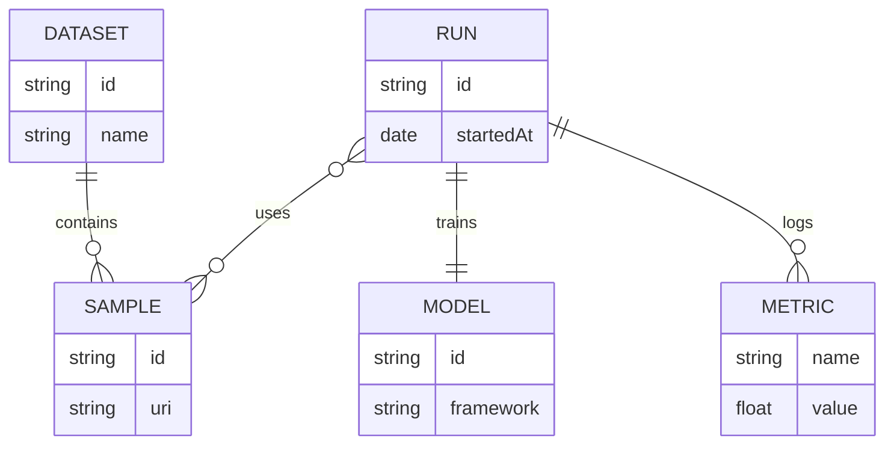

import { Image } from 'astro:assets';
import placeholder from '../assets/images/placeholder.png';
import audioDemo from '../assets/audio/audio-example.wav';
import HtmlEmbed from '../../components/HtmlEmbed.astro';
import Sidenote from '../../components/Sidenote.astro';
import Wide from '../../components/Wide.astro';
import Note from '../../components/Note.astro';
import FullWidth from '../../components/FullWidth.astro';
import Accordion from '../../components/Accordion.astro';
import ResponsiveImage from '../../components/ResponsiveImage.astro';

## Available components

**All** the following **components** are available in the **article.mdx** file. You can also create your own **components** by creating a new file in the `/components` folder.

<br/>
<div className="button-group">
  <a className="button" href="#math">Math</a>
  <a className="button" href="#code-blocks">Code</a>
  <a className="button" href="#citations-and-notes">Citations & notes</a>
  <a className="button" href="#responsiveimage">ResponsiveImage</a>
  <a className="button" href="#mermaid-diagrams">Mermaid</a>
  <a className="button" href="#placement">Placement</a>
  <a className="button" href="#accordion">Accordion</a>
  <a className="button" href="#note">Note</a>
  <a className="button" href="#minimal-table">Minimal table</a>
  <a className="button" href="#audio">Audio</a>
  <a className="button" href="#htmlembeds">HtmlEmbeds</a>
</div>

### Math

KaTeX is used for math rendering.

**Inline**

This is an inline math equation: $x^2 + y^2 = z^2$. 


<small className="muted">Example</small>
```mdx
$x^2 + y^2 = z^2$
```

**Block**

$$
\mathrm{Attention}(Q,K,V)=\mathrm{softmax}\!\left(\frac{QK^\top}{\sqrt{d_k}}\right) V
$$

<small className="muted">Example</small>
```mdx
$$
\mathrm{Attention}(Q,K,V)=\mathrm{softmax}\!\left(\frac{QK^\top}{\sqrt{d_k}}\right) V
$$
```

### Code

Use fenced code blocks with a language for syntax highlighting.

```python
def greet(name: str) -> None:
    print(f"Hello, {name}!")

greet("Astro")
```

<small className="muted">Example</small>
````mdx
```python
def greet(name: str) -> None:
    print(f"Hello, {name}!")

greet("Astro")
```
````


### Citation and footnote

**Citations** use the `@` syntax (e.g., `[@vaswani2017attention]` or `@vaswani2017attention` in narrative form) and are **automatically** collected to render the **bibliography** at the end of the article. The citation keys come from `app/src/content/bibliography.bib`.

**Footnotes** use an identifier like `[^f1]` and a definition anywhere in the document, e.g., `[^f1]: Your explanation`. They are **numbered** and **listed automatically** at the end of the article.

Here are a few variations using the same bibliography:

1) **In-text citation** with brackets: [@example2023].

2) **Narrative citation**: As shown by @vaswani2017attention, transformers enable efficient sequence modeling.

3) **Multiple citations** and a **footnote** together: see [@vaswani2017attention; @example2023] for related work. Also note this footnote[^f1].

[^f1]: Footnote attached to the sentence above.

<small className="muted">Example</small>
```mdx
1) In-text citation with brackets: [@example2023].

2) Narrative citation: As shown by @vaswani2017attention, transformers enable efficient sequence modeling.

3) Multiple citations and a footnote together: see [@vaswani2017attention; @example2023] for related work. Also note this footnote[^f1].

[^f1]: Footnote attached to the sentence above.
```


### ResponsiveImage

**Responsive images** automatically generate an optimized `srcset` and `sizes` so the browser downloads the most appropriate file for the current viewport and DPR. You can also request multiple output formats (e.g., **AVIF**, **WebP**, fallback **PNG/JPEG**) and control **lazy loading/decoding** for better **performance**.

| Prop                   | Required | Description                                                                                                         | Option/Note                                                                                                 |
|------------------------|----------|---------------------------------------------------------------------------------------------------------------------|-------------------------------------------------------------------------------------------------------------|
| `data-zoomable`        | No       | Adds a zoomable lightbox (Medium-like).                                                                             | Only images with this attribute will open full-screen on click.                                             |
| `data-downloadable`    | No       | Adds a small download button to fetch the image file.                                                               | By default uses the original filename. Can be customized with `data-download-name` and `data-download-src`. |
| `loading="lazy"`       | No       | Lazy loads the image.                                                                                               | Defers image loading until it is visible on screen.                                                         |
| `caption`              | No       | Adds a caption and credit.                                                                                          | Pass HTML as the `caption` prop, or use `<slot name="caption">`. Keep `<span className="image-credit">` for credits. |


<ResponsiveImage
  src={placeholder}
  data-zoomable
  data-downloadable
  layout="fixed"
  alt="Tensor parallelism in a transformer block"
  caption={'Tensor parallelism in a transformer block <span class="image-credit">Original work on <a target="_blank" href="https://huggingface.co/spaces/nanotron/ultrascale-playbook?section=tensor_parallelism_in_a_transformer_block">Ultrascale Playbook</a></span>'}
/>

<small className="muted">Example</small>
```mdx
import ResponsiveImage from '../components/ResponsiveImage.astro'
import myImage from './assets/images/placeholder.jpg'

<ResponsiveImage src={myImage} alt="Responsive, optimized example image" />

<ResponsiveImage
  src={myImage}
  layout="fixed"
  data-zoomable
  data-downloadable
  loading="lazy"
  alt="Example with caption and credit"
  caption={'Optimized image with a descriptive caption. <span class="image-credit">Credit: Photo by <a href="https://example.com">Author</a></span>'}
/>
```


### Mermaid diagram

Native mermaid diagrams are supported. You can use the <a target="_blank" href="https://mermaid.live/edit#pako:eNpVjUFPg0AQhf_KZk6a0AYsCywHE0u1lyZ66EnoYQMDSyy7ZFlSK_DfXWiMOqd58773ZoBcFQgxlGd1yQXXhhx3mSR2ntJE6LozDe9OZLV6HPdoSKMkXkeyvdsr0gnVtrWs7m_8doZIMhxmDIkRtfyYblay5F8ljmSXHnhrVHv66xwvaiTPaf0mbP1_R2i0qZe05HHJVznXJOF6QcCBStcFxEb36ECDuuGzhGF2MzACG8wgtmuBJe_PJoNMTjbWcvmuVPOT1KqvBNj6c2dV3xbc4K7mlea_CMoCdaJ6aSCm3lIB8QCfED94dM2o77ssjFzK3MiBq2WCNWUeiza-H26YvU8OfC0_3XVII9eLQuYFIaVBGEzfyTJ22g"> live editor</a> to create your diagram and copy the code to your article.




<small className="muted">Example</small>
````mdx

````


### Separator

Use `---` on its own line to insert a horizontal separator between sections. This is a standard Markdown “thematic break”. Don’t confuse it with the `---` used at the very top of the file to delimit the frontmatter.

---

<small className="muted">Example</small>
```mdx
Intro paragraph.

---

Next section begins here.
```


### Accordion

Accessible accordion based on `details/summary`. You can pass any children content.

<Accordion title="What can this accordion hold?" open>
  <p>Text, lists, images, code blocks, etc.</p>
  <ul>
    <li>Item one</li>
    <li>Item two</li>
  </ul>
</Accordion>

<Accordion title="Accordion with code example">
```ts
function greet(name: string) {
  console.log(`Hello, ${name}`);
}

greet("Astro");
```
</Accordion>

<small className="muted">Example</small>
````mdx
import Accordion from '../components/Accordion.astro'

<Accordion title="Accordion title" open>
  <p>Free content with <strong>markdown</strong> and MDX components.</p>
</Accordion>

<Accordion title="Accordion with code example">
```ts
function greet(name: string) {
  console.log(`Hello, ${name}`);
}

greet("Astro");
```
</Accordion>
````


### Note

Small contextual callout for tips, caveats, or emphasis.

Props (optional)
- `title`: short title displayed in the header.
- `emoji`: emoji displayed before the title.
- `class`: extra classes for custom styling.

<Note title="Heads‑up" emoji="💡">
  Use notes to surface context without breaking reading flow.
</Note>

<Note>
  Plain note without header. Useful for short clarifications.
</Note>

<small className="muted">Example</small>
```mdx
import Note from '../../components/Note.astro'

<Note title="Heads‑up" emoji="💡">
  Use notes to surface context without breaking reading flow.
</Note>

<Note>
  Plain note without header. Useful for short clarifications.
</Note>
```


### Minimal table

| Method | Score |
|---|---|
| A | 0.78 |
| B | 0.86 |

<small className="muted">Example</small>
```mdx
| Method | Score |
| --- | --- |
| A | 0.78 |
| B | 0.86 |
```

### Audio

<audio controls src={audioDemo}/>
<br/>
<small className="muted">Example</small>
```mdx
import audioDemo from './assets/audio/audio-example.wav'

<audio controls src={audioDemo}/>
```


### HtmlEmbed

The main purpose of the ```HtmlEmbed``` component is to **embed** a **Plotly** or **D3.js** chart in your article. **Libraries** are already imported in the template.

They exist in the `app/src/content/embeds` folder.

For researchers who want to stay in **Python** while targeting **D3**, the [d3blocks](https://github.com/d3blocks/d3blocks) library lets you create interactive D3 charts with only a few lines of code. In **2025**, **D3** often provides more flexibility and a more web‑native rendering than **Plotly** for custom visualizations.

| Prop        | Required | Description                                                                                      
|-------------|----------|--------------------------------------------------------------------------------------------------
| `src`       | Yes      | Path to the embed file in the `embeds` folder.                                                   
| `title`     | No       | Short title displayed above the card.                                                            
| `desc`      | No       | Short description displayed below the card. Supports inline HTML (e.g., links).                  
| `frameless` | No       | Removes the card background and border for seamless embeds.                                      
| `align`     | No       | Aligns the title/description text. One of `left` (default), `center`, `right`.                  

<HtmlEmbed src="plotly-line.html" title="Plotly Line" desc="Interactive time series" />
---

<HtmlEmbed src="d3-line-example.html" title="D3 Line" desc="Interactive time series" />

<br/>
<small className="muted">Examples</small>
```mdx
import HtmlEmbed from '../components/HtmlEmbed.astro'

<HtmlEmbed src="plotly-line.html" title="Plotly Line" desc="Interactive time series" />
<HtmlEmbed src="d3-line-example.html" title="D3 Line" desc="Interactive time series" />
```

#### Data

If you need to link your HTML embeds to data files, there is an **`assets/data`** folder for this.
As long as your files are there, they will be served from the **`public/data`** folder.
You can fetch them with this address: **`[domain]/data/your-data.ext`**

<Note>⚠️ <b>Be careful</b>, unlike images, <b>data files are not optimized</b> by Astro. You need to optimize them manually.</Note>

#### Real world examples

Here are some real world examples to inspire you.

<HtmlEmbed src="d3-comparison.html" title="Image comparison" desc="" />
---
<HtmlEmbed src="d3-line.html" title="D3 Line" desc="Simple time series" />
---
<HtmlEmbed src="d3-bar.html" title="D3 Memory usage with recomputation" desc={`Memory usage with recomputation — <a href="https://huggingface.co/spaces/nanotron/ultrascale-playbook?section=activation_recomputation" target="_blank">from the ultrascale playbook</a>`}/>
---
<Wide>
  <HtmlEmbed src="d3-neural.html" title="D3 Interactive neural network (MNIST-like)" desc="Draw a digit and visualize activations and class probabilities (0–9)." align="center" />
</Wide>
---
<FullWidth>
  <HtmlEmbed src="d3-pie.html" desc="D3 Pie charts by category" align="center" />
</FullWidth>


### Iframes

You can embed external content in your article using **iframes**. For example, **TrackIO**, **Gradio** or even **Github code embeds** can be used this way.

<small className="muted">Github code embed</small>
<iframe frameborder="0" scrolling="no" style="width:100%; height:292px;" allow="clipboard-write" src="https://emgithub.com/iframe.html?target=https%3A%2F%2Fgithub.com%2Fhuggingface%2Fpicotron%2Fblob%2F1004ae37b87887cde597c9060fb067faa060bafe%2Fsetup.py&style=default&type=code&showBorder=on&showLineNumbers=on"></iframe>

<small className="muted">TrackIO embed</small>
<div className="">
<iframe src="https://trackio-documentation.hf.space/?project=fake-training-750735&metrics=train_loss,train_accuracy&sidebar=hidden&lang=en" width="100%" height="660" frameborder="0"></iframe>
</div>

<small className="muted">Gradio embed</small>
<div className="">
<iframe src="https://gradio-hello-world.hf.space" width="100%" height="380" frameborder="0"></iframe>
</div>

<small className="muted">Example</small>
```mdx
<iframe frameborder="0" scrolling="no" style="width:100%; height:292px;" allow="clipboard-write" src="https://emgithub.com/iframe.html?target=https%3A%2F%2Fgithub.com%2Fhuggingface%2Fpicotron%2Fblob%2F1004ae37b87887cde597c9060fb067faa060bafe%2Fsetup.py&style=default&type=code&showBorder=on&showLineNumbers=on"></iframe>
<iframe src="https://trackio-documentation.hf.space/?project=fake-training-750735&metrics=train_loss,train_accuracy&sidebar=hidden&lang=en" width="100%" height="600" frameborder="0"></iframe>
<iframe src="https://gradio-hello-world.hf.space" width="100%" height="380" frameborder="0"></iframe>
```
