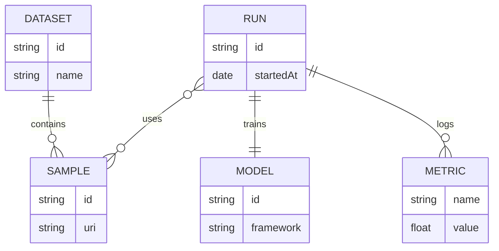

import placeholder from '../../assets/image/placeholder.png';
import audioDemo from '../../assets/audio/audio-example.wav';
import HtmlEmbed from '../../../components/HtmlEmbed.astro';
import Sidenote from '../../../components/Sidenote.astro';
import Wide from '../../../components/Wide.astro';
import Note from '../../../components/Note.astro';
import FullWidth from '../../../components/FullWidth.astro';
import Accordion from '../../../components/Accordion.astro';
import Image from '../../../components/Image.astro';

## Markdown

All the following **markdown features** are available **natively** in the `article.mdx` file. No imports needed, just write markdown directly:

**Text formatting** — `**Bold**` → **Bold**, `*italic*` → *italic*, `~~strikethrough~~` → ~~strikethrough~~

**Code** — `` `inline code` `` → `inline code`, triple backticks for code blocks

**Lists** — `- Item` for bullets, `1. Item` for numbered lists with nesting support

**Links** — `[text](url)` → [External links](https://example.com) and internal navigation

**Highlight** — `<mark>text</mark>` → <mark>Highlighted text</mark> for emphasis

See also the complete [**Markdown documentation**](https://www.markdownguide.org/basic-syntax/).

**Advanced features** — Explore specialized content types:

<div className="feature-grid">
  <a href="#math" className="feature-card">
    <strong>Math</strong>
    <span>LaTeX equations</span>
  </a>
  <a href="#code-blocks" className="feature-card">
    <strong>Code</strong>
    <span>Syntax highlighting</span>
  </a>
  <a href="#citation-and-notes" className="feature-card">
    <strong>Citation</strong>
    <span>Academic references</span>
  </a>
  <a href="#footnote" className="feature-card">
    <strong>Footnote</strong>
    <span>Additional context</span>
  </a>
  <a href="#mermaid-diagrams" className="feature-card">
    <strong>Mermaid</strong>
    <span>Diagrams & flowcharts</span>
  </a>
  <a href="#separator" className="feature-card">
    <strong>Separator</strong>
    <span>Visual breaks</span>
  </a>
  <a href="#table" className="feature-card">
    <strong>Table</strong>
    <span>Data presentation</span>
  </a>
  <a href="#audio" className="feature-card">
    <strong>Audio</strong>
    <span>Sound embeds</span>
  </a>
</div>

### Math

**KaTeX** provides full LaTeX math support with two simple syntaxes:

**Inline math** — Use `$...$` for equations within text: $x^2 + y^2 = z^2$

**Block math** — Use `$$...$$` for centered equations:

$$
\mathrm{Attention}(Q,K,V)=\mathrm{softmax}\!\left(\frac{QK^\top}{\sqrt{d_k}}\right) V
$$

**Advanced features** — Aligned equations with IDs for cross-referencing:

```math
\htmlId{trajectory_definition}{\begin{align}
    \log p_\theta(\mathcal D) &= \log \sum_{i=0}^N p_\theta ((o,a)_i) \\
                              &= \log \sum_{i=0}^N \int_{\text{supp}({Z})} p_\theta((o,a)_i \vert z) p(z) \\
                              &= \log \sum_{i=0}^N \int_{\text{supp}({Z})} \frac{q_\theta(z \vert (o,a)_i)}{q_\theta(z \vert (o,a)_i)} \cdot p_\theta((o,a)_i \vert z) p(z) \\
                              &= \log \sum_{i=0}^N \mathbb E_{z \sim p_\theta(\bullet \vert (o,a)_i)} [\frac{p(z)}{q_\theta(z \vert (o,a)_i)} \cdot p_\theta((o,a)_i \vert z)], 
\end{align}}
```

You can reference equations with links like [this equation](#trajectory_definition).

<Accordion title="Code example">
```mdx
$x^2 + y^2 = z^2$

$$
\mathrm{Attention}(Q,K,V)=\mathrm{softmax}\!\left(\frac{QK^\top}{\sqrt{d_k}}\right) V
$$

$$
\htmlId{trajectory_definition}{\begin{align}
    \log p_\theta(\mathcal D) &= \log \sum_{i=0}^N p_\theta ((o,a)_i) \\
                              &= \log \sum_{i=0}^N \int_{\text{supp}({Z})} p_\theta((o,a)_i \vert z) p(z) \\
                              &= \log \sum_{i=0}^N \int_{\text{supp}({Z})} \frac{q_\theta(z \vert (o,a)_i)}{q_\theta(z \vert (o,a)_i)} \cdot p_\theta((o,a)_i \vert z) p(z) \\
                              &= \log \sum_{i=0}^N \mathbb E_{z \sim p_\theta(\bullet \vert (o,a)_i)} [\frac{p(z)}{q_\theta(z \vert (o,a)_i)} \cdot p_\theta((o,a)_i \vert z)], 
\end{align}}
$$

```
</Accordion>

### Code

Use inline code with backticks \`...\` or \`\`\` fenced code blocks \`\`\` with a language for syntax highlighting (e.g., \`python\`).

As an example, here is inline code: `greet("Astro")` and below is a block.


```python
def greet(name: str) -> None:
    print(f"Hello, {name}!")
```

<Accordion title="Code example">
````mdx
`greet("Astro")`

```python
def greet(name: str) -> None:
    print(f"Hello, {name}!")
```
````
</Accordion>


### Code output

If you want to display the output of a code block, you can use the `:::output` directive. If it's directly below the code block, it will adapt to the code block's styling.

```python
def greet(name: str) -> None:
    print(f"Hello, {name}!")

greet("Astro")
```
:::output
Hello, Astro!
:::

Or it can also be used at a standalone block.

:::output
Hello i'm a standalone output block.
:::

<Accordion title="It also works in an accordion">
```python
print("This script prints a very very long line to check overflow behavior.")
```
:::output
This script prints a very very long line to check overflow behavior.
:::
</Accordion>


<Accordion title="Code example">
````mdx
```python
def greet(name: str) -> None:
    print(f"Hello, {name}!")

greet("Astro")
```
:::output
Hello, Astro!
:::

Or you can also use it at a standalone block.

:::output
Hello i'm a standalone outputs block.
:::
````
</Accordion>

### Citation

The **citation keys** come from `app/src/content/bibliography.bib`.

**Citation** use the `@` syntax (e.g., `[@vaswani2017attention]` or `@vaswani2017attention` in narrative form) and are **automatically** collected to render the **bibliography** at the end of the article.

1) In-text citation with brackets: [@vaswani2017attention].

2) Narrative citation: As shown by @kingma2015adam, stochastic optimization is widely used.

3) Multiple citations and a footnote together: see [@mckinney2017python; @he2016resnet] for related work.

4) All citations in one group: [@vaswani2017attention; @mckinney2017python; @he2016resnet; @silver2017mastering; @openai2023gpt4; @doe2020thesis; @cover2006entropy; @zenodo2021dataset; @sklearn2024; @smith2024privacy; @kingma2015adam; @raffel2020t5].

<Accordion title="Code example">
```mdx
1) In-text citation with brackets: [@vaswani2017attention].

2) Narrative citation: As shown by @kingma2015adam, stochastic optimization is widely used.

3) Multiple citations and a footnote together: see [@mckinney2017python; @he2016resnet] for related work.

4) All citations in one group: [@vaswani2017attention; @mckinney2017python; @he2016resnet; @silver2017mastering; @openai2023gpt4; @doe2020thesis; @cover2006entropy; @zenodo2021dataset; @sklearn2024; @smith2024privacy; @kingma2015adam; @raffel2020t5].
```
</Accordion>

<Note variant="info" emoji="💡">You can change the citation style in the `astro.config.mjs` file. There are several styles available: `apa`, `vancouver`, `harvard1`, `chicago`, `mla`. Default is `apa`.</Note>

### Footnote

**Footnote** use an identifier like `[^f1]` and a definition anywhere in the document, e.g., `[^f1]: Your explanation`. They are **numbered** and **listed automatically** at the end of the article.

1) Footnote attached to the sentence above[^f1].

[^f1]: Footnote attached to the sentence above.

2) Multi-paragraph footnote example[^f2].

[^f2]: Multi-paragraph footnote. First paragraph.

    Second paragraph with a link to [Astro](https://astro.build).

2) Footnote containing a list[^f3].

[^f3]: Footnote with a list:

    - First item
    - Second item

3) Footnote with an inline code and an indented code block[^f4].

[^f4]: Footnote with code snippet:

    ```ts
    function add(a: number, b: number) {
      return a + b;
    }
    ```
    Result: `add(2, 3) === 5`.

4) Footnote that includes citation inside[^f5] and another footnote[^f1].

[^f5]: Footnote containing citation [@vaswani2017attention] and [@kingma2015adam].

<Accordion title="Code example">
```mdx
1) Footnote attached to the sentence above[^f1].

2) Multi-paragraph footnote example[^f2].

2) Footnote containing a list[^f3].

3) Footnote with an inline code and an indented code block[^f4].

4) Footnote that includes citation inside[^f5].

[^f1]: Footnote attached to the sentence above.

[^f2]: Multi-paragraph footnote. First paragraph.

    Second paragraph with a link to [Astro](https://astro.build).

[^f3]: Footnote with a list:

    - First item
    - Second item

[^f4]: Footnote with code snippet:

        function add(a: number, b: number) {
          return a + b;
        }

    Result: `add(2, 3) === 5`.

[^f5]: Footnote containing citation [@vaswani2017attention] and [@kingma2015adam].
```
</Accordion>


### Referencing

In research articles, you may have to make references to anything. They are basically html anchors. They can be used internally in the article or externally in other articles.


1. **Title**<br/>
  Each title is automatically generated with a slugged version  from the citation key. ( slugged title from the citation key )
  like for example, the id `#mermaid-diagrams` is generated from the `Mermaid diagrams` title.
  <br/><br/>**Example** [Mermaid diagrams](#mermaid-diagram)

2. **Image and chart**<br/>
  You can make a link to an image or a chart by adding an ID on it.<br/>`<HtmlEmbed id="neural-network-mnist-like"/>` then you can link to it with a link like `<a href="#neural-network-mnist-like">Fig 1</a>`.
  <br/><br/>**Example** [Chart 1](#neural-network-mnist-like) or [Fig 1](#placeholder-image)

<Note emoji="💡" variant="info">
  **Available with:** `Reference`, `Image`, and `HtmlEmbed` components all support the `id` prop for creating referenceable anchors.
</Note>

<Accordion title="Code example">
```mdx
  #### Mermaid diagrams
  [Mermaid diagrams](#mermaid-diagrams)
  
  <HtmlEmbed id="neural-network-mnist-like"/>
  [Chart 1](#neural-network-mnist-like)

  <Image id="placeholder-image" src="..."/>
  [Fig 1](#placeholder-image)
```
</Accordion>


### Mermaid diagram

Native mermaid diagrams are supported (use a \`\`\`mermaid\`\`\` code fence). You can use the <a target="_blank" href="https://mermaid.live/edit#pako:eNpVjUFPg0AQhf_KZk6a0AYsCywHE0u1lyZ66EnoYQMDSyy7ZFlSK_DfXWiMOqd58773ZoBcFQgxlGd1yQXXhhx3mSR2ntJE6LozDe9OZLV6HPdoSKMkXkeyvdsr0gnVtrWs7m_8doZIMhxmDIkRtfyYblay5F8ljmSXHnhrVHv66xwvaiTPaf0mbP1_R2i0qZe05HHJVznXJOF6QcCBStcFxEb36ECDuuGzhGF2MzACG8wgtmuBJe_PJoNMTjbWcvmuVPOT1KqvBNj6c2dV3xbc4K7mlea_CMoCdaJ6aSCm3lIB8QCfED94dM2o77ssjFzK3MiBq2WCNWUeiza-H26YvU8OfC0_3XVII9eLQuYFIaVBGEzfyTJ22g"> live editor</a> to create your diagram and copy the code to your article.



<Accordion title="Code example">
````mdx

````
</Accordion>


### Separator

Use `---` on its own line to insert a horizontal separator between sections. This is a standard Markdown “thematic break”. Don’t confuse it with the `---` used at the very top of the file to delimit the frontmatter.

---

<Accordion title="Code example">
```mdx
Intro paragraph.

---

Next section begins here.
```
</Accordion>

### Table

Use pipe tables like `| Column |` with header separator `| --- |`. You can control alignment with `:---` (left), `:---:` (center), and `---:` (right).

| Model | Accuracy | F1-Score | Training Time | Status |
|:---|:---:|:---:|---:|:---:|
| **BERT-base** | 0.89 | 0.89 | 2.5h | ✅ |
| **RoBERTa-large** | 0.92 | 0.92 | 4.2h | ✅ |
| **DeBERTa-v3** | 0.94 | 0.94 | 5.8h | ✅ |
| **GPT-3.5-turbo** | 0.91 | 0.91 | 0.1h | ✅ |

<Accordion title="Code example">
```mdx
| Model | Accuracy | F1-Score | Training Time | Status |
|:---|:---:|:---:|---:|:---:|
| **BERT-base** | 0.89 | 0.89 | 2.5h | ✅ |
| **RoBERTa-large** | 0.92 | 0.92 | 4.2h | ✅ |
| **DeBERTa-v3** | 0.94 | 0.94 | 5.8h | ✅ |
| **GPT-3.5-turbo** | 0.91 | 0.91 | 0.1h | ✅ |
```
</Accordion>

### Audio

Embed audio using `<audio controls src={...} />`.

<audio controls src={audioDemo}/>
<br/>
<Accordion title="Code example">
```mdx
import audioDemo from './assets/audio/audio-example.wav'

<audio controls src={audioDemo}/>
```
</Accordion>

