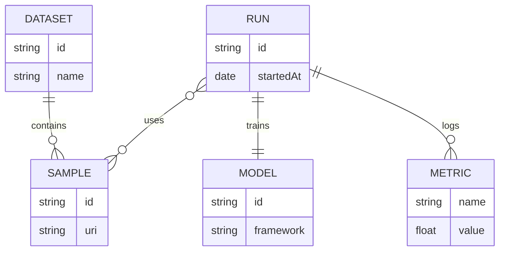

import { Image } from 'astro:assets';
import placeholder from '../assets/images/placeholder.png';
import audioDemo from '../assets/audio/audio-example.wav';
import HtmlEmbed from '../../components/HtmlEmbed.astro';
import Sidenote from '../../components/Sidenote.astro';
import Wide from '../../components/Wide.astro';
import Note from '../../components/Note.astro';
import FullWidth from '../../components/FullWidth.astro';
import Accordion from '../../components/Accordion.astro';
import ResponsiveImage from '../../components/ResponsiveImage.astro';

## Markdown

All the following **markdown features** are available **natively** in the `article.mdx` file. See also the complete [**Markdown documentation**](https://www.markdownguide.org/basic-syntax/).

<br/>
<div className="button-group">
  <a className="button" href="#math">Math</a>
  <a className="button" href="#code-blocks">Code</a>
  <a className="button" href="#citations-and-notes">Citations</a>
  <a className="button" href="#footnotes">Footnotes</a>
  <a className="button" href="#mermaid-diagrams">Mermaid</a>
  <a className="button" href="#separator">Separator</a>
  <a className="button" href="#table">Table</a>
  <a className="button" href="#audio">Audio</a>
</div>

### Math

KaTeX is used for math rendering.

**Inline**

This is an inline math equation: $x^2 + y^2 = z^2$. 


<small className="muted">Example</small>
```mdx
$x^2 + y^2 = z^2$
```

**Block**

$$
\mathrm{Attention}(Q,K,V)=\mathrm{softmax}\!\left(\frac{QK^\top}{\sqrt{d_k}}\right) V
$$

<small className="muted">Example</small>
```mdx
$$
\mathrm{Attention}(Q,K,V)=\mathrm{softmax}\!\left(\frac{QK^\top}{\sqrt{d_k}}\right) V
$$
```

### Code

Use fenced code blocks with a language for syntax highlighting.

```python
def greet(name: str) -> None:
    print(f"Hello, {name}!")

greet("Astro")
```

<small className="muted">Example</small>
````mdx
```python
def greet(name: str) -> None:
    print(f"Hello, {name}!")

greet("Astro")
```
````

### Citations

**Citations** use the `@` syntax (e.g., `[@vaswani2017attention]` or `@vaswani2017attention` in narrative form) and are **automatically** collected to render the **bibliography** at the end of the article. The citation keys come from `app/src/content/bibliography.bib`.

1) In-text citation with brackets: [@vaswani2017attention].

2) Narrative citation: As shown by @kingma2015adam, stochastic optimization is widely used.

3) Multiple citations and a footnote together: see [@mckinney2017python; @he2016resnet] for related work.

4) All citations in one group: [@vaswani2017attention; @mckinney2017python; @he2016resnet; @silver2017mastering; @openai2023gpt4; @doe2020thesis; @cover2006entropy; @zenodo2021dataset; @sklearn2024; @smith2024privacy; @kingma2015adam; @raffel2020t5].

<small className="muted">Example</small>
```mdx
1) In-text citation with brackets: [@vaswani2017attention].

2) Narrative citation: As shown by @kingma2015adam, stochastic optimization is widely used.

3) Multiple citations and a footnote together: see [@mckinney2017python; @he2016resnet] for related work.

4) All citations in one group: [@vaswani2017attention; @mckinney2017python; @he2016resnet; @silver2017mastering; @openai2023gpt4; @doe2020thesis; @cover2006entropy; @zenodo2021dataset; @sklearn2024; @smith2024privacy; @kingma2015adam; @raffel2020t5].
```

### Footnotes

**Footnotes** use an identifier like `[^f1]` and a definition anywhere in the document, e.g., `[^f1]: Your explanation`. They are **numbered** and **listed automatically** at the end of the article.

1) Footnote attached to the sentence above[^f1].

[^f1]: Footnote attached to the sentence above.

2) Multi-paragraph footnote example[^f2].

[^f2]: Multi-paragraph footnote. First paragraph.

    Second paragraph with a link to [Astro](https://astro.build).

2) Footnote containing a list[^f3].

[^f3]: Footnote with a list:

    - First item
    - Second item

3) Footnote with an inline code and an indented code block[^f4].

[^f4]: Footnote with code snippet:

    ```ts
    function add(a: number, b: number) {
      return a + b;
    }
    ```
    Result: `add(2, 3) === 5`.

4) Footnote that includes citations inside[^f5] and another footnote[^f1].

[^f5]: Footnote containing citations [@vaswani2017attention] and [@kingma2015adam].

<small className="muted">Example</small>
```mdx
1) Footnote attached to the sentence above[^f1].

2) Multi-paragraph footnote example[^f2].

2) Footnote containing a list[^f3].

3) Footnote with an inline code and an indented code block[^f4].

4) Footnote that includes citations inside[^f5].

[^f1]: Footnote attached to the sentence above.

[^f2]: Multi-paragraph footnote. First paragraph.

    Second paragraph with a link to [Astro](https://astro.build).

[^f3]: Footnote with a list:

    - First item
    - Second item

[^f4]: Footnote with code snippet:

        function add(a: number, b: number) {
          return a + b;
        }

    Result: `add(2, 3) === 5`.

[^f5]: Footnote containing citations [@vaswani2017attention] and [@kingma2015adam].
```


### Mermaid diagram

Native mermaid diagrams are supported. You can use the <a target="_blank" href="https://mermaid.live/edit#pako:eNpVjUFPg0AQhf_KZk6a0AYsCywHE0u1lyZ66EnoYQMDSyy7ZFlSK_DfXWiMOqd58773ZoBcFQgxlGd1yQXXhhx3mSR2ntJE6LozDe9OZLV6HPdoSKMkXkeyvdsr0gnVtrWs7m_8doZIMhxmDIkRtfyYblay5F8ljmSXHnhrVHv66xwvaiTPaf0mbP1_R2i0qZe05HHJVznXJOF6QcCBStcFxEb36ECDuuGzhGF2MzACG8wgtmuBJe_PJoNMTjbWcvmuVPOT1KqvBNj6c2dV3xbc4K7mlea_CMoCdaJ6aSCm3lIB8QCfED94dM2o77ssjFzK3MiBq2WCNWUeiza-H26YvU8OfC0_3XVII9eLQuYFIaVBGEzfyTJ22g"> live editor</a> to create your diagram and copy the code to your article.




<small className="muted">Example</small>
````mdx

````


### Separator

Use `---` on its own line to insert a horizontal separator between sections. This is a standard Markdown “thematic break”. Don’t confuse it with the `---` used at the very top of the file to delimit the frontmatter.

---

<small className="muted">Example</small>
```mdx
Intro paragraph.

---

Next section begins here.
```

### Table

| Method | Score |
|---|---|
| A | 0.78 |
| B | 0.86 |

<small className="muted">Example</small>
```mdx
| Method | Score |
| --- | --- |
| A | 0.78 |
| B | 0.86 |
```

### Audio

<audio controls src={audioDemo}/>
<br/>
<small className="muted">Example</small>
```mdx
import audioDemo from './assets/audio/audio-example.wav'

<audio controls src={audioDemo}/>
```

