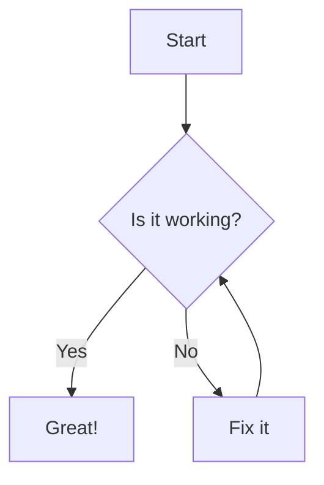

{/* IMPORTS */}
import { Image } from 'astro:assets';
import placeholder from '../../assets/images/placeholder.png';
import Aside from '../../components/Aside.astro';
import Wide from '../../components/Wide.astro';
import FullBleed from '../../components/FullBleed.astro';
import HtmlFragment from '../../components/HtmlFragment.astro';
import audioDemo from '../../assets/audio/audio-example.wav';

## Writing Your Content

### Introduction

Your article lives in two places:

- `app/src/content/` — where you can find the article.mdx, bibliography.bib and html fragments.
- `app/src/assets/` — images, audio, and other static assets. (handled by git lfs)

This is MDX, its basically a markdown file with html and astro components.
The **initial skeleton** of an article looks like this.

```mdx
{/* HEADER */}
---
title: "This is the main title"
subtitle: "This will be displayed just below the banner"
description: "A modern, MDX-first research article template with math, citations, and interactive figures."
authors:
  - "John Doe"
  - "Alice Martin"
  - "Robert Brown"
affiliation: "Hugging Face"
published: "Feb 19, 2025"
tags:
  - research
  - template
ogImage: "https://example.com/your-og-image.png"
---

{/* IMPORTS */}
import { Image } from 'astro:assets';
import placeholder from '../assets/images/placeholder.jpg';

{/* CONTENT */}
# Hello, world

This is a short paragraph written in Markdown. Below is an example image:

<Image src={placeholder} alt="Example image" />
```

### Chapters


**If** your article becomes **too long**, you can **organize** it into **separate chapters**.

Simply **create a new file** in the `app/src/content/chapters` **directory**.  
Then, **include** your new chapter in the main article by adding the following lines:

```mdx
import MyChapter from './chapters/my-chapter.mdx';
<MyChapter />
```

You can see an example of this in the <a href="">`app/src/content/chapters/best-pratices.mdx`</a> file.

### Theme

All **interactive elements** (buttons, inputs, cards, etc.) are themed with the **primary color** you choose. Feel free to update this color to match your **brand**.

You can **override** the theme by changing the main variable in the `app/src/styles/_variables.css` file.

You can use the **color picker** below to choose the right color.
<Aside>
<div className="">
  <HtmlFragment src="color-picker.html" />
</div>
<Fragment slot="aside">
  There is also a color <a href="#use-the-right-color">palette generator</a> that will help you choose the right color for your data visualizations.
</Fragment>
</Aside>


### Available blocks

All the following blocks are available in the article.mdx file. You can also create your own blocks by creating a new component in the components folder.

<br/>
<div className="button-group">
  <a className="button" href="#math">Math</a>
  <a className="button" href="#images">Images</a>
  <a className="button" href="#code-blocks">Code</a>
  <a className="button" href="#citations-and-notes">Citations & notes</a>
  <a className="button" href="#asides">Asides</a>
  <a className="button" href="#minimal-table">Table</a>
  <a className="button" href="#audio">Audio</a>
  <a className="button" href="#embeds">Embeds</a>
</div>

### Math

KaTeX is used for math rendering.

**Inline**

This is an inline math equation: $x^2 + y^2 = z^2$. 


<small className="muted">Example</small>
```mdx
$x^2 + y^2 = z^2$
```

**Block**

$$
\mathrm{Attention}(Q,K,V)=\mathrm{softmax}\!\left(\frac{QK^\top}{\sqrt{d_k}}\right) V
$$

<small className="muted">Example</small>
```mdx
$$
\mathrm{Attention}(Q,K,V)=\mathrm{softmax}\!\left(\frac{QK^\top}{\sqrt{d_k}}\right) V
$$
```

### Images

**Responsive images** automatically generate an optimized `srcset` and `sizes` so the browser downloads the most appropriate file for the current viewport and DPR. You can also request multiple output formats (e.g., **AVIF**, **WebP**, fallback **PNG/JPEG**) and control **lazy loading/decoding** for better **performance**.

**Optional:** Zoomable (Medium-like lightbox): add `data-zoomable` to opt-in. Only images with this attribute will open full-screen on click.

**Optional:** Lazy loading: add `loading="lazy"` to opt-in.

**Optional:** Figcaption and credits: add a `figcaption` element with a `span` containing the credit.


<figure>
  <Image
    src={placeholder}
    data-zoomable
    alt="Tensor parallelism in a transformer block"
  />
  <figcaption>
    Tensor parallelism in a transformer block
    <span className="image-credit">Original work on <a target="_blank" href="https://huggingface.co/spaces/nanotron/ultrascale-playbook?section=tensor_parallelism_in_a_transformer_block">Ultrascale Playbook</a></span>
  </figcaption>
</figure>

<small className="muted">Example</small>
```mdx
import { Image } from 'astro:assets'
import myImage from '../assets/images/placeholder.jpg'

<Image src={myImage} alt="Responsive, optimized example image" />

<figure>
  <Image src={myImage} data-zoomable alt="Example with caption and credit" loading="lazy" />
  <figcaption>
    Optimized image with a descriptive caption.
    <span className="image-credit">Credit: Photo by <a href="https://example.com">Author</a></span>
  </figcaption>
</figure>
```


### Code blocks

Use fenced code blocks with a language for syntax highlighting.

```python
def greet(name: str) -> None:
    print(f"Hello, {name}!")

greet("Astro")
```

<small className="muted">Example</small>
````mdx
```python
def greet(name: str) -> None:
    print(f"Hello, {name}!")

greet("Astro")
```
````

### Mermaid diagrams

Native mermaid diagrams are supported. You can use the <a target="_blank" href="https://mermaid.live/edit#pako:eNpVjUFPg0AQhf_KZk6a0AYsCywHE0u1lyZ66EnoYQMDSyy7ZFlSK_DfXWiMOqd58773ZoBcFQgxlGd1yQXXhhx3mSR2ntJE6LozDe9OZLV6HPdoSKMkXkeyvdsr0gnVtrWs7m_8doZIMhxmDIkRtfyYblay5F8ljmSXHnhrVHv66xwvaiTPaf0mbP1_R2i0qZe05HHJVznXJOF6QcCBStcFxEb36ECDuuGzhGF2MzACG8wgtmuBJe_PJoNMTjbWcvmuVPOT1KqvBNj6c2dV3xbc4K7mlea_CMoCdaJ6aSCm3lIB8QCfED94dM2o77ssjFzK3MiBq2WCNWUeiza-H26YvU8OfC0_3XVII9eLQuYFIaVBGEzfyTJ22g"> live editor</a> to create your diagram and copy the code to your article.



<small className="muted">Example</small>
````mdx

````

### Citations and notes

Here are a few variations using the same bibliography:

1) **In-text citation** with brackets: [@example2023].

2) **Narrative citation**: As shown by @vaswani2017attention, transformers enable efficient sequence modeling.

3) **Multiple citations** and a **footnote** together: see [@vaswani2017attention; @example2023] for related work. Also note this footnote[^f1].

[^f1]: Footnote attached to the sentence above.

<small className="muted">Example</small>
```mdx
1) In-text citation with brackets: [@example2023].

2) Narrative citation: As shown by @vaswani2017attention, transformers enable efficient sequence modeling.

3) Multiple citations and a footnote together: see [@vaswani2017attention; @example2023] for related work. Also note this footnote[^f1].

[^f1]: Footnote attached to the sentence above.
```


### Placement

#### Asides

<Aside>
  This paragraph presents a **key idea** concisely.
  <Fragment slot="aside">
    **Side note** for brief context or a definition.
  </Fragment>
  </Aside>

<small className="muted">Example</small>
```mdx
import Aside from '../components/Aside.astro'

<Aside>
  Main paragraph with the core idea.
  <Fragment slot="aside">Short side note.</Fragment>
</Aside>
```

Use these helpers to expand content beyond the main column when needed. They will always be centered and displayed above every other content.

#### Wide example

<Wide>
  <div className="demo-wide">demo wide</div>
</Wide>

<small className="muted">Example</small>
```mdx
import Wide from '../components/Wide.astro'

<Wide>
  Your content here...
</Wide>
```

#### Full-bleed example

<FullBleed>
  <div className="demo-full-bleed">demo full-bleed</div>
</FullBleed>

<small className="muted">Example</small>
```mdx
import FullBleed from '../components/FullBleed.astro'

<FullBleed>
  Your content here...
</FullBleed>
```


### Minimal table

| Method | Score |
|---|---|
| A | 0.78 |
| B | 0.86 |

<small className="muted">Example</small>
```mdx
| Method | Score |
| --- | --- |
| A | 0.78 |
| B | 0.86 |
```

### Audio

<audio controls src={audioDemo}>
  Your browser does not support the audio element.
</audio>

<small className="muted">Example</small>
```mdx
import audioDemo from '../assets/audio/audio-example.wav'

<audio controls src={audioDemo}>
  Your browser does not support the audio element.
</audio>
```


### Embeds


#### Html Fragments

The main purpose of the ```HtmlFragment``` component is to **embed** a **Plotly** or **D3.js** chart in your article. **Libraries** are already imported in the template.

They exist in the `app/src/content/fragments` folder.

Here are some examples of the two **libraries** in the template:

D3 version
  <div className="plot-card">
    <HtmlFragment src="d3-line.html" />
</div>

  <div className="plot-card">
    <HtmlFragment src="d3-bar.html" />
</div>


Plotly version
<div className="plot-card">
  <HtmlFragment src="line.html" />
</div>
<div className="plot-card">
  <HtmlFragment src="bar.html" />
</div>

<small className="muted">Example</small>
```mdx
import HtmlFragment from '../components/HtmlFragment.astro'

<HtmlFragment src="line.html" />
```

#### Iframes

You can embed external content in your article using **iframes**. For example, **TrackIO or github code embeds** can be used this way.

<iframe frameborder="0" scrolling="no" style="width:100%; height:292px;" allow="clipboard-write" src="https://emgithub.com/iframe.html?target=https%3A%2F%2Fgithub.com%2Fhuggingface%2Fpicotron%2Fblob%2F1004ae37b87887cde597c9060fb067faa060bafe%2Fsetup.py&style=default&type=code&showBorder=on&showLineNumbers=on"></iframe>

<iframe className="plot-card" src="https://trackio-documentation.hf.space/?project=fake-training-750735&metrics=train_loss,train_accuracy&sidebar=hidden&lang=en" width="100%" height="660" frameborder="0"></iframe>

<small className="muted">Example</small>
```mdx
<iframe frameborder="0" scrolling="no" style="width:100%; height:292px;" allow="clipboard-write" src="https://emgithub.com/iframe.html?target=https%3A%2F%2Fgithub.com%2Fhuggingface%2Fpicotron%2Fblob%2F1004ae37b87887cde597c9060fb067faa060bafe%2Fsetup.py&style=default&type=code&showBorder=on&showLineNumbers=on"></iframe>
<iframe src="https://trackio-documentation.hf.space/?project=fake-training-750735&metrics=train_loss,train_accuracy&sidebar=hidden&lang=en" width="100%" height="600" frameborder="0"></iframe>
```
